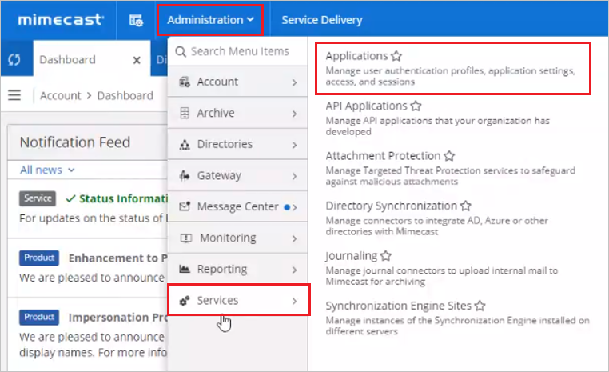
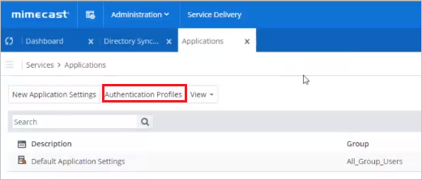
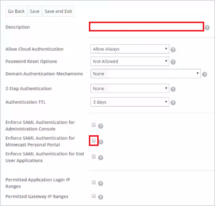
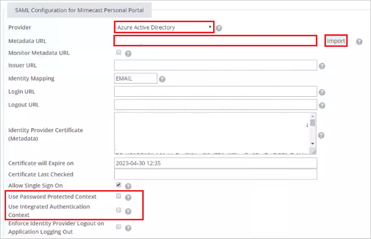
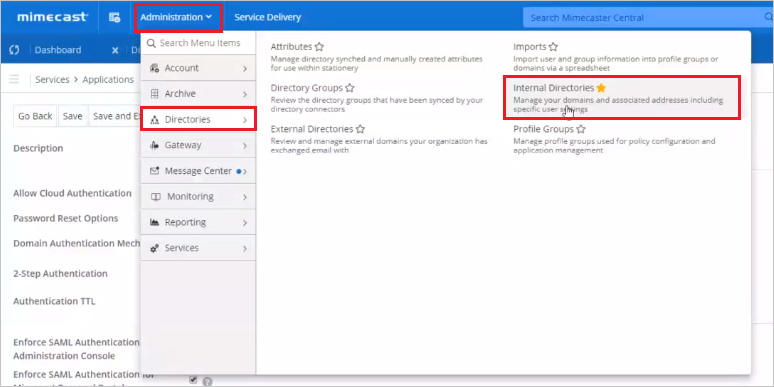
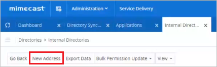
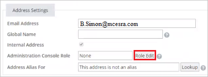

# Tutorial: Azure Active Directory single sign-on (SSO) integration with Mimecast Personal Portal

In this tutorial, you'll learn how to integrate Mimecast Personal Portal with Azure Active Directory (Azure AD). When you integrate Mimecast Personal Portal with Azure AD, you can:

* Control in Azure AD who has access to Mimecast Personal Portal.
* Enable your users to be automatically signed-in to Mimecast Personal Portal with their Azure AD accounts.
* Manage your accounts in one central location - the Azure portal.

To learn more about SaaS app integration with Azure AD, see [What is application access and single sign-on with Azure Active Directory](https://docs.microsoft.com/azure/active-directory/manage-apps/what-is-single-sign-on).

## Prerequisites

To get started, you need the following items:

* An Azure AD subscription. If you don't have a subscription, you can get a [free account](https://azure.microsoft.com/free/).
* Mimecast Personal Portal single sign-on (SSO) enabled subscription.

## Scenario description

In this tutorial, you configure and test Azure AD SSO in a test environment.

* Mimecast Personal Portal supports **SP and IDP** initiated SSO
* Once you configure Mimecast Personal Portal you can enforce session control, which protect exfiltration and infiltration of your organization’s sensitive data in real-time. Session control extend from Conditional Access. [Learn how to enforce session control with Microsoft Cloud App Security](https://docs.microsoft.com/cloud-app-security/proxy-deployment-any-app).

## Adding Mimecast Personal Portal from the gallery

To configure the integration of Mimecast Personal Portal into Azure AD, you need to add Mimecast Personal Portal from the gallery to your list of managed SaaS apps.

1. Sign in to the [Azure portal](https://portal.azure.com) using either a work or school account, or a personal Microsoft account.
1. On the left navigation pane, select the **Azure Active Directory** service.
1. Navigate to **Enterprise Applications** and then select **All Applications**.
1. To add new application, select **New application**.
1. In the **Add from the gallery** section, type **Mimecast Personal Portal** in the search box.
1. Select **Mimecast Personal Portal** from results panel and then add the app. Wait a few seconds while the app is added to your tenant.

## Configure and test Azure AD single sign-on for Mimecast Personal Portal

Configure and test Azure AD SSO with Mimecast Personal Portal using a test user called **B.Simon**. For SSO to work, you need to establish a link relationship between an Azure AD user and the related user in Mimecast Personal Portal.

To configure and test Azure AD SSO with Mimecast Personal Portal, complete the following building blocks:

1. **[Configure Azure AD SSO](#configure-azure-ad-sso)** - to enable your users to use this feature.
    1. **[Create an Azure AD test user](#create-an-azure-ad-test-user)** - to test Azure AD single sign-on with B.Simon.
    1. **[Assign the Azure AD test user](#assign-the-azure-ad-test-user)** - to enable B.Simon to use Azure AD single sign-on.
1. **[Configure Mimecast Personal Portal SSO](#configure-mimecast-personal-portal-sso)** - to configure the single sign-on settings on application side.
    1. **[Create Mimecast Personal Portal test user](#create-mimecast-personal-portal-test-user)** - to have a counterpart of B.Simon in Mimecast Personal Portal that is linked to the Azure AD representation of user.
1. **[Test SSO](#test-sso)** - to verify whether the configuration works.

## Configure Azure AD SSO

Follow these steps to enable Azure AD SSO in the Azure portal.

1. In the [Azure portal](https://portal.azure.com/), on the **Mimecast Personal Portal** application integration page, find the **Manage** section and select **single sign-on**.
1. On the **Select a single sign-on method** page, select **SAML**.
1. On the **Set up single sign-on with SAML** page, click the edit/pen icon for **Basic SAML Configuration** to edit the settings.

   

1. On the **Basic SAML Configuration** section,  if you wish to configure the application in IDP initiated mode, perform the following steps:

	a. In the **Identifier** textbox, type a URL using the following pattern:

    | Region  |  Value | 
	| --------------- | --------------- |
	| Europe          | `https://eu-api.mimecast.com/sso/<accountcode>`|
	| United States   | `https://us-api.mimecast.com/sso/<accountcode>`|
	| South Africa    | `https://za-api.mimecast.com/sso/<accountcode>`|
	| Australia       | `https://au-api.mimecast.com/sso/<accountcode>`|
	| Offshore        | `https://jer-api.mimecast.com/sso/<accountcode>`|

	> [!NOTE]
	> You will find the `accountcode` value in the Mimecast Personal Portal under **Account** > **Settings** > **Account Code**. Append the `accountcode` to the Identifier.

	b. In the **Reply URL** textbox, type a URL:

	| Region  |  Value |
	| --------------- | --------------- |
	| Europe          | `https://eu-api.mimecast.com/login/saml`|
	| United States   | `https://us-api.mimecast.com/login/saml`|
	| South Africa    | `https://za-api.mimecast.com/login/saml`|
	| Australia       | `https://au-api.mimecast.com/login/saml`|
	| Offshore        | `https://jer-api.mimecast.com/login/saml`|

1. If you wish to configure the application in **SP** initiated mode:

    In the **Sign-on URL** textbox, type a URL:

	| Region  |  Value |
	| --------------- | --------------- |
	| Europe          | `https://eu-api.mimecast.com/login/saml`|
	| United States   | `https://us-api.mimecast.com/login/saml`|
	| South Africa    | `https://za-api.mimecast.com/login/saml`|
	| Australia       | `https://au-api.mimecast.com/login/saml`|
	| Offshore        | `https://jer-api.mimecast.com/login/saml`|

1. Click **Save**.

1. On the **Set up single sign-on with SAML** page, In the **SAML Signing Certificate** section, click copy button to copy **App Federation Metadata Url** and save it on your computer.

	

### Create an Azure AD test user

In this section, you'll create a test user in the Azure portal called B.Simon.

1. From the left pane in the Azure portal, select **Azure Active Directory**, select **Users**, and then select **All users**.
1. Select **New user** at the top of the screen.
1. In the **User** properties, follow these steps:
   1. In the **Name** field, enter `B.Simon`.  
   1. In the **User name** field, enter the username@companydomain.extension. For example, `B.Simon@contoso.com`.
   1. Select the **Show password** check box, and then write down the value that's displayed in the **Password** box.
   1. Click **Create**.

### Assign the Azure AD test user

In this section, you'll enable B.Simon to use Azure single sign-on by granting access to Mimecast Personal Portal.

1. In the Azure portal, select **Enterprise Applications**, and then select **All applications**.
1. In the applications list, select **Mimecast Personal Portal**.
1. In the app's overview page, find the **Manage** section and select **Users and groups**.

   

1. Select **Add user**, then select **Users and groups** in the **Add Assignment** dialog.

	

1. In the **Users and groups** dialog, select **B.Simon** from the Users list, then click the **Select** button at the bottom of the screen.
1. If you're expecting any role value in the SAML assertion, in the **Select Role** dialog, select the appropriate role for the user from the list and then click the **Select** button at the bottom of the screen.
1. In the **Add Assignment** dialog, click the **Assign** button.

## Configure Mimecast Personal Portal SSO

1. In a different web browser window, sign into Mimecast Administration Console.

1. Navigate to **Administration** > **Services** > **Applications**.

    

1. Click **Authentication Profiles** tab.
    
    

1. Click **New Authentication Profile** tab.

	

1. Provide a valid description in the **Description** textbox and select **Enforce SAML Authentication for Mimecast Personal Portal** checkbox.

    

1. On the **SAML Configuration for Mimecast Personal Portal** page, perform the following steps:

    

	a. For **Provider**, select **Azure Active Directory** from the Dropdown.

	b. In the **Metadata URL** textbox, paste the **App Federation Metadata URL** value, which you have copied from the Azure portal.

	c. Click **Import**. After importing the Metadata URL, the fields will be populated automatically, no need to perform any action on these fields.

	d. Make sure you uncheck **Use Password protected Context** and **Use Integrated Authentication Context** checkboxes.

	e. Click **Save**.

### Create Mimecast Personal Portal test user

1. In a different web browser window, sign into Mimecast Administration Console.

1. Navigate to **Administration** > **Directories** > **Internal Directories**.

    

1. Select on your domain, if the domain is mentioned below, otherwise please create a new domain by clicking on the **New Domain**.

    

1. Click **New Address** tab.

    

1. Provide the required user information on the following page:

    

	a. In the **Email Address** textbox, enter the email address of the user like `B.Simon@yourdomainname.com`.

	b. In the **GLobal Name** textbox, enter the **Full name** of the user.

	c. In the **Password** and **Confirm Password** textboxes, enter the password of the user.

	d. Select **Force Change at Login** checkbox.

	e. Click **Save**.

	f. To assign roles to the user, click on **Role Edit** and assign the required role to user as per your organization requirement.

    

## Test SSO 

In this section, you test your Azure AD single sign-on configuration using the Access Panel.

When you click the Mimecast Personal Portal tile in the Access Panel, you should be automatically signed in to the Mimecast Personal Portal for which you set up SSO. For more information about the Access Panel, see [Introduction to the Access Panel](https://docs.microsoft.com/azure/active-directory/active-directory-saas-access-panel-introduction).

## Additional resources

- [ List of Tutorials on How to Integrate SaaS Apps with Azure Active Directory ](https://docs.microsoft.com/azure/active-directory/active-directory-saas-tutorial-list)

- [What is application access and single sign-on with Azure Active Directory? ](https://docs.microsoft.com/azure/active-directory/active-directory-appssoaccess-whatis)

- [What is conditional access in Azure Active Directory?](https://docs.microsoft.com/azure/active-directory/conditional-access/overview)

- [Try Mimecast Personal Portal with Azure AD](https://aad.portal.azure.com/)

- [What is session control in Microsoft Cloud App Security?](https://docs.microsoft.com/cloud-app-security/proxy-intro-aad)

- [How to protect Mimecast Personal Portal with advanced visibility and controls](https://docs.microsoft.com/cloud-app-security/proxy-intro-aad)
