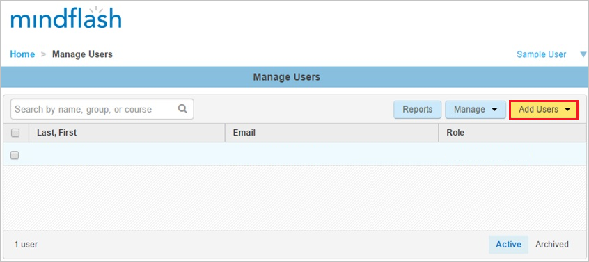
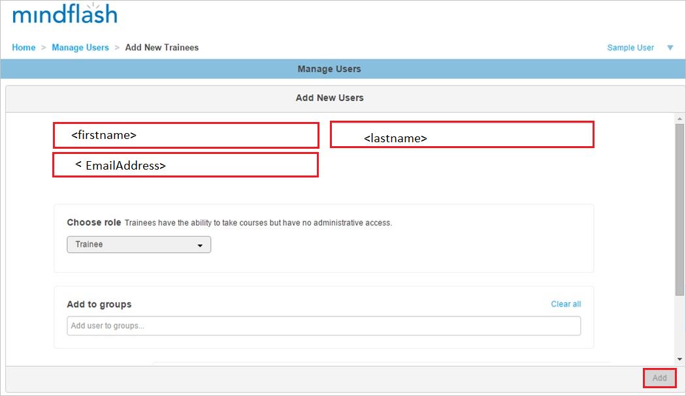

# Tutorial: Azure AD SSO integration with Trakstar Learn

In this tutorial, you'll learn how to integrate Trakstar Learn (Mindflash) with Azure Active Directory (Azure AD). When you integrate Learn with Azure AD, you can:

* Control in Azure AD who has access to Learn.
* Enable your users to be automatically signed-in to Learn with their Azure AD accounts.
* Manage your accounts in one central location - the Azure portal.

## Prerequisites

To get started, you need the following items:

* An Azure AD subscription. If you don't have a subscription, you can get a [free account](https://azure.microsoft.com/free/).
* Trakstar Learn single sign-on (SSO) enabled subscription.
* Along with Cloud Application Administrator, Application Administrator can also add or manage applications in Azure AD.
For more information, see [Azure built-in roles](../roles/permissions-reference.md).

## Scenario description

In this tutorial, you configure and test Azure AD single sign-on in a test environment.

* Learn supports **SP** initiated SSO.

## Add Learn from the gallery

To configure the integration of Learn into Azure AD, you need to add Learn from the gallery to your list of managed SaaS apps.

1. Sign in to the Azure portal using either a work or school account, or a personal Microsoft account.
1. On the left navigation pane, select the **Azure Active Directory** service.
1. Navigate to **Enterprise Applications** and then select **All Applications**.
1. To add new application, select **New application**.
1. In the **Add from the gallery** section, type **Trakstar Learn** in the search box.  Trakstar Learn was formerly Mindlfash.
1. Select **Trakstar Learn** from results panel and then add the app. Wait a few seconds while the app is added to your tenant.

## Configure and test Azure AD SSO for Learn

Configure and test Azure AD SSO with Learn using a test user called **B.Simon**. For SSO to work, you need to establish a link relationship between an Azure AD user and the related user in Learn.

To configure and test Azure AD SSO with Learn, perform the following steps:

1. **[Configure Azure AD SSO](#configure-azure-ad-sso)** - to enable your users to use this feature.
    1. **[Create an Azure AD test user](#create-an-azure-ad-test-user)** - to test Azure AD single sign-on with B.Simon.
    1. **[Assign the Azure AD test user](#assign-the-azure-ad-test-user)** - to enable B.Simon to use Azure AD single sign-on.
1. **[Configure Trakstar Learn SSO](#configure-trakstar-learn-sso)** - to configure the single sign-on settings on application side.
    1. **[Create Trakstar Learn test user](#create-trakstar-learn-test-user)** - to have a counterpart of B.Simon in Trakstar Learn that is linked to the Azure AD representation of user.
1. **[Test SSO](#test-sso)** - to verify whether the configuration works.

## Configure Azure AD SSO

Follow these steps to enable Azure AD SSO in the Azure portal.

1. In the Azure portal, on the **Trakstar Learn** application integration page, find the **Manage** section and select **single sign-on**.
1. On the **Select a single sign-on method** page, select **SAML**.
1. On the **Set up single sign-on with SAML** page, click the pencil icon for **Basic SAML Configuration** to edit the settings.

    

1. On the **Basic SAML Configuration** section, perform the following steps:

    a. In the **Identifier (Entity ID)** text box, type a URL using the following pattern:
    `https://<companyname>.mindflash.com`

	b. In the **Sign on URL** text box, type a URL using the following pattern:
    `https://<companyname>.mindflash.com`

	> [!NOTE]
	> These values are not real. Update these values with the actual Identifier and Sign on URL. Contact [Trakstar Learn Client support team](mailto:learn@trakstar.com) to get these values. You can also refer to the patterns shown in the **Basic SAML Configuration** section in the Azure portal.

1. On the **Set up Single Sign-On with SAML** page, in the **SAML Signing Certificate** section, click **Download** to download the **Federation Metadata XML** from the given options as per your requirement and save it on your computer.

	

1. On the **Set up Trakstar Learn** section, copy the appropriate URL(s) as per your requirement.

	

### Create an Azure AD test user 

In this section, you'll create a test user in the Azure portal called B.Simon.

1. From the left pane in the Azure portal, select **Azure Active Directory**, select **Users**, and then select **All users**.
1. Select **New user** at the top of the screen.
1. In the **User** properties, follow these steps:
   1. In the **Name** field, enter `B.Simon`.  
   1. In the **User name** field, enter the username@companydomain.extension. For example, `B.Simon@contoso.com`.
   1. Select the **Show password** check box, and then write down the value that's displayed in the **Password** box.
   1. Click **Create**.

### Assign the Azure AD test user

In this section, you'll enable B.Simon to use Azure single sign-on by granting access to Learn.

1. In the Azure portal, select **Enterprise Applications**, and then select **All applications**.
1. In the applications list, select **Trakstar Learn**.
1. In the app's overview page, find the **Manage** section and select **Users and groups**.
1. Select **Add user**, then select **Users and groups** in the **Add Assignment** dialog.
1. In the **Users and groups** dialog, select **B.Simon** from the Users list, then click the **Select** button at the bottom of the screen.
1. If you are expecting a role to be assigned to the users, you can select it from the **Select a role** dropdown. If no role has been set up for this app, you see "Default Access" role selected.
1. In the **Add Assignment** dialog, click the **Assign** button.

## Configure Trakstar Learn SSO

To configure single sign-on on **Trakstar Learn** side, you need to send the downloaded **Federation Metadata XML** and appropriate copied URLs from Azure portal to [Trakstar Learn support team](mailto:learn@trakstar.com). They set this setting to have the SAML SSO connection set properly on both sides.

### Create Trakstar Learn test user

In order to enable Azure AD users to log into Learn, they must be provisioned into Learn. In the case of Learn, provisioning is a manual task.

### To provision a user account, perform the following steps:

1. Log in to your **Trakstar Learn** company site as an administrator.

1. Go to **Manage Users**.
   
    

1. Click the **Add Users**, and then click **New**.

1. In the **Add New Users** section, perform the following steps of a valid Azure AD account you want to provision:
   
    
   
    a. In the **First name** textbox, type **First name** of the user as **Britta**.

	b. In the **Last name** textbox, type **Last name** of the user as **Simon**.
	
	c. In the **Email** textbox, type **Email Address** of the user as **BrittaSimon\@contoso.com**.

    b. Click **Add**.

>[!NOTE]
>You can use any other Learn user account creation tools or APIs provided by Learn to provision Azure AD user accounts. 
> 

## Test SSO

In this section, you test your Azure AD single sign-on configuration with following options. 

* Click on **Test this application** in Azure portal. This will redirect to Learn Sign on URL where you can initiate the login flow. 

* Go to Learn Sign on URL directly and initiate the login flow from there.

* You can use Microsoft My Apps. When you click the Trakstar Learn tile in the My Apps, this will redirect to Learn Sign on URL. For more information about the My Apps, see [Introduction to the My Apps](../user-help/my-apps-portal-end-user-access.md).

## Next steps

Once you configure Trakstar Learn you can enforce session control, which protects exfiltration and infiltration of your organization’s sensitive data in real time. Session control extends from Conditional Access. [Learn how to enforce session control with Microsoft Cloud App Security](/cloud-app-security/proxy-deployment-aad).