# Tutorial: Microsoft Entra integration with Mitel MiCloud Connect or CloudLink Platform

In this tutorial, you will learn how to use the Mitel Connect app to integrate Microsoft Entra ID with Mitel MiCloud Connect or CloudLink Platform. The Mitel Connect app is available in the Azure Gallery. Integrating Microsoft Entra ID with MiCloud Connect or CloudLink Platform provides you with the following benefits:

* You can control users' access to MiCloud Connect apps and to CloudLink apps in Microsoft Entra ID by using their enterprise credentials.
* You can enable users on your account to be automatically signed in to MiCloud Connect or CloudLink (single sign-on) by using their Microsoft Entra accounts.

## Prerequisites

To configure Microsoft Entra integration with MiCloud Connect, you need the following items:

* A Microsoft Entra subscription. If you don't have a Microsoft Entra environment, you can get a [free account](https://azure.microsoft.com/free/).
* A Mitel MiCloud Connect account or Mitel CloudLink account, depending on the application you want to configure.

## Scenario description

In this tutorial, you'll configure and test Microsoft Entra single sign-on (SSO).

* Mitel Connect supports **SP** initiated SSO.

## Adding Mitel Connect from the gallery

To configure the integration of Mitel Connect into Microsoft Entra ID, you need to add Mitel Connect from the gallery to your list of managed SaaS apps.

1. Sign in to the [Microsoft Entra admin center](https://entra.microsoft.com) as at least a [Cloud Application Administrator](../roles/permissions-reference.md#cloud-application-administrator).
1. Browse to **Identity** > **Applications** > **Enterprise applications** > **New application**.
1. In the **Add from the gallery** section, type **Mitel Connect** in the search box.
1. Select **Mitel Connect** from results panel and then add the app. Wait a few seconds while the app is added to your tenant.

 Alternatively, you can also use the [Enterprise App Configuration Wizard](https://portal.office.com/AdminPortal/home?Q=Docs#/azureadappintegration). In this wizard, you can add an application to your tenant, add users/groups to the app, assign roles, as well as walk through the SSO configuration as well. [Learn more about Microsoft 365 wizards.](/microsoft-365/admin/misc/azure-ad-setup-guides)

## Configure and test Microsoft Entra SSO

In this section, you'll configure and test Microsoft Entra SSO with MiCloud Connect or CloudLink Platform based on a test user named **_Britta Simon_**. For single sign-on to work, a link must be established between the user in Azure portal and the corresponding user on the Mitel platform. Refer to the following sections for information about configuring and testing Microsoft Entra SSO with MiCloud Connect or CloudLink Platform.
* Configure and test Microsoft Entra SSO with MiCloud Connect
* Configure and test Microsoft Entra SSO with CloudLink Platform

## Configure and test Microsoft Entra SSO with MiCloud Connect

To configure and test Microsoft Entra single sign-on with MiCloud Connect:

1. **[Configure MiCloud Connect for SSO with Microsoft Entra ID](#configure-micloud-connect-for-sso-with-azure-ad)** - to enable your users to use this feature and to configure the SSO settings on the application side.
2. **[Create a Microsoft Entra test user](#create-an-azure-ad-test-user)** - to test Microsoft Entra single sign-on with Britta Simon.
3. **[Assign the Microsoft Entra test user](#assign-the-azure-ad-test-user)** - to enable Britta Simon to use Microsoft Entra single sign-on.
4. **[Create a Mitel MiCloud Connect test user](#create-a-mitel-micloud-connect-test-user)** - to have a counterpart of Britta Simon on your MiCloud Connect account that is linked to the Microsoft Entra representation of the user.
5. **[Test SSO](#test-sso)** - to verify whether the configuration works.

## Configure MiCloud Connect for SSO with Microsoft Entra ID

In this section, you'll enable Microsoft Entra single sign-on for MiCloud Connect in the Azure portal and configure your MiCloud Connect account to allow SSO using Microsoft Entra ID.

To configure MiCloud Connect with SSO for Microsoft Entra ID, it is easiest to open the Azure portal and the Mitel Account portal side by side. You'll need to copy some information to the Mitel Account portal and some from the Mitel Account portal to the Azure portal.

1. To open the configuration page in the Azure portal:

    1. On the **Mitel Connect** application integration page, select **Single sign-on**.

    1. In the **Select a Single sign-on method** dialog box, select **SAML**. The SAML-based sign-on page is displayed.

2. To open the configuration dialog box in the Mitel Account portal:

    1. On the **Phone System** menu, select **Add-On Features**.

    1. To the right of **Single Sign-On**, select **Activate** or **Settings**.
    
    The Connect Single Sign-On Settings dialog box appears.
	
3. Select the **Enable Single Sign-On** check box.
    
    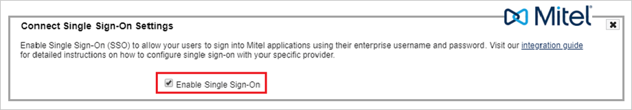

4. In the Azure portal, select the **Edit** icon in the **Basic SAML Configuration** section.
   
    

    The Basic SAML Configuration dialog box appears.

5.  Copy the URL from the **Mitel Identifier (Entity ID)** field in the Mitel Account portal and paste it into the **Identifier (Entity ID)** field.

6. Copy the URL from the **Reply URL (Assertion Consumer Service URL)** field in the Mitel Account portal and paste it into the **Reply URL (Assertion Consumer Service URL)** field.

   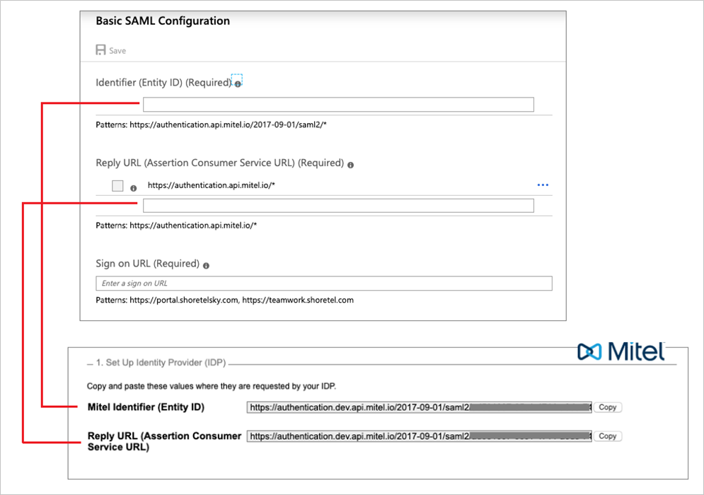

7. In the **Sign-on URL** text box, type one of the following URLs:

    1. **https://portal.shoretelsky.com** - to use the Mitel Account portal as your default Mitel application
    1. **https://teamwork.shoretel.com** - to use Teamwork as your default Mitel application

    > [!NOTE]
    > The default Mitel application is the application that is accessed when a user selects the Mitel Connect tile in the Access Panel. This is also the application accessed when doing a test setup from Microsoft Entra ID.

8. Select **Save** in the **Basic SAML Configuration** dialog box.

9. In the **SAML Signing Certificate** section on the **SAML-based sign-on** page in the Azure portal, select **Download** next to **Certificate (Base64)** to download the **Signing Certificate** and save it to your computer.

    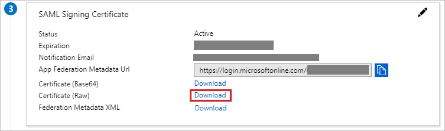

10. Open the Signing Certificate file in a text editor, copy all data in the file, and then paste the data in the **Signing Certificate** field in the Mitel Account portal. 

      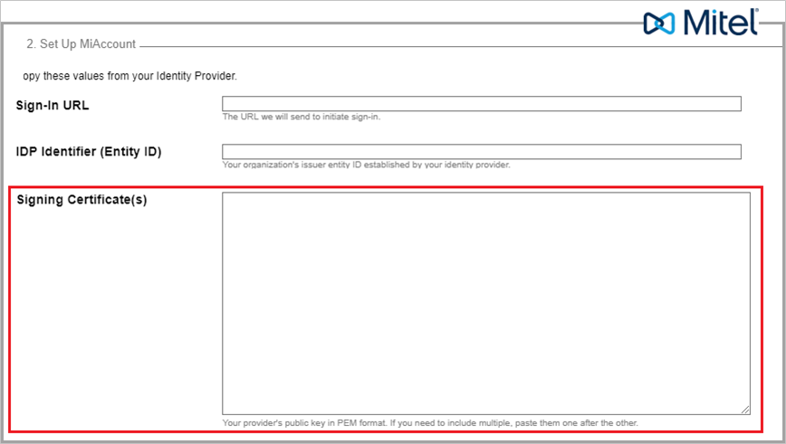

11. In the **Setup Mitel Connect** section on the **SAML-based sign-on** page of the Azure portal:

     1. Copy the URL from the **Login URL** field and paste it into the **Sign-in URL** field in the Mitel Account portal.

     1. Copy the URL from the **Microsoft Entra Identifier** field and paste it into the **Entity ID** field in the Mitel Account portal.
         
         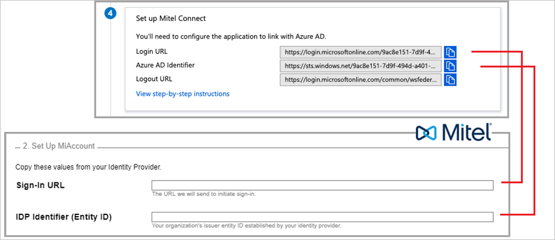

12. Select **Save** on the **Connect Single Sign-On Settings** dialog box in the Mitel Account portal.

### Create a Microsoft Entra test user 

In this section, you'll create a test user called B.Simon.

1. Sign in to the [Microsoft Entra admin center](https://entra.microsoft.com) as at least a [User Administrator](../roles/permissions-reference.md#user-administrator).
1. Browse to **Identity** > **Users** > **All users**.
1. Select **New user** > **Create new user**, at the top of the screen.
1. In the **User** properties, follow these steps:
   1. In the **Display name** field, enter `B.Simon`.  
   1. In the **User principal name** field, enter the username@companydomain.extension. For example, `B.Simon@contoso.com`.
   1. Select the **Show password** check box, and then write down the value that's displayed in the **Password** box.
   1. Select **Review + create**.
1. Select **Create**.

### Assign the Microsoft Entra test user

In this section, you'll enable B.Simon to use single sign-on by granting access to Mitel Connect.

1. Sign in to the [Microsoft Entra admin center](https://entra.microsoft.com) as at least a [Cloud Application Administrator](../roles/permissions-reference.md#cloud-application-administrator).
1. Browse to **Identity** > **Applications** > **Enterprise applications** > **Mitel Connect**.
1. In the app's overview page, select **Users and groups**.
1. Select **Add user/group**, then select **Users and groups** in the **Add Assignment** dialog.
   1. In the **Users and groups** dialog, select **B.Simon** from the Users list, then click the **Select** button at the bottom of the screen.
   1. If you are expecting a role to be assigned to the users, you can select it from the **Select a role** dropdown. If no role has been set up for this app, you see "Default Access" role selected.
   1. In the **Add Assignment** dialog, click the **Assign** button.

### Create a Mitel MiCloud Connect test user

In this section, you create a user named Britta Simon on your MiCloud Connect account. Users must be created and activated before using single sign-on.

For details about adding users in the Mitel Account portal, see the [Adding a User](https://shoretelcommunity.force.com/s/article/Adding-Users-092815) article in the Mitel Knowledge Base.

Create a user on your MiCloud Connect account with the following details:

* **Name:** Britta Simon
* **Business Email Address:** `brittasimon@<yourcompanydomain>.<extension>`   
  (Example: [brittasimon@contoso.com](mailto:brittasimon@contoso.com))
* **Username:** `brittasimon@<yourcompanydomain>.<extension>`  
  (Example: [brittasimon@contoso.com](mailto:brittasimon@contoso.com); the user’s username is typically the same as the user’s business email address)

> [!NOTE]
> The user’s MiCloud Connect username must be identical to the user’s email address in Azure.

### Test SSO

In this section, you test your Microsoft Entra single sign-on configuration with following options. 

* Click on **Test this application**, this will redirect to Mitel Connect Sign-on URL where you can initiate the login flow. 

* Go to Mitel Connect Sign-on URL directly and initiate the login flow from there.

* You can use Microsoft My Apps. When you click the Mitel Connect tile in the My Apps, this will redirect to MiCloud Connect Sign-on URL. For more information about the My Apps, see [Introduction to the My Apps](https://support.microsoft.com/account-billing/sign-in-and-start-apps-from-the-my-apps-portal-2f3b1bae-0e5a-4a86-a33e-876fbd2a4510).

## Configure and test Microsoft Entra SSO with CloudLink Platform

This section describes how to enable Microsoft Entra SSO for CloudLink platform in the Azure portal and how to configure your CloudLink platform account to allow single sign-on using Microsoft Entra ID.

To configure CloudLink platform with single sign-on for Microsoft Entra ID, it is recommended that you  open the Azure portal and the CloudLink Accounts portal side by side as you will need to copy some information to the CloudLink Accounts portal and vice versa.

1. To open the configuration page in the Azure portal:

    1. On the **Mitel Connect** application integration page, select **Single sign-on**.
    1. In the **Select a Single sign-on method** dialog box, select **SAML**. The **SAML-based Sign-on** page opens, displaying the **Basic SAML Configuration** section.

       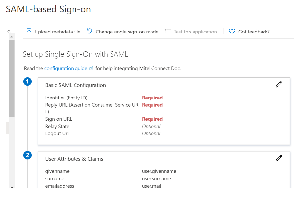

2. To access the **Microsoft Entra Single Sign On** configuration panel in the CloudLink Accounts portal:

    1. Go to the **Account Information** page of the customer account with which you want to enable the integration.

    1. In the **Integrations** section, select **+ Add new**. A pop-up screen displays the **Integrations** panel.

    1. Select the **3rd party** tab. A list of supported third-party applications is displayed. Select the **Add** button associated with **Microsoft Entra Single Sign On**,  and select **Done**.

       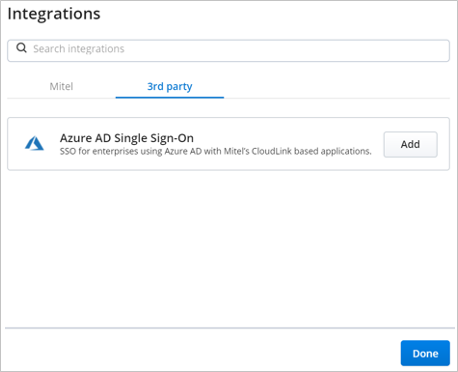

       The **Microsoft Entra Single Sign On** is enabled for the customer account and is added to the **Integrations** section of the **Account Information** page.   

   1. Select **Complete Setup**.
    
      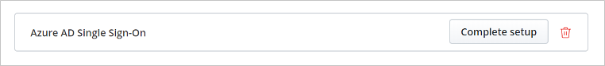
      
      The **Microsoft Entra Single Sign On** configuration panel opens.
      
       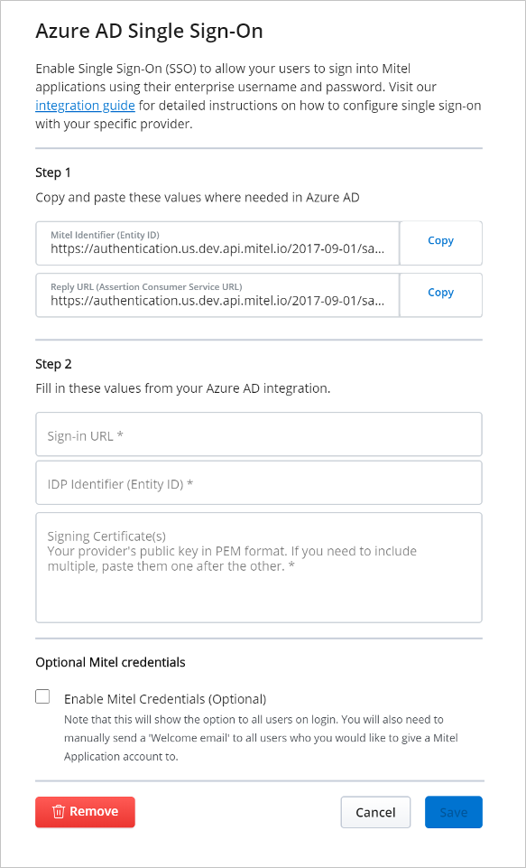
       
       Mitel recommends that the **Enable Mitel Credentials (Optional)** check box in the **Optional Mitel credentials** section is not selected. Select this check box only if you want the user to sign in to the CloudLink application using the Mitel credentials in addition to the single sign-on option.

3. In the Azure portal, from the **SAML-based Sign-on** page, select the **Edit** icon  in the **Basic SAML Configuration** section. The **Basic SAML Configuration** panel opens.

    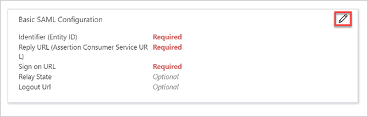
 
 4. Copy the URL from the **Mitel Identifier (Entity ID)** field in the CloudLink Accounts portal and paste it into the **Identifier (Entity ID)** field.

 5. Copy the URL from the **Reply URL (Assertion Consumer Service URL)** field in the CloudLink Accounts portal and paste it into the **Reply URL (Assertion Consumer Service URL)** field.  
    
    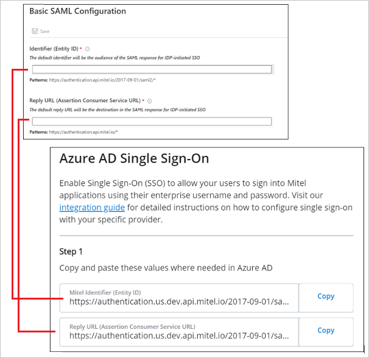 

 6. In the **Sign-on URL** text box, type the URL `https://accounts.mitel.io` to use the CloudLink Accounts portal as your default Mitel application.
     
     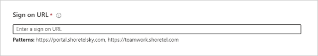
  
     > [!NOTE]
     > The default Mitel application is the application that opens when a user selects the Mitel Connect tile in the Access Panel. This is also the application accessed when the user configures a test setup from Microsoft Entra ID.

7. Select **Save** in the **Basic SAML Configuration** dialog box.

8. In the **SAML Signing Certificate** section on the **SAML-based sign-on** page in the Azure portal, select **Download** beside **Certificate (Base64)** to download the **Signing Certificate**. Save the certificate on your computer.
  
    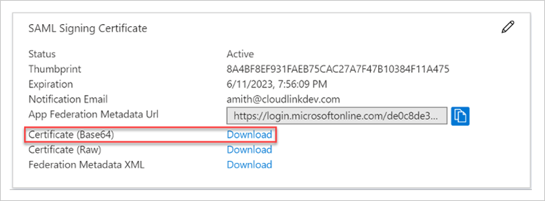

9. Open the Signing Certificate file in a text editor, copy all data in the file, and then paste the data into the **Signing Certificate** field in the CloudLink Accounts portal.  

    > [!NOTE]
    > If you have more than one certificate, we recommend that you paste them one after the other. 
       
    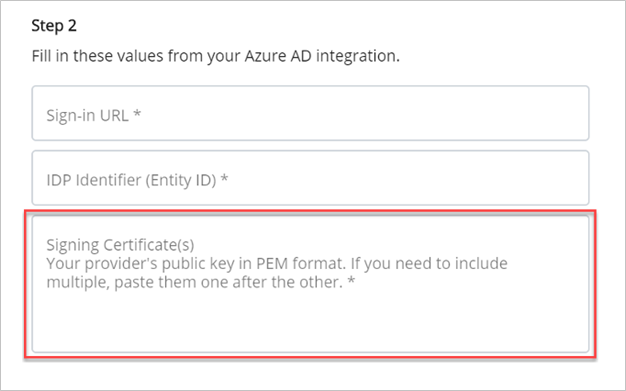

10. In the **Set up Mitel Connect** section on the **SAML-based sign-on** page of the Azure portal:

     1. Copy the URL from the **Login URL** field and paste it into the **Sign-in URL** field in the CloudLink Accounts portal.

     1. Copy the URL from the **Microsoft Entra Identifier** field and paste it into the **IDP Identifier (Entity ID)** field in the CloudLink Accounts portal.
     
        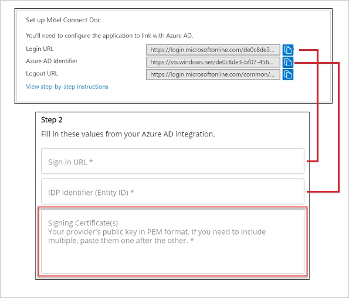

11. Select **Save** on the **Microsoft Entra Single Sign On** panel in the CloudLink Accounts portal.

### Create a Microsoft Entra test user 

In this section, you'll create a test user called B.Simon.

1. Sign in to the [Microsoft Entra admin center](https://entra.microsoft.com) as at least a [User Administrator](../roles/permissions-reference.md#user-administrator).
1. Browse to **Identity** > **Users** > **All users**.
1. Select **New user** > **Create new user**, at the top of the screen.
1. In the **User** properties, follow these steps:
   1. In the **Display name** field, enter `B.Simon`.  
   1. In the **User principal name** field, enter the username@companydomain.extension. For example, `B.Simon@contoso.com`.
   1. Select the **Show password** check box, and then write down the value that's displayed in the **Password** box.
   1. Select **Review + create**.
1. Select **Create**.

### Assign the Microsoft Entra test user

In this section, you'll enable B.Simon to use single sign-on by granting access to Mitel Connect.

1. Sign in to the [Microsoft Entra admin center](https://entra.microsoft.com) as at least a [Cloud Application Administrator](../roles/permissions-reference.md#cloud-application-administrator).
1. Browse to **Identity** > **Applications** > **Enterprise applications** > **Mitel Connect**.
1. In the app's overview page, select **Users and groups**.
1. Select **Add user/group**, then select **Users and groups** in the **Add Assignment** dialog.
   1. In the **Users and groups** dialog, select **B.Simon** from the Users list, then click the **Select** button at the bottom of the screen.
   1. If you are expecting a role to be assigned to the users, you can select it from the **Select a role** dropdown. If no role has been set up for this app, you see "Default Access" role selected.
   1. In the **Add Assignment** dialog, click the **Assign** button.

### Create a CloudLink test user

This section describes how to create a test user named **_Britta Simon_** on your CloudLink platform. Users must be created and activated before they can use single sign-on.

For details about adding users in the CloudLink Accounts portal, see **_Managing Users_** in the [CloudLink Accounts documentation](https://www.mitel.com/document-center/technology/cloudlink/all-releases/en/cloudlink-accounts-html).

Create a user on your CloudLink Accounts portal with the following details:

* Name: Britta Simon
* First Name: Britta
* Last Name: Simon
* Email: BrittaSimon@contoso.com

> [!NOTE]
> The user's CloudLink email address must be identical to the **User Principal Name**.

### Test SSO

In this section, you test your Microsoft Entra single sign-on configuration with following options. 

* Click on **Test this application**, this will redirect to CloudLink Sign-on URL where you can initiate the login flow. 

* Go to CloudLink Sign-on URL directly and initiate the login flow from there.

* You can use Microsoft My Apps. When you click the Mitel Connect tile in the My Apps, this will redirect to CloudLink Sign-on URL. For more information about the My Apps, see [Introduction to the My Apps](https://support.microsoft.com/account-billing/sign-in-and-start-apps-from-the-my-apps-portal-2f3b1bae-0e5a-4a86-a33e-876fbd2a4510).

## Next steps

Once you configure Mitel Connect you can enforce session control, which protects exfiltration and infiltration of your organization’s sensitive data in real time. Session control extends from Conditional Access. [Learn how to enforce session control with Microsoft Defender for Cloud Apps](/cloud-app-security/proxy-deployment-aad).
