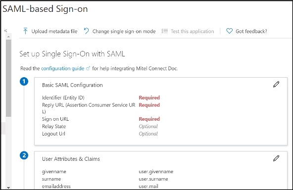
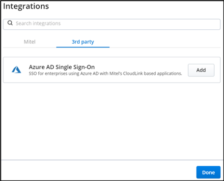
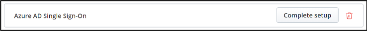
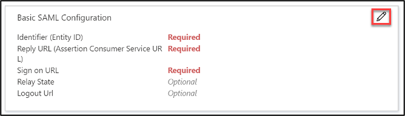
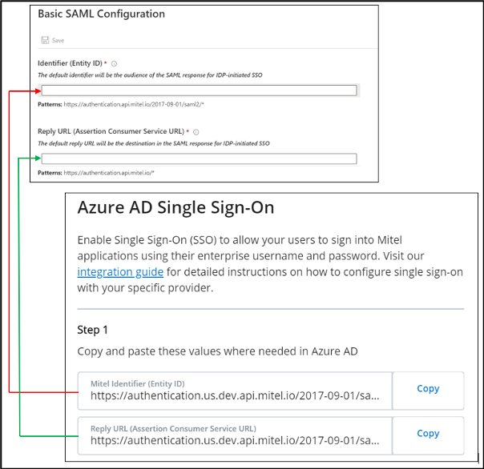
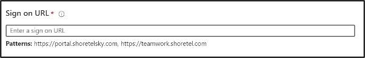
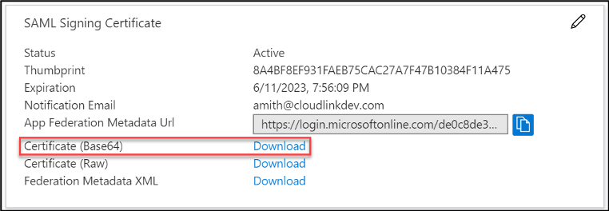
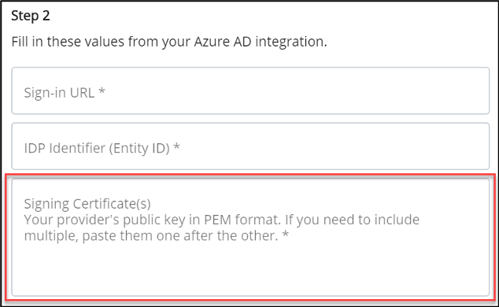
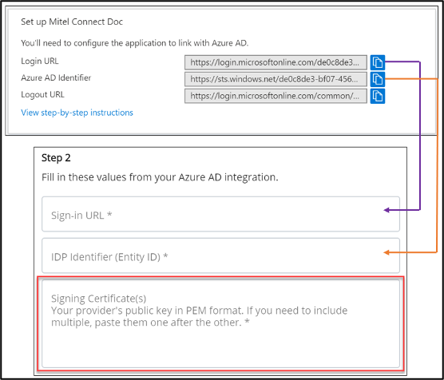

---
title: 'Tutorial: Azure Active Directory integration with Mitel Connect | Microsoft Docs'
description: Learn how to configure single sign-on between Azure Active Directory and Mitel Connect.
services: active-directory
documentationCenter: na
author: jeevansd
manager: mtillman
ms.reviewer: barbkess

ms.assetid: 204f540b-09f1-452b-a52f-78143710ef76
ms.service: active-directory
ms.subservice: saas-app-tutorial
ms.workload: identity
ms.tgt_pltfrm: na
ms.devlang: na
ms.topic: tutorial
ms.date: 05/03/2019
ms.author: jeedes

---
# Tutorial: Azure Active Directory integration with Mitel MiCloud Connect or Cloudlink Platform

In this tutorial, you will learn how to use the Mitel Connect app to integrate Azure Active Directory (Azure AD) with Mitel MiCloud Connect or CloudLink Platform. The Mitel Connect app is available in the Azure Gallery. Integrating Azure AD with MiCloud Connect or CloudLink Platform provides you with the following benefits:

* You can control user’s access to MiCloud Connect apps and to CloudLink apps in Azure AD by using their enterprise credentials.
* You can enable users on your account to be automatically signed-in to MiCloud Connect or CloudLink (single sign-on) using their Azure AD accounts.

For details about SaaS app integration with Azure AD, see [What is application access and single sign-on with Azure Active Directory](https://docs.microsoft.com/azure/active-directory/active-directory-appssoaccess-whatis).
If you don't have an Azure subscription, [create a free account](https://azure.microsoft.com/free/) before you begin the integration of Azure AD with Mitel MiCloud Connect or CloudLink Platform.

## Prerequisites

To configure Azure AD integration with MiCloud Connect, you need the following items:

* An Azure AD subscription

  If you don't have an Azure AD environment, you can get a [free account](https://azure.microsoft.com/free/)
* A Mitel MiCloud Connect account or Mitel CloudLink Account, depending on the application you want to configure.

## Scenario description

In this tutorial, you'll configure and test Azure AD single sign-on (SSO).

## Adding Mitel Connect from the gallery

To configure the integration of Mitel Connect into Azure AD, you need to add Mitel Connect from the gallery to your list of managed SaaS apps in the Azure portal.
* Mitel Connect supports **SP** initiated SSO

**To add Mitel Connect from the gallery, do the following steps:**

1. In the **[Azure portal](https://portal.azure.com)**, on the left navigation panel, click **Azure Active Directory**.

	

2. Click **Enterprise Applications** and then click **All Applications**.

	

3. Click **New application**.

	

4. Type **Mitel Connect** in the search field, click **Mitel Connect** from results panel, and then click **Add**.

	 

## Configure and test Azure AD single sign-on

In this section, you'll configure and test Azure AD SSO with MiCloud Connect or CloudLink Platform based on a test user named **_Britta Simon_**. For single sign-on to work, a link must be established between the user in Azure AD portal and the corresponding user on the Mitel platform. Refer to the following sections for information about configuring and testing Azure AD SSO with MiCloud Connect or CloudLink Platform.
* Configure and test Azure AD SSO with MiCloud Connect
* Configure and test Azure AD SSO with Cloudlink Platform

### Configure and test Azure AD SSO with MiCloud Connect
To configure and test Azure AD single sign-on with MiCloud Connect, you need to complete the following steps:

1. **[Configure MiCloud Connect for SSO with Azure AD](#configure-micloud-connect-for-sso-with-azure-ad)** - to enable your users to use this feature and to configure the SSO settings on the application side.
2. **[Create an Azure AD test user](#create-an-azure-ad-test-user)** - to test Azure AD single sign-on with Britta Simon.
3. **[Assign the Azure AD test user](#assign-the-azure-ad-test-user)** - to enable Britta Simon to use Azure AD single sign-on.
4. **[Create a Mitel MiCloud Connect test user](#create-a-mitel-micloud-connect-test-user)** - to have a counterpart of Britta Simon on your MiCloud Connect account that is linked to the Azure AD representation of the user.
5. **[Test single sign-on](#test-single-sign-on)** - to verify whether the configuration works.

#### Configure MiCloud Connect for SSO with Azure AD

In this section, you'll enable Azure AD single sign-on for MiCloud Connect in the Azure portal and configure your MiCloud Connect account to allow SSO using Azure AD.

To configure MiCloud Connect with SSO for Azure AD, it is easiest to open the Azure portal and the Mitel Account portal side by side. You'll need to copy some information from the Azure portal to the Mitel Account portal and some from the Mitel Account portal to the Azure portal.

1. To open the configuration page in the [Azure portal](https://portal.azure.com/), do the following:

    a. On the **Mitel Connect** application integration page, click **Single sign-on**.

    

    b. In the **Select a Single sign-on method** dialog, click **SAML**.

    
	
	The SAML-based sign-on page is displayed.

2. To open the configuration dialog in the Mitel Account portal, do the following:

    a. On the **Phone System** menu, click **Add-On Features**.

    b. To the right of **Single Sign-On**, click **Activate** or **Settings**.
    
    The Connect Single Sign-On Settings dialog box appears.
	
3. Select the **Enable Single Sign-On** check box.
    

4. In the Azure portal, click the **Edit** icon in the **Basic SAML Configuration** section.
    

    The Basic SAML Configuration dialog box appears.

5.  Copy the URL from the **Mitel Identifier (Entity ID)** field in the Mitel Account portal and paste it into the **Identifier (Entity ID)** field in the Azure portal.

6. Copy the URL from the **Reply URL (Assertion Consumer Service URL)** field in the Mitel Account portal and paste it into the **Reply URL (Assertion Consumer Service URL)** field in the Azure portal.  
   

7. In the **Sign on URL** text box, type one of the following URLs:

    * **https://portal.shoretelsky.com** - to use the Mitel Account portal as your default Mitel application
    * **https://teamwork.shoretel.com** - to use Teamwork as your default Mitel application

    **NOTE**: The default Mitel application is the application accessed when a user clicks on the Mitel Connect tile in the Access Panel. This is also the application accessed when doing a test setup from Azure AD.

8. Click **Save** in the **Basic SAML Configuration** dialog box in the Azure portal.

9. In the **SAML Signing Certificate** section on the **SAML-based sign-on** page in the Azure portal, click **Download** next to **Certificate (Base64)** to download the **Signing Certificate** and save it to your computer.
    

10. Open the Signing Certificate file in a text editor, copy all data in the file, and then paste the data in the **Signing Certificate** field in the Mitel Account portal. 
    

11. In the **Setup Mitel Connect** section on the **SAML-based sign-on** page of the Azure portal, do the following:

    a. Copy the URL from the **Login URL** field and paste it into the **Sign-in URL** field in the Mitel Account portal.

    b. Copy the URL from the **Azure AD Identifier** field and paste it into the **Entity ID** field in the Mitel Account portal.
    

12. Click **Save** on the **Connect Single Sign-On Settings** dialog box in the Mitel Account portal.

#### Create an Azure AD test user 

In this section, you'll create a test user named Britta Simon in the Azure portal.

1. In the Azure portal, in the left pane, click **Azure Active Directory**, click **Users**, and then click **All users**.

    

2. Click **New user** at the top of the screen.

    

3. In the User properties dialog, do the following steps:

    

    a. In the **Name** field, type **BrittaSimon**.
  
    b. In the **User name** field, type brittasimon@\<yourcompanydomain\>.\<extension\>.  
For example, BrittaSimon@contoso.com.

    c. Select the **Show password** check box, and then write down the value that is displayed in the **Password** box.

    d. Click **Create**.

#### Assign the Azure AD test user

In this section, you'll enable Britta Simon to use Azure single sign-on by granting access to Mitel Connect.

1. In the Azure portal, click **Enterprise Applications**, and then click **All applications**.

	

2. In the applications list, click **Mitel Connect**.

	

3. In the menu on the left, click **Users and groups**.

    

4. Click **Add user**, then click **Users and groups** in the **Add Assignment** dialog.

    

5. In the **Users and groups** dialog, select **Britta Simon** in the **Users** list, then click **Select** at the bottom of the screen.

6. If you are expecting any role value in the SAML assertion, select the appropriate role for the user from the list in the **Select Role** dialog, and then click **Select** at the bottom of the screen.

7. In the **Add Assignment** dialog, click **Assign**.

#### Create a Mitel MiCloud Connect test user

In this section, you create a user named Britta Simon on your MiCloud Connect account. Users must be created and activated before using single sign-on.

For details about adding users in the Mitel Account portal, see the [Adding a User](https://oneview.mitel.com/s/article/Adding-a-User-092815) article in the Mitel Knowledge Base.

Create a user on your MiCloud Connect account with the following details:

  * **Name:** Britta Simon

* **Business Email Address:** `brittasimon@<yourcompanydomain>.<extension>`   
(Example: [brittasimon@contoso.com](mailto:brittasimon@contoso.com))

* **Username:** `brittasimon@<yourcompanydomain>.<extension>`  
(Example: [brittasimon@contoso.com](mailto:brittasimon@contoso.com); the user’s username is typically the same as the user’s business email address)

**NOTE:** The user’s MiCloud Connect username must be identical to the user’s email address in Azure.

#### Test single sign-on

In this section, you'll test your Azure AD single sign-on configuration using the Access Panel.

When you click the Mitel Connect tile in the Access Panel, you should be automatically redirected to sign in to the MiCloud Connect application you configured as your default in the **Sign on URL** field. For more information about the Access Panel, see [Introduction to the Access Panel](https://docs.microsoft.com/azure/active-directory/active-directory-saas-access-panel-introduction).

### Configure and test Azure AD SSO with Cloudlink Platform
This section describes how to enable Azure AD SSO for CloudLink platform in the Azure portal and how to configure your CloudLink platform account to allow single sign-on using Azure AD.

To configure CloudLink platform with single sign-on for Azure AD, it is recommended that you  open the Azure portal and the CloudLink Accounts portal side-by-side as you will need to copy some information from the Azure portal to the CloudLink Accounts portal and vice versa.

1. To open the configuration page in the [Azure portal](https://portal.azure.com/), do the following:

    a. On the **Mitel Connect** application integration page, click **Single sign-on**.

    

    b. In the **Select a Single sign-on method** dialog, click **SAML**.

    
	
	The **SAML-based Sign-on** page opens, displaying the **Basic SAML Configuration** section.

2. To access the **Azure AD Single Sign On** configuration panel in the CloudLink Accounts portal, you must do the following:

    * Navigate to the **Account Information** page of the customer account with which you want to enable the integration.

   * In the **Integrations** section, click **+ Add new**. A pop-up screen displays the **Integrations** panel.

   * Click the **3rd party** tab. A list of supported third-party applications is displayed. Click the **Add** button associated with **Azure AD Single Sign On**,  and click **Done**.

       

    The **Azure AD Single Sign On** is enabled for the customer account and is added to the **Integrations** section of the **Account Information** page.   

   * Click **Complete Setup**
       
      The **Azure AD Single Sign On** configuration panel opens.
       
      Mitel recommends that the **Enable Mitel Credentials (Optional)** check box in the **Optional Mitel credentials** section is not selected. Select this checkbox only if you want the user to log in to the CloudLink application using the Mitel credentials in addition to the single sign-on option.

3. In the Azure portal, from the **SAML-based Sign-on** page, click the Edit icon  in the **Basic SAML Configuration** section. The **Basic SAML Configuration** panel opens.

 
 4. Copy the URL from the **Mitel Identifier (Entity ID)** field in the CloudLink Accounts portal and paste it into the **Identifier (Entity ID)** field in the Azure portal.
 5. Copy the URL from the **Reply URL (Assertion Consumer Service URL)** field in the CloudLink Accounts portal and paste it into the **Reply URL (Assertion Consumer Service URL)** field in the Azure portal.  
   
 6. In the **Sign on URL** text box, type the following URL:
[httpS://accounts.mitel.io](https://accounts.mitel.io) — to use the CloudLink Accounts portal as your default Mitel application.

  
       NOTE: The default Mitel application is the application that opens when a user clicks the Mitel Connect tile in the Access Panel. This is also the application accessed when the user configures a test setup from Azure AD.

7. Click  in the **Basic SAML Configuration** 

8. In the **SAML Signing Certificate** section on the **SAML-based sign-on** page in the Azure portal, click **Download** beside **Certificate (Base64)** to download the **Signing Certificate**. Save the certificate on your computer.
 

9. Open the Signing Certificate file in a text editor, copy all data in the file, and then paste the data into the **Signing Certificate** field in the CloudLink Accounts portal.  
Note: If you have more than one certificate, it is recommended that you paste them one after the other. 
 

10. In the **Set up Mitel Connect** section on the **SAML-based sign-on** page of the Azure portal, do the following:

    * Copy the URL from the **Login URL** field and paste it into the **Sign-in URL** field in the CloudLink Accounts portal.

    * Copy the URL from the **Azure AD Identifier** field and paste it into the **IDP Identifier (Entity ID)** field in the CloudLink Accounts portal.

    

11. Click **Save** on the **Azure AD Single Sign On** panel in the CloudLink Accounts portal.

#### Create an Azure AD test user 

In this section, you'll create a test user named Britta Simon in the Azure portal.

1. In the Azure portal, in the left pane, click **Azure Active Directory**, click **Users**, and then click **All users**.

    

2. Click **New user** at the top of the screen.

    

3. In the User properties dialog, do the following steps:

    

    a. In the **Name** field, type **BrittaSimon**.
  
    b. In the **User name** field, type brittasimon@\<yourcompanydomain\>.\<extension\>.  
For example, BrittaSimon@contoso.com.

    c. Select the **Show password** check box, and then write down the value that is displayed in the **Password** box.

    d. Click **Create**.

#### Assign the Azure AD test user

In this section, you'll enable Britta Simon to use Azure single sign-on by granting access to Mitel Connect.

1. In the Azure portal, click **Enterprise Applications**, and then click **All applications**.

	

2. In the applications list, click **Mitel Connect**.

	

3. In the menu on the left, click **Users and groups**.

    

4. Click **Add user**, then click **Users and groups** in the **Add Assignment** dialog.

    

5. In the **Users and groups** dialog, select **Britta Simon** in the **Users** list, then click **Select** at the bottom of the screen.

6. If you are expecting any role value in the SAML assertion, select the appropriate role for the user from the list in the **Select Role** dialog, and then click **Select** at the bottom of the screen.

7. In the **Add Assignment** dialog, click **Assign**.

#### Create a Cloudlink test user
This section describes how to create a test user named **_Britta Simon_** on your CloudLink platform. Users must be created and activated before they can use single sign-on.

For details about adding users in the CloudLink Accounts portal, see the **_Managing Users_** topic in [CloudLink Accounts documentation](https://www.mitel.com/document-center/technology/cloudlink/all-releases/en/cloudlink-accounts-html).

Create a user on your CloudLink Accounts portal with the following details:

   * Name: Britta Simon
   * First Name: Britta
   * Last Name: Simon
   * Email: BrittaSimon@contoso.com

NOTE: The user's CloudLink email address must be identical to the **User Principal Name** in Azure portal.

#### Test Single Sign-On
In this section, you'll test your Azure AD SSO configuration using the Access Panel.

When you click the Mitel Connect tile in the Access Panel, you will be automatically redirected to sign in to the CloudLink application you configured as your default in the **Sign on URL** field. For more information about the Access Panel, see [Introduction to the Access Panel](https://docs.microsoft.com/en-us/azure/active-directory/active-directory-saas-access-panel-introduction).

## Additional Resources

- [List of Tutorials on How to Integrate SaaS Apps with Azure Active Directory](https://docs.microsoft.com/azure/active-directory/active-directory-saas-tutorial-list)

- [What is application access and single sign-on with Azure Active Directory?](https://docs.microsoft.com/azure/active-directory/active-directory-appssoaccess-whatis)

- [What is Conditional Access in Azure Active Directory?](https://docs.microsoft.com/azure/active-directory/conditional-access/overview)
