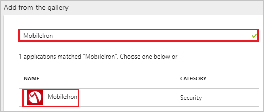
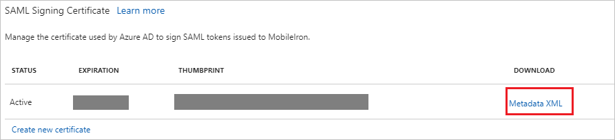
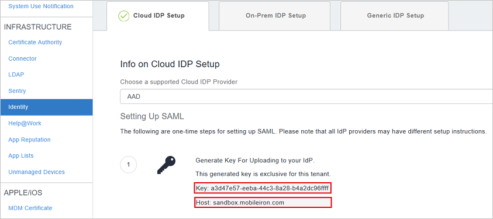
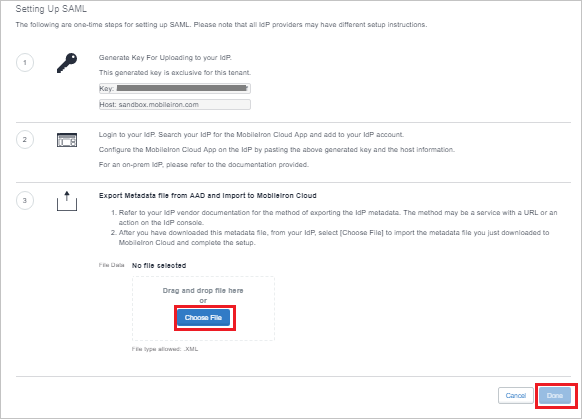

---
title: 'Tutorial: Azure Active Directory integration with MobileIron | Microsoft Docs'
description: Learn how to configure single sign-on between Azure Active Directory and MobileIron.
services: active-directory
documentationCenter: na
author: jeevansd
manager: mtillman
ms.reviewer: joflore

ms.assetid: 3e4bbd5b-290e-4951-971b-ec0c1c11aaa2
ms.service: active-directory
ms.component: saas-app-tutorial
ms.workload: identity
ms.tgt_pltfrm: na
ms.devlang: na
ms.topic: article
ms.date: 10/9/2017
ms.author: jeedes

---
# Tutorial: Azure Active Directory integration with MobileIron

In this tutorial, you learn how to integrate MobileIron with Azure Active Directory (Azure AD).

Integrating MobileIron with Azure AD provides you with the following benefits:

- You can control in Azure AD who has access to MobileIron.
- You can enable your users to automatically get signed-on to MobileIron (Single Sign-On) with their Azure AD accounts.
- You can manage your accounts in one central location - the Azure portal.

If you want to know more details about SaaS app integration with Azure AD, see [what is application access and single sign-on with Azure Active Directory](../manage-apps/what-is-single-sign-on.md).

## Prerequisites

To configure Azure AD integration with MobileIron, you need the following items:

- An Azure AD subscription
- A MobileIron single sign-on enabled subscription

> [!NOTE]
> To test the steps in this tutorial, we do not recommend using a production environment.

To test the steps in this tutorial, you should follow these recommendations:

- Do not use your production environment, unless it is necessary.
- If you don't have an Azure AD trial environment, you can [get a one-month trial](https://azure.microsoft.com/pricing/free-trial/).

## Scenario description
In this tutorial, you test Azure AD single sign-on in a test environment. 
The scenario outlined in this tutorial consists of two main building blocks:

1. Adding MobileIron from the gallery
1. Configuring and testing Azure AD single sign-on

## Adding MobileIron from the gallery
To configure the integration of MobileIron into Azure AD, you need to add MobileIron from the gallery to your list of managed SaaS apps.

**To add MobileIron from the gallery, perform the following steps:**

1. In the **[Azure portal](https://portal.azure.com)**, on the left navigation panel, click **Azure Active Directory** icon. 

	![The Azure Active Directory button][1]

1. Navigate to **Enterprise applications**. Then go to **All applications**.

	![The Enterprise applications blade][2]
	
1. To add new application, click **New application** button on the top of dialog.

	![The New application button][3]

1. In the search box, type **MobileIron**, select **MobileIron** from result panel then click **Add** button to add the application.

	

## Configure and test Azure AD single sign-on

In this section, you configure and test Azure AD single sign-on with MobileIron based on a test user called "Britta Simon."

For single sign-on to work, Azure AD needs to know what the counterpart user in MobileIron is to a user in Azure AD. In other words, a link relationship between an Azure AD user and the related user in MobileIron needs to be established.

In MobileIron, assign the value of the **user name** in Azure AD as the value of the **Username** to establish the link relationship.

To configure and test Azure AD single sign-on with MobileIron, you need to complete the following building blocks:

1. **[Configure Azure AD Single Sign-On](#configure-azure-ad-single-sign-on)** - to enable your users to use this feature.
1. **[Create an Azure AD test user](#create-an-azure-ad-test-user)** - to test Azure AD single sign-on with Britta Simon.
1. **[Create a MobileIron test user](#create-a-mobileiron-test-user)** - to have a counterpart of Britta Simon in MobileIron that is linked to the Azure AD representation of user.
1. **[Assign the Azure AD test user](#assign-the-azure-ad-test-user)** - to enable Britta Simon to use Azure AD single sign-on.
1. **[Test single sign-on](#test-single-sign-on)** - to verify whether the configuration works.

### Configure Azure AD single sign-on

In this section, you enable Azure AD single sign-on in the Azure portal and configure single sign-on in your MobileIron application.

**To configure Azure AD single sign-on with MobileIron, perform the following steps:**

1. In the Azure portal, on the **MobileIron** application integration page, click **Single sign-on**.

	![Configure single sign-on link][4]

1. On the **Single sign-on** dialog, select **Mode** as	**SAML-based Sign-on** to enable single sign-on.
 
	

1. On the **MobileIron Domain and URLs** section, perform the following steps if you wish to configure the application in **IDP** initiated mode:

	

    a. In the **Identifier** textbox, type a URL using the following pattern: `https://www.mobileiron.com/<key>`

	b. In the **Reply URL** textbox, type a URL using the following pattern: `https://<host>.mobileiron.com/saml/SSO/alias/<key>`

1. Check **Show advanced URL settings** and perform the following step if you wish to configure the application in **SP** initiated mode:

	

	In the **Sign-on URL** textbox, type a URL using the following pattern: `https://<host>.mobileiron.com/user/login.html`
	
	> [!NOTE] 
	> These values are not real. Update these values with the actual Identifier, Reply URL, and Sign-On URL. You will get the values of key and host from the ​administrative​ ​portal of MobileIron which is explained later in the tutorial.

1. On the **SAML Signing Certificate** section, click **Metadata XML** and then save the metadata file on your computer.

	 

1. Click **Save** button.

	

1. In a different web browser window, log in to your MobileIron company site as an administrator.

1. Go to **Admin** > **Identity**.

   * Select **AAD** option in the **Info on Cloud IDP Setup** field.

    

1. Copy the values of **Key** and **Host** and paste them to complete the URLs in the **MobileIron Domain and URLs** section in Azure portal.

    

1. In the **Export​​ ​metadata​ file ​from​ ​A​AD​ and import to MobileIron Cloud Field** click **Choose File** to upload the downloaded metadata from Azure portal. Click **Done** once uploaded.
 
    

> [!TIP]
> You can now read a concise version of these instructions inside the [Azure portal](https://portal.azure.com), while you are setting up the app!  After adding this app from the **Active Directory > Enterprise Applications** section, simply click the **Single Sign-On** tab and access the embedded documentation through the **Configuration** section at the bottom. You can read more about the embedded documentation feature here: [Azure AD embedded documentation]( https://go.microsoft.com/fwlink/?linkid=845985)

### Create an Azure AD test user

The objective of this section is to create a test user in the Azure portal called Britta Simon.

   ![Create an Azure AD test user][100]

**To create a test user in Azure AD, perform the following steps:**

1. In the Azure portal, in the left pane, click the **Azure Active Directory** button.

    

1. To display the list of users, go to **Users and groups**, and then click **All users**.

    

1. To open the **User** dialog box, click **Add** at the top of the **All Users** dialog box.

    

1. In the **User** dialog box, perform the following steps:

    

    a. In the **Name** box, type **BrittaSimon**.

    b. In the **User name** box, type the email address of user Britta Simon.

    c. Select the **Show Password** check box, and then write down the value that's displayed in the **Password** box.

    d. Click **Create**.
  
### Create a MobileIron test user

To enable Azure AD users to log in to MobileIron, they must be provisioned into MobileIron.  
In the case of MobileIron, provisioning is a manual task.

**To provision a user account, perform the following steps:**

1. Log in to your MobileIron company site as an administrator.

1. Go to **Users** and Click on **Add** > **Single User**.

    

1. On the **“Single User”** dialog page, perform the following steps:

	

	a. In **E-mail Address** text box, enter the email of user like brittasimon@contoso.com.

	b. In **First Name** text box, enter the first name of user like Britta.

	c. In **Last Name** text box, enter the last name of user like Simon.
	
	d. Click **Done**.	

### Assign the Azure AD test user

In this section, you enable Britta Simon to use Azure single sign-on by granting access to MobileIron.

![Assign the user role][200] 

**To assign Britta Simon to MobileIron, perform the following steps:**

1. In the Azure portal, open the applications view, and then navigate to the directory view and go to **Enterprise applications** then click **All applications**.

	![Assign User][201] 

1. In the applications list, select **MobileIron**.

	  

1. In the menu on the left, click **Users and groups**.

	![The "Users and groups" link][202]

1. Click **Add** button. Then select **Users and groups** on **Add Assignment** dialog.

	![The Add Assignment pane][203]

1. On **Users and groups** dialog, select **Britta Simon** in the Users list.

1. Click **Select** button on **Users and groups** dialog.

1. Click **Assign** button on **Add Assignment** dialog.
	
### Test single sign-on

In this section, you test your Azure AD single sign-on configuration using the Access Panel.

When you click the MobileIron tile in the Access Panel, you should get automatically signed-on to your MobileIron application.
For more information about the Access Panel, see [Introduction to the Access Panel](../user-help/active-directory-saas-access-panel-introduction.md). 

## Additional resources

* [List of Tutorials on How to Integrate SaaS Apps with Azure Active Directory](tutorial-list.md)
* [What is application access and single sign-on with Azure Active Directory?](../manage-apps/what-is-single-sign-on.md)

<!--Image references-->

[1]: ./media/mobileiron-tutorial/tutorial_general_01.png
[2]: ./media/mobileiron-tutorial/tutorial_general_02.png
[3]: ./media/mobileiron-tutorial/tutorial_general_03.png
[4]: ./media/mobileiron-tutorial/tutorial_general_04.png

[100]: ./media/mobileiron-tutorial/tutorial_general_100.png

[200]: ./media/mobileiron-tutorial/tutorial_general_200.png
[201]: ./media/mobileiron-tutorial/tutorial_general_201.png
[202]: ./media/mobileiron-tutorial/tutorial_general_202.png
[203]: ./media/mobileiron-tutorial/tutorial_general_203.png

