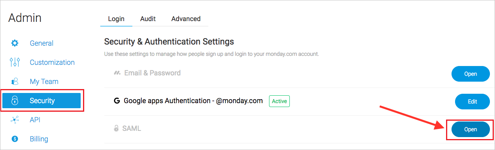

# Tutorial: Integrate monday.com with Azure Active Directory

In this tutorial, you'll learn how to integrate monday.com with Azure Active Directory (Azure AD). When you integrate monday.com with Azure AD, you can:

* Control in Azure AD who has access to monday.com.
* Enable your users to be automatically signed-in to monday.com with their Azure AD accounts.
* Manage your accounts in one central location - the Azure portal.

To learn more about SaaS app integration with Azure AD, see [What is application access and single sign-on with Azure Active Directory](https://docs.microsoft.com/azure/active-directory/active-directory-appssoaccess-whatis).

## Prerequisites

To get started, you need the following items:

* An Azure AD subscription. If you don't have a subscription, you can get a [free account](https://azure.microsoft.com/free/).
* monday.com single sign-on (SSO) enabled subscription.

## Scenario description

In this tutorial, you configure and test Azure AD SSO in a test environment. monday.com supports **SP and IDP** initiated SSO and supports **Just In Time** user provisioning.

## Adding monday.com from the gallery

To configure the integration of monday.com into Azure AD, you need to add monday.com from the gallery to your list of managed SaaS apps.

1. Sign in to the [Azure portal](https://portal.azure.com) using either a work or school account, or a personal Microsoft account.
1. On the left navigation pane, select the **Azure Active Directory** service.
1. Navigate to **Enterprise Applications** and then select **All Applications**.
1. To add new application, select **New application**.
1. In the **Add from the gallery** section, type **monday.com** in the search box.
1. Select **monday.com** from results panel and then add the app. Wait a few seconds while the app is added to your tenant.

## Configure and test Azure AD single sign-on

Configure and test Azure AD SSO with monday.com using a test user called **B.Simon**. For SSO to work, you need to establish a link relationship between an Azure AD user and the related user in monday.com.

To configure and test Azure AD SSO with monday.com, complete the following building blocks:

1. **[Configure Azure AD SSO](#configure-azure-ad-sso)** to enable your users to use this feature.
2. **[Configure monday.com](#configure-mondaycom)** to configure the SSO settings on application side.
3. **[Create an Azure AD test user](#create-an-azure-ad-test-user)** to test Azure AD single sign-on with B.Simon.
4. **[Assign the Azure AD test user](#assign-the-azure-ad-test-user)** to enable B.Simon to use Azure AD single sign-on.
5. **[Create monday.com test user](#create-mondaycom-test-user)** to have a counterpart of B.Simon in monday.com that is linked to the Azure AD representation of user.
6. **[Test SSO](#test-sso)** to verify whether the configuration works.

### Configure Azure AD SSO

Follow these steps to enable Azure AD SSO in the Azure portal.

1. In the [Azure portal](https://portal.azure.com/), on the **monday.com** application integration page, find the **Manage** section and select **Single sign-on**.
1. On the **Select a Single sign-on method** page, select **SAML**.
1. On the **Set up Single Sign-On with SAML** page, click the edit/pen icon for **Basic SAML Configuration** to edit the settings.

   

1. In the **Basic SAML Configuration** pane, if you have a service provider metadata file and you want to configure in **IDP-initiated** mode, perform the following steps:

	1. Select **Upload metadata file**.

	1. To select the metadata file, select the folder icon, and then select **Upload**.

	1. After the metadata file is successfully uploaded, the **Identifier** and **Reply URL** values are automatically populated in the **Basic SAML Configuration** pane:

	   > [!Note]
	   > If the **Identifier** and **Reply URL** values do not get populated automatically, then fill in the values manually. The **Identifier** and the **Reply URL** are the same and value is in the following pattern: `https://<your-domain>.monday.com/saml/saml_callback`

1. Click **Set additional URLs** and perform the following step if you wish to configure the application in **SP** initiated mode:

    In the **Sign-on URL** text box, type a URL using the following pattern:
    `https://<your-domain>.monday.com`

	> [!NOTE]
	> These values are not real. Update these values with the actual Identifier, Reply URL and Sign-On URL. Contact [monday.com Client support team](mailto:dev@food.ee) to get these values. You can also refer to the patterns shown in the **Basic SAML Configuration** section in the Azure portal.

1. Your monday.com application expects the SAML assertions in a specific format, which requires you to add custom attribute mappings to your SAML token attributes configuration. The following screenshot shows the list of default attributes. Click **Edit** icon to open User Attributes dialog.

    

1. In addition to above, monday.com application expects few more attributes to be passed back in SAML response. In the **User Claims** section on the **User Attributes** dialog, perform the following steps to add SAML token attribute as shown in the below table:

    | Name | Source Attribute|
	| ---------------| --------------- |
	| Email | user.mail |
    | FirstName | user.givenname |
    | LastName | user.surname |

    a. Click **Add new claim** to open the **Manage user claims** dialog.

    b. In the **Name** textbox, type the attribute name shown for that row.

    c. Remove the **Namespace**.

    d. Select Source as **Attribute**.

    e. From the **Source attribute** list, type the attribute value shown for that row.

    f. Click **Ok**.

    g. Click **Save**.

1. On the **Set up Single Sign-On with SAML** page, in the **SAML Signing Certificate** section, find **Certificate (Base64)** and select **Download** to download the certificate and save it on your computer.

   

1. On the **Set up monday.com** section, copy the appropriate URL(s) based on your requirement.

   

### Configure monday.com

1. To automate the configuration within monday.com, you need to install **My Apps Secure Sign-in browser extension** by clicking **Install the extension**.

	

1. After adding extension to the browser, click on **Setup monday.com** which will direct you to the monday.com application. From there, provide the admin credentials to sign into monday.com. The browser extension will automatically configure the application for you and automate steps 3-6.

	

1. If you want to setup monday.com manually, open a new web browser window and sign in to monday.com as an administrator and perform the following steps:

1. Go to the **Profile** on the top right corner of page and click on **Admin**.

	

1. Select **Security** and make sure to click on **Open** next to SAML.

    

1. Fill in the details below from your IDP.

    

	>[!NOTE]
	>For more details refer [this](https://support.monday.com/hc/articles/360000460605-SAML-Single-Sign-on?abcb=34642) article

### Create an Azure AD test user

In this section, you'll create a test user in the Azure portal called B.Simon.

1. From the left pane in the Azure portal, select **Azure Active Directory**, select **Users**, and then select **All users**.
1. Select **New user** at the top of the screen.
1. In the **User** properties, follow these steps:
   1. In the **Name** field, enter `B.Simon`.  
   1. In the **User name** field, enter the username@companydomain.extension. For example, `B.Simon@contoso.com`.
   1. Select the **Show password** check box, and then write down the value that's displayed in the **Password** box.
   1. Click **Create**.

### Assign the Azure AD test user

In this section, you'll enable B.Simon to use Azure single sign-on by granting access to monday.com.

1. In the Azure portal, select **Enterprise Applications**, and then select **All applications**.
1. In the applications list, select **monday.com**.
1. In the app's overview page, find the **Manage** section and select **Users and groups**.

   

1. Select **Add user**, then select **Users and groups** in the **Add Assignment** dialog.

	

1. In the **Users and groups** dialog, select **B.Simon** from the Users list, then click the **Select** button at the bottom of the screen.
1. If you're expecting any role value in the SAML assertion, in the **Select Role** dialog, select the appropriate role for the user from the list and then click the **Select** button at the bottom of the screen.
1. In the **Add Assignment** dialog, click the **Assign** button.

### Create monday.com test user

In this section, a user called B.Simon is created in monday.com. monday.com supports just-in-time provisioning, which is enabled by default. There is no action item for you in this section. If a user doesn't already exist in monday.com, a new one is created when you attempt to access monday.com.

### Test SSO

When you select the monday.com tile in the Access Panel, you should be automatically signed in to the monday.com for which you set up SSO. For more information about the Access Panel, see [Introduction to the Access Panel](https://docs.microsoft.com/azure/active-directory/active-directory-saas-access-panel-introduction).

## Additional resources

- [List of Tutorials on How to Integrate SaaS Apps with Azure Active Directory](https://docs.microsoft.com/azure/active-directory/active-directory-saas-tutorial-list)

- [What is application access and single sign-on with Azure Active Directory?](https://docs.microsoft.com/azure/active-directory/active-directory-appssoaccess-whatis)

- [What is conditional access in Azure Active Directory?](https://docs.microsoft.com/azure/active-directory/conditional-access/overview)
