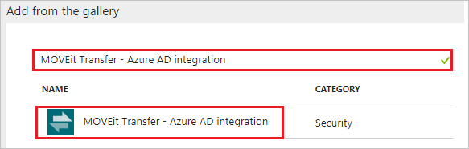
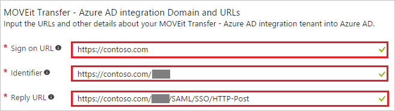
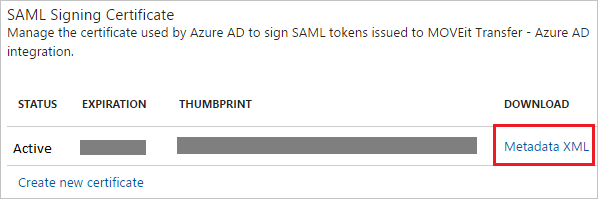

# Tutorial: Azure Active Directory integration with MOVEit Transfer - Azure AD integration

In this tutorial, you learn how to integrate MOVEit Transfer - Azure AD integration with Azure Active Directory (Azure AD).

Integrating MOVEit Transfer - Azure AD integration with Azure AD provides you with the following benefits:

- You can control in Azure AD who has access to MOVEit Transfer - Azure AD integration.
- You can enable your users to automatically get signed-on to MOVEit Transfer - Azure AD integration (Single Sign-On) with their Azure AD accounts.
- You can manage your accounts in one central location - the Azure portal.

If you want to know more details about SaaS app integration with Azure AD, see [what is application access and single sign-on with Azure Active Directory](../manage-apps/what-is-single-sign-on.md).

## Prerequisites

To configure Azure AD integration with MOVEit Transfer - Azure AD integration, you need the following items:

- An Azure AD subscription
- A MOVEit Transfer - Azure AD integration single-sign on enabled subscription

> [!NOTE]
> To test the steps in this tutorial, we do not recommend using a production environment.

To test the steps in this tutorial, you should follow these recommendations:

- Do not use your production environment, unless it is necessary.
- If you don't have an Azure AD trial environment, you can [get a one-month trial](https://azure.microsoft.com/pricing/free-trial/).

## Scenario description
In this tutorial, you test Azure AD single sign-on in a test environment. 
The scenario outlined in this tutorial consists of two main building blocks:

1. Adding MOVEit Transfer - Azure AD integration from the gallery
1. Configuring and testing Azure AD single sign-on

## Adding MOVEit Transfer - Azure AD integration from the gallery
To configure the integration of MOVEit Transfer - Azure AD integration into Azure AD, you need to add MOVEit Transfer - Azure AD integration from the gallery to your list of managed SaaS apps.

**To add MOVEit Transfer - Azure AD integration from the gallery, perform the following steps:**

1. In the **[Azure portal](https://portal.azure.com)**, on the left navigation panel, click **Azure Active Directory** icon. 

	![The Azure Active Directory button][1]

1. Navigate to **Enterprise applications**. Then go to **All applications**.

	![The Enterprise applications blade][2]
	
1. To add new application, click **New application** button on the top of dialog.

	![The New application button][3]

1. In the search box, type **MOVEit Transfer - Azure AD integration**, select **MOVEit Transfer - Azure AD integration** from result panel then click **Add** button to add the application.

	

## Configure and test Azure AD single sign-on

In this section, you configure and test Azure AD single sign-on with MOVEit Transfer - Azure AD integration based on a test user called "Britta Simon".

For single sign-on to work, Azure AD needs to know what the counterpart user in MOVEit Transfer - Azure AD integration is to a user in Azure AD. In other words, a link relationship between an Azure AD user and the related user in MOVEit Transfer - Azure AD integration needs to be established.

In MOVEit Transfer - Azure AD integration, assign the value of the **user name** in Azure AD as the value of the **Username** to establish the link relationship.

To configure and test Azure AD single sign-on with MOVEit Transfer - Azure AD integration, you need to complete the following building blocks:

1. **[Configure Azure AD Single Sign-On](#configure-azure-ad-single-sign-on)** - to enable your users to use this feature.
1. **[Create an Azure AD test user](#create-an-azure-ad-test-user)** - to test Azure AD single sign-on with Britta Simon.
1. **[Create a MOVEit Transfer - Azure AD integration test user](#create-a-moveit-transfer---azure-ad-integration-test-user)** - to have a counterpart of Britta Simon in MOVEit Transfer - Azure AD integration that is linked to the Azure AD representation of user.
1. **[Assign the Azure AD test user](#assign-the-azure-ad-test-user)** - to enable Britta Simon to use Azure AD single sign-on.
1. **[Test single sign-on](#test-single-sign-on)** - to verify whether the configuration works.

### Configure Azure AD single sign-on

In this section, you enable Azure AD single sign-on in the Azure portal and configure single sign-on in your MOVEit Transfer - Azure AD integration application.

**To configure Azure AD single sign-on with MOVEit Transfer - Azure AD integration, perform the following steps:**

1. In the Azure portal, on the **MOVEit Transfer - Azure AD integration** application integration page, click **Single sign-on**.

	![Configure single sign-on link][4]

1. On the **Single sign-on** dialog, select **Mode** as	**SAML-based Sign-on** to enable single sign-on.
 
	

1. On the **MOVEit Transfer - Azure AD integration Domain and URLs** section, perform the following steps:

	

	a. In the **Sign-on URL** textbox, type a URL using the following pattern: `https://contoso.com`

    b. In the **Identifier** textbox, type a URL using the following pattern: `https://contoso.com/<tenatid>`

	c. In the **Reply URL** textbox, type a URL using the following pattern: `https://contoso.com/<tenatid>/SAML/SSO/HTTP-Post`    
	 
	> [!NOTE] 
	> These values are not real. Update these values with the actual Identifier, Reply URL, and Sign-On URL. You can refer these values later in **Service Provider Metadata URL** section or contact [MOVEit Transfer - Azure AD integration Client support team](https://community.ipswitch.com/s/support) to get these values.

1. On the **SAML Signing Certificate** section, click **Metadata XML** and then save the metadata file on your computer.

	 

1. Click **Save** button.

	
	
1. Sign on to your MOVEit Transfer tenant as an administrator.

1. On the left navigation pane, click **Settings**.

	

1. Click **Single Signon** link, which is under **Security Policies -> User Auth**.

	

1. Click the Metadata URL link to download the metadata document.

	
	
	* Verify **entityID** matches **Identifier** in the **MOVEit Transfer - Azure AD integration Domain and URLs** section .
	* Verify **AssertionConsumerService** Location URL matches **REPLY URL** in the **MOVEit Transfer - Azure AD integration Domain and URLs** section.
	
	

1. Click **Add Identity Provider** button to add a new Federated Identity Provider.

	

1. Click **Browse...** to select the metadata file which you downloaded from Azure portal, then click **Add Identity Provider** to upload the downloaded file.

	

1. Select "**Yes**" as **Enabled** in the **Edit Federated Identity Provider Settings...** page and click **Save**.

	

1. In the **Edit Federated Identity Provider User Settings** page, perform the following actions:
	
	
	
	a. Select **SAML NameID** as **Login name**.
	
	b. Select **Other** as **Full name** and in the **Attribute name** textbox put the value: `http://schemas.microsoft.com/identity/claims/displayname`.
	
	c. Select **Other** as **Email** and in the **Attribute name** textbox put the value: `http://schemas.xmlsoap.org/ws/2005/05/identity/claims/emailaddress`.
	
	d. Select **Yes** as **Auto-create account on signon**.
	
	e. Click **Save** button.

> [!TIP]
> You can now read a concise version of these instructions inside the [Azure portal](https://portal.azure.com), while you are setting up the app!  After adding this app from the **Active Directory > Enterprise Applications** section, simply click the **Single Sign-On** tab and access the embedded documentation through the **Configuration** section at the bottom. You can read more about the embedded documentation feature here: [Azure AD embedded documentation]( https://go.microsoft.com/fwlink/?linkid=845985)

### Create an Azure AD test user

The objective of this section is to create a test user in the Azure portal called Britta Simon.

   ![Create an Azure AD test user][100]

**To create a test user in Azure AD, perform the following steps:**

1. In the Azure portal, in the left pane, click the **Azure Active Directory** button.

    

1. To display the list of users, go to **Users and groups**, and then click **All users**.

    

1. To open the **User** dialog box, click **Add** at the top of the **All Users** dialog box.

    

1. In the **User** dialog box, perform the following steps:

    

    a. In the **Name** box, type **BrittaSimon**.

    b. In the **User name** box, type the email address of user Britta Simon.

    c. Select the **Show Password** check box, and then write down the value that's displayed in the **Password** box.

    d. Click **Create**.
 
### Create a MOVEit Transfer - Azure AD integration test user

The objective of this section is to create a user called Britta Simon in MOVEit Transfer - Azure AD integration. MOVEit Transfer - Azure AD integration supports just-in-time provisioning, which you have enabled. There is no action item for you in this section. A new user is created during an attempt to access MOVEit Transfer - Azure AD integration if it doesn't exist yet.

>[!NOTE]
>If you need to create a user manually, you need to contact the [MOVEit Transfer - Azure AD integration Client support team](https://community.ipswitch.com/s/support).

### Assign the Azure AD test user

In this section, you enable Britta Simon to use Azure single sign-on by granting access to MOVEit Transfer - Azure AD integration.

![Assign the user role][200] 

**To assign Britta Simon to MOVEit Transfer - Azure AD integration, perform the following steps:**

1. In the Azure portal, open the applications view, and then navigate to the directory view and go to **Enterprise applications** then click **All applications**.

	![Assign User][201] 

1. In the applications list, select **MOVEit Transfer - Azure AD integration**.

	  

1. In the menu on the left, click **Users and groups**.

	![The "Users and groups" link][202]

1. Click **Add** button. Then select **Users and groups** on **Add Assignment** dialog.

	![The Add Assignment pane][203]

1. On **Users and groups** dialog, select **Britta Simon** in the Users list.

1. Click **Select** button on **Users and groups** dialog.

1. Click **Assign** button on **Add Assignment** dialog.
	
### Test single sign-on

The objective of this section is to test your Azure AD SSO configuration using the Access Panel.

When you click the MOVEit Transfer - Azure AD integration tile in the Access Panel, you should get automatically signed-on to your MOVEit Transfer - Azure AD integration application. 

## Additional resources

* [List of Tutorials on How to Integrate SaaS Apps with Azure Active Directory](tutorial-list.md)
* [What is application access and single sign-on with Azure Active Directory?](../manage-apps/what-is-single-sign-on.md)

<!--Image references-->

[1]: ./media/moveittransfer-tutorial/tutorial_general_01.png
[2]: ./media/moveittransfer-tutorial/tutorial_general_02.png
[3]: ./media/moveittransfer-tutorial/tutorial_general_03.png
[4]: ./media/moveittransfer-tutorial/tutorial_general_04.png

[100]: ./media/moveittransfer-tutorial/tutorial_general_100.png

[200]: ./media/moveittransfer-tutorial/tutorial_general_200.png
[201]: ./media/moveittransfer-tutorial/tutorial_general_201.png
[202]: ./media/moveittransfer-tutorial/tutorial_general_202.png
[203]: ./media/moveittransfer-tutorial/tutorial_general_203.png

