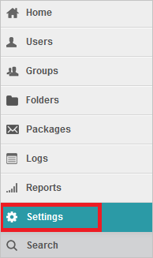
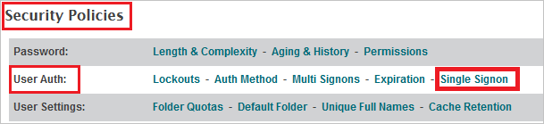
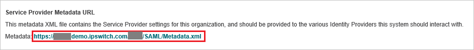
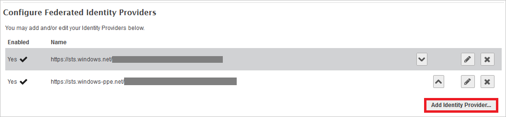
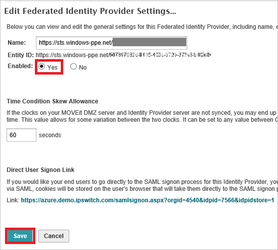
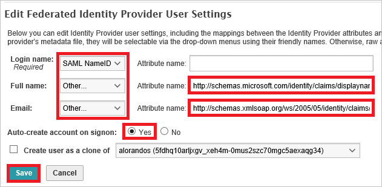

# Tutorial: Azure Active Directory integration with MOVEit Transfer - Azure AD integration

In this tutorial, you learn how to integrate MOVEit Transfer - Azure AD integration with Azure Active Directory (Azure AD).
Integrating MOVEit Transfer - Azure AD integration with Azure AD provides you with the following benefits:

* You can control in Azure AD who has access to MOVEit Transfer - Azure AD integration.
* You can enable your users to be automatically signed-in to MOVEit Transfer - Azure AD integration (Single Sign-On) with their Azure AD accounts.
* You can manage your accounts in one central location - the Azure portal.

If you want to know more details about SaaS app integration with Azure AD, see [What is application access and single sign-on with Azure Active Directory](https://docs.microsoft.com/azure/active-directory/active-directory-appssoaccess-whatis).
If you don't have an Azure subscription, [create a free account](https://azure.microsoft.com/free/) before you begin.

## Prerequisites

To configure Azure AD integration with MOVEit Transfer - Azure AD integration, you need the following items:

* An Azure AD subscription. If you don't have an Azure AD environment, you can get one-month trial [here](https://azure.microsoft.com/pricing/free-trial/)
* MOVEit Transfer - Azure AD integration single sign-on enabled subscription

## Scenario description

In this tutorial, you configure and test Azure AD single sign-on in a test environment.

* MOVEit Transfer - Azure AD integration supports **SP** initiated SSO

## Adding MOVEit Transfer - Azure AD integration from the gallery

To configure the integration of MOVEit Transfer - Azure AD integration into Azure AD, you need to add MOVEit Transfer - Azure AD integration from the gallery to your list of managed SaaS apps.

**To add MOVEit Transfer - Azure AD integration from the gallery, perform the following steps:**

1. In the **[Azure portal](https://portal.azure.com)**, on the left navigation panel, click **Azure Active Directory** icon.

	

2. Navigate to **Enterprise Applications** and then select the **All Applications** option.

	

3. To add new application, click **New application** button on the top of dialog.

	

4. In the search box, type **MOVEit Transfer - Azure AD integration**, select **MOVEit Transfer - Azure AD integration** from result panel then click **Add** button to add the application.

	 

## Configure and test Azure AD single sign-on

In this section, you configure and test Azure AD single sign-on with MOVEit Transfer - Azure AD integration based on a test user called **Britta Simon**.
For single sign-on to work, a link relationship between an Azure AD user and the related user in MOVEit Transfer - Azure AD integration needs to be established.

To configure and test Azure AD single sign-on with MOVEit Transfer - Azure AD integration, you need to complete the following building blocks:

1. **[Configure Azure AD Single Sign-On](#configure-azure-ad-single-sign-on)** - to enable your users to use this feature.
2. **[Configure MOVEit Transfer - Azure AD integration Single Sign-On](#configure-moveit-transfer---azure-ad-integration-single-sign-on)** - to configure the Single Sign-On settings on application side.
3. **[Create an Azure AD test user](#create-an-azure-ad-test-user)** - to test Azure AD single sign-on with Britta Simon.
4. **[Assign the Azure AD test user](#assign-the-azure-ad-test-user)** - to enable Britta Simon to use Azure AD single sign-on.
5. **[Create MOVEit Transfer - Azure AD integration test user](#create-moveit-transfer---azure-ad-integration-test-user)** - to have a counterpart of Britta Simon in MOVEit Transfer - Azure AD integration that is linked to the Azure AD representation of user.
6. **[Test single sign-on](#test-single-sign-on)** - to verify whether the configuration works.

### Configure Azure AD single sign-on

In this section, you enable Azure AD single sign-on in the Azure portal.

To configure Azure AD single sign-on with MOVEit Transfer - Azure AD integration, perform the following steps:

1. In the [Azure portal](https://portal.azure.com/), on the **MOVEit Transfer - Azure AD integration** application integration page, select **Single sign-on**.

    

2. On the **Select a Single sign-on method** dialog, select **SAML/WS-Fed** mode to enable single sign-on.

    

3. On the **Set up Single Sign-On with SAML** page, click **Edit** icon to open **Basic SAML Configuration** dialog.

	

4. On the **Basic SAML Configuration** section, if you have **Service Provider metadata file**, perform the following steps:

	a. Click **Upload metadata file**.

    

	b. Click on **folder logo** to select the metadata file and click **Upload**.

	

	c. After the metadata file is successfully uploaded, the **Identifier** and **Reply URL** value gets auto populated in **Basic SAML Configuration** section:

    

    In the **Sign-on URL** text box, type a URL using the following pattern:
    `https://contoso.com`

	> [!NOTE]
	> The **Sign-on URL** value is not real. Update the value with the actual Sign-On URL. Contact [MOVEit Transfer - Azure AD integration Client support](https://community.ipswitch.com/s/support) team to get the value. You can download the **Service Provider Metadata file** from the **Service Provider Metadata URL** which is explained later in the **Configure MOVEit Transfer - Azure AD integration Single Sign-On** section of the tutorial. You can also refer to the patterns shown in the **Basic SAML Configuration** section in the Azure portal.

4. On the **Set up Single Sign-On with SAML** page, in the **SAML Signing Certificate** section, click **Download** to download the **Federation Metadata XML** from the given options as per your requirement and save it on your computer.

	

6. On the **Set up MOVEit Transfer - Azure AD integration** section, copy the appropriate URL(s) as per your requirement.

	

	a. Login URL

	b. Azure AD Identifier

	c. Logout URL

### Configure MOVEit Transfer - Azure AD integration Single Sign-On

1. Sign on to your MOVEit Transfer tenant as an administrator.

2. On the left navigation pane, click **Settings**.

	

3. Click **Single Signon** link, which is under **Security Policies -> User Auth**.

	

4. Click the Metadata URL link to download the metadata document.

	
	
   * Verify **entityID** matches **Identifier** in the **Basic SAML Configuration** section .
   * Verify **AssertionConsumerService** Location URL matches **REPLY URL**  in the **Basic SAML Configuration** section.
	
     

5. Click **Add Identity Provider** button to add a new Federated Identity Provider.

	

6. Click **Browse...** to select the metadata file which you downloaded from Azure portal, then click **Add Identity Provider** to upload the downloaded file.

	

7. Select "**Yes**" as **Enabled** in the **Edit Federated Identity Provider Settings...** page and click **Save**.

	

8. In the **Edit Federated Identity Provider User Settings** page, perform the following actions:
	
	
	
	a. Select **SAML NameID** as **Login name**.
	
	b. Select **Other** as **Full name** and in the **Attribute name** textbox put the value: `http://schemas.microsoft.com/identity/claims/displayname`.
	
	c. Select **Other** as **Email** and in the **Attribute name** textbox put the value: `http://schemas.xmlsoap.org/ws/2005/05/identity/claims/emailaddress`.
	
	d. Select **Yes** as **Auto-create account on signon**.
	
	e. Click **Save** button.

### Create an Azure AD test user 

The objective of this section is to create a test user in the Azure portal called Britta Simon.

1. In the Azure portal, in the left pane, select **Azure Active Directory**, select **Users**, and then select **All users**.

    

2. Select **New user** at the top of the screen.

    

3. In the User properties, perform the following steps.

    

    a. In the **Name** field enter **BrittaSimon**.
  
    b. In the **User name** field type **brittasimon\@yourcompanydomain.extension**  
    For example, BrittaSimon@contoso.com

    c. Select **Show password** check box, and then write down the value that's displayed in the Password box.

    d. Click **Create**.

### Assign the Azure AD test user

In this section, you enable Britta Simon to use Azure single sign-on by granting access to MOVEit Transfer - Azure AD integration.

1. In the Azure portal, select **Enterprise Applications**, select **All applications**, then select **MOVEit Transfer - Azure AD integration**.

	

2. In the applications list, select **MOVEit Transfer - Azure AD integration**.

	

3. In the menu on the left, select **Users and groups**.

    

4. Click the **Add user** button, then select **Users and groups** in the **Add Assignment** dialog.

    

5. In the **Users and groups** dialog select **Britta Simon** in the Users list, then click the **Select** button at the bottom of the screen.

6. If you are expecting any role value in the SAML assertion then in the **Select Role** dialog select the appropriate role for the user from the list, then click the **Select** button at the bottom of the screen.

7. In the **Add Assignment** dialog click the **Assign** button.

### Create MOVEit Transfer - Azure AD integration test user

The objective of this section is to create a user called Britta Simon in MOVEit Transfer - Azure AD integration. MOVEit Transfer - Azure AD integration supports just-in-time provisioning, which you have enabled. There is no action item for you in this section. A new user is created during an attempt to access MOVEit Transfer - Azure AD integration if it doesn't exist yet.

>[!NOTE]
>If you need to create a user manually, you need to contact the [MOVEit Transfer - Azure AD integration Client support team](https://community.ipswitch.com/s/support).

### Test single sign-on 

In this section, you test your Azure AD single sign-on configuration using the Access Panel.

When you click the MOVEit Transfer - Azure AD integration tile in the Access Panel, you should be automatically signed in to the MOVEit Transfer - Azure AD integration for which you set up SSO. For more information about the Access Panel, see [Introduction to the Access Panel](https://docs.microsoft.com/azure/active-directory/active-directory-saas-access-panel-introduction).

## Additional resources

- [List of Tutorials on How to Integrate SaaS Apps with Azure Active Directory](https://docs.microsoft.com/azure/active-directory/active-directory-saas-tutorial-list)

- [What is application access and single sign-on with Azure Active Directory?](https://docs.microsoft.com/azure/active-directory/active-directory-appssoaccess-whatis)

- [What is Conditional Access in Azure Active Directory?](https://docs.microsoft.com/azure/active-directory/conditional-access/overview)

