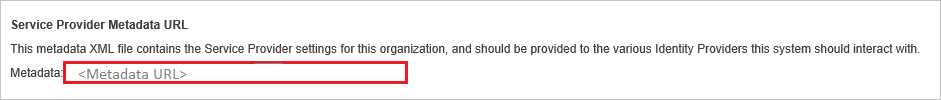
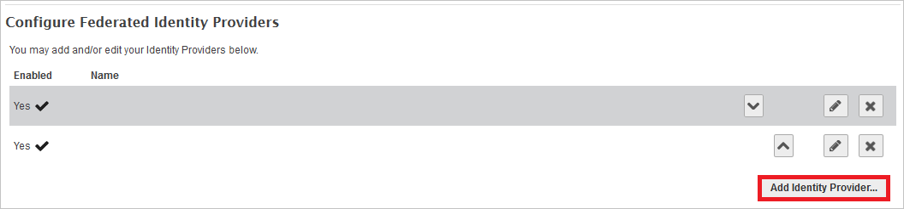
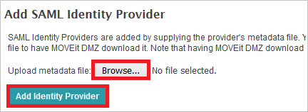
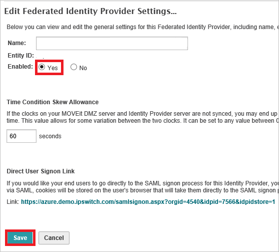

# Tutorial: Azure AD SSO integration with MOVEit Transfer - Azure AD integration

In this tutorial, you'll learn how to integrate MOVEit Transfer - Azure AD integration with Azure Active Directory (Azure AD). When you integrate MOVEit Transfer - Azure AD integration with Azure AD, you can:

* Control in Azure AD who has access to MOVEit Transfer - Azure AD integration.
* Enable your users to be automatically signed-in to MOVEit Transfer - Azure AD integration with their Azure AD accounts.
* Manage your accounts in one central location - the Azure portal.

## Prerequisites

To get started, you need the following items:

* An Azure AD subscription. If you don't have a subscription, you can get a [free account](https://azure.microsoft.com/free/).
* MOVEit Transfer - Azure AD integration single sign-on (SSO) enabled subscription.

## Scenario description

In this tutorial, you configure and test Azure AD single sign-on in a test environment.

* MOVEit Transfer - Azure AD integration supports **SP** initiated SSO.

## Add MOVEit Transfer - Azure AD integration from the gallery

To configure the integration of MOVEit Transfer - Azure AD integration into Azure AD, you need to add MOVEit Transfer - Azure AD integration from the gallery to your list of managed SaaS apps.

1. Sign in to the Azure portal using either a work or school account, or a personal Microsoft account.
1. On the left navigation pane, select the **Azure Active Directory** service.
1. Navigate to **Enterprise Applications** and then select **All Applications**.
1. To add new application, select **New application**.
1. In the **Add from the gallery** section, type **MOVEit Transfer - Azure AD integration** in the search box.
1. Select **MOVEit Transfer - Azure AD integration** from results panel and then add the app. Wait a few seconds while the app is added to your tenant.

 Alternatively, you can also use the [Enterprise App Configuration Wizard](https://portal.office.com/AdminPortal/home?Q=Docs#/azureadappintegration). In this wizard, you can add an application to your tenant, add users/groups to the app, assign roles, as well as walk through the SSO configuration as well. [Learn more about Microsoft 365 wizards.](/microsoft-365/admin/misc/azure-ad-setup-guides)

## Configure and test Azure AD SSO for MOVEit Transfer - Azure AD integration

Configure and test Azure AD SSO with MOVEit Transfer - Azure AD integration using a test user called **B.Simon**. For SSO to work, you need to establish a link relationship between an Azure AD user and the related user in MOVEit Transfer - Azure AD integration.

To configure and test Azure AD SSO with MOVEit Transfer - Azure AD integration, perform the following steps:

1. **[Configure Azure AD SSO](#configure-azure-ad-sso)** - to enable your users to use this feature.
    1. **[Create an Azure AD test user](#create-an-azure-ad-test-user)** - to test Azure AD single sign-on with B.Simon.
    1. **[Assign the Azure AD test user](#assign-the-azure-ad-test-user)** - to enable B.Simon to use Azure AD single sign-on.
1. **[Configure MOVEit Transfer - Azure AD integration SSO](#configure-moveit-transfer---azure-ad-integration-sso)** - to configure the single sign-on settings on application side.
    1. **[Create MOVEit Transfer - Azure AD integration test user](#create-moveit-transfer---azure-ad-integration-test-user)** - to have a counterpart of B.Simon in MOVEit Transfer - Azure AD integration that is linked to the Azure AD representation of user.
1. **[Test SSO](#test-sso)** - to verify whether the configuration works.

## Configure Azure AD SSO

Follow these steps to enable Azure AD SSO in the Azure portal.

1. In the Azure portal, on the **MOVEit Transfer - Azure AD integration** application integration page, find the **Manage** section and select **single sign-on**.
1. On the **Select a single sign-on method** page, select **SAML**.
1. On the **Set up single sign-on with SAML** page, click the pencil icon for **Basic SAML Configuration** to edit the settings.

   

4. On the **Basic SAML Configuration** section, if you have **Service Provider metadata file**, perform the following steps:

	a. Click **Upload metadata file**.

    

	b. Click on **folder logo** to select the metadata file and click **Upload**.

	

	c. After the metadata file is successfully uploaded, the **Identifier** and **Reply URL** value gets auto populated in **Basic SAML Configuration** section.

    d. In the **Sign-on URL** text box, type the URL:
    `https://contoso.com`

	> [!NOTE]
	> The **Sign-on URL** value is not real. Update the value with the actual Sign-On URL. Contact [MOVEit Transfer - Azure AD integration Client support](https://community.ipswitch.com/s/support) team to get the value. You can download the **Service Provider Metadata file** from the **Service Provider Metadata URL** which is explained later in the **Configure MOVEit Transfer - Azure AD integration Single Sign-On** section of the tutorial. You can also refer to the patterns shown in the **Basic SAML Configuration** section in the Azure portal.

4. On the **Set up Single Sign-On with SAML** page, in the **SAML Signing Certificate** section, click **Download** to download the **Federation Metadata XML** from the given options as per your requirement and save it on your computer.

	

6. On the **Set up MOVEit Transfer - Azure AD integration** section, copy the appropriate URL(s) as per your requirement.

	

### Create an Azure AD test user 

In this section, you'll create a test user in the Azure portal called B.Simon.

1. From the left pane in the Azure portal, select **Azure Active Directory**, select **Users**, and then select **All users**.
1. Select **New user** at the top of the screen.
1. In the **User** properties, follow these steps:
   1. In the **Name** field, enter `B.Simon`.  
   1. In the **User name** field, enter the username@companydomain.extension. For example, `B.Simon@contoso.com`.
   1. Select the **Show password** check box, and then write down the value that's displayed in the **Password** box.
   1. Click **Create**.

### Assign the Azure AD test user

In this section, you'll enable B.Simon to use Azure single sign-on by granting access to MOVEit Transfer - Azure AD integration.

1. In the Azure portal, select **Enterprise Applications**, and then select **All applications**.
1. In the applications list, select **MOVEit Transfer - Azure AD integration**.
1. In the app's overview page, find the **Manage** section and select **Users and groups**.
1. Select **Add user**, then select **Users and groups** in the **Add Assignment** dialog.
1. In the **Users and groups** dialog, select **B.Simon** from the Users list, then click the **Select** button at the bottom of the screen.
1. If you are expecting a role to be assigned to the users, you can select it from the **Select a role** dropdown. If no role has been set up for this app, you see "Default Access" role selected.
1. In the **Add Assignment** dialog, click the **Assign** button.

## Configure MOVEit Transfer - Azure AD integration SSO

1. Sign on to your MOVEit Transfer tenant as an administrator.

2. On the left navigation pane, click **Settings**.

	

3. Click **Single Signon** link, which is under **Security Policies -> User Auth**.

	

4. Click the Metadata URL link to download the metadata document.

	
	
   a. Verify **entityID** matches **Identifier** in the **Basic SAML Configuration** section .

   b. Verify **AssertionConsumerService** Location URL matches **REPLY URL**  in the **Basic SAML Configuration** section.
	
     :::image type="content" source="./media/moveittransfer-tutorial/file.png" alt-text="Screenshot of Configure Single Sign-On On App side." lightbox="./media/moveittransfer-tutorial/file.png":::

5. Click **Add Identity Provider** button to add a new Federated Identity Provider.

	

6. Click **Browse...** to select the metadata file which you downloaded from Azure portal, then click **Add Identity Provider** to upload the downloaded file.

	

7. Select "**Yes**" as **Enabled** in the **Edit Federated Identity Provider Settings...** page and click **Save**.

	

8. In the **Edit Federated Identity Provider User Settings** page, perform the following actions:
	
	
	
	a. Select **SAML NameID** as **Login name**.
	
	b. Select **Other** as **Full name** and in the **Attribute name** textbox put the value: `http://schemas.microsoft.com/identity/claims/displayname`.
	
	c. Select **Other** as **Email** and in the **Attribute name** textbox put the value: `http://schemas.xmlsoap.org/ws/2005/05/identity/claims/emailaddress`.
	
	d. Select **Yes** as **Auto-create account on signon**.
	
	e. Click **Save** button.

### Create MOVEit Transfer - Azure AD integration test user

The objective of this section is to create a user called Britta Simon in MOVEit Transfer - Azure AD integration. MOVEit Transfer - Azure AD integration supports just-in-time provisioning, which you have enabled. There is no action item for you in this section. A new user is created during an attempt to access MOVEit Transfer - Azure AD integration if it doesn't exist yet.

>[!NOTE]
>If you need to create a user manually, you need to contact the [MOVEit Transfer - Azure AD integration Client support team](https://community.ipswitch.com/s/support).

## Test SSO 

In this section, you test your Azure AD single sign-on configuration with following options. 

* Click on **Test this application** in Azure portal. This will redirect to MOVEit Transfer - Azure AD integration Sign-on URL where you can initiate the login flow. 

* Go to MOVEit Transfer - Azure AD integration Sign-on URL directly and initiate the login flow from there.

* You can use Microsoft My Apps. When you click the MOVEit Transfer - Azure AD integration tile in the My Apps, you should be automatically signed in to the MOVEit Transfer - Azure AD integration for which you set up the SSO. For more information about the My Apps, see [Introduction to the My Apps](https://support.microsoft.com/account-billing/sign-in-and-start-apps-from-the-my-apps-portal-2f3b1bae-0e5a-4a86-a33e-876fbd2a4510).

## Next steps

Once you configure MOVEit Transfer - Azure AD integration you can enforce session control, which protects exfiltration and infiltration of your organization’s sensitive data in real time. Session control extends from Conditional Access. [Learn how to enforce session control with Microsoft Defender for Cloud Apps](/cloud-app-security/proxy-deployment-any-app).