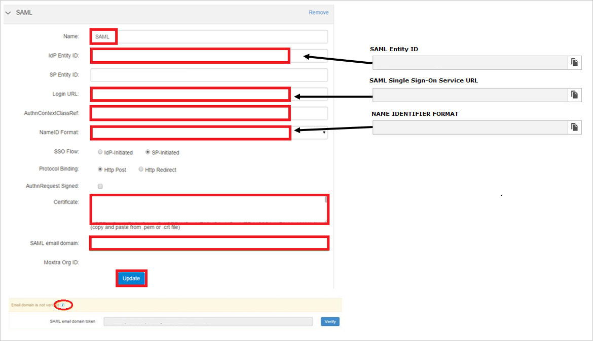
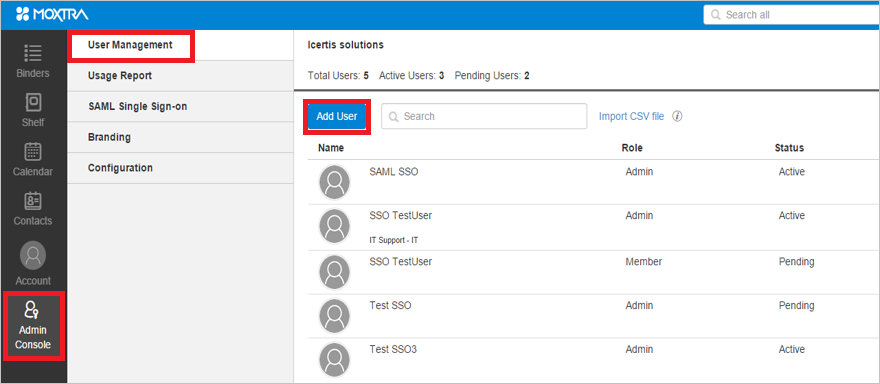

# Tutorial: Azure AD SSO integration with Moxtra

In this tutorial, you'll learn how to integrate Moxtra with Azure Active Directory (Azure AD). When you integrate Moxtra with Azure AD, you can:

* Control in Azure AD who has access to Moxtra.
* Enable your users to be automatically signed-in to Moxtra with their Azure AD accounts.
* Manage your accounts in one central location - the Azure portal.

## Prerequisites

To get started, you need the following items:

* An Azure AD subscription. If you don't have a subscription, you can get a [free account](https://azure.microsoft.com/free/).
* Moxtra single sign-on (SSO) enabled subscription.
* Along with Cloud Application Administrator, Application Administrator can also add or manage applications in Azure AD.
For more information, see [Azure built-in roles](../roles/permissions-reference.md).

## Scenario description

In this tutorial, you configure and test Azure AD SSO in a test environment.

* Moxtra supports **SP** initiated SSO.

> [!NOTE]
> Identifier of this application is a fixed string value so only one instance can be configured in one tenant.

## Add Moxtra from the gallery

To configure the integration of Moxtra into Azure AD, you need to add Moxtra from the gallery to your list of managed SaaS apps.

1. Sign in to the Azure portal using either a work or school account, or a personal Microsoft account.
1. On the left navigation pane, select the **Azure Active Directory** service.
1. Navigate to **Enterprise Applications** and then select **All Applications**.
1. To add new application, select **New application**.
1. In the **Add from the gallery** section, type **Moxtra** in the search box.
1. Select **Moxtra** from results panel and then add the app. Wait a few seconds while the app is added to your tenant.

 Alternatively, you can also use the [Enterprise App Configuration Wizard](https://portal.office.com/AdminPortal/home?Q=Docs#/azureadappintegration). In this wizard, you can add an application to your tenant, add users/groups to the app, assign roles, as well as walk through the SSO configuration as well. [Learn more about Microsoft 365 wizards.](/microsoft-365/admin/misc/azure-ad-setup-guides)

## Configure and test Azure AD SSO for Moxtra

Configure and test Azure AD SSO with Moxtra using a test user called **B.Simon**. For SSO to work, you need to establish a link relationship between an Azure AD user and the related user in Moxtra.

To configure and test Azure AD SSO with Moxtra, perform the following steps:

1. **[Configure Azure AD SSO](#configure-azure-ad-sso)** - to enable your users to use this feature.
    1. **[Create an Azure AD test user](#create-an-azure-ad-test-user)** - to test Azure AD single sign-on with B.Simon.
    1. **[Assign the Azure AD test user](#assign-the-azure-ad-test-user)** - to enable B.Simon to use Azure AD single sign-on.
1. **[Configure Moxtra SSO](#configure-moxtra-sso)** - to configure the single sign-on settings on application side.
    1. **[Create Moxtra test user](#create-moxtra-test-user)** - to have a counterpart of B.Simon in Moxtra that is linked to the Azure AD representation of user.
1. **[Test SSO](#test-sso)** - to verify whether the configuration works.

## Configure Azure AD SSO

Follow these steps to enable Azure AD SSO in the Azure portal.

1. In the Azure portal, on the **Moxtra** application integration page, find the **Manage** section and select **single sign-on**.
1. On the **Select a single sign-on method** page, select **SAML**.
1. On the **Set up single sign-on with SAML** page, click the pencil icon for **Basic SAML Configuration** to edit the settings.

   

1. On the **Basic SAML Configuration** section, perform the following step:

    In the **Sign-on URL** text box, type the URL:
    `https://www.moxtra.com/service/#login`

1. Moxtra application expects the SAML assertions in a specific format, which requires you to add custom attribute mappings to your SAML token attributes configuration. The following screenshot shows the list of default attributes. Click **Edit** icon to open User Attributes dialog.

	

1. In addition to above, Moxtra application expects few more attributes to be passed back in SAML response. In the User Claims section on the User Attributes dialog, perform the following steps to add SAML token attribute as shown in the below table:

	| Name | Source Attribute|
	| ------------------- | ---------- |    
	| firstname | user.givenname |
	| lastname | user.surname |
	| idpid    | < Azure AD Identifier >

	> [!Note]
	> The value of **idpid** attribute is not real. You can get the actual value from **Set up Moxtra** section from step#8. 

	1. Click **Add new claim** to open the **Manage user claims** dialog.

	1. In the **Name** textbox, type the attribute name shown for that row.

	1. Leave the **Namespace** blank.

	1. Select Source as **Attribute**.

	1. From the **Source attribute** list, type the attribute value shown for that row.

	1. Click **Ok**

	1. Click **Save**.

1. On the **Set up single sign-on with SAML** page, in the **SAML Signing Certificate** section,  find **Certificate (Base64)** and select **Download** to download the certificate and save it on your computer.

	

1. On the **Set up Moxtra** section, copy the appropriate URL(s) based on your requirement.

	

### Create an Azure AD test user

In this section, you'll create a test user in the Azure portal called B.Simon.

1. From the left pane in the Azure portal, select **Azure Active Directory**, select **Users**, and then select **All users**.
1. Select **New user** at the top of the screen.
1. In the **User** properties, follow these steps:
   1. In the **Name** field, enter `B.Simon`.  
   1. In the **User name** field, enter the username@companydomain.extension. For example, `B.Simon@contoso.com`.
   1. Select the **Show password** check box, and then write down the value that's displayed in the **Password** box.
   1. Click **Create**.

### Assign the Azure AD test user

In this section, you'll enable B.Simon to use Azure single sign-on by granting access to Moxtra.

1. In the Azure portal, select **Enterprise Applications**, and then select **All applications**.
1. In the applications list, select **Moxtra**.
1. In the app's overview page, find the **Manage** section and select **Users and groups**.
1. Select **Add user**, then select **Users and groups** in the **Add Assignment** dialog.
1. In the **Users and groups** dialog, select **B.Simon** from the Users list, then click the **Select** button at the bottom of the screen.
1. If you're expecting any role value in the SAML assertion, in the **Select Role** dialog, select the appropriate role for the user from the list and then click the **Select** button at the bottom of the screen.
1. In the **Add Assignment** dialog, click the **Assign** button.

## Configure Moxtra SSO

1. In another browser window, sign on to your Moxtra company site as an administrator.

2. In the toolbar on the left, click **Admin Console > SAML Single Sign-on**, and then click **New**.
   
     

3. On the **SAML** page, perform the following steps:
   
       
 
    a. In the **Name** textbox, type a name for your configuration (e.g.: **SAML**). 
  
    b. In the **IdP Entity ID** textbox, paste the value of **Azure AD Identifier** which you have copied from Azure portal. 
 
    c. In **Login URL** textbox, paste the value of **Login URL** which you have copied from Azure portal. 
 
    d. In the **AuthnContextClassRef** textbox, type **urn:oasis:names:tc:SAML:2.0:ac:classes:Password**. 
 
    e. In the **NameID Format** textbox, type **urn:oasis:names:tc:SAML:1.1:nameid-format:emailAddress**. 
 
    f. Open certificate which you have downloaded from Azure portal in notepad, copy the content, and then paste it into the **Certificate** textbox.    
 
    g. In the SAML email domain textbox, type your SAML email domain.    
  
    >[!NOTE]
    >To see the steps to verify the domain, click the "**i**" below.

    h. Click **Update**.

### Create Moxtra test user

The objective of this section is to create a user called B.simon in Moxtra.

**To create a user called B.simon in Moxtra, perform the following steps:**

1. Sign on to your Moxtra company site as an administrator.

1. In the toolbar on the left, click **Admin Console > User Management**, and then **Add User**.
   
     

1. On the **Add User** dialog, perform the following steps:
  
    a. In the **First Name** textbox, type **B**.
  
    b. In the **Last Name** textbox, type **Simon**.
  
    c. In the **Email** textbox, type B.simon's email address same as on Azure portal.
  
    d. In the **Division** textbox, type **Dev**.
  
    e. In the **Department** textbox, type **IT**.
  
    f. Select **Administrator**.
  
    g. Click **Add**.

## Test SSO 

In this section, you test your Azure AD single sign-on configuration with following options. 

* Click on **Test this application** in Azure portal. This will redirect to Moxtra Sign-on URL where you can initiate the login flow. 

* Go to Moxtra Sign-on URL directly and initiate the login flow from there.

* You can use Microsoft My Apps. When you click the Moxtra tile in the My Apps, this will redirect to Moxtra Sign-on URL. For more information about the My Apps, see [Introduction to the My Apps](../user-help/my-apps-portal-end-user-access.md).

## Next steps

Once you configure Moxtra you can enforce session control, which protects exfiltration and infiltration of your organization’s sensitive data in real time. Session control extends from Conditional Access. [Learn how to enforce session control with Microsoft Cloud App Security](/cloud-app-security/proxy-deployment-aad).