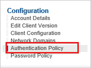
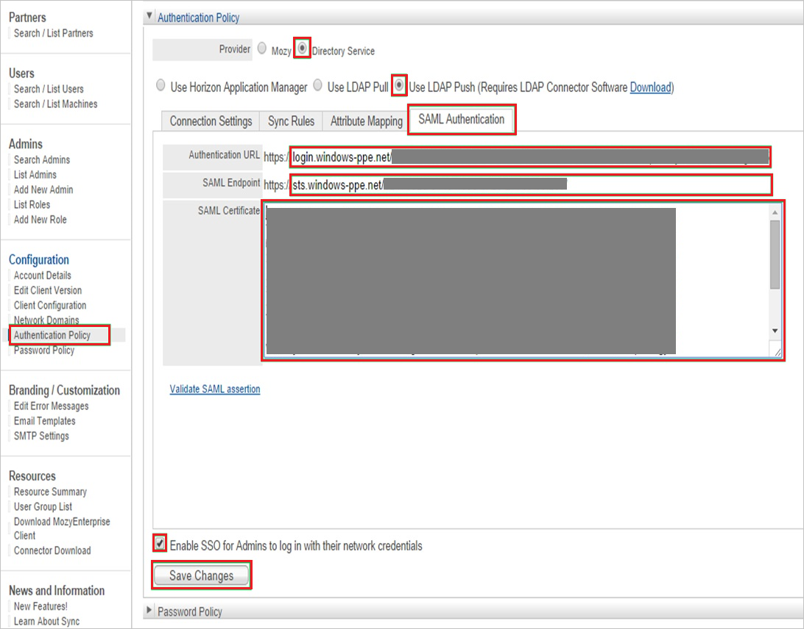
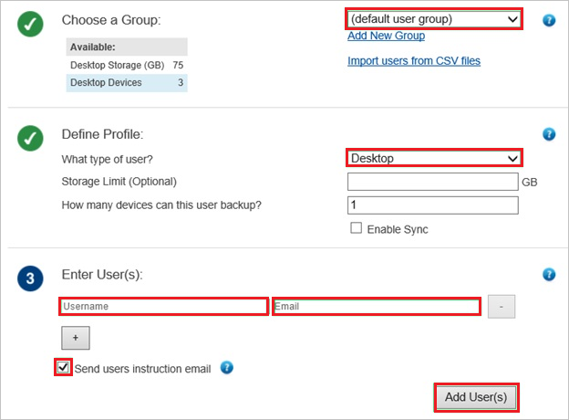

# Tutorial: Microsoft Entra integration with Mozy Enterprise

In this tutorial, you learn how to integrate Mozy Enterprise with Microsoft Entra ID.
Integrating Mozy Enterprise with Microsoft Entra ID provides you with the following benefits:

* You can control in Microsoft Entra ID who has access to Mozy Enterprise.
* You can enable your users to be automatically signed-in to Mozy Enterprise (Single Sign-On) with their Microsoft Entra accounts.
* You can manage your accounts in one central location.

If you want to know more details about SaaS app integration with Microsoft Entra ID, see [What is application access and single sign-on with Microsoft Entra ID](../manage-apps/what-is-single-sign-on.md).
If you don't have an Azure subscription, [create a free account](https://azure.microsoft.com/free/) before you begin.

## Prerequisites

To configure Microsoft Entra integration with Mozy Enterprise, you need the following items:

* A Microsoft Entra subscription. If you don't have a Microsoft Entra environment, you can get one-month trial [here](https://azure.microsoft.com/pricing/free-trial/)
* Mozy Enterprise single sign-on enabled subscription

## Scenario description

In this tutorial, you configure and test Microsoft Entra single sign-on in a test environment.

* Mozy Enterprise supports **SP** initiated SSO

## Adding Mozy Enterprise from the gallery

To configure the integration of Mozy Enterprise into Microsoft Entra ID, you need to add Mozy Enterprise from the gallery to your list of managed SaaS apps.

**To add Mozy Enterprise from the gallery, perform the following steps:**

1. Sign in to the [Microsoft Entra admin center](https://entra.microsoft.com) as at least a [Cloud Application Administrator](../roles/permissions-reference.md#cloud-application-administrator).
1. Browse to **Identity** > **Applications** > **Enterprise applications** > **New application**.
1. In the search box, type **Mozy Enterprise**, select **Mozy Enterprise** from result panel then click **Add** button to add the application.

	 

## Configure and test Microsoft Entra single sign-on

In this section, you configure and test Microsoft Entra single sign-on with Mozy Enterprise based on a test user called **Britta Simon**.
For single sign-on to work, a link relationship between a Microsoft Entra user and the related user in Mozy Enterprise needs to be established.

To configure and test Microsoft Entra single sign-on with Mozy Enterprise, you need to complete the following building blocks:

1. **[Configure Microsoft Entra Single Sign-On](#configure-azure-ad-single-sign-on)** - to enable your users to use this feature.
2. **[Configure Mozy Enterprise Single Sign-On](#configure-mozy-enterprise-single-sign-on)** - to configure the Single Sign-On settings on application side.
3. **[Create a Microsoft Entra test user](#create-an-azure-ad-test-user)** - to test Microsoft Entra single sign-on with Britta Simon.
4. **[Assign the Microsoft Entra test user](#assign-the-azure-ad-test-user)** - to enable Britta Simon to use Microsoft Entra single sign-on.
5. **[Create Mozy Enterprise test user](#create-mozy-enterprise-test-user)** - to have a counterpart of Britta Simon in Mozy Enterprise that is linked to the Microsoft Entra representation of user.
6. **[Test single sign-on](#test-single-sign-on)** - to verify whether the configuration works.

### Configure Microsoft Entra single sign-on

In this section, you enable Microsoft Entra single sign-on.

To configure Microsoft Entra single sign-on with Mozy Enterprise, perform the following steps:

1. Sign in to the [Microsoft Entra admin center](https://entra.microsoft.com) as at least a [Cloud Application Administrator](../roles/permissions-reference.md#cloud-application-administrator).
1. Browse to **Identity** > **Applications** > **Enterprise applications** > **Mozy Enterprise** application integration page, select **Single sign-on**.

    

1. On the **Select a Single sign-on method** dialog, select **SAML/WS-Fed** mode to enable single sign-on.

    

1. On the **Set up Single Sign-On with SAML** page, click **Edit** icon to open **Basic SAML Configuration** dialog.

	

1. On the **Basic SAML Configuration** section, perform the following steps:

    

    In the **Sign-on URL** text box, type a URL using the following pattern:
    `https://<tenantname>.Mozyenterprise.com`

	> [!NOTE]
	> The value is not real. Update the value with the actual Sign-On URL. Contact [Mozy Enterprise Client support team](https://www.safenames.net/about-us/contact-us) to get the value. You can also refer to the patterns shown in the **Basic SAML Configuration** section.

1. On the **Set up Single Sign-On with SAML** page, in the **SAML Signing Certificate** section, click **Download** to download the **Certificate (Base64)** from the given options as per your requirement and save it on your computer.

	

1. On the **Set up Mozy Enterprise** section, copy the appropriate URL(s) as per your requirement.

	

	a. Login URL

	b. Microsoft Entra Identifier

	c. Logout URL

### Configure Mozy Enterprise Single Sign-On

1. In a different web browser window, log into your Mozy Enterprise company site as an administrator.

2. In the **Configuration** section, click **Authentication Policy**.
   
	

3. On the **Authentication Policy** section, perform the following steps:
   
	
   
    a. Select **Directory Service** as **Provider**.
   
    b. Select **Use LDAP Push**.
   
    c. Click the **SAML Authentication** tab.
   
    d. Paste **Login URL** into the **Authentication URL** textbox.
   
    e. Paste **Microsoft Entra Identifier** into the **SAML Endpoint** textbox.
   
    f. Open your downloaded base-64 encoded certificate in notepad, copy the content of it into your clipboard, and then paste the entire Certificate into **SAML Certificate** textbox.
   
    g. Select **Enable SSO for Admins to log in with their network credentials**.
   
    h. Click **Save Changes**.

### Create a Microsoft Entra test user 

The objective of this section is to create a test user called Britta Simon.

1. Sign in to the [Microsoft Entra admin center](https://entra.microsoft.com) as at least a [User Administrator](../roles/permissions-reference.md#user-administrator).
1. Browse to **Identity** > **Users** > **All users**.
1. Select **New user** > **Create new user**, at the top of the screen.
1. In the **User** properties, follow these steps:
   1. In the **Display name** field, enter `B.Simon`.  
   1. In the **User principal name** field, enter the username@companydomain.extension. For example, `B.Simon@contoso.com`.
   1. Select the **Show password** check box, and then write down the value that's displayed in the **Password** box.
   1. Select **Review + create**.
1. Select **Create**.

### Assign the Microsoft Entra test user

In this section, you enable Britta Simon to use Azure single sign-on by granting access to Mozy Enterprise.

1. Sign in to the [Microsoft Entra admin center](https://entra.microsoft.com) as at least a [Cloud Application Administrator](../roles/permissions-reference.md#cloud-application-administrator).
1. Browse to **Identity** > **Applications** > **Enterprise applications** > **Mozy Enterprise**.

	

1. In the applications list, select **Mozy Enterprise**.

	

1. In the app's overview page, select **Users and groups**.
1. Select **Add user/group**, then select **Users and groups** in the **Add Assignment** dialog.
   1. In the **Users and groups** dialog, select **B.Simon** from the Users list, then click the **Select** button at the bottom of the screen.
   1. If you are expecting a role to be assigned to the users, you can select it from the **Select a role** dropdown. If no role has been set up for this app, you see "Default Access" role selected.
   1. In the **Add Assignment** dialog, click the **Assign** button.

### Create Mozy Enterprise test user

In order to enable Microsoft Entra users to log into Mozy Enterprise, they must be provisioned into Mozy Enterprise. In the case of Mozy Enterprise, provisioning is a manual task.

>[!NOTE]
>You can use any other Mozy Enterprise user account creation tools or APIs provided by Mozy Enterprise to provision Microsoft Entra user accounts.

**To provision a user accounts, perform the following steps:**

1. Log in to your **Mozy Enterprise** tenant.

2. Click **Users**, and then click **Add New User**.
   
	
   
	>[!NOTE]
	>The **Add New User** option is only displayed only if **Mozy** is selected as the provider under **Authentication policy**. If SAML Authentication is configured, then the users are added automatically on their first login through Single sign on.
    
3. On the new user dialog, perform the following steps:
   
	
   
    a. From the **Choose a Group** list, select a group.
   
    b. From the **What type of user** list, select a type.
   
    c. In the **Username** textbox, type the name of the Microsoft Entra user.
   
    d. In the **Email** textbox, type the email address of the Microsoft Entra user.
   
    e. Select **Send user instruction email**.
   
    f. Click **Add User(s)**.

     >[!NOTE]
     > After creating the user, an email will be sent to the Microsoft Entra user that includes a link to confirm the account before it becomes active.

### Test single sign-on 

In this section, you test your Microsoft Entra single sign-on configuration using the Access Panel.

When you click the Mozy Enterprise tile in the Access Panel, you should be automatically signed in to the Mozy Enterprise for which you set up SSO. For more information about the Access Panel, see [Introduction to the Access Panel](https://support.microsoft.com/account-billing/sign-in-and-start-apps-from-the-my-apps-portal-2f3b1bae-0e5a-4a86-a33e-876fbd2a4510).

## Additional Resources

- [List of Tutorials on How to Integrate SaaS Apps with Microsoft Entra ID](./tutorial-list.md)

- [What is application access and single sign-on with Microsoft Entra ID?](../manage-apps/what-is-single-sign-on.md)

- [What is Conditional Access in Microsoft Entra ID?](../conditional-access/overview.md)
