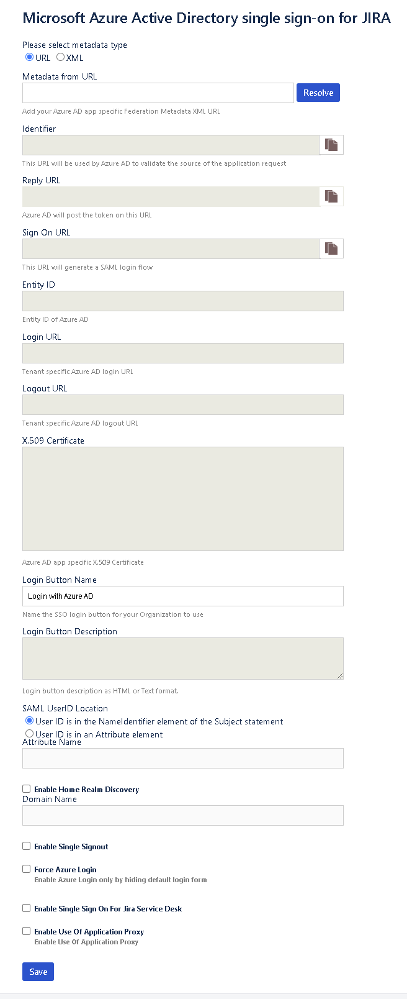

# Atlassian Jira and Confluence admin guide for Azure Active Directory

## Overview

The Azure Active Directory (Azure AD) single sign-on (SSO) plug-in enables Microsoft Azure AD customers to use their work or school account for signing in to Atlassian Jira and Confluence Server-based products. It implements SAML 2.0-based SSO.

## How it works

When users want to sign in to the Atlassian Jira or Confluence application, they see the **Login with Azure AD** button on the sign-in page. When they select it, they're required to sign in by using the Azure AD organization sign-in page (that is, their work or school account).

After the users are authenticated, they should be able to sign in to the application. If they are already authenticated with the ID and password for their work or school account, then they directly sign in to the application. 

Sign-in works across Jira and Confluence. If users are signed in to the Jira application and Confluence is opened in the same browser window, they don't have to provide the credentials for the other app. 

Users can also get to the Atlassian product through My Apps under the work or school account. They should be signed in without being asked for credentials.

> [!NOTE]
> User provisioning is not done through the plug-in.

## Audience

Jira and Confluence admins can use the plug-in to enable SSO by using Azure AD.

## Assumptions

* Jira and Confluence instances are HTTPS enabled.
* Users are already created in Jira or Confluence.
* Users have roles assigned in Jira or Confluence.
* Admins have access to information required to configure the plug-in.
* Jira or Confluence is available outside the company network as well.
* The plug-in works with only the on-premises version of Jira and Confluence.

## Prerequisites

Note the following information before you install the plug-in:

* Jira and Confluence are installed on a Windows 64-bit version.
* Jira and Confluence versions are HTTPS enabled.
* Jira and Confluence are available on the internet.
* Admin credentials are in place for Jira and Confluence.
* Admin credentials are in place for Azure AD.
* WebSudo is disabled in Jira and Confluence.

## Supported versions of Jira and Confluence

The plug-in supports the following versions of Jira and Confluence:

* Jira Core and Software: 6.0 to 9.10.0
* Jira Service Desk: 3.0.0 to 4.22.1.
* JIRA also supports 5.2. For more details, click [Microsoft Azure Active Directory single sign-on for JIRA 5.2](./jira52microsoft-tutorial.md).
* Confluence: 5.0 to 5.10.
* Confluence: 6.0.1 to 6.15.9.
* Confluence: 7.0.1 to 8.0.4.

## Installation

To install the plug-in, follow these steps:

1. Sign in to your Jira or Confluence instance as an admin.

2. Go to the Jira/Confluence administration console and select **Add-ons**.

3. From the Microsoft Download Center, download the [Microsoft SAML SSO Plugin for Jira](https://www.microsoft.com/download/details.aspx?id=56506)/ [Microsoft SAML SSO Plugin for Confluence](https://www.microsoft.com/download/details.aspx?id=56503).

   The appropriate version of the plug-in appears in the search results.

4. Select the plug-in, and the Universal Plug-in Manager (UPM) installs it.

After the plug-in is installed, it appears in the **User Installed Add-ons** section of **Manage Add-ons**.

## Plug-in configuration

Before you start using the plug-in, you must configure it. Select the plug-in, select the **Configure** button, and provide the configuration details.

The following image shows the configuration screen in both Jira and Confluence:

* **Metadata URL**: The URL to get federation metadata from Azure AD.

* **Identifiers**: The URL that Azure AD uses to validate the source of the request. It maps to the **Identifier** element in Azure AD. The plug-in automatically derives this URL as https://*\<domain:port>*/.

* **Reply URL**: The reply URL in your identity provider (IdP) that initiates the SAML sign-in. It maps to the **Reply URL** element in Azure AD. The plug-in automatically derives this URL as https://*\<domain:port>*/plugins/servlet/saml/auth.

* **Sign On URL**: The sign-on URL in your IdP that initiates the SAML sign-in. It maps to the **Sign On** element in Azure AD. The plug-in automatically derives this URL as https://*\<domain:port>*/plugins/servlet/saml/auth.

* **IdP Entity ID**: The entity ID that your IdP uses. This box is populated when the metadata URL is resolved.

* **Login URL**: The sign-in URL from your IdP. This box is populated from Azure AD when the metadata URL is resolved.

* **Logout URL**: The logout URL from your IdP. This box is populated from Azure AD when the metadata URL is resolved.

* **X.509 Certificate**: Your IdP’s X.509 certificate. This box is populated from Azure AD when the metadata URL is resolved.

* **Login Button Name**: The name of the sign-in button that your organization wants users to see on the sign-in page.

* **SAML User ID Locations**: The location where the Jira or Confluence user ID is expected in the SAML response. It can be in **NameID** or in a custom attribute name.

* **Attribute Name**: The name of the attribute where the user ID is expected.

* **Enable Home Realm Discovery**: The selection to make if the company is using Active Directory Federation Services (AD FS)-based sign-in.

* **Domain Name**: The domain name if sign-in is AD FS based.

* **Enable Single Signout**: The selection to make if you want to sign out from Azure AD when a user signs out from Jira or Confluence.

* Enable **Force Azure Login** checkbox, if you wish to sign in through Azure AD credentials only.

* **Enable Use of Application Proxy** checkbox, if you have configured your on-premise atlassian application in an App Proxy setup.

   * For App proxy setup , follow the steps on the [Azure AD App Proxy Documentation](../app-proxy/what-is-application-proxy.md).
## Release Notes
JIRA:

|Plugin Version   |                                   Release Notes                                           |       Supported JIRA versions       |
|-----------------|-------------------------------------------------------------------------------------------|-------------------------------------|
|  1.0.20         |   Bug Fixes:                                                                              | Jira Core and Software:             |
|                 |   JIRA SAML SSO add-on redirects to incorrect URL from mobile browser.                 |  7.0.0 to 9.10.0                    |
|                 |   The mark log section after enabling the JIRA plugin.                                 |                                     |
|                 |   The last login date for a user doesn't update when user signs in via SSO.           |                                     |
|                 |                                                                                           |                                     |
|  1.0.19         |   New Feature:                                                                            | Jira Core and Software:             |
|                 |    Application Proxy Support - Checkbox on the configure plugin screen to toggle the App Proxy mode so as to make the Reply URL editable as per the need to point the App Proxy mode so as to make the Reply URL editable as per the need to point it to the proxy server URL |  6.0 to 9.3.1           |
|                 |                                                                                           | Jira Service Desk: 3.0.0 to 4.22.1  |
|                 |                                                                                           |                                     |
|  1.0.18         |   Bug Fixes:                                                                              | Jira Core and Software:             |
|                 |    Bug fix for the 405 error upon clicking on the Configure button of the Jira Azure AD SSO Plugin.|  6.0 to 9.1.0.          |
|                 |    JIRA server isn't rendering the "Project Setting Page" correctly.                  | Jira Service Desk: 3.0.0 to 4.22.1. |
|                 |    JIRA isn't forcing Azure AD Login. An extra button click was required.                |                                     |
|                 |    We have now resolved the security fix in this version. This will protect you from user impersonation vulnerability.|       |
|                 |    JIRA Service Desk logout issue is resolved.                                         |                                     |
 
Confluence:

|Plugin Version   |                                   Release Notes                                           |       Supported JIRA versions       |
|-----------------|-------------------------------------------------------------------------------------------|-------------------------------------|
|  6.3.9          |   Bug Fixes:                                                                              | Confluence Server: 7.20.3 to 8.0.4  |
|                 |   System Error: Metadata link cannot be configured on SSO plugins.                        |                                     |
|                 |                                                                                           |                                     |
|  6.3.8          |   New Feature:                                                                            | Confluence Server: 5.0 to 7.20.1    |
|                 |   Application Proxy Support - Checkbox on the configure plugin screen to toggle the App Proxy mode so as to make the Reply URL editable as per the need to point it to the proxy server URL                                                                      |                                     |
|                 |                                                                                           |                                     |
|  6.3.7          |   Bug Fixes:                                                                              | Confluence Server: 5.0 to 7.19.0    |
|                 |   "Force Login" functionality allows the IT admins to force the Azure AD authentication to users. This way users will not see the username and password box and they will be forced to use SSO.                                                              |                                     |
|                 |   "Force Login" is configurable from the plugin                                           |                                     |
|                 |   You can pass the domain string to Azure AD so that Azure AD can directly redirect the user to your Federation server.|        |  
 
## Troubleshooting

* **You're getting multiple certificate errors**: Sign in to Azure AD and remove the multiple certificates that are available against the app. Ensure that only one certificate is present.

* **A certificate is about to expire in Azure AD**: Add-ons take care of automatic rollover of the certificate. When a certificate is about to expire, a new certificate should be marked active and unused certificates should be deleted. When a user tries to sign in to Jira in this scenario, the plug-in fetches and saves the new certificate.

* **You want to disable WebSudo (disable the secure administrator session)**:

  * For Jira, secure administrator sessions (that is, password confirmation before accessing administration functions) are enabled by default. If you want to remove this ability in your Jira instance, specify the following line in your jira-config.properties file: `jira.websudo.is.disabled = true`

  * For Confluence, follow the steps on the [Confluence support site](https://confluence.atlassian.com/doc/configuring-secure-administrator-sessions-218269595.html).

* **Fields that are supposed to be populated by the metadata URL are not getting populated**:

  * Check if the URL is correct. Check if you have mapped the correct tenant and app ID.

  * Enter the URL in a browser and see if you receive the federation metadata XML.

* **There's an internal server error**: Review the logs in the log directory of the installation. If you're getting the error when the user is trying to sign in by using Azure AD SSO, you can share the logs with the support team.

* **There's a "User ID not found" error when the user tries to sign in**: Create the user ID in Jira or Confluence.

* **There's an "App not found" error in Azure AD**: See if the appropriate URL is mapped to the app in Azure AD.

* **You need support**: Reach out to the [Azure AD SSO Integration Team](mailto:SaaSApplicationIntegrations@service.microsoft.com). The team responds in 24-48 business hours.

  You can also raise a support ticket with Microsoft through the Azure portal channel.

## Plug-in FAQ

Please refer below FAQs if you have any query regarding this plug-in.

### What does the plug-in do?

The plug-in provides single sign-on (SSO) capability for Atlassian Jira (including Jira Core, Jira Software, Jira Service Desk) and Confluence on-premises software. The plug-in works with Azure Active Directory (Azure AD) as an identity provider (IdP).

### Which Atlassian products does the plug-in work with?

The plug-in works with on-premises versions of Jira and Confluence.

### Does the plug-in work on cloud versions?

No. The plug-in supports only on-premises versions of Jira and Confluence.

### Which versions of Jira and Confluence does the plug-in support?

The plug-in supports these versions:

* Jira Core and Software: 6.0 to 9.10.0
* Jira Service Desk: 3.0.0 to 4.22.1.
* JIRA also supports 5.2. For more details, click [Microsoft Azure Active Directory single sign-on for JIRA 5.2](./jira52microsoft-tutorial.md).
* Confluence: 5.0 to 5.10.
* Confluence: 6.0.1 to 6.15.9.
* Confluence: 7.0.1 to 8.0.4.

### Is the plug-in free or paid?

It's a free add-on.

### Do I need to restart Jira or Confluence after I deploy the plug-in?

A restart is not required. You can start using the plug-in immediately.

### How do I get support for the plug-in?

You can reach out to the [Azure AD SSO Integration Team](mailto:SaaSApplicationIntegrations@service.microsoft.com) for any support needed for this plug-in. The team responds in 24-48 business hours.

You can also raise a support ticket with Microsoft through the Azure portal channel.

### Would the plug-in work on a Mac or Ubuntu installation of Jira and Confluence?

We have tested the plug-in only on 64-bit Windows Server installations of Jira and Confluence.

### Does the plug-in work with IdPs other than Azure AD?

No. It works only with Azure AD.

### What version of SAML does the plug-in work with?

It works with SAML 2.0.

### Does the plug-in do user provisioning?

No. The plug-in provides only SAML 2.0-based SSO. The user has to be provisioned in the application before the SSO sign-in.

### Does the plug-in support cluster versions of Jira and Confluence?

No. The plug-in works with on-premises versions of Jira and Confluence.

### Does the plug-in work with HTTP versions of Jira and Confluence?

No. The plug-in works with HTTPS-enabled installations only.
