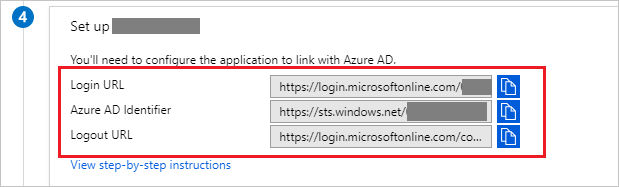

# Tutorial: Azure Active Directory integration with MyWorkDrive

In this tutorial, you learn how to integrate MyWorkDrive with Azure Active Directory (Azure AD).

Integrating MyWorkDrive with Azure AD provides you with the following benefits:

- You can control in Azure AD who has access to MyWorkDrive.
- You can enable your users to automatically get signed-on to MyWorkDrive (Single Sign-On) with their Azure AD accounts.
- You can manage your accounts in one central location - the Azure portal.

If you want to know more details about SaaS app integration with Azure AD, see [what is application access and single sign-on with Azure Active Directory](../manage-apps/what-is-single-sign-on.md).

## Prerequisites

To configure Azure AD integration with MyWorkDrive, you need the following items:

- An Azure AD subscription
- A MyWorkDrive single sign-on enabled subscription

> [!NOTE]
> To test the steps in this tutorial, we do not recommend using a production environment.

To test the steps in this tutorial, you should follow these recommendations:

- Do not use your production environment, unless it is necessary.
- If you don't have an Azure AD trial environment, you can [get a one-month trial](https://azure.microsoft.com/pricing/free-trial/).

## Scenario description
In this tutorial, you test Azure AD single sign-on in a test environment. 
The scenario outlined in this tutorial consists of two main building blocks:

1. Adding MyWorkDrive from the gallery
2. Configuring and testing Azure AD single sign-on

## Adding MyWorkDrive from the gallery
To configure the integration of MyWorkDrive into Azure AD, you need to add MyWorkDrive from the gallery to your list of managed SaaS apps.

**To add MyWorkDrive from the gallery, perform the following steps:**

1. In the **[Azure portal](https://portal.azure.com)**, on the left navigation panel, click **Azure Active Directory** icon. 

	

2. Navigate to **Enterprise applications**. Then go to **All applications**.

	
	
3. To add new application, click **New application** button on the top of dialog.

	

4. In the search box, type **MyWorkDrive**, select **MyWorkDrive** from result panel then click **Add** button to add the application.

	 

## Configure and test Azure AD single sign-on

In this section, you configure and test Azure AD single sign-on with MyWorkDrive based on a test user called "Britta Simon".

For single sign-on to work, Azure AD needs to know what the counterpart user in MyWorkDrive is to a user in Azure AD. In other words, a link relationship between an Azure AD user and the related user in MyWorkDrive needs to be established.

To configure and test Azure AD single sign-on with MyWorkDrive, you need to complete the following building blocks:

1. **[Configure Azure AD Single Sign-On](#configure-azure-ad-single-sign-on)** - to enable your users to use this feature.
2. **[Create an Azure AD test user](#create-an-azure-ad-test-user)** - to test Azure AD single sign-on with Britta Simon.
3. **[Create a MyWorkDrive test user](#create-a-myworkdrive-test-user)** - to have a counterpart of Britta Simon in MyWorkDrive that is linked to the Azure AD representation of user.
4. **[Assign the Azure AD test user](#assign-the-azure-ad-test-user)** - to enable Britta Simon to use Azure AD single sign-on.
5. **[Test single sign-on](#test-single-sign-on)** - to verify whether the configuration works.

### Configure Azure AD single sign-on

In this section, you enable Azure AD single sign-on in the Azure portal and configure single sign-on in your MyWorkDrive application.

**To configure Azure AD single sign-on with MyWorkDrive, perform the following steps:**

1. In the [Azure portal](https://portal.azure.com/), on the **MyWorkDrive** application integration page, select **Single sign-on**.

    

2. On the **Select a Single sign-on method** dialog, select **SAML** mode to enable single sign-on.

    

3. On the **Set up Single Sign-On with SAML** page, click **Edit** button to open **Basic SAML Configuration** dialog.

	

4. On the **Basic SAML Configuration** section, perform the following steps if you wish to configure the application in **IDP** initiated mode:

    

	In the **Reply URL** textbox, type a URL using the following pattern: `https://<SERVER.DOMAIN.COM>/SAML/AssertionConsumerService.aspx`

5. Click on  **Set additional URLs** and perform the following step if you wish to configure the application in **SP** initiated mode:

	

    In the **Sign-on URL** textbox, type a URL using the following pattern: `https://<SERVER.DOMAIN.COM>/Account/Login-saml` 

    > [!NOTE]
    > These values are not real. Update these values with the actual Reply URL, and Sign-On URL.  Input your own company's MyWorkDrive Server host name:e.g.
    > 
    > Reply URL: `https://yourserver.yourdomain.com/SAML/AssertionConsumerService.aspx`
    > 
    > Sign-on URL:`https://yourserver.yourdomain.com/Account/Login-saml`
    > 
    > Contact MyWorkDrive Client support team if you are unsure how to setup your own host name and SSL certificate for these values.

6. On the **Set up Single Sign-On with SAML** page, in the **SAML Signing Certificate** section, click copy **icon** to copy **App Federation Metadata Url** and click **Download** to download the **Certificate (Base64)** save it on your computer.

	 

7. On the **Set up MyWorkDrive** section, copy the appropriate URL as per your requirement.

	Note that the URL may say the following:

	a. Login URL

	b. Azure Ad Identifier

	c. Logout URL

	 

8. To configure single sign-on on MyWorkDrive side, download the **Certificate (Base64), Sign-Out URL, SAML Entity ID, and SAML Single Sign-On Service URL** and configure them manually on MyWorkDrive server or copy and paste the Azure **App Federation Metadata URL** into your MyWorkDrive Server Admin Panel SAML Azure AD configuration screen. For additional information contact [MyWorkDrive support team](mailto:support@myworkdrive.com).

	
### Create an Azure AD test user

The objective of this section is to create a test user in the Azure portal called Britta Simon.

1. In the Azure portal, in the left pane, select **Azure Active Directory**, select **Users**, and then select **All users**.

    

2. Select **New user** at the top of the screen.

    

3. In the User properties, perform the following steps.

    

    a. In the **Name** field enter **BrittaSimon**.
  
    b. In the **User name** field type **brittasimon@yourcompanydomain.extension**  
    For example, BrittaSimon@contoso.com

    c. Select **Properties**, select the **Show password** check box, and then write down the value that's displayed in the Password box.

    d. Select **Create**.
 
### Create a MyWorkDrive test user

In this section, you create a user called Britta Simon in MyWorkDrive. Work with [MyWorkDrive support team](mailto:support@myworkdrive.com) to add the users in the MyWorkDrive platform. Users must be created and activated before you use single sign-on.

### Assign the Azure AD test user

In this section, you enable Britta Simon to use Azure single sign-on by granting access to MyWorkDrive.

1. In the Azure portal, select **Enterprise Applications**, select **All applications**.

	

2. In the applications list, select **MyWorkDrive**.

	

3. In the menu on the left, select **Users and groups**.

    

4. Select the **Add** button, then select **Users and groups** in the **Add Assignment** dialog.

    

4. In the **Users and groups** dialog select **Britta Simon** in the Users list, then click the **Select** button at the bottom of the screen.

5. In the **Add Assignment** dialog select the **Assign** button.
	
### Test single sign-on

In this section, you test your Azure AD single sign-on configuration using the Access Panel.

When you click the MyWorkDrive tile in the Access Panel, you should get automatically signed-on to your MyWorkDrive application.
For more information about the Access Panel, see [Introduction to the Access Panel](../active-directory-saas-access-panel-introduction.md). 

## Additional resources

* [List of Tutorials on How to Integrate SaaS Apps with Azure Active Directory](tutorial-list.md)
* [What is application access and single sign-on with Azure Active Directory?](../manage-apps/what-is-single-sign-on.md)
