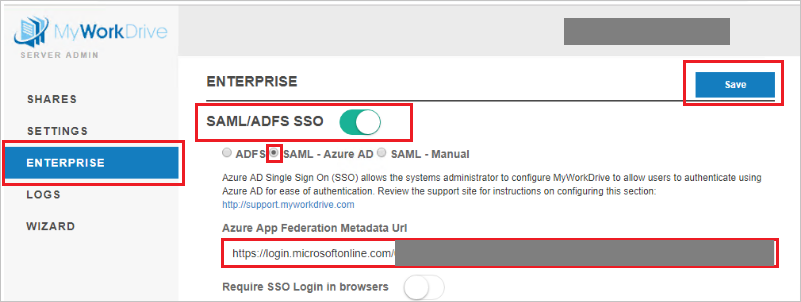

# Tutorial: Integrate MyWorkDrive with Azure Active Directory

In this tutorial, you'll learn how to integrate MyWorkDrive with Azure Active Directory (Azure AD). When you integrate MyWorkDrive with Azure AD, you can:

* Control in Azure AD who has access to MyWorkDrive.
* Enable your users to be automatically signed-in to MyWorkDrive with their Azure AD accounts.
* Manage your accounts in one central location - the Azure portal.

To learn more about SaaS app integration with Azure AD, see [What is application access and single sign-on with Azure Active Directory](https://docs.microsoft.com/azure/active-directory/active-directory-appssoaccess-whatis).

## Prerequisites

To get started, you need the following items:

* An Azure AD subscription. If you don't have a subscription, you can get one-month free trial [here](https://azure.microsoft.com/pricing/free-trial/).
* MyWorkDrive single sign-on (SSO) enabled subscription.

## Scenario description

In this tutorial, you configure and test Azure AD SSO in a test environment. MyWorkDrive supports **SP** and **IDP** initiated SSO

## Adding MyWorkDrive from the gallery

To configure the integration of MyWorkDrive into Azure AD, you need to add MyWorkDrive from the gallery to your list of managed SaaS apps.

1. Sign in to the [Azure portal](https://portal.azure.com) using either a work or school account, or a personal Microsoft account.
1. On the left navigation pane, select the **Azure Active Directory** service.
1. Navigate to **Enterprise Applications** and then select **All Applications**.
1. To add new application, select **New application**.
1. In the **Add from the gallery** section, type **MyWorkDrive** in the search box.
1. Select **MyWorkDrive** from results panel and then add the app. Wait a few seconds while the app is added to your tenant.

## Configure and test Azure AD single sign-on

Configure and test Azure AD SSO with MyWorkDrive using a test user called **Britta Simon**. For SSO to work, you need to establish a link relationship between an Azure AD user and the related user in MyWorkDrive.

To configure and test Azure AD SSO with MyWorkDrive, complete the following building blocks:

1. **[Configure Azure AD SSO](#configure-azure-ad-sso)** - to enable your users to use this feature.
2. **[Configure MyWorkDrive SSO](#configure-myworkdrive-sso)** - to configure the Single Sign-On settings on application side.
3. **[Create an Azure AD test user](#create-an-azure-ad-test-user)** - to test Azure AD single sign-on with Britta Simon.
4. **[Assign the Azure AD test user](#assign-the-azure-ad-test-user)** - to enable Britta Simon to use Azure AD single sign-on.
5. **[Create MyWorkDrive test user](#create-myworkdrive-test-user)** - to have a counterpart of Britta Simon in MyWorkDrive that is linked to the Azure AD representation of user.
6. **[Test SSO](#test-sso)** - to verify whether the configuration works.

### Configure Azure AD SSO

Follow these steps to enable Azure AD SSO in the Azure portal.

1. In the [Azure portal](https://portal.azure.com/), on the **MyWorkDrive** application integration page, find the **Manage** section and select **Single sign-on**.
1. On the **Select a Single sign-on method** page, select **SAML**.
1. On the **Set up Single Sign-On with SAML** page, click the edit/pen icon for **Basic SAML Configuration** to edit the settings.

   

1. On the **Basic SAML Configuration** page, If you wish to configure the application in **IDP** initiated mode, enter the values for the following field:

	In the **Reply URL** text box, type a URL using the following pattern:
    `https://<SERVER.DOMAIN.COM>/SAML/AssertionConsumerService.aspx`

1. Click **Set additional URLs** and perform the following step if you wish to configure the application in **SP** initiated mode:

    In the **Sign-on URL** text box, type a URL using the following pattern:
    `https://<SERVER.DOMAIN.COM>/Account/Login-saml`

	> [!NOTE]
    > These values are not real. Update these values with the actual Reply URL and Sign-On URL. Input your own company's MyWorkDrive Server host name:e.g.
    > 
    > Reply URL: `https://yourserver.yourdomain.com/SAML/AssertionConsumerService.aspx`
    > 
    > Sign-on URL:`https://yourserver.yourdomain.com/Account/Login-saml`
    > 
    > Contact [MyWorkDrive support team](mailto:support@myworkdrive.com) if you are unsure how to setup your own host name and SSL certificate for these values.

1. On the **Set up Single Sign-On with SAML** page, in the **SAML Signing Certificate** section, click copy button to copy **App Federation Metadata Url** to your clipboard.

	

### Configure MyWorkDrive SSO

1. In a different web browser window, sign in to MyWorkDrive as a Security Administrator.

2. On the MyWorkDrive Server in the admin panel, click on **ENTERPRISE** and perform the following steps:

	

	a. Enable **SAML/ADFS SSO**.

	b. Select **SAML - Azure AD**

	c. In the **Azure App Federation Metadata Url** textbox, paste the value of **App Federation Metadata Url** which you have copied from the Azure portal.

	d. Click **Save**

	> [!NOTE]
	> For additional information review the [MyWorkDrive Azure AD support article](https://www.myworkdrive.com/support/saml-single-sign-on-azure-ad/).

### Create an Azure AD test user

In this section, you'll create a test user in the Azure portal called Britta Simon.

1. From the left pane in the Azure portal, select **Azure Active Directory**, select **Users**, and then select **All users**.
1. Select **New user** at the top of the screen.
1. In the **User** properties, follow these steps:
   1. In the **Name** field, enter `Britta Simon`.  
   1. In the **User name** field, enter the username@companydomain.extension. For example, `BrittaSimon@contoso.com`.
   1. Select the **Show password** check box, and then write down the value that's displayed in the **Password** box.
   1. Click **Create**.

### Assign the Azure AD test user

In this section, you'll enable Britta Simon to use Azure single sign-on by granting access to MyWorkDrive.

1. In the Azure portal, select **Enterprise Applications**, and then select **All applications**.
1. In the applications list, select **MyWorkDrive**.
1. In the app's overview page, find the **Manage** section and select **Users and groups**.

   

1. Select **Add user**, then select **Users and groups** in the **Add Assignment** dialog.

	

1. In the **Users and groups** dialog, select **Britta Simon** from the Users list, then click the **Select** button at the bottom of the screen.
1. If you're expecting any role value in the SAML assertion, in the **Select Role** dialog, select the appropriate role for the user from the list and then click the **Select** button at the bottom of the screen.
1. In the **Add Assignment** dialog, click the **Assign** button.

### Create MyWorkDrive test user

In this section, you create a user called Britta Simon in MyWorkDrive. Work with [MyWorkDrive support team](mailto:support@myworkdrive.com) to add the users in the MyWorkDrive platform. Users must be created and activated before you use single sign-on.

### Test SSO

When you select the MyWorkDrive tile in the Access Panel, you should be automatically signed in to the MyWorkDrive for which you set up SSO. For more information about the Access Panel, see [Introduction to the Access Panel](https://docs.microsoft.com/azure/active-directory/active-directory-saas-access-panel-introduction).

## Additional Resources

- [List of Tutorials on How to Integrate SaaS Apps with Azure Active Directory](https://docs.microsoft.com/azure/active-directory/active-directory-saas-tutorial-list)

- [What is application access and single sign-on with Azure Active Directory?](https://docs.microsoft.com/azure/active-directory/active-directory-appssoaccess-whatis)

- [What is Conditional Access in Azure Active Directory?](https://docs.microsoft.com/azure/active-directory/conditional-access/overview)