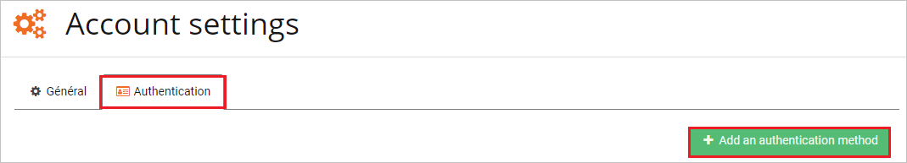
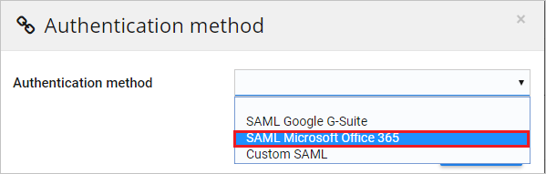
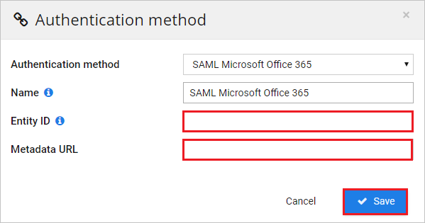

# Tutorial: Azure AD SSO integration with N2F - Expense reports

In this tutorial, you'll learn how to integrate N2F - Expense reports with Azure Active Directory (Azure AD). When you integrate N2F - Expense reports with Azure AD, you can:

* Control in Azure AD who has access to N2F - Expense reports.
* Enable your users to be automatically signed-in to N2F - Expense reports with their Azure AD accounts.
* Manage your accounts in one central location - the Azure portal.

## Prerequisites

To get started, you need the following items:

* An Azure AD subscription. If you don't have a subscription, you can get a [free account](https://azure.microsoft.com/free/).
* N2F - Expense reports single sign-on (SSO) enabled subscription.

## Scenario description

In this tutorial, you configure and test Azure AD single sign-on in a test environment.

* N2F - Expense reports supports **SP** and **IDP** initiated SSO.

## Add N2F - Expense reports from the gallery

To configure the integration of N2F - Expense reports into Azure AD, you need to add N2F - Expense reports from the gallery to your list of managed SaaS apps.

1. Sign in to the Azure portal using either a work or school account, or a personal Microsoft account.
1. On the left navigation pane, select the **Azure Active Directory** service.
1. Navigate to **Enterprise Applications** and then select **All Applications**.
1. To add new application, select **New application**.
1. In the **Add from the gallery** section, type **N2F - Expense reports** in the search box.
1. Select **N2F - Expense reports** from results panel and then add the app. Wait a few seconds while the app is added to your tenant.

 Alternatively, you can also use the [Enterprise App Configuration Wizard](https://portal.office.com/AdminPortal/home?Q=Docs#/azureadappintegration). In this wizard, you can add an application to your tenant, add users/groups to the app, assign roles, as well as walk through the SSO configuration as well. [Learn more about Microsoft 365 wizards.](/microsoft-365/admin/misc/azure-ad-setup-guides)

## Configure and test Azure AD SSO for N2F - Expense reports

Configure and test Azure AD SSO with N2F - Expense reports using a test user called **B.Simon**. For SSO to work, you need to establish a link relationship between an Azure AD user and the related user in N2F - Expense reports.

To configure and test Azure AD SSO with N2F - Expense reports, perform the following steps:

1. **[Configure Azure AD SSO](#configure-azure-ad-sso)** - to enable your users to use this feature.
    1. **[Create an Azure AD test user](#create-an-azure-ad-test-user)** - to test Azure AD single sign-on with B.Simon.
    1. **[Assign the Azure AD test user](#assign-the-azure-ad-test-user)** - to enable B.Simon to use Azure AD single sign-on.
1. **[Configure N2F - Expense reports SSO](#configure-n2f---expense-reports-sso)** - to configure the single sign-on settings on application side.
    1. **[Create N2F - Expense reports test user](#create-n2f---expense-reports-test-user)** - to have a counterpart of B.Simon in N2F - Expense reports that is linked to the Azure AD representation of user.
1. **[Test SSO](#test-sso)** - to verify whether the configuration works.

## Configure Azure AD SSO

Follow these steps to enable Azure AD SSO in the Azure portal.

1. In the Azure portal, on the **N2F - Expense reports** application integration page, find the **Manage** section and select **single sign-on**.
1. On the **Select a single sign-on method** page, select **SAML**.
1. On the **Set up single sign-on with SAML** page, click the pencil icon for **Basic SAML Configuration** to edit the settings.

   

4. On the **Basic SAML Configuration** section, if you wish to configure the application in **IDP** initiated mode, the user does not have to perform any steps as the app is already pre-integrated with Azure.

5. Click **Set additional URLs** and perform the following step if you wish to configure the application in **SP** initiated mode:

    In the **Sign-on URL** text box, type the URL:
    `https://www.n2f.com/app/`

6. On the **Set up Single Sign-On with SAML** page, In the **SAML Signing Certificate** section, click copy button to copy **App Federation Metadata Url** and save it on your computer.

	

7. On the **Set up myPolicies** section, copy the appropriate URL(s) as per your requirement.

	

### Create an Azure AD test user 

In this section, you'll create a test user in the Azure portal called B.Simon.

1. From the left pane in the Azure portal, select **Azure Active Directory**, select **Users**, and then select **All users**.
1. Select **New user** at the top of the screen.
1. In the **User** properties, follow these steps:
   1. In the **Name** field, enter `B.Simon`.  
   1. In the **User name** field, enter the username@companydomain.extension. For example, `B.Simon@contoso.com`.
   1. Select the **Show password** check box, and then write down the value that's displayed in the **Password** box.
   1. Click **Create**.

### Assign the Azure AD test user

In this section, you'll enable B.Simon to use Azure single sign-on by granting access to N2F - Expense reports.

1. In the Azure portal, select **Enterprise Applications**, and then select **All applications**.
1. In the applications list, select **N2F - Expense reports**.
1. In the app's overview page, find the **Manage** section and select **Users and groups**.
1. Select **Add user**, then select **Users and groups** in the **Add Assignment** dialog.
1. In the **Users and groups** dialog, select **B.Simon** from the Users list, then click the **Select** button at the bottom of the screen.
1. If you are expecting a role to be assigned to the users, you can select it from the **Select a role** dropdown. If no role has been set up for this app, you see "Default Access" role selected.
1. In the **Add Assignment** dialog, click the **Assign** button.

## Configure N2F - Expense reports SSO

1. In a different web browser window, sign in to your N2F - Expense reports company site as an administrator.

2. Click on **Settings** and then select **Advance Settings** from the dropdown.

	

3. Select **Account settings** tab.

	

4. Select **Authentication** and then select **+ Add an authentication method** tab.

	

5. Select **SAML Microsoft Office 365** as Authentication method.

	

6. On the **Authentication method** section, perform the following steps:

	

	a. In the **Entity ID** textbox, paste the **Azure AD Identifier** value, which you have copied from the Azure portal.

	b. In the **Metadata URL** textbox, paste the **App Federation Metadata Url** value, which you have copied from the Azure portal.

	c. Click **Save**.

### Create N2F - Expense reports test user

To enable Azure AD users to log in to N2F - Expense reports, they must be provisioned into N2F - Expense reports. In the case of N2F - Expense reports, provisioning is a manual task.

**To provision a user account, perform the following steps:**

1. Log in to your N2F - Expense reports company site as an administrator.

2. Click on **Settings** and then select **Advance Settings** from the dropdown.

    

3. Select **Users** tab from left navigation panel.

	

4. Select **+ New user** tab.

    

5. On the **User** section, perform the following steps:

	

	a. In the **Email address** textbox, enter the email address of user like **brittasimon\@contoso.com**.

	b. In the **First name** textbox, enter the first name of user like **Britta**.

	c. In the **Name** textbox, enter the name of user like **BrittaSimon**.

	d. Choose **Role, Direct manager (N+1)**, and **Division** as per your organization requirement.

	e. Click **Validate and send invitation**.

	> [!NOTE]
	> If you are facing any problems while adding the user, please contact [N2F - Expense reports support team](mailto:support@n2f.com)

## Test SSO

In this section, you test your Azure AD single sign-on configuration with following options. 

#### SP initiated:

* Click on **Test this application** in Azure portal. This will redirect to N2F - Expense reports Sign on URL where you can initiate the login flow.  

* Go to N2F - Expense reports Sign-on URL directly and initiate the login flow from there.

#### IDP initiated:

* Click on **Test this application** in Azure portal and you should be automatically signed in to the N2F - Expense reports for which you set up the SSO. 

You can also use Microsoft My Apps to test the application in any mode. When you click the N2F - Expense reports tile in the My Apps, if configured in SP mode you would be redirected to the application sign on page for initiating the login flow and if configured in IDP mode, you should be automatically signed in to the N2F - Expense reports for which you set up the SSO. For more information about the My Apps, see [Introduction to the My Apps](../user-help/my-apps-portal-end-user-access.md).

## Next steps

Once you configure N2F - Expense reports you can enforce session control, which protects exfiltration and infiltration of your organization’s sensitive data in real time. Session control extends from Conditional Access. [Learn how to enforce session control with Microsoft Defender for Cloud Apps](/cloud-app-security/proxy-deployment-aad).
