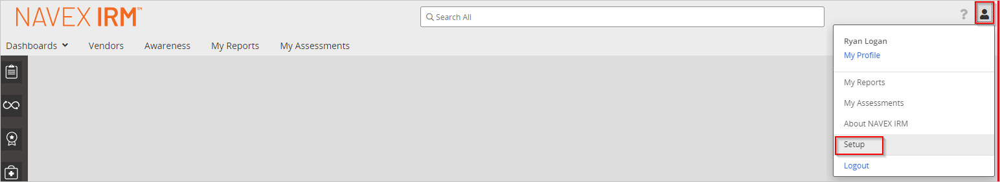
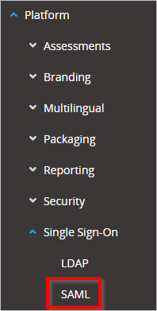
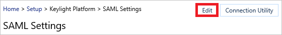
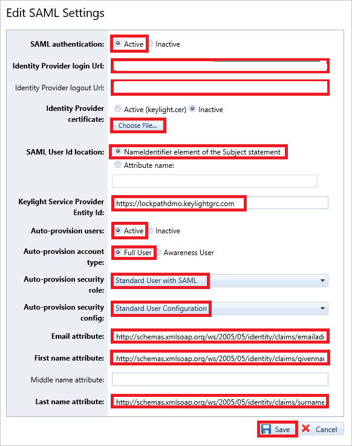

# Tutorial: Microsoft Entra integration with NAVEX IRM (Lockpath/Keylight)

In this tutorial, you'll learn how to integrate NAVEX IRM (Lockpath/Keylight) with Microsoft Entra ID. When you integrate NAVEX IRM (Lockpath/Keylight) with Microsoft Entra ID, you can:

* Control in Microsoft Entra ID who has access to NAVEX IRM (Lockpath/Keylight).
* Enable your users to be automatically signed-in to NAVEX IRM (Lockpath/Keylight) with their Microsoft Entra accounts.
* Manage your accounts in one central location.

## Prerequisites

To configure Microsoft Entra integration with NAVEX IRM (Lockpath/Keylight), you need the following items:

* A Microsoft Entra subscription. If you don't have a Microsoft Entra environment, you can get a [free account](https://azure.microsoft.com/free/).
* NAVEX IRM (Lockpath/Keylight) single sign-on enabled subscription.

## Scenario description

In this tutorial, you configure and test Microsoft Entra single sign-on in a test environment.

* NAVEX IRM (Lockpath/Keylight) supports **SP** initiated SSO.
* NAVEX IRM (Lockpath/Keylight) supports **Just In Time** user provisioning.

## Add NAVEX IRM (Lockpath/Keylight) from the gallery

To configure the integration of NAVEX IRM (Lockpath/Keylight) into Microsoft Entra ID, you need to add NAVEX IRM (Lockpath/Keylight) from the gallery to your list of managed SaaS apps.

1. Sign in to the [Microsoft Entra admin center](https://entra.microsoft.com) as at least a [Cloud Application Administrator](../roles/permissions-reference.md#cloud-application-administrator).
1. Browse to **Identity** > **Applications** > **Enterprise applications** > **New application**.
1. In the **Add from the gallery** section, type **NAVEX IRM (Lockpath/Keylight)** in the search box.
1. Select **NAVEX IRM (Lockpath/Keylight)** from results panel and then add the app. Wait a few seconds while the app is added to your tenant.

 Alternatively, you can also use the [Enterprise App Configuration Wizard](https://portal.office.com/AdminPortal/home?Q=Docs#/azureadappintegration). In this wizard, you can add an application to your tenant, add users/groups to the app, assign roles, as well as walk through the SSO configuration as well. [Learn more about Microsoft 365 wizards.](/microsoft-365/admin/misc/azure-ad-setup-guides)

## Configure and test Microsoft Entra SSO for NAVEX IRM (Lockpath/Keylight)

Configure and test Microsoft Entra SSO with NAVEX IRM (Lockpath/Keylight) using a test user called **B.Simon**. For SSO to work, you need to establish a link relationship between a Microsoft Entra user and the related user in NAVEX IRM (Lockpath/Keylight).

To configure and test Microsoft Entra SSO with NAVEX IRM (Lockpath/Keylight), perform the following steps:

1. **[Configure Microsoft Entra SSO](#configure-azure-ad-sso)** - to enable your users to use this feature.
    1. **[Create a Microsoft Entra test user](#create-an-azure-ad-test-user)** - to test Microsoft Entra single sign-on with B.Simon.
    1. **[Assign the Microsoft Entra test user](#assign-the-azure-ad-test-user)** - to enable B.Simon to use Microsoft Entra single sign-on.
1. **[Configure NAVEX IRM (Lockpath/Keylight) SSO](#configure-navex-irm-lockpathkeylight-sso)** - to configure the single sign-on settings on application side.
    1. **[Create NAVEX IRM (Lockpath/Keylight) test user](#create-navex-irm-lockpathkeylight-test-user)** - to have a counterpart of B.Simon in NAVEX IRM (Lockpath/Keylight) that is linked to the Microsoft Entra representation of user.
1. **[Test SSO](#test-sso)** - to verify whether the configuration works.

## Configure Microsoft Entra SSO

In this section, you enable Microsoft Entra single sign-on.

Follow these steps to enable Microsoft Entra SSO.

1. Sign in to the [Microsoft Entra admin center](https://entra.microsoft.com) as at least a [Cloud Application Administrator](../roles/permissions-reference.md#cloud-application-administrator).
1. Browse to **Identity** > **Applications** > **Enterprise applications** > **NAVEX IRM (Lockpath/Keylight)** > **Single sign-on**.
1. On the **Select a single sign-on method** page, select **SAML**.
1. On the **Set up single sign-on with SAML** page, click the pencil icon for **Basic SAML Configuration** to edit the settings.

   

1. On the **Basic SAML Configuration** section, perform the following steps:

    a. In the **Identifier (Entity ID)** text box, type a URL using the following pattern:
    `https://<COMPANY_NAME>.keylightgrc.com`

    b. In the **Reply URL** textbox, type a URL using the following pattern: `https://<COMPANY_NAME>.keylightgrc.com/Login.aspx`

    c. In the **Sign on URL** text box, type a URL using the following pattern:
    `https://<COMPANY_NAME>.keylightgrc.com/`

	> [!NOTE]
	> These values are not real. Update these values with the actual Identifier, Reply URL and Sign on URL. Contact [NAVEX IRM (Lockpath/Keylight) Client support team](https://www.lockpath.com/contact/) to get these values. You can also refer to the patterns shown in the **Basic SAML Configuration** section.

1. On the **Set up Single Sign-On with SAML** page, in the **SAML Signing Certificate** section, click **Download** to download the **Certificate (Raw)** from the given options as per your requirement and save it on your computer.

	

6. On the **Set up NAVEX IRM (Lockpath/Keylight)** section, copy the appropriate URL(s) as per your requirement.

	

### Create a Microsoft Entra test user

In this section, you'll create a test user called B.Simon.

1. Sign in to the [Microsoft Entra admin center](https://entra.microsoft.com) as at least a [User Administrator](../roles/permissions-reference.md#user-administrator).
1. Browse to **Identity** > **Users** > **All users**.
1. Select **New user** > **Create new user**, at the top of the screen.
1. In the **User** properties, follow these steps:
   1. In the **Display name** field, enter `B.Simon`.  
   1. In the **User principal name** field, enter the username@companydomain.extension. For example, `B.Simon@contoso.com`.
   1. Select the **Show password** check box, and then write down the value that's displayed in the **Password** box.
   1. Select **Review + create**.
1. Select **Create**.

### Assign the Microsoft Entra test user

In this section, you'll enable B.Simon to use single sign-on by granting access to NAVEX IRM (Lockpath/Keylight).

1. Sign in to the [Microsoft Entra admin center](https://entra.microsoft.com) as at least a [Cloud Application Administrator](../roles/permissions-reference.md#cloud-application-administrator).
1. Browse to **Identity** > **Applications** > **Enterprise applications** > **NAVEX IRM (Lockpath/Keylight)**.
1. In the app's overview page, select **Users and groups**.
1. Select **Add user/group**, then select **Users and groups** in the **Add Assignment** dialog.
   1. In the **Users and groups** dialog, select **B.Simon** from the Users list, then click the **Select** button at the bottom of the screen.
   1. If you are expecting a role to be assigned to the users, you can select it from the **Select a role** dropdown. If no role has been set up for this app, you see "Default Access" role selected.
   1. In the **Add Assignment** dialog, click the **Assign** button.

## Configure NAVEX IRM (Lockpath/Keylight) SSO

1. To enable SSO in NAVEX IRM (Lockpath/Keylight), perform the following steps:

    a. Sign on to your NAVEX IRM (Lockpath/Keylight) account as administrator.

    b. In the menu on the top, click **User Icon**, and select **Setup**.

    

    c. In the treeview on the left, click **SAML**.

    

    d. On the **SAML Settings** dialog, click **Edit**.

    

1. On the **Edit SAML Settings** dialog page, perform the following steps:

    

    a. Set **SAML authentication** to **Active**.

    b. In the **Identity Provider Login URL** textbox, paste the **Login URL** value which you copied previously.

    c. In the **Identity Provider Logout URL** textbox, paste the **Logout URL** value which you copied previously.

    d. Click **Choose File** to select your downloaded NAVEX IRM (Lockpath/Keylight) certificate, and then click **Open** to upload the certificate.

    e. Set **SAML User Id location** to **NameIdentifier element of the subject statement**.

    f. Provide the **Service Provider Entity Id** using the following pattern: `https://<CompanyName>.keylightgrc.com`.

    g. Set **Auto-provision users** to **Active**.

    h. Set **Auto-provision account type** to **Full User**.

    i. Set **Auto-provision security role**, select **Standard User with SAML**.

    j. Set **Auto-provision security config**, select **Standard User Configuration**.

    k. In the **Email attribute** textbox, type `http://schemas.xmlsoap.org/ws/2005/05/identity/claims/emailaddress`.

    l. In the **First name attribute** textbox, type `http://schemas.xmlsoap.org/ws/2005/05/identity/claims/givenname`.

    m. In the **Last name attribute** textbox, type `http://schemas.xmlsoap.org/ws/2005/05/identity/claims/surname`.

    n. Click **Save**.

### Create NAVEX IRM (Lockpath/Keylight) test user

In this section, a user called Britta Simon is created in NAVEX IRM (Lockpath/Keylight). NAVEX IRM (Lockpath/Keylight) supports just-in-time user provisioning, which is enabled by default. There is no action item for you in this section. If a user doesn't already exist in NAVEX IRM (Lockpath/Keylight), a new one is created after authentication. If you need to create a user manually, you need to contact the [NAVEX IRM (Lockpath/Keylight) Customer support team](https://www.lockpath.com/contact/).

## Test SSO

In this section, you test your Microsoft Entra single sign-on configuration with following options. 

* Click on **Test this application**, this will redirect to NAVEX IRM (Lockpath/Keylight) Sign-on URL where you can initiate the login flow. 

* Go to NAVEX IRM (Lockpath/Keylight) Sign-on URL directly and initiate the login flow from there.

* You can use Microsoft My Apps. When you click the NAVEX IRM (Lockpath/Keylight) tile in the My Apps, this will redirect to NAVEX IRM (Lockpath/Keylight) Sign-on URL. For more information about the My Apps, see [Introduction to the My Apps](https://support.microsoft.com/account-billing/sign-in-and-start-apps-from-the-my-apps-portal-2f3b1bae-0e5a-4a86-a33e-876fbd2a4510).

## Next steps

Once you configure NAVEX IRM (Lockpath/Keylight) you can enforce session control, which protects exfiltration and infiltration of your organization’s sensitive data in real time. Session control extends from Conditional Access. [Learn how to enforce session control with Microsoft Defender for Cloud Apps](/cloud-app-security/proxy-deployment-aad).
