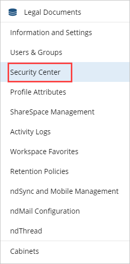
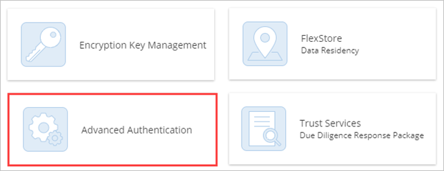
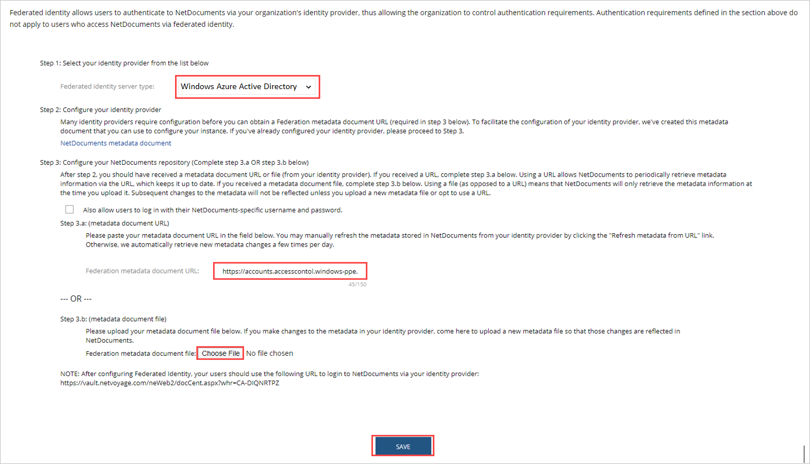
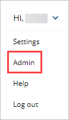
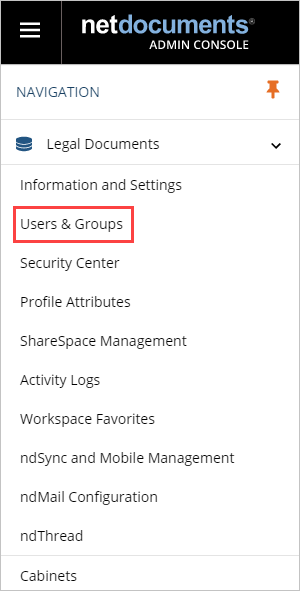
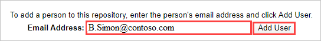

# Tutorial: Microsoft Entra single sign-on (SSO) integration with NetDocuments

In this tutorial, you'll learn how to integrate NetDocuments with Microsoft Entra ID. When you integrate NetDocuments with Microsoft Entra ID, you can:

* Control in Microsoft Entra ID who has access to NetDocuments.
* Enable your users to be automatically signed-in to NetDocuments with their Microsoft Entra accounts.
* Manage your accounts in one central location.

## Prerequisites

To get started, you need the following items:

* A Microsoft Entra subscription. If you don't have a subscription, you can get a [free account](https://azure.microsoft.com/free/).
* NetDocuments single sign-on (SSO) enabled subscription.

## Scenario description

In this tutorial, you configure and test Microsoft Entra SSO in a test environment.

* NetDocuments supports **SP** initiated SSO

## Adding NetDocuments from the gallery

To configure the integration of NetDocuments into Microsoft Entra ID, you need to add NetDocuments from the gallery to your list of managed SaaS apps.

1. Sign in to the [Microsoft Entra admin center](https://entra.microsoft.com) as at least a [Cloud Application Administrator](../roles/permissions-reference.md#cloud-application-administrator).
1. Browse to **Identity** > **Applications** > **Enterprise applications** > **New application**.
1. In the **Add from the gallery** section, type **NetDocuments** in the search box.
1. Select **NetDocuments** from results panel and then add the app. Wait a few seconds while the app is added to your tenant.

 Alternatively, you can also use the [Enterprise App Configuration Wizard](https://portal.office.com/AdminPortal/home?Q=Docs#/azureadappintegration). In this wizard, you can add an application to your tenant, add users/groups to the app, assign roles, as well as walk through the SSO configuration as well. [Learn more about Microsoft 365 wizards.](/microsoft-365/admin/misc/azure-ad-setup-guides)

## Configure and test Microsoft Entra SSO for NetDocuments

Configure and test Microsoft Entra SSO with NetDocuments using a test user called **B.Simon**. For SSO to work, you need to establish a link relationship between a Microsoft Entra user and the related user in NetDocuments.

To configure and test Microsoft Entra SSO with NetDocuments, complete the following building blocks:

1. **[Configure Microsoft Entra SSO](#configure-azure-ad-sso)** - to enable your users to use this feature.
    1. **[Create a Microsoft Entra test user](#create-an-azure-ad-test-user)** - to test Microsoft Entra single sign-on with B.Simon.
    1. **[Assign the Microsoft Entra test user](#assign-the-azure-ad-test-user)** - to enable B.Simon to use Microsoft Entra single sign-on.
1. **[Configure NetDocuments SSO](#configure-netdocuments-sso)** - to configure the single sign-on settings on application side.
    1. **[Create NetDocuments test user](#create-netdocuments-test-user)** - to have a counterpart of B.Simon in NetDocuments that is linked to the Microsoft Entra representation of user.
1. **[Test SSO](#test-sso)** - to verify whether the configuration works.

## Configure Microsoft Entra SSO

Follow these steps to enable Microsoft Entra SSO.

1. Sign in to the [Microsoft Entra admin center](https://entra.microsoft.com) as at least a [Cloud Application Administrator](../roles/permissions-reference.md#cloud-application-administrator).
1. Browse to **Identity** > **Applications** > **Enterprise applications** > **NetDocuments** > **Single sign-on**.
1. On the **Select a single sign-on method** page, select **SAML**.
1. On the **Set up single sign-on with SAML** page, click the edit/pen icon for **Basic SAML Configuration** to edit the settings.

   

1. On the **Basic SAML Configuration** section, enter the values for the following fields:

    a. In the **Sign on URL** text box, type one of the following URL patterns:

    |Sign on URL|
    |-----------|
    |`https://vault.netvoyage.com/neWeb2/docCent.aspx?whr=<Repository ID>`|
    |`https://eu.netdocuments.com/neWeb2/docCent.aspx?whr=<Repository ID>`|
    |`https://de.netdocuments.com/neWeb2/docCent.aspx?whr=<Repository ID>`|
    |`https://au.netdocuments.com/neWeb2/docCent.aspx?whr=<Repository ID>`|
    |

    b. In the **Identifier (Entity ID)** text box, type one of the URLs:

    |Identifier|
    |-----------|
    |`http://netdocuments.com/VAULT`|
    |`http://netdocuments.com/EU`|
    |`http://netdocuments.com/AU`|
    |`http://netdocuments.com/DE`|
    |

    c. In the **Reply URL** text box, type one of the following URL patterns:

    |Reply URL|
    |-----------|
    |`https://vault.netvoyage.com/neWeb2/docCent.aspx?whr=<Repository ID>`|
    |`https://eu.netdocuments.com/neWeb2/docCent.aspx?whr=<Repository ID>`|
    |`https://de.netdocuments.com/neWeb2/docCent.aspx?whr=<Repository ID>`|
    |`https://au.netdocuments.com/neWeb2/docCent.aspx?whr=<Repository ID>`|
    |

	> [!NOTE]
	> These values are not real. Update these values with the actual Sign on URL and Reply URL. Repository ID is a value starting with **CA-** followed by 8 character code associated with your NetDocuments Repository. You can check the [NetDocuments Federated Identity support document](https://netdocuments.force.com/NetDocumentsSupport/s/article/205220410) for more information. Alternatively you can contact [NetDocuments Client support team](https://netdocuments.force.com/NetDocumentsSupport/s/) to get these values if you have difficulties configuring using the above information . You can also refer to the patterns shown in the **Basic SAML Configuration** section.

1. NetDocuments application expects the SAML assertions in a specific format, which requires you to add custom attribute mappings to your SAML token attributes configuration. The following screenshot shows the list of default attributes, where as **nameidentifier** is mapped with **user.userprincipalname**. NetDocuments application expects **nameidentifier** to be mapped with **ObjectID** or any other claim which is applicable to your Organization as **nameidentifier**, so you need to edit the attribute mapping by clicking on **Edit** icon and change the attribute mapping.

	

1. On the **Set up single sign-on with SAML** page, in the **SAML Signing Certificate** section,  find **App Federation Metadata URL** and copy the URL.

	

1. On the **Set up NetDocuments** section, copy the appropriate URL(s) based on your requirement.

	

### Create a Microsoft Entra test user

In this section, you'll create a test user called B.Simon.

1. Sign in to the [Microsoft Entra admin center](https://entra.microsoft.com) as at least a [User Administrator](../roles/permissions-reference.md#user-administrator).
1. Browse to **Identity** > **Users** > **All users**.
1. Select **New user** > **Create new user**, at the top of the screen.
1. In the **User** properties, follow these steps:
   1. In the **Display name** field, enter `B.Simon`.  
   1. In the **User principal name** field, enter the username@companydomain.extension. For example, `B.Simon@contoso.com`.
   1. Select the **Show password** check box, and then write down the value that's displayed in the **Password** box.
   1. Select **Review + create**.
1. Select **Create**.

### Assign the Microsoft Entra test user

In this section, you'll enable B.Simon to use single sign-on by granting access to NetDocuments.

1. Sign in to the [Microsoft Entra admin center](https://entra.microsoft.com) as at least a [Cloud Application Administrator](../roles/permissions-reference.md#cloud-application-administrator).
1. Browse to **Identity** > **Applications** > **Enterprise applications** > **NetDocuments**.
1. In the app's overview page, select **Users and groups**.
1. Select **Add user/group**, then select **Users and groups** in the **Add Assignment** dialog.
   1. In the **Users and groups** dialog, select **B.Simon** from the Users list, then click the **Select** button at the bottom of the screen.
   1. If you are expecting a role to be assigned to the users, you can select it from the **Select a role** dropdown. If no role has been set up for this app, you see "Default Access" role selected.
   1. In the **Add Assignment** dialog, click the **Assign** button.

<!-- docutune:ignore "Security Center" -->

## Configure NetDocuments SSO

1. In a different web browser window, sign into your NetDocuments company site as an administrator.

2. In the upper-right corner, select your name > **Admin**.

3. Select **Security Center**.

    

4. Select **Advanced Authentication**.

    

5. On the **Federated ID** tab, perform the following steps:  

    

    1. For **Federated identity server type**, select as **Windows Azure Active Directory**.

    1. Select **Choose File**, to upload the downloaded metadata file which you have downloaded previously.

    1. Select **SAVE**.

### Create NetDocuments test user

To enable Microsoft Entra users to sign in to NetDocuments, they must be provisioned into NetDocuments. In the case of NetDocuments, provisioning is a manual task.

**To provision a user account, perform the following steps:**

1. Sign on to your **NetDocuments** company site as an administrator.

2. In the upper-right corner, select your name > **Admin**.

    

3. Select **Users and groups**.

    

4. In the **Email Address** textbox, type the email address of a valid Microsoft Entra account you want to provision, and then click **Add User**.

    

    > [!NOTE]
    > The Microsoft Entra account holder will get an email that includes a link to confirm the account before it becomes active. You can use any other NetDocuments user account creation tools or APIs provided by NetDocuments to provision Microsoft Entra user accounts.

## Test SSO 

In this section, you test your Microsoft Entra single sign-on configuration with following options. 

* Click on **Test this application**, this will redirect to NetDocuments Sign-on URL where you can initiate the login flow. 

* Go to NetDocuments Sign-on URL directly and initiate the login flow from there.

* You can use Microsoft My Apps. When you click the NetDocuments tile in the My Apps, you should be automatically signed in to the NetDocuments for which you set up the SSO. For more information about the My Apps, see [Introduction to the My Apps](https://support.microsoft.com/account-billing/sign-in-and-start-apps-from-the-my-apps-portal-2f3b1bae-0e5a-4a86-a33e-876fbd2a4510).

## Next steps

Once you configure NetDocuments you can enforce session control, which protects exfiltration and infiltration of your organization’s sensitive data in real time. Session control extends from Conditional Access. [Learn how to enforce session control with Microsoft Defender for Cloud Apps](/cloud-app-security/proxy-deployment-any-app).
