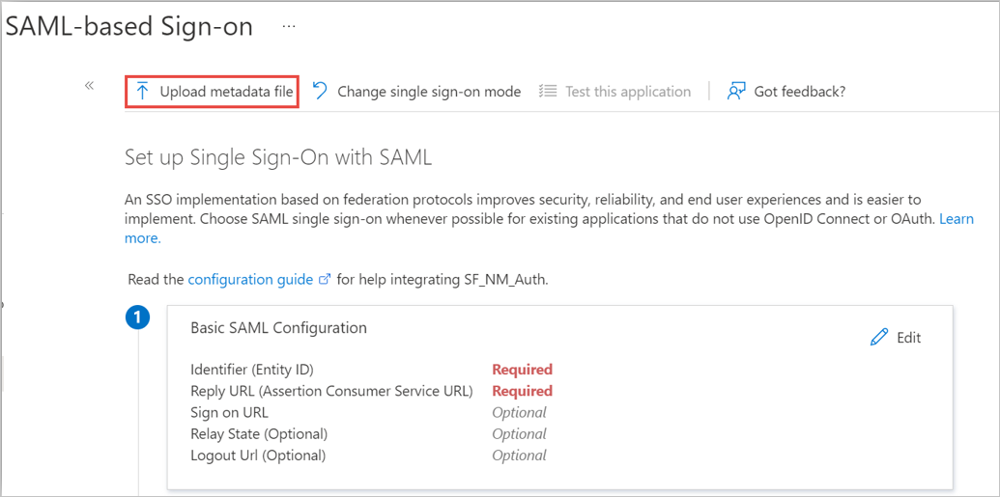

# Tutorial: Azure AD SSO integration with NetMotion Mobility

In this tutorial, you'll learn how to integrate NetMotion Mobility with Azure Active Directory (Azure AD). When you integrate NetMotion Mobility with Azure AD, you can:

* Control in Azure AD who has access to NetMotion Mobility.
* Enable users to be signed-in with a NetMotion Mobility client with their Azure AD accounts.
* Manage your accounts in one central location - the Azure portal.

## Prerequisites

To get started, you need the following items:

* An Azure AD subscription. If you don't have a subscription, you can get a [free account](https://azure.microsoft.com/free/).
* NetMotion Mobility 12.50 or later.
* Along with Cloud Application Administrator, Application Administrator can also add or manage applications in Azure AD.
For more information, see [Azure built-in roles](../roles/permissions-reference.md).

## Scenario description

In this tutorial, you configure and test Azure AD SSO in a test environment.

* NetMotion Mobility supports **SP** initiated SSO.
* NetMotion Mobility supports **Just In Time** user provisioning.

## Add NetMotion Mobility from the gallery

To configure the integration of NetMotion Mobility into Azure AD, you need to add NetMotion Mobility from the gallery to your list of managed SaaS apps.

1. Sign in to the Azure portal using either a work or school account, or a personal Microsoft account.
1. On the left navigation pane, select the **Azure Active Directory** service.
1. Navigate to **Enterprise Applications** and then select **All Applications**.
1. To add new application, select **New application**.
1. In the **Add from the gallery** section, type **NetMotion Mobility** in the search box.
1. Select **NetMotion Mobility** from results panel and then add the app. Wait a few seconds while the app is added to your tenant.

 Alternatively, you can also use the [Enterprise App Configuration Wizard](https://portal.office.com/AdminPortal/home?Q=Docs#/azureadappintegration). In this wizard, you can add an application to your tenant, add users/groups to the app, assign roles, as well as walk through the SSO configuration as well. [Learn more about Microsoft 365 wizards.](/microsoft-365/admin/misc/azure-ad-setup-guides)

## Configure and test Azure AD SSO for NetMotion Mobility

Configure and test Azure AD SSO with NetMotion Mobility using a test user called **B.Simon**. For SSO to work, you need to establish a link relationship between an Azure AD user and the related user in NetMotion Mobility.

To configure and test Azure AD SSO with NetMotion Mobility, perform the following steps:

1. **[Configure Mobility for SAML-based Authentication](#configure-mobility-for-saml-based-authentication)** - to enable end users to authenticate using their Azure AD credentials. 
2. **[Configure Azure AD SSO](#configure-azure-ad-sso)** - to enable your users to use this feature.
    1. **[Create an Azure AD test user](#create-an-azure-ad-test-user)** - to test Azure AD single sign-on with B.Simon.
    1. **[Assign the Azure AD test user](#assign-the-azure-ad-test-user)** - to enable B.Simon to use Azure AD single sign-on.
3. **[Configure NetMotion Mobility SSO](#configure-netmotion-mobility-sso)** - to configure the single sign-on settings on application side.
    1. **[Create NetMotion Mobility test user](#create-netmotion-mobility-test-user)** - to have a counterpart of B.Simon in NetMotion Mobility that is linked to the Azure AD representation of user.
4. **[Test SAML-based User Authentication with the Mobility Client](#test-saml-based-user-authentication-with-the-mobility-client)** - to verify whether the configuration works.

## Configure Mobility for SAML-based Authentication

On the Mobility console, follow the procedures in the [Mobility Administrator Guide](https://help.netmotionsoftware.com/support/docs/MobilityXG/1250/help/mobilityhelp.htm#page/Mobility%2520Server%2Fintro.01.01.html%23) to accomplish the following:
1.	Create an [authentication profile](https://help.netmotionsoftware.com/support/docs/MobilityXG/1250/help/mobilityhelp.htm#page/Mobility%2520Server%2Fconfig.05.41.html%23ww2298330) for SAML – to enable a set of Mobility users to use the SAML protocol.
2.	Configure [SAML-based user authentication](https://help.netmotionsoftware.com/support/docs/MobilityXG/1250/help/mobilityhelp.htm#context/nmcfgapp/saml_userconfig), in Mobility – to set an SP URL and generate the mobilitySPmetadata.xml file which you will later import into Azure AD.

## Configure Azure AD SSO

Follow these steps to enable Azure AD SSO in the Azure portal.

1. In the Azure portal, on the **NetMotion Mobility** application integration page, find the **Manage** section and select **single sign-on**.
1. On the **Select a single sign-on method** page, select **SAML**.
1. On the **Set up single sign-on with SAML** page, click on **Upload Metadata file** just above the **Basic SAML Configuration** section to import your mobilitySPMetadata.xml file into Azure AD.
    
    

1.	After importing the metadata file, on the **Basic SAML Configuration** section, perform the following steps to verify that the XML import has been completed successfully:

    a. In the **Identifier** text box, verify that the URL is using the following pattern, where the variables in the following example URL match those for your Mobility server:
    `https://<YourMobilityServerName>.<CustomerDomain>.<tld>/`

    b. In the **Reply URL** text box, verify that the URL is using the following pattern: 
    `https://<YourMobilityServerName>.<CustomerDomain>.<tld>/saml/login`

1. On the **Set-up single sign-on with SAML** page, in the **SAML Signing Certificate** section,  find **Federation Metadata XML** and select **Download** to download the certificate and save it on your computer.

     

### Create an Azure AD test user

In this section, you'll create a test user in the Azure portal called B.Simon.

1. From the left pane in the Azure portal, select **Azure Active Directory**, select **Users**, and then select **All users**.
1. Select **New user** at the top of the screen.
1. In the **User** properties, follow these steps:
   1. In the **Name** field, enter `B.Simon`.  
   1. In the **User name** field, enter the username@companydomain.extension. For example, `B.Simon@contoso.com`.
   1. Select the **Show password** check box, and then write down the value that's displayed in the **Password** box.
   1. Click **Create**.

### Assign the Azure AD test user

In this section, you'll enable B.Simon to use Azure single sign-on by granting access to NetMotion Mobility.

1. In the Azure portal, select **Enterprise Applications**, and then select **All applications**.
1. In the applications list, select **NetMotion Mobility**.
1. In the app's overview page, find the **Manage** section and select **Users and groups**.
1. Select **Add user**, then select **Users and groups** in the **Add Assignment** dialog.
1. In the **Users and groups** dialog, select **B.Simon** from the Users list, then click the **Select** button at the bottom of the screen.
1. If you are expecting a role to be assigned to the users, you can select it from the **Select a role** dropdown. If no role has been set up for this app, you see "Default Access" role selected.
1. In the **Add Assignment** dialog, click the **Assign** button.

## Configure NetMotion Mobility SSO

Follow the instructions in the Mobility Administrator Guide for [Configuring IdP Settings in the Mobility Console](https://help.netmotionsoftware.com/support/docs/MobilityXG/1250/help/mobilityhelp.htm#context/nmcfgapp/saml_userconfig), import the Azure AD metadata file back into your Mobility server and complete the steps for IdP configuration.

1. Once the Mobility authentication settings are configured, assign them to devices or device groups. 
1.	Go to **Mobility console** > **Configure** > **Client Settings** and select the device or device group on the left that will use SAML-based authentication.
1.	Select **Authentication - Settings** Profile and choose the settings profile you created from the drop-down list.
1.	When you click **Apply**, the selected device or group is subscribed to the non-default settings.

### Create NetMotion Mobility test user

In this section, a user called B.Simon is created in NetMotion Mobility. NetMotion Mobility supports just-in-time user provisioning, which is enabled by default. There is no action item for you in this section. If a user doesn't already exist in NetMotion Mobility, a new one is created after authentication.

## Test SAML-based User Authentication with the Mobility Client

In this section, you test your Azure AD SAML configuration for client authentication.

1. Follow the guidance in [Configuring Mobility Clients](https://help.netmotionsoftware.com/support/docs/MobilityXG/1250/help/mobilityhelp.htm#page/Mobility%2520Server%2Fusing.06.01.html%23), configure a client device that is assigned a SAML-based authentication profile to access the Mobility server pool you have configured for SAML-based authentication and attempt to connect.
1. If you encounter problems during the test, follow the guidance under [Troubleshooting the Mobility Client](https://help.netmotionsoftware.com/support/docs/MobilityXG/1250/help/mobilityhelp.htm#page/Mobility%2520Server%2Ftrouble.14.02.html).