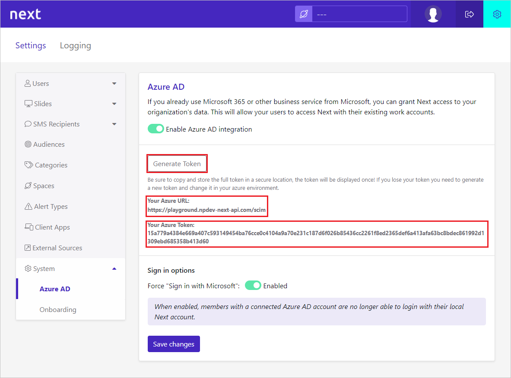

# Tutorial: Configure Netpresenter Next for automatic user provisioning

This tutorial describes the steps you need to perform in both Netpresenter Next and Microsoft Entra ID to configure automatic user provisioning. When configured, Microsoft Entra ID automatically provisions and de-provisions users and groups to [Netpresenter Next](https://www.Netpresenter.com/) using the Microsoft Entra provisioning service. For important details on what this service does, how it works, and frequently asked questions, see [Automate user provisioning and deprovisioning to SaaS applications with Microsoft Entra ID](../app-provisioning/user-provisioning.md).

## Capabilities supported

> [!div class="checklist"]
> * Create users in Netpresenter Next
> * Remove users in Netpresenter Next when they do not require access anymore
> * Keep user attributes synchronized between Microsoft Entra ID and Netpresenter Next.
> * [Single sign-on](../manage-apps/add-application-portal-setup-oidc-sso.md) to Netpresenter Next (recommended).

## Prerequisites

The scenario outlined in this tutorial assumes that you already have the following prerequisites:

* [A Microsoft Entra tenant](../develop/quickstart-create-new-tenant.md) 
* A user account in Microsoft Entra ID with [permission](../roles/permissions-reference.md) to configure provisioning (for example, Application Administrator, Cloud Application administrator, Application Owner, or Global Administrator). 
* An administrator account with Netpresenter Next.

## Step 1: Plan your provisioning deployment

1. Learn about [how the provisioning service works](../app-provisioning/user-provisioning.md).
1. Determine who will be in [scope for provisioning](../app-provisioning/define-conditional-rules-for-provisioning-user-accounts.md).
1. Determine what data to [map between Microsoft Entra ID and Netpresenter Next](../app-provisioning/customize-application-attributes.md). 

## Step 2: Configure Netpresenter Next to support provisioning with Microsoft Entra ID

1. Sign in to the Netpresenter Next with an administrator account.
1. Click on cogwheel icon to go to settings page.
1. In the settings page, click on **System** to open the submenu and click on **Microsoft Entra ID**.
1. Click on the **Generate Token** button.
1. Save the **SCIM Endpoint URL** and **Token** at a secure place, you'll need it in the **Step 5**.

   

1. **Optional:** Under **Sign in options**, you can enable or disable 'Force sign in with Microsoft'. If enabled, users with a Microsoft Entra account will lose the ability to sign in with their local account.

## Step 3: Add Netpresenter Next from the Microsoft Entra application gallery

Add Netpresenter Next from the Microsoft Entra application gallery to start managing provisioning to Netpresenter Next. If you have previously setup Netpresenter Next for SSO, you can use the same application. However it's recommended that you create a separate app when testing out the integration initially. Learn more about adding an application from the gallery [here](../manage-apps/add-application-portal.md).

## Step 4: Define who will be in scope for provisioning

The Microsoft Entra provisioning service allows you to scope who will be provisioned based on assignment to the application and or based on attributes of the user / group. If you choose to scope who will be provisioned to your app based on assignment, you can use the following [steps](../manage-apps/assign-user-or-group-access-portal.md) to assign users and groups to the application. If you choose to scope who will be provisioned based solely on attributes of the user or group, you can use a scoping filter as described [here](../app-provisioning/define-conditional-rules-for-provisioning-user-accounts.md).

* Start small. Test with a small set of users and groups before rolling out to everyone. When scope for provisioning is set to assigned users and groups, you can control this by assigning one or two users or groups to the app. When scope is set to all users and groups, you can specify an [attribute based scoping filter](../app-provisioning/define-conditional-rules-for-provisioning-user-accounts.md).
* If you need additional roles, you can [update the application manifest](../develop/howto-add-app-roles-in-azure-ad-apps.md) to add new roles.

## Step 5: Configure automatic user provisioning to Netpresenter Next 

This section guides you through the steps to configure the Microsoft Entra provisioning service to create, update, and disable users and/or groups in TestApp based on user and/or group assignments in Microsoft Entra ID.

### To configure automatic user provisioning for Netpresenter Next in Microsoft Entra ID:

1. Sign in to the [Microsoft Entra admin center](https://entra.microsoft.com) as at least a [Cloud Application Administrator](../roles/permissions-reference.md#cloud-application-administrator).
1. Browse to **Identity** > **Applications** > **Enterprise applications**

1. In the applications list, select **Netpresenter Next**.

1. Select the **Provisioning** tab.

1. Set the **Provisioning Mode** to **Automatic**.

1. Under the **Admin Credentials** section, input your Netpresenter Next Tenant URL and Secret Token. Click **Test Connection** to ensure Microsoft Entra ID can connect to Netpresenter Next. If the connection fails, ensure your Netpresenter Next account has Admin permissions and try again.

   

1. In the **Notification Email** field, enter the email address of a person or group who should receive the provisioning error notifications and select the **Send an email notification when a failure occurs** check box.

1. Select **Save**.

1. Under the **Mappings** section, select **Synchronize Microsoft Entra users to Netpresenter Next**.

1. Review the user attributes that are synchronized from Microsoft Entra ID to Netpresenter Next in the **Attribute-Mapping** section. The attributes selected as **Matching** properties are used to match the user accounts in Netpresenter Next for update operations. If you choose to change the [matching target attribute](../app-provisioning/customize-application-attributes.md), you'll need to ensure that the Netpresenter Next API supports filtering users based on that attribute. Select the **Save** button to commit any changes.

    |Attribute|Type|Supported for filtering|Required by Netpresenter Next
    |---|---|---|---|
    |userName|String|&check;|&check;
    |externalId|String|&check;|&check;
    |emails[type eq "work"].value|String|&check;|&check;
    |active|Boolean||
    |name.givenName|String||
    |name.familyName|String||
    |phoneNumbers[type eq "work"].value|String||
    |phoneNumbers[type eq "mobile"].value|String||

1. To configure scoping filters, refer to the following instructions provided in the [Scoping filter tutorial](../app-provisioning/define-conditional-rules-for-provisioning-user-accounts.md).

1. To enable the Microsoft Entra provisioning service for Netpresenter Next, change the **Provisioning Status** to **On** in the **Settings** section.

1. Define the users and/or groups that you would like to provision to Netpresenter Next by choosing the desired values in **Scope** in the **Settings** section.

   

1. When you're ready to provision, click **Save**.

This operation starts the initial synchronization cycle of all users and groups defined in **Scope** in the **Settings** section. The initial cycle takes longer to perform than subsequent cycles, which occur approximately every 40 minutes as long as the Microsoft Entra provisioning service is running.

## Step 6: Monitor your deployment

Once you've configured provisioning, use the following resources to monitor your deployment:

1. Use the [provisioning logs](../reports-monitoring/concept-provisioning-logs.md) to determine which users have been provisioned successfully or unsuccessfully
1. Check the [progress bar](../app-provisioning/application-provisioning-when-will-provisioning-finish-specific-user.md) to see the status of the provisioning cycle and how close it is to completion
1. If the provisioning configuration seems to be in an unhealthy state, the application will go into quarantine. Learn more about quarantine states [here](../app-provisioning/application-provisioning-quarantine-status.md).

## Additional resources

* [Managing user account provisioning for Enterprise Apps](../app-provisioning/configure-automatic-user-provisioning-portal.md)
* [What is application access and single sign-on with Microsoft Entra ID?](../manage-apps/what-is-single-sign-on.md)

## Next steps

* [Learn how to review logs and get reports on provisioning activity](../app-provisioning/check-status-user-account-provisioning.md)
