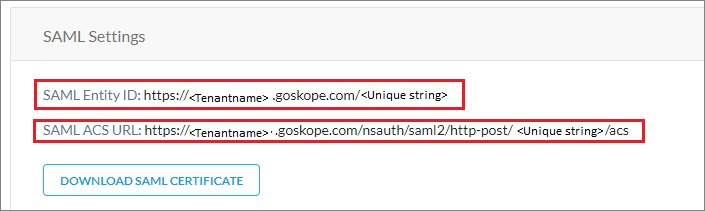
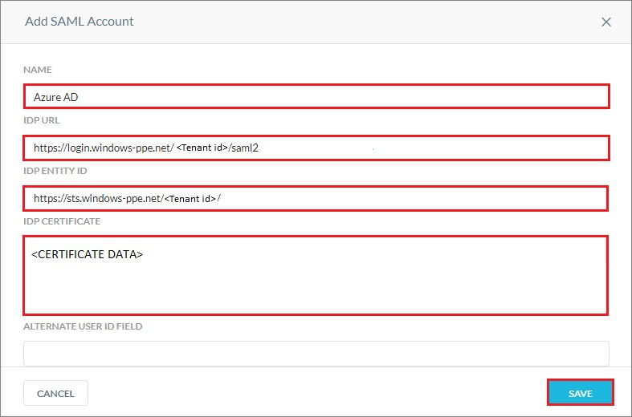
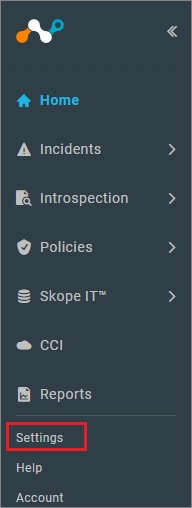

# Tutorial: Azure Active Directory single sign-on (SSO) integration with Netskope User Authentication

In this tutorial, you'll learn how to integrate Netskope User Authentication with Azure Active Directory (Azure AD). When you integrate Netskope User Authentication with Azure AD, you can:

* Control in Azure AD who has access to Netskope User Authentication.
* Enable your users to be automatically signed-in to Netskope User Authentication with their Azure AD accounts.
* Manage your accounts in one central location - the Azure portal.

To learn more about SaaS app integration with Azure AD, see [What is application access and single sign-on with Azure Active Directory](https://docs.microsoft.com/azure/active-directory/active-directory-appssoaccess-whatis).

## Prerequisites

To get started, you need the following items:

* An Azure AD subscription. If you don't have a subscription, you can get a [free account](https://azure.microsoft.com/free/).
* Netskope User Authentication single sign-on (SSO) enabled subscription.

## Scenario description

In this tutorial, you configure and test Azure AD SSO in a test environment.

* Netskope User Authentication supports **SP and IDP** initiated SSO

## Adding Netskope User Authentication from the gallery

To configure the integration of Netskope User Authentication into Azure AD, you need to add Netskope User Authentication from the gallery to your list of managed SaaS apps.

1. Sign in to the [Azure portal](https://portal.azure.com) using either a work or school account, or a personal Microsoft account.
1. On the left navigation pane, select the **Azure Active Directory** service.
1. Navigate to **Enterprise Applications** and then select **All Applications**.
1. To add new application, select **New application**.
1. In the **Add from the gallery** section, type **Netskope User Authentication** in the search box.
1. Select **Netskope User Authentication** from results panel and then add the app. Wait a few seconds while the app is added to your tenant.

## Configure and test Azure AD single sign-on for Netskope User Authentication

Configure and test Azure AD SSO with Netskope User Authentication using a test user called **B.Simon**. For SSO to work, you need to establish a link relationship between an Azure AD user and the related user in Netskope User Authentication.

To configure and test Azure AD SSO with Netskope User Authentication, complete the following building blocks:

1. **[Configure Azure AD SSO](#configure-azure-ad-sso)** - to enable your users to use this feature.
    * **[Create an Azure AD test user](#create-an-azure-ad-test-user)** - to test Azure AD single sign-on with B.Simon.
    * **[Assign the Azure AD test user](#assign-the-azure-ad-test-user)** - to enable B.Simon to use Azure AD single sign-on.
1. **[Configure Netskope User Authentication SSO](#configure-netskope-user-authentication-sso)** - to configure the single sign-on settings on application side.
    * **[Create Netskope User Authentication test user](#create-netskope-user-authentication-test-user)** - to have a counterpart of B.Simon in Netskope User Authentication that is linked to the Azure AD representation of user.
1. **[Test SSO](#test-sso)** - to verify whether the configuration works.

## Configure Azure AD SSO

Follow these steps to enable Azure AD SSO in the Azure portal.

1. In the [Azure portal](https://portal.azure.com/), on the **Netskope User Authentication** application integration page, find the **Manage** section and select **single sign-on**.
1. On the **Select a single sign-on method** page, select **SAML**.
1. On the **Set up single sign-on with SAML** page, click the edit/pen icon for **Basic SAML Configuration** to edit the settings.

   

1. On the **Basic SAML Configuration** section, if you wish to configure the application in **IDP** initiated mode, enter the values for the following fields:

    a. In the **Identifier** text box, type a URL using the following pattern:
    `https://<tenantname>.goskope.com/<customer entered string>`

    b. In the **Reply URL** text box, type a URL using the following pattern:
    `https://<tenantname>.goskope.com/nsauth/saml2/http-post/<customer entered string>`

    > [!NOTE]
	> These values are not real. Update these values with the actual Identifier and Reply URL. You will get these values explained later in the tutorial.

1. Click **Set additional URLs** and perform the following step if you wish to configure the application in **SP** initiated mode:

    In the **Sign-on URL** text box, type a URL using the following pattern:
    `https://<tenantname>.goskope.com`

	> [!NOTE]
	> The Sign-on URL values is not real. Update Sign-on URL value with the actual Sign-on URL. Contact [Netskope User Authentication Client support team](mailto:support@netskope.com) to get Sign-on URL value. You can also refer to the patterns shown in the **Basic SAML Configuration** section in the Azure portal.

1. On the **Set up Single Sign-On with SAML** page, in the **SAML Signing Certificate** section, click **Download** to download the **Federation Metadata XML** from the given options as per your requirement and save it on your computer.

	

1. On the **Set up Netskope User Authentication** section, copy the appropriate URL(s) based on your requirement.

	

### Create an Azure AD test user

In this section, you'll create a test user in the Azure portal called B.Simon.

1. From the left pane in the Azure portal, select **Azure Active Directory**, select **Users**, and then select **All users**.
1. Select **New user** at the top of the screen.
1. In the **User** properties, follow these steps:
   1. In the **Name** field, enter `B.Simon`.  
   1. In the **User name** field, enter the username@companydomain.extension. For example, `B.Simon@contoso.com`.
   1. Select the **Show password** check box, and then write down the value that's displayed in the **Password** box.
   1. Click **Create**.

### Assign the Azure AD test user

In this section, you'll enable B.Simon to use Azure single sign-on by granting access to Netskope User Authentication.

1. In the Azure portal, select **Enterprise Applications**, and then select **All applications**.
1. In the applications list, select **Netskope User Authentication**.
1. In the app's overview page, find the **Manage** section and select **Users and groups**.

   

1. Select **Add user**, then select **Users and groups** in the **Add Assignment** dialog.

	

1. In the **Users and groups** dialog, select **B.Simon** from the Users list, then click the **Select** button at the bottom of the screen.
1. If you're expecting any role value in the SAML assertion, in the **Select Role** dialog, select the appropriate role for the user from the list and then click the **Select** button at the bottom of the screen.
1. In the **Add Assignment** dialog, click the **Assign** button.

## Configure Netskope User Authentication SSO

1. Open a new tab in your browser, and sign in to your Netskope User Authentication company site as an administrator.

1. Click **Active Platform** tab.

    

1. Scroll down to **FORWARD PROXY** and select **SAML**.

    

1. On the **SAML Settings** page, perform the following steps:

    

    a. Copy **SAML Entity ID** value and paste it into the **Identifier** textbox in the **Basic SAML Configuration** section in the Azure portal.

    b. Copy **SAML ACS URL** value and paste it into the **Reply URL** textbox in the **Basic SAML Configuration** section in the Azure portal.

1. Click **ADD ACCOUNT**.

    

1. On the **Add SAML Account** page, perform the following steps:

    

    a. In the **NAME** textbox, provide the name like Azure AD.

    b. In the **IDP URL** textbox, paste the **Login URL** value, which you have copied from the Azure portal.

    c. In the **IDP ENTITY ID** textbox, paste the **Azure AD Identifier** value, which you have copied from the Azure portal.

    d. Open your downloaded metadata file in notepad, copy the content of it into your clipboard, and then paste it to the **IDP CERTIFICATE** textbox.

    e. Click **SAVE**.

### Create Netskope User Authentication test user

1. Open a new tab in your browser, and sign in to your Netskope User Authentication company site as an administrator.

1. Click on the **Settings** tab from the left navigation pane.

    

1. Click **Active Platform** tab.

    

1. Click **Users** tab.

    

1. Click **ADD USERS**.

    

1. Enter the email address of the user you want to add and click **ADD**.

    

## Test SSO

In this section, you test your Azure AD single sign-on configuration using the Access Panel.

When you click the Netskope User Authentication tile in the Access Panel, you should be automatically signed in to the Netskope User Authentication for which you set up SSO. For more information about the Access Panel, see [Introduction to the Access Panel](https://docs.microsoft.com/azure/active-directory/active-directory-saas-access-panel-introduction).

## Additional resources

- [ List of Tutorials on How to Integrate SaaS Apps with Azure Active Directory ](https://docs.microsoft.com/azure/active-directory/active-directory-saas-tutorial-list)

- [What is application access and single sign-on with Azure Active Directory? ](https://docs.microsoft.com/azure/active-directory/active-directory-appssoaccess-whatis)

- [What is conditional access in Azure Active Directory?](https://docs.microsoft.com/azure/active-directory/conditional-access/overview)

- [Try Netskope User Authentication with Azure AD](https://aad.portal.azure.com/)