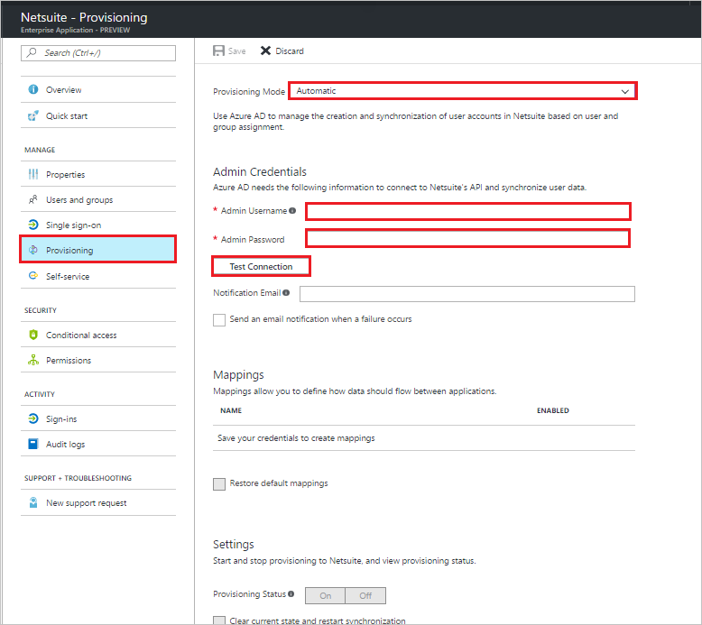

# Tutorial: Configuring Netsuite for automatic user provisioning

The objective of this tutorial is to show you the steps you need to perform in Netsuite OneWorld and Azure AD to automatically provision and de-provision user accounts from Azure AD to Netsuite.

## Prerequisites

The scenario outlined in this tutorial assumes that you already have the following items:

*   An Azure Active directory tenant.
*   A Netsuite OneWorld subscription. Note that automatic user provisioning is presently only supported with NetSuite OneWorld.
*   A user account in Netsuite with administrator permissions.

## Assigning users to Netsuite OneWorld

Azure Active Directory uses a concept called "assignments" to determine which users should receive access to selected apps. In the context of automatic user account provisioning, only the users and groups that have been "assigned" to an application in Azure AD are synchronized.

Before configuring and enabling the provisioning service, you need to decide what users and/or groups in Azure AD represent the users who need access to your Netsuite app. Once decided, you can assign these users to your Netsuite app by following the instructions here:

[Assign a user or group to an enterprise app](https://docs.microsoft.com/azure/active-directory/active-directory-coreapps-assign-user-azure-portal)

### Important tips for assigning users to Netsuite OneWorld

*   It is recommended that a single Azure AD user is assigned to Netsuite to test the provisioning configuration. Additional users and/or groups may be assigned later.

*   When assigning a user to Netsuite, you must select a valid user role. The "Default Access" role does not work for provisioning.

## Enable User Provisioning

This section guides you through connecting your Azure AD to Netsuite's user account provisioning API, and configuring the provisioning service to create, update, and disable assigned user accounts in Netsuite based on user and group assignment in Azure AD.

> [!TIP] 
> You may also choose to enabled SAML-based Single Sign-On for Netsuite, following the instructions provided in [Azure portal](https://portal.azure.com). Single sign-on can be configured independently of automatic provisioning, though these two features compliment each other.

### To configure user account provisioning:

The objective of this section is to outline how to enable user provisioning of Active Directory user accounts to Netsuite.

1. In the [Azure portal](https://portal.azure.com), browse to the **Azure Active Directory > Enterprise Apps > All applications** section.

1. If you have already configured Netsuite for single sign-on, search for your instance of Netsuite using the search field. Otherwise, select **Add** and search for **Netsuite** in the application gallery. Select Netsuite from the search results, and add it to your list of applications.

1. Select your instance of Netsuite, then select the **Provisioning** tab.

1. Set the **Provisioning Mode** to **Automatic**. 

    

1. Under the **Admin Credentials** section, provide the following configuration settings:
   
    a. In the **Admin User Name** textbox, type a Netsuite account name that has the **System Administrator** profile in Netsuite.com assigned.
   
    b. In the **Admin Password** textbox, type the password for this account.
      
1. In the Azure portal, click **Test Connection** to ensure Azure AD can connect to your Netsuite app.

1. In the **Notification Email** field, enter the email address of a person or group who should receive provisioning error notifications, and check the checkbox.

1. Click **Save.**

1. Under the Mappings section, select **Synchronize Azure Active Directory Users to Netsuite.**

1. In the **Attribute Mappings** section, review the user attributes that are synchronized from Azure AD to Netsuite. Note that the attributes selected as **Matching** properties are used to match the user accounts in Netsuite for update operations. Select the Save button to commit any changes.

1. To enable the Azure AD provisioning service for Netsuite, change the **Provisioning Status** to **On** in the Settings section

1. Click **Save.**

It starts the initial synchronization of any users and/or groups assigned to Netsuite in the Users and Groups section. Note that the initial sync takes longer to perform than subsequent syncs, which occur approximately every 40 minutes as long as the service is running. You can use the **Synchronization Details** section to monitor progress and follow links to provisioning activity logs, which describe all actions performed by the provisioning service on your Netsuite app.

For more information on how to read the Azure AD provisioning logs, see [Reporting on automatic user account provisioning](../app-provisioning/check-status-user-account-provisioning.md).

## Additional resources

* [Managing user account provisioning for Enterprise Apps](tutorial-list.md)
* [What is application access and single sign-on with Azure Active Directory?](../manage-apps/what-is-single-sign-on.md)
* [Configure Single Sign-on](netsuite-tutorial.md)
