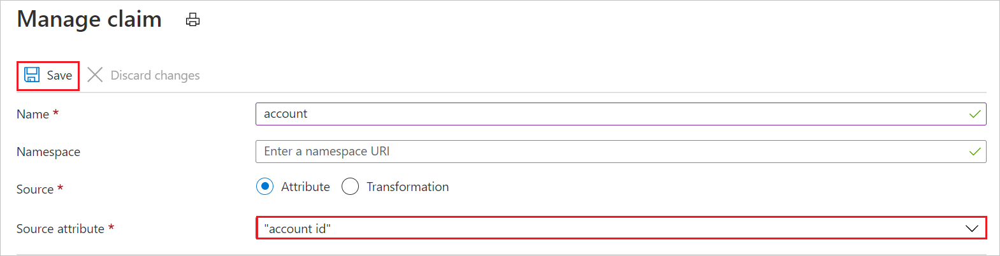

# Tutorial: Integrate Microsoft Entra single sign-on (SSO) with NetSuite

In this tutorial, you'll learn how to integrate NetSuite with Microsoft Entra ID. When you integrate NetSuite with Microsoft Entra ID, you can:

* Control in Microsoft Entra ID who has access to NetSuite.
* Enable your users to be automatically signed in to NetSuite with their Microsoft Entra accounts.
* Manage your accounts in one central location, the Azure portal.

## Prerequisites

To get started, you need the following items:

* A Microsoft Entra subscription. If you don't have a subscription, you can get a [free account](https://azure.microsoft.com/free/).
* A NetSuite single sign-on (SSO)-enabled subscription.

## Scenario description

In this tutorial, you configure and test Microsoft Entra SSO in a test environment. 

NetSuite supports:

* IDP-initiated SSO.
* JIT (just-in-time) user provisioning.

> [!NOTE]
> Because the identifier of this application is a fixed string value, only one instance can be configured in one tenant.

## Add NetSuite from the gallery

To configure the integration of NetSuite into Microsoft Entra ID, add NetSuite from the gallery to your list of managed SaaS apps by doing the following:

1. Sign in to the [Microsoft Entra admin center](https://entra.microsoft.com) as at least a [Cloud Application Administrator](../roles/permissions-reference.md#cloud-application-administrator).
1. Browse to **Identity** > **Applications** > **Enterprise applications** > **New application**.
1. In the **Add from the gallery** section, type **NetSuite** in the search box.
1. In the results pane, select **NetSuite**, and then add the app. Wait a few seconds while the app is added to your tenant.

 Alternatively, you can also use the [Enterprise App Configuration Wizard](https://portal.office.com/AdminPortal/home?Q=Docs#/azureadappintegration). In this wizard, you can add an application to your tenant, add users/groups to the app, assign roles, as well as walk through the SSO configuration as well. [Learn more about Microsoft 365 wizards.](/microsoft-365/admin/misc/azure-ad-setup-guides)

## Configure and test Microsoft Entra SSO for NetSuite

Configure and test Microsoft Entra SSO with NetSuite by using a test user called **B.Simon**. For SSO to work, you need to establish a link relationship between a Microsoft Entra user and the related user in NetSuite.

To configure and test Microsoft Entra SSO with NetSuite, perform the following steps:

1. [Configure Microsoft Entra SSO](#configure-azure-ad-sso) to enable your users to use this feature.
    * [Create a Microsoft Entra test user](#create-an-azure-ad-test-user) to test Microsoft Entra single sign-on with user B.Simon.  
    * [Assign the Microsoft Entra test user](#assign-the-azure-ad-test-user) to enable user B.Simon to use Microsoft Entra single sign-on.
1. [Configure NetSuite SSO](#configure-netsuite-sso) to configure the single sign-on settings on the application side.
    * [Create the NetSuite test user](#create-the-netsuite-test-user) to have a counterpart of user B.Simon in NetSuite that's linked to the Microsoft Entra representation of the user.
1. [Test SSO](#test-sso) to verify that the configuration works.

## Configure Microsoft Entra SSO

To enable Microsoft Entra SSO in the Azure portal, do the following:

1. Sign in to the [Microsoft Entra admin center](https://entra.microsoft.com) as at least a [Cloud Application Administrator](../roles/permissions-reference.md#cloud-application-administrator).
1. Browse to **Identity** > **Applications** > **Enterprise applications** > **NetSuite** application integration page, look for the **Manage** section, and then select **Single sign-on**.
1. In the **Select a single sign-on method** pane, select **SAML**.
1. In the **Set up Single Sign-On with SAML** pane, select the **Edit** ("pencil") icon next to **Basic SAML Configuration**.

   

1. In the **Basic SAML Configuration** section, in the **Reply URL** text box, type the URL:
`https://system.netsuite.com/saml2/acs`

1. NetSuite application expects the SAML assertions in a specific format, which requires you to add custom attribute mappings to your SAML token attributes configuration. The following screenshot shows the list of default attributes.

	

1. In addition to above, NetSuite application expects few more attributes to be passed back in SAML response which are shown below. These attributes are also pre populated but you can review them as per your requirements.

	| Name | Source attribute |
	| ---------------| --------------- |
	| account  | `account id` |

	> [!NOTE]
	> The value of the account attribute is not real. You'll update this value, as explained later in this tutorial.

1. On the Set up single sign-on with SAML page, in the SAML Signing Certificate section, find Federation Metadata XML and select Download to download the certificate and save it on your computer.

	

1. In the **Set up NetSuite** section, copy the appropriate URL or URLs, depending on your requirement.

	

### Create a Microsoft Entra test user

In this section, you create a test user called B.Simon.

1. Sign in to the [Microsoft Entra admin center](https://entra.microsoft.com) as at least a [User Administrator](../roles/permissions-reference.md#user-administrator).
1. Browse to **Identity** > **Users** > **All users**.
1. Select **New user** > **Create new user**, at the top of the screen.
1. In the **User** properties, follow these steps:
   1. In the **Display name** field, enter `B.Simon`.  
   1. In the **User principal name** field, enter the username@companydomain.extension. For example, `B.Simon@contoso.com`.
   1. Select the **Show password** check box, and then write down the value that's displayed in the **Password** box.
   1. Select **Review + create**.
1. Select **Create**.

### Assign the Microsoft Entra test user

In this section, you enable user B.Simon to use Azure single sign-on by granting access to NetSuite.

1. Sign in to the [Microsoft Entra admin center](https://entra.microsoft.com) as at least a [Cloud Application Administrator](../roles/permissions-reference.md#cloud-application-administrator).
1. Browse to **Identity** > **Applications** > **Enterprise applications** > **NetSuite**.
1. In the overview pane, look for the **Manage** section, and then select the **Users and groups** link.
1. Select **Add user** and then, in the **Add Assignment** pane, select **Users and groups**.
1. In the **Users and groups** pane, in the **Users** drop-down list, select **B.Simon**, and then select the **Select** button at the bottom of the screen.
1. If you're expecting any role value in the SAML assertion, do the following:

   a. In the **Select Role** pane, in the drop-down list, select the appropriate role for the user.  
   b. At the bottom of the screen, select the **Select** button.
1. In the **Add Assignment** pane, select the **Assign** button.

## Configure NetSuite SSO

1. Open a new tab in your browser, and sign in to your NetSuite company site as an administrator.

2. In the top navigation bar, select **Setup**, and then select **Company** > **Enable Features**.

    

3. In the toolbar at the middle of the page, select **SuiteCloud**.

    

4. Under **Manage Authentication**, select the **SAML Single Sign-on** check box to enable the SAML single sign-on option in NetSuite.

    

5. In the top navigation bar, select **Setup**.

    

6. In the **Setup Tasks** list, select **Integration**.

	

7. Under **Manage Authentication**, select **SAML Single Sign-on**.

    

8. In the **SAML Setup** pane, under **NetSuite Configuration**, do the following:

    
  
    a. Select the **Primary Authentication Method** check box.

    b. Under **SAMLV2 Identity Provider Metadata**, select **Upload IDP Metadata File**, and then select **Browse** to upload the metadata file that you downloaded.

    c. Select **Submit**.

9. In the NetSuite top navigation bar, select **Setup**, and then select **Company** > **Company Information**.

	

	

    b. In the **Company Information** pane, in the right column, copy the **Account ID** value.

    c. Paste the **Account ID** that you copied from the NetSuite account into the **Attribute Value** box in Microsoft Entra ID.

    

10. Before users can perform single sign-on into NetSuite, they must first be assigned the appropriate permissions in NetSuite. To assign these permissions, do the following:

    a. In the top navigation bar, select **Setup**.

    

    b. In the left pane, select **Users/Roles**, then select **Manage Roles**.

    

    c. Select **New Role**.

    d. Enter a **Name** for the new role.

    

    e. Select **Save**.

    f. In the top navigation bar, select **Permissions**. Then select **Setup**.

    

    g. Select **SAML Single Sign-on**, and then select **Add**.

    h. Select **Save**.

    i. In the top navigation bar, select **Setup**, and then select **Setup Manager**.

    

    j. In the left pane, select **Users/Roles**, and then select **Manage Users**.

    

    k. Select a test user, select **Edit**, and then select the **Access** tab.

    

    l. In the **Roles** pane, assign the appropriate role that you have created.

    

    m. Select **Save**.

### Create the NetSuite test user

In this section, a user called B.Simon is created in NetSuite. NetSuite supports just-in-time user provisioning, which is enabled by default. There's no action item for you in this section. If a user doesn't already exist in NetSuite, a new one is created after authentication.

## Test SSO

In this section, you test your Microsoft Entra single sign-on configuration with following options.

- Click on **Test this application**, and you should be automatically signed in to the NetSuite for which you set up the SSO

- You can use Microsoft My Apps. When you click the NetSuite tile in the My Apps, you should be automatically signed in to the NetSuite for which you set up the SSO. For more information about the My Apps, see [Introduction to the My Apps](https://support.microsoft.com/account-billing/sign-in-and-start-apps-from-the-my-apps-portal-2f3b1bae-0e5a-4a86-a33e-876fbd2a4510).

## Next steps

Once you configure the NetSuite you can enforce session controls, which protects exfiltration and infiltration of your organization’s sensitive data in real time. Session controls extends from Conditional Access. [Learn how to enforce session control with Microsoft Defender for Cloud Apps](/cloud-app-security/proxy-deployment-aad).
