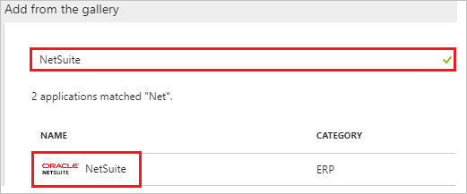

---
title: 'Tutorial: Azure Active Directory integration with NetSuite | Microsoft Docs'
description: Learn how to configure single sign-on between Azure Active Directory and NetSuite.
services: active-directory
documentationCenter: na
author: jeevansd
manager: mtillman

ms.assetid: dafa0864-aef2-4f5e-9eac-770504688ef4
ms.service: active-directory
ms.component: saas-app-tutorial
ms.workload: identity
ms.tgt_pltfrm: na
ms.devlang: na
ms.topic: article
ms.date: 07/11/2018
ms.author: jeedes

---
# Tutorial: Azure Active Directory integration with NetSuite

In this tutorial, you learn how to integrate NetSuite with Azure Active Directory (Azure AD).

Integrating NetSuite with Azure AD provides you with the following benefits:

- You can control in Azure AD who has access to NetSuite
- You can enable your users to automatically get signed-on to NetSuite (Single Sign-On) with their Azure AD accounts
- You can manage your accounts in one central location - the Azure portal

If you want to know more details about SaaS app integration with Azure AD, see [What is application access and single sign-on with Azure Active Directory](../manage-apps/what-is-single-sign-on.md).

## Prerequisites

To configure Azure AD integration with NetSuite, you need the following items:

- An Azure AD subscription
- A NetSuite single sign-on enabled subscription

> [!NOTE]
> To test the steps in this tutorial, we do not recommend using a production environment.

To test the steps in this tutorial, you should follow these recommendations:

- Do not use your production environment, unless it is necessary.
- If you don't have an Azure AD trial environment, you can get a one-month trial [here](https://azure.microsoft.com/pricing/free-trial/).

## Scenario description
In this tutorial, you test Azure AD single sign-on in a test environment. 
The scenario outlined in this tutorial consists of two main building blocks:

1. Adding NetSuite from the gallery
1. Configuring and testing Azure AD single sign-on

## Adding NetSuite from the gallery
To configure the integration of NetSuite into Azure AD, you need to add NetSuite from the gallery to your list of managed SaaS apps.

**To add NetSuite from the gallery, perform the following steps:**

1. In the **[Azure portal](https://portal.azure.com)**, on the left navigation panel, click **Azure Active Directory** icon. 

    ![Active Directory][1]

1. Navigate to **Enterprise applications**. Then go to **All applications**.

    ![Applications][2]

1. Click **New application** button on the top of the dialog.

    ![Applications][3]

1. In the search box, type **NetSuite**, select **NetSuite** from result panel then click **Add** button to add the application.

	

##  Configuring and testing Azure AD single sign-on
In this section, you configure and test Azure AD single sign-on with NetSuite based on a test user called "Britta Simon."

For single sign-on to work, Azure AD needs to know what the counterpart user in NetSuite is to a user in Azure AD. In other words, a link relationship between an Azure AD user and the related user in NetSuite needs to be established.

This link relationship is established by assigning the value of the **user name** in Azure AD as the value of the **Username** in NetSuite.

To configure and test Azure AD single sign-on with NetSuite, you need to complete the following building blocks:

1. **[Configuring Azure AD Single Sign-On](#configuring-azure-ad-single-sign-on)** - to enable your users to use this feature.
1. **[Creating an Azure AD test user](#creating-an-azure-ad-test-user)** - to test Azure AD single sign-on with Britta Simon.
1. **[Creating a NetSuite test user](#creating-a-netsuite-test-user)** - to have a counterpart of Britta Simon in NetSuite that is linked to the Azure AD representation of user.
1. **[Assigning the Azure AD test user](#assigning-the-azure-ad-test-user)** - to enable Britta Simon to use Azure AD single sign-on.
1. **[Testing Single Sign-On](#testing-single-sign-on)** - to verify whether the configuration works.

### Configuring Azure AD single sign-on

In this section, you enable Azure AD single sign-on in the Azure portal and configure single sign-on in your NetSuite application.

**To configure Azure AD single sign-on with NetSuite, perform the following steps:**

1. In the Azure portal, on the **NetSuite** application integration page, click **Single sign-on**.

    ![Configure Single Sign-On][4]

1. On the **Single sign-on** dialog, select **Mode** as **SAML-based Sign-on** to enable single sign-on.

    

1. On the **NetSuite Domain and URLs** section, perform the following steps:

    

    In the **Reply URL** textbox, type a URL using the following pattern:

    `https://<tenant-name>.NetSuite.com/saml2/acs`

	`https://<tenant-name>.na1.NetSuite.com/saml2/acs`

	`https://<tenant-name>.na2.NetSuite.com/saml2/acs`

	`https://<tenant-name>.sandbox.NetSuite.com/saml2/acs`

	`https://<tenant-name>.na1.sandbox.NetSuite.com/saml2/acs`

	`https://<tenant-name>.na2.sandbox.NetSuite.com/saml2/acs`
    
    > [!NOTE]
    > These are not real values. Update these values with the actual Reply URL. Contact [NetSuite support team](http://www.NetSuite.com/portal/services/support.shtml) to get these values.

1. On the **SAML Signing Certificate** section, click **Metadata XML** and then save the XML file on your computer.

     

1. Click **Save** button.

    

1. On the **NetSuite Configuration** section, click **Configure NetSuite** to open **Configure sign-on** window. Copy the **SAML Single Sign-On Service URL** from the **Quick Reference section.**

    

1. Open a new tab in your browser, and sign into your NetSuite company site as an administrator.

1. In the toolbar at the top of the page, click **Setup**, then navigate to **Company** and click **Enable Features**.

    

1. In the toolbar at the middle of the page, click **SuiteCloud**.

    

1. Under **Manage Authentication** section, select **SAML SINGLE SIGN-ON** to enable the SAML SINGLE SIGN-ON option in NetSuite.

    

1. In the toolbar at the top of the page, click **Setup**.

    

1. From the **SETUP TASKS** list, click **Integration**.

	

1. In the **MANAGE AUTHENTICATION** section, click **SAML Single Sign-on**.

    

1. On the **SAML Setup** page, under **NetSuite Configuration** section perform the following steps:

    
  
    a. Select **PRIMARY AUTHENTICATION METHOD**.

    b. For the field labeled **SAMLV2 IDENTITY PROVIDER METADATA**, select **UPLOAD IDP METADATA FILE**. Then click **Browse** to upload the metadata file that you downloaded from Azure portal.

    c. Click **Submit**.

1. In Azure AD, Click on **View and edit all other user attributes** check-box and add attribute.

    

1. For the **Attribute Name** field, type in `account`. For the **Attribute Value** field, type in your NetSuite account ID. This value is constant and change with account. Instructions on how to find your account ID are included below:

    

    a. In NetSuite, click **Setup** then navigate to **Company** and click **Company Information** from the top navigation menu.

	

	

    b. In the **Company Information** Page on the right column copy the **ACCOUNT ID**.

    c. Paste the **Account ID** which you have copied from NetSuite account it into the **Attribute Value** field in Azure AD. 

1. Before users can perform single sign-on into NetSuite, they must first be assigned the appropriate permissions in NetSuite. Follow the instructions below to assign these permissions.

    a. On the top navigation menu, click **Setup**.

    

    b. On the left navigation menu, select **Users/Roles**, then click **Manage Roles**.

    

    c. Click **New Role**.

    d. Type in a **Name** for your new role.

    

    e. Click **Save**.

    f. In the menu on the top, click **Permissions**. Then click **Setup**.

    

    g. Select **SAML Single Sign-on**, and then click **Add**.

    h. Click **Save**.

    i. On the top navigation menu, click **Setup**, then click **Setup Manager**.

    

    j. On the left navigation menu, select **Users/Roles**, then click **Manage Users**.

    

    k. Select a test user. Then click **Edit** and then navigate to **Access** tab.

    

    l. On the Roles dialog, assign the appropriate role that you have created.

    

    m. Click **Save**.
 
### Creating an Azure AD test user
The objective of this section is to create a test user in the Azure portal called Britta Simon.

![Create Azure AD User][100]

**To create a test user in Azure AD, perform the following steps:**

1. In the **Azure portal**, on the left navigation pane, click **Azure Active Directory** icon.

	 

1.  To display the list of users, go to **Users and groups** and click **All users**.
	
	 

1. At the top of the dialog, click **Add** to open the **User** dialog.
 
	 

1. On the **User** dialog page, perform the following steps:
 
	 

    a. In the **Name** textbox, type **BrittaSimon**.

    b. In the **User name** textbox, type the **email address** of BrittaSimon.

	c. Select **Show Password** and write down the value of the **Password**.

    d. Click **Create**. 

### Creating a NetSuite test user

In this section, a user called Britta Simon is created in NetSuite. NetSuite supports just-in-time provisioning, which is enabled by default.
There is no action item for you in this section. If a user doesn't already exist in NetSuite, a new one is created when you attempt to access NetSuite.

### Assigning the Azure AD test user

In this section, you enable Britta Simon to use Azure single sign-on by granting access to NetSuite.

![Assign User][200] 

**To assign Britta Simon to NetSuite, perform the following steps:**

1. In the Azure portal, open the applications view, and then navigate to the directory view and go to **Enterprise applications** then click **All applications**.

	![Assign User][201] 

1. In the applications list, select **NetSuite**.

	 

1. In the menu on the left, click **Users and groups**.

	![Assign User][202] 

1. Click **Add** button. Then select **Users and groups** on **Add Assignment** dialog.

	![Assign User][203]

1. On **Users and groups** dialog, select **Britta Simon** in the Users list.

1. Click **Select** button on **Users and groups** dialog.

1. Click **Assign** button on **Add Assignment** dialog.
	
### Testing single sign-on

In this section, you test your Azure AD single sign-on configuration using the Access Panel.

To test your single sign-on settings, open the Access Panel at [https://myapps.microsoft.com](https://myapps.microsoft.com/), sign into the test account, and click **NetSuite**.

## Additional resources

* [List of Tutorials on How to Integrate SaaS Apps with Azure Active Directory](tutorial-list.md)
* [What is application access and single sign-on with Azure Active Directory?](../manage-apps/what-is-single-sign-on.md)
* [Configure User Provisioning](NetSuite-provisioning-tutorial.md)

<!--Image references-->

[1]: ./media/NetSuite-tutorial/tutorial_general_01.png
[2]: ./media/NetSuite-tutorial/tutorial_general_02.png
[3]: ./media/NetSuite-tutorial/tutorial_general_03.png
[4]: ./media/NetSuite-tutorial/tutorial_general_04.png

[100]: ./media/NetSuite-tutorial/tutorial_general_100.png

[200]: ./media/NetSuite-tutorial/tutorial_general_200.png
[201]: ./media/NetSuite-tutorial/tutorial_general_201.png
[202]: ./media/NetSuite-tutorial/tutorial_general_202.png
[203]: ./media/NetSuite-tutorial/tutorial_general_203.png

