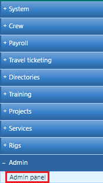
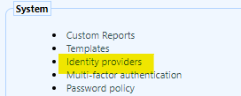
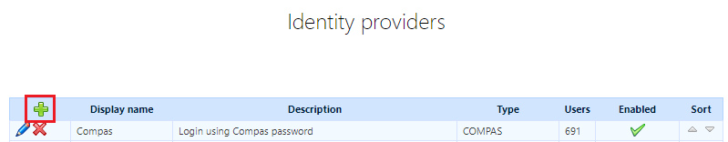
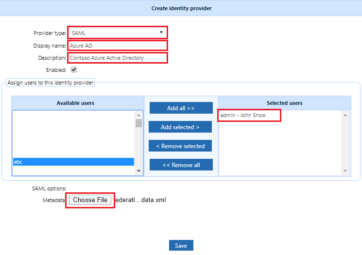
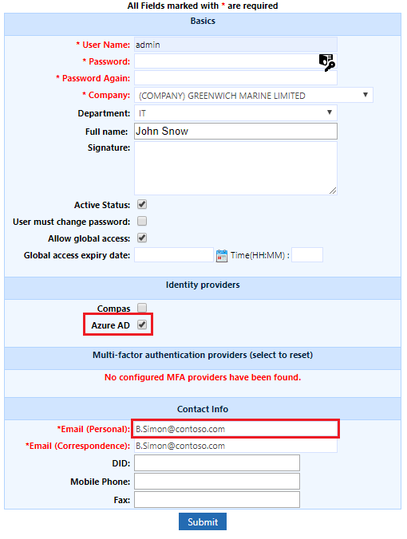
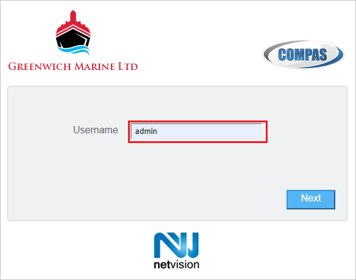
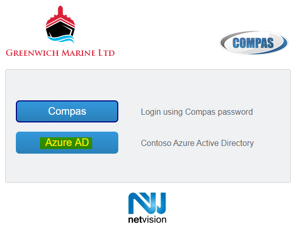

# Tutorial: Azure Active Directory single sign-on (SSO) integration with Netvision Compas

In this tutorial, you'll learn how to integrate Netvision Compas with Azure Active Directory (Azure AD). When you integrate Netvision Compas with Azure AD, you can:

* Control in Azure AD who has access to Netvision Compas.
* Enable your users to be automatically signed-in to Netvision Compas with their Azure AD accounts.
* Manage your accounts in one central location - the Azure portal.

To learn more about SaaS app integration with Azure AD, see [What is application access and single sign-on with Azure Active Directory](https://docs.microsoft.com/azure/active-directory/manage-apps/what-is-single-sign-on).

## Prerequisites

To get started, you need the following items:

* An Azure AD subscription. If you don't have a subscription, you can get a [free account](https://azure.microsoft.com/free/).
* Netvision Compas single sign-on (SSO) enabled subscription.

## Scenario description

In this tutorial, you configure and test Azure AD SSO in a test environment.

* Netvision Compas supports **SP and IDP** initiated SSO
* Once you configure Netvision Compas you can enforce Session Control, which protects exfiltration and infiltration of your organization's sensitive data in real time. Session Control extends from Conditional Access. [Learn how to enforce session control with Microsoft Cloud App Security](https://docs.microsoft.com/cloud-app-security/proxy-deployment-aad)

## Adding Netvision Compas from the gallery

To configure the integration of Netvision Compas into Azure AD, you need to add Netvision Compas from the gallery to your list of managed SaaS apps.

1. Sign in to the [Azure portal](https://portal.azure.com) using either a work or school account, or a personal Microsoft account.
1. On the left navigation pane, select the **Azure Active Directory** service.
1. Navigate to **Enterprise Applications** and then select **All Applications**.
1. To add new application, select **New application**.
1. In the **Add from the gallery** section, type **Netvision Compas** in the search box.
1. Select **Netvision Compas** from results panel and then add the app. Wait a few seconds while the app is added to your tenant.

## Configure and test Azure AD single sign-on for Netvision Compas

Configure and test Azure AD SSO with Netvision Compas using a test user called **B.Simon**. For SSO to work, you need to establish a link relationship between an Azure AD user and the related user in Netvision Compas.

To configure and test Azure AD SSO with Netvision Compas, complete the following building blocks:

1. **[Configure Azure AD SSO](#configure-azure-ad-sso)** - to enable your users to use this feature.
    1. **[Create an Azure AD test user](#create-an-azure-ad-test-user)** - to test Azure AD single sign-on with B.Simon.
    1. **[Assign the Azure AD test user](#assign-the-azure-ad-test-user)** - to enable B.Simon to use Azure AD single sign-on.
1. **[Configure Netvision Compas SSO](#configure-netvision-compas-sso)** - to configure the single sign-on settings on application side.
    1. **[Configure Netvision Compas test user](#configure-netvision-compas-test-user)** - to have a counterpart of B.Simon in Netvision Compas that is linked to the Azure AD representation of user.
1. **[Test SSO](#test-sso)** - to verify whether the configuration works.

## Configure Azure AD SSO

Follow these steps to enable Azure AD SSO in the Azure portal.

1. In the [Azure portal](https://portal.azure.com/), on the **Netvision Compas** application integration page, find the **Manage** section and select **single sign-on**.
1. On the **Select a single sign-on method** page, select **SAML**.
1. On the **Set up single sign-on with SAML** page, click the edit/pen icon for **Basic SAML Configuration** to edit the settings.

   

1. On the **Basic SAML Configuration** section, if you wish to configure the application in **IDP** initiated mode, enter the values for the following fields:

    a. In the **Identifier** text box, type a URL using the following pattern:
    `https://<TENANT>.compas.cloud/Identity/Saml20`

    b. In the **Reply URL** text box, type a URL using the following pattern:
    `https://<TENANT>.compas.cloud/Identity/Auth/AssertionConsumerService`

1. Click **Set additional URLs** and perform the following step if you wish to configure the application in **SP** initiated mode:

    In the **Sign-on URL** text box, type a URL using the following pattern:
    `https://<TENANT>.compas.cloud/Identity/Auth/AssertionConsumerService`

    > [!NOTE]
    > These values are not real. Update these values with the actual Identifier, Reply URL and Sign-on URL. Contact [Netvision Compas Client support team](mailto:contact@net.vision) to get these values. You can also refer to the patterns shown in the **Basic SAML Configuration** section in the Azure portal.

1. On the **Set up single sign-on with SAML** page, in the **SAML Signing Certificate** section,  find **Federation Metadata XML** and select **Download** to download the metadata file and save it on your computer.

    

### Create an Azure AD test user

In this section, you'll create a test user in the Azure portal called B.Simon.

1. From the left pane in the Azure portal, select **Azure Active Directory**, select **Users**, and then select **All users**.
1. Select **New user** at the top of the screen.
1. In the **User** properties, follow these steps:
   1. In the **Name** field, enter `B.Simon`.  
   1. In the **User name** field, enter the username@companydomain.extension. For example, `B.Simon@contoso.com`.
   1. Select the **Show password** check box, and then write down the value that's displayed in the **Password** box.
   1. Click **Create**.

### Assign the Azure AD test user

In this section, you'll enable B.Simon to use Azure single sign-on by granting access to Netvision Compas.

1. In the Azure portal, select **Enterprise Applications**, and then select **All applications**.
1. In the applications list, select **Netvision Compas**.
1. In the app's overview page, find the **Manage** section and select **Users and groups**.

   

1. Select **Add user**, then select **Users and groups** in the **Add Assignment** dialog.

    

1. In the **Users and groups** dialog, select **B.Simon** from the Users list, then click the **Select** button at the bottom of the screen.
1. If you're expecting any role value in the SAML assertion, in the **Select Role** dialog, select the appropriate role for the user from the list and then click the **Select** button at the bottom of the screen.
1. In the **Add Assignment** dialog, click the **Assign** button.

## Configure Netvision Compas SSO

In this section you enable SAML SSO in **Netvision Compas**.
1. Log into **Netvision Compas** using an administrative account and access the administration area.

    

1. Locate the **System** area and select **Identity Providers**.

    

1. Select the **Add** action to register Azure AD as a new IDP.

    

1. Select **SAML** for the **Provider type**.
1. Enter meaningful values for the **Display name** and **Description** fields.
1. Assign **Netvision Compas** users to the IDP by selecting from the **Available users** list and then selecting the **Add selected** button. Users can also be assigned to the IDP while following the provisioning procedure.
1. For the **Metadata** SAML option click the **Choose File** button and select the metadata file previously saved on your computer.
1. Click **Save**.

    

### Configure Netvision Compas test user

In this section, you configure an existing user in **Netvision Compas** to use Azure AD for SSO.
1. Follow the **Netvision Compas** user provisioning procedure, as defined by your company or edit an existing user account.
1. While defining the user's profile, make sure that the user's **Email (Personal)** address matches the Azure AD username: username@companydomain.extension. For example, `B.Simon@contoso.com`.

    

Users must be created and activated before you use single sign-on.

## Test SSO 

In this section, you test your Azure AD single sign-on configuration.

### Using the Access Panel (IDP initiated).

When you click the Netvision Compas tile in the Access Panel, you should be automatically signed in to the Netvision Compas for which you set up SSO. For more information about the Access Panel, see [Introduction to the Access Panel](https://docs.microsoft.com/azure/active-directory/active-directory-saas-access-panel-introduction).

### Directly accessing Netvision Compas (SP initiated).

1. Access the **Netvision Compas** URL. For example, `https://tenant.compas.cloud`.
1. Enter the **Netvision Compas** username and select **Next**.

    

1. **(optional)** If the user is assigned multiple IDPs within **Netvision Compas**, a list of available IDPs is presented. Select the Azure AD IDP configured previously in **Netvision Compas**.

    

1. You are redirected to Azure AD to perform the authentication. Once you are successfully authenticated, you should be automatically signed in to **Netvision Compas** for which you set up SSO.

## Additional resources

- [ List of Tutorials on How to Integrate SaaS Apps with Azure Active Directory ](https://docs.microsoft.com/azure/active-directory/active-directory-saas-tutorial-list)

- [What is application access and single sign-on with Azure Active Directory? ](https://docs.microsoft.com/azure/active-directory/manage-apps/what-is-single-sign-on)

- [What is conditional access in Azure Active Directory?](https://docs.microsoft.com/azure/active-directory/conditional-access/overview)

- [Try Netvision Compas with Azure AD](https://aad.portal.azure.com/)

- [What is session control in Microsoft Cloud App Security?](https://docs.microsoft.com/cloud-app-security/proxy-intro-aad)
