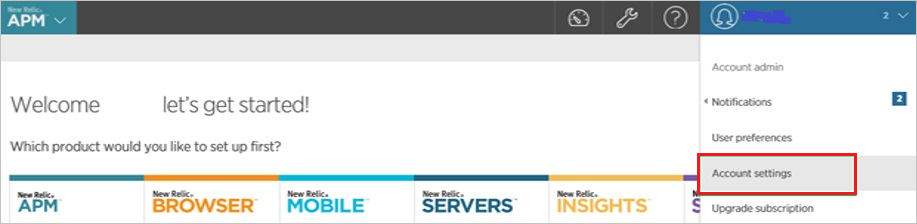

# Tutorial: Azure Active Directory single sign-on (SSO) integration with New Relic by Account

In this tutorial, you'll learn how to integrate New Relic by Account with Azure Active Directory (Azure AD). When you integrate New Relic by Account with Azure AD, you can:

* Control in Azure AD who has access to New Relic by Account.
* Enable your users to be automatically signed-in to New Relic by Account with their Azure AD accounts.
* Manage your accounts in one central location - the Azure portal.

To learn more about SaaS app integration with Azure AD, see [What is application access and single sign-on with Azure Active Directory](https://docs.microsoft.com/azure/active-directory/active-directory-appssoaccess-whatis).

## Prerequisites

To get started, you need the following items:

* An Azure AD subscription. If you don't have a subscription, you can get a [free account](https://azure.microsoft.com/free/).
* New Relic by Account single sign-on (SSO) enabled subscription.

## Scenario description

In this tutorial, you configure and test Azure AD SSO in a test environment.

* New Relic by Account supports **SP** initiated SSO

* Once you configure the New Relic by Account you can enforce session controls, which protect exfiltration and infiltration of your organization’s sensitive data in real-time. Session controls extend from Conditional Access. [Learn how to enforce session control with Microsoft Cloud App Security](https://docs.microsoft.com/cloud-app-security/proxy-deployment-any-app).

## Adding New Relic by Account from the gallery

To configure the integration of New Relic by Account into Azure AD, you need to add New Relic by Account from the gallery to your list of managed SaaS apps.

1. Sign in to the [Azure portal](https://portal.azure.com) using either a work or school account, or a personal Microsoft account.
1. On the left navigation pane, select the **Azure Active Directory** service.
1. Navigate to **Enterprise Applications** and then select **All Applications**.
1. To add new application, select **New application**.
1. In the **Add from the gallery** section, type **New Relic by Account** in the search box.
1. Select **New Relic by Account** from results panel and then add the app. Wait a few seconds while the app is added to your tenant.

## Configure and test Azure AD single sign-on for New Relic by Account

Configure and test Azure AD SSO with New Relic by Account using a test user called **B.Simon**. For SSO to work, you need to establish a link relationship between an Azure AD user and the related user in New Relic by Account.

To configure and test Azure AD SSO with New Relic by Account, complete the following building blocks:

1. **[Configure Azure AD SSO](#configure-azure-ad-sso)** - to enable your users to use this feature.
    * **[Create an Azure AD test user](#create-an-azure-ad-test-user)** - to test Azure AD single sign-on with B.Simon.
    * **[Assign the Azure AD test user](#assign-the-azure-ad-test-user)** - to enable B.Simon to use Azure AD single sign-on.
1. **[Configure New Relic by Account SSO](#configure-new-relic-by-account-sso)** - to configure the single sign-on settings on application side.
    * **[Create New Relic by Account test user](#create-new-relic-by-account-test-user)** - to have a counterpart of B.Simon in New Relic by Account that is linked to the Azure AD representation of user.
1. **[Test SSO](#test-sso)** - to verify whether the configuration works.

## Configure Azure AD SSO

Follow these steps to enable Azure AD SSO in the Azure portal.

1. In the [Azure portal](https://portal.azure.com/), on the **New Relic by Account** application integration page, find the **Manage** section and select **single sign-on**.
1. On the **Select a single sign-on method** page, select **SAML**.
1. On the **Set up single sign-on with SAML** page, click the edit/pen icon for **Basic SAML Configuration** to edit the settings.

   
1. On the **Basic SAML Configuration** section, perform the following steps:

	a. In the **Sign on URL** text box, type a URL using the following pattern:

    `https://rpm.newrelic.com/accounts/{acc_id}/sso/saml/login` - Be sure to substitute `acc_id` with your own Account ID of New Relic by Account.

    b. In the **Identifier (Entity ID)** text box, type a URL:
    `rpm.newrelic.com`

1. On the **Set up Single Sign-On with SAML** page, in the **SAML Signing Certificate** section, click **Download** to download the **Certificate (Base64)** from the given options as per your requirement and save it on your computer.

	

1. On the **Set up New Relic by Account** section, copy the appropriate URL(s) as per your requirement.

	

	a. Login URL

	b. Azure Ad Identifier

	c. Logout URL

### Create an Azure AD test user

In this section, you'll create a test user in the Azure portal called B.Simon.

1. From the left pane in the Azure portal, select **Azure Active Directory**, select **Users**, and then select **All users**.
1. Select **New user** at the top of the screen.
1. In the **User** properties, follow these steps:
   1. In the **Name** field, enter `B.Simon`.  
   1. In the **User name** field, enter the username@companydomain.extension. For example, `B.Simon@contoso.com`.
   1. Select the **Show password** check box, and then write down the value that's displayed in the **Password** box.
   1. Click **Create**.

### Assign the Azure AD test user

In this section, you'll enable B.Simon to use Azure single sign-on by granting access to New Relic by Account.

1. In the Azure portal, select **Enterprise Applications**, and then select **All applications**.
1. In the applications list, select **New Relic by Account**.
1. In the app's overview page, find the **Manage** section and select **Users and groups**.

   

1. Select **Add user**, then select **Users and groups** in the **Add Assignment** dialog.

	

1. In the **Users and groups** dialog, select **B.Simon** from the Users list, then click the **Select** button at the bottom of the screen.
1. If you're expecting any role value in the SAML assertion, in the **Select Role** dialog, select the appropriate role for the user from the list and then click the **Select** button at the bottom of the screen.
1. In the **Add Assignment** dialog, click the **Assign** button.

## Configure New Relic by Account SSO

1. In a different web browser window, sign on to your **New Relic by Account** company site as administrator.

2. In the menu on the top, click **Account Settings**.
   
    

3. Click the **Security and authentication** tab, and then click the **Single sign on** tab.
   
    

4. On the SAML dialog page, perform the following steps:
   
    
   
    a. Click **Choose File** to upload your downloaded Azure Active Directory certificate.

    b. In the **Remote login URL** textbox,  paste the value of **Login URL**, which you have copied from Azure portal.
   
    c. In the **Logout landing URL** textbox, paste the value of **Logout URL**, which you have copied from Azure portal.

    d. Click **Save my changes**.

### Create New Relic by Account test user

1. Sign into your **New Relic by Account** company site as administrator.

2. In the menu on the top, click **Account Settings**.
   
    

3. In the **Account** pane on the left side, click **Summary**, and then click **Add user**.
   
    

4. On the **Active users** dialog, perform the following steps:
   
    
   
    a. In the **Email** textbox, type the email address of a valid Azure Active Directory user you want to provision.

    b. As **Role** select **User**.

    c. Click **Add this user**.

> [!NOTE]
> You can use any other New Relic by Account user account creation tools or APIs provided by New Relic by Account to provision Azure AD user accounts.

## Test SSO 

In this section, you test your Azure AD single sign-on configuration using the Access Panel.

When you click the New Relic by Account tile in the Access Panel, you should be automatically signed in to the New Relic by Account for which you set up SSO. For more information about the Access Panel, see [Introduction to the Access Panel](https://docs.microsoft.com/azure/active-directory/active-directory-saas-access-panel-introduction).

## Additional resources

- [ List of Tutorials on How to Integrate SaaS Apps with Azure Active Directory ](https://docs.microsoft.com/azure/active-directory/active-directory-saas-tutorial-list)

- [What is application access and single sign-on with Azure Active Directory? ](https://docs.microsoft.com/azure/active-directory/active-directory-appssoaccess-whatis)

- [What is conditional access in Azure Active Directory?](https://docs.microsoft.com/azure/active-directory/conditional-access/overview)

- [Try New Relic by Account with Azure AD](https://aad.portal.azure.com/)

- [What is session control in Microsoft Cloud App Security?](https://docs.microsoft.com/cloud-app-security/proxy-intro-aad)