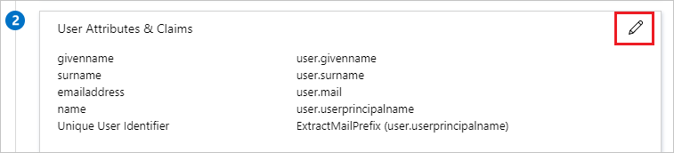
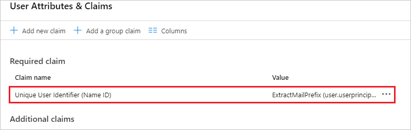
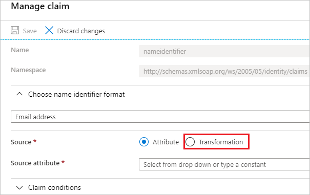
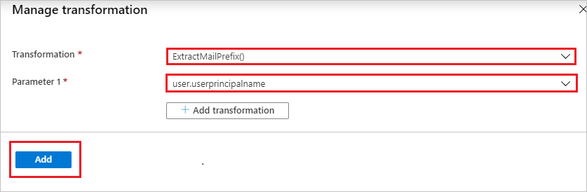

# Tutorial: Azure Active Directory single sign-on (SSO) integration with NS1 SSO for Azure

In this tutorial, you'll learn how to integrate NS1 SSO for Azure with Azure Active Directory (Azure AD). When you integrate NS1 SSO for Azure with Azure AD, you can:

* Control in Azure AD who has access to NS1 SSO for Azure.
* Enable your users to be automatically signed in to NS1 SSO for Azure with their Azure AD accounts.
* Manage your accounts in one central location, the Azure portal.

To learn more about software as a service (SaaS) app integration with Azure AD, see [What is application access and single sign-on with Azure Active Directory](https://docs.microsoft.com/azure/active-directory/manage-apps/what-is-single-sign-on).

## Prerequisites

To get started, you need the following items:

* An Azure AD subscription. If you don't have a subscription, you can get a [free account](https://azure.microsoft.com/free/).
* NS1 SSO for Azure single sign-on (SSO) enabled subscription.

## Scenario description

In this tutorial, you configure and test Azure AD SSO in a test environment.

* NS1 SSO for Azure supports SP and IDP initiated SSO.
* After you configure NS1 SSO for Azure, you can enforce session control. This protects exfiltration and infiltration of your organization’s sensitive data in real time. Session control extends from conditional access. [Learn how to enforce session control with Microsoft Cloud App Security](https://docs.microsoft.com/cloud-app-security/proxy-deployment-any-app).

## Add NS1 SSO for Azure from the gallery

To configure the integration of NS1 SSO for Azure into Azure AD, you need to add NS1 SSO for Azure from the gallery to your list of managed SaaS apps.

1. Sign in to the [Azure portal](https://portal.azure.com) by using either a work or school account, or a personal Microsoft account.
1. On the left navigation pane, select the **Azure Active Directory** service.
1. Go to **Enterprise Applications**, and then select **All Applications**.
1. To add a new application, select **New application**.
1. In the **Add from the gallery** section, type **NS1 SSO for Azure** in the search box.
1. Select **NS1 SSO for Azure** from the results panel, and then add the app. Wait a few seconds while the app is added to your tenant.

## Configure and test Azure AD single sign-on for NS1 SSO for Azure

Configure and test Azure AD SSO with NS1 SSO for Azure by using a test user called **B.Simon**. For SSO to work, establish a linked relationship between an Azure AD user and the related user in NS1 SSO for Azure.

Here are the general steps to configure and test Azure AD SSO with NS1 SSO for Azure:

1. **[Configure Azure AD SSO](#configure-azure-ad-sso)** to enable your users to use this feature.

    a. **[Create an Azure AD test user](#create-an-azure-ad-test-user)** to test Azure AD single sign-on with B.Simon.

    b. **[Assign the Azure AD test user](#assign-the-azure-ad-test-user)** to enable B.Simon to use Azure AD single sign-on.
1. **[Configure NS1 SSO for Azure SSO](#configure-ns1-sso-for-azure-sso)** to configure the single sign-on settings on the application side.

    a. **[Create an NS1 SSO for Azure test user](#create-an-ns1-sso-for-azure-test-user)** to have a counterpart of B.Simon in NS1 SSO for Azure. This counterpart is linked to the Azure AD representation of the user.
1. **[Test SSO](#test-sso)** to verify whether the configuration works.

## Configure Azure AD SSO

Follow these steps to enable Azure AD SSO in the Azure portal.

1. In the [Azure portal](https://portal.azure.com/), on the **NS1 SSO for Azure** application integration page, find the **Manage** section. Select **single sign-on**.
1. On the **Select a single sign-on method** page, select **SAML**.
1. On the **Set up single sign-on with SAML** page, select the pencil icon for **Basic SAML Configuration** to edit the settings.

   

1. In the **Basic SAML Configuration** section, if you want to configure the application in **IDP** initiated mode, enter the values for the following fields:

    a. In the **Identifier** text box, type the following URL:
    `https://api.nsone.net/saml/metadata`

    b. In the **Reply URL** text box, type a URL that uses the following pattern:
    `https://api.nsone.net/saml/sso/<ssoid>`

1. Select **Set additional URLs**, and perform the following step if you want to configure the application in **SP** initiated mode:

    In the **Sign-on URL** text box, type the following URL:
    `https://my.nsone.net/#/login/sso`

	> [!NOTE]
	> The Reply URL value isn't real. Update Reply URL value with the actual Reply URL. Contact the [NS1 SSO for Azure Client support team](mailto:techops@nsone.net) to get the value. You can also refer to the patterns shown in the **Basic SAML Configuration** section in the Azure portal.

1. The NS1 SSO for Azure application expects the SAML assertions in a specific format. Configure the following claims for this application. You can manage the values of these attributes from the **User Attributes & Claims** section on the application integration page. On the **Set up Single Sign-On with SAML** page, select the pencil icon to open the **User Attributes** dialog box.

    

1. Select the attribute name to edit the claim.

    

1. Select **Transformation**.

    

1. In the **Manage transformation** section, perform the following steps:

    

    1. Select **ExactMailPrefix()** as **Transformation**.

    1. Select **user.userprincipalname** as **Parameter 1**.

    1. Select **Add**.

    1. Select **Save**.

1. On the **Set up single sign-on with SAML** page, in the **SAML Signing Certificate** section, select the copy button. This copies the **App Federation Metadata Url** and saves it on your computer.

	

### Create an Azure AD test user

In this section, you create a test user in the Azure portal called B.Simon.

1. From the left pane in the Azure portal, select **Azure Active Directory** > **Users** > **All users**.
1. Select **New user** at the top of the screen.
1. In the **User** properties, follow these steps:

   1. In the **Name** field, enter `B.Simon`.  
   1. In the **User name** field, enter the username@companydomain.extension. For example, `B.Simon@contoso.com`.
   1. Select the **Show password** check box, and then write down the value that's shown in the **Password** field.
   1. Select **Create**.

### Assign the Azure AD test user

In this section, you enable B.Simon to use Azure single sign-on by granting access to NS1 SSO for Azure.

1. In the Azure portal, select **Enterprise Applications** > **All applications**.
1. In the applications list, select **NS1 SSO for Azure**.
1. In the app's overview page, find the **Manage** section, and select **Users and groups**.

   

1. Select **Add user**. In the **Add Assignment** dialog box, select **Users and groups**.

	

1. In the **Users and groups** dialog box, select **B.Simon** from the users list. Then choose the **Select** button at the bottom of the screen.
1. If you're expecting any role value in the SAML assertion, in the **Select Role** dialog box, select the appropriate role for the user from the list. Then choose the **Select** button at the bottom of the screen.
1. In the **Add Assignment** dialog box, select **Assign**.

## Configure NS1 SSO for Azure SSO

To configure single sign-on on the NS1 SSO for Azure side, you need to send the App Federation Metadata URL to the [NS1 SSO for Azure support team](mailto:techops@nsone.net). They configure this setting to have the SAML SSO connection set properly on both sides.

### Create an NS1 SSO for Azure test user

In this section, you create a user called B.Simon in NS1 SSO for Azure. Work with the NS1 SSO for Azure support team to add the users in the NS1 SSO for Azure platform. You can't use single sign-on until you create and activate users.

## Test SSO 

In this section, you test your Azure AD single sign-on configuration by using Access Panel.

When you select the NS1 SSO for Azure tile in Access Panel, you should be automatically signed in to the NS1 SSO for Azure for which you set up SSO. For more information, see [Introduction to Access Panel](https://docs.microsoft.com/azure/active-directory/active-directory-saas-access-panel-introduction).

## Additional resources

- [Tutorials for integrating SaaS applications with Azure Active Directory](https://docs.microsoft.com/azure/active-directory/active-directory-saas-tutorial-list)

- [What is application access and single sign-on with Azure Active Directory?](https://docs.microsoft.com/azure/active-directory/manage-apps/what-is-single-sign-on)

- [What is conditional access in Azure Active Directory?](https://docs.microsoft.com/azure/active-directory/conditional-access/overview)

- [Try NS1 SSO for Azure with Azure AD](https://aad.portal.azure.com/)

- [What is session control in Microsoft Cloud App Security?](https://docs.microsoft.com/cloud-app-security/proxy-intro-aad)