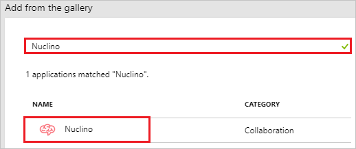
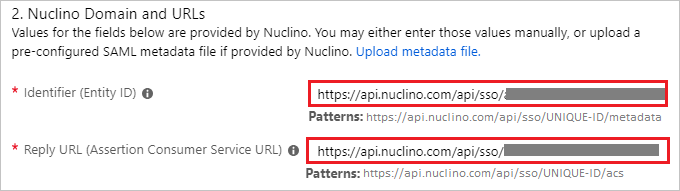
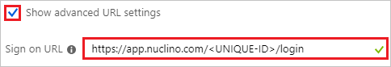
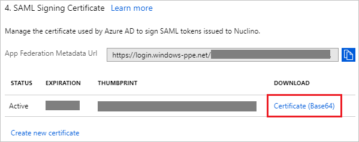
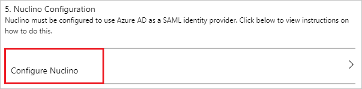
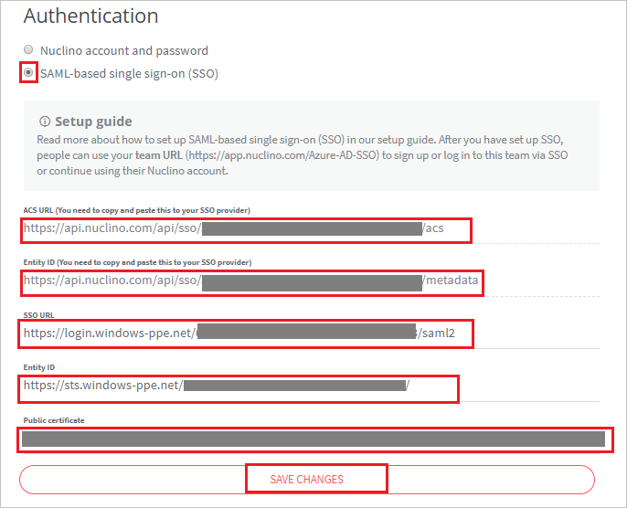
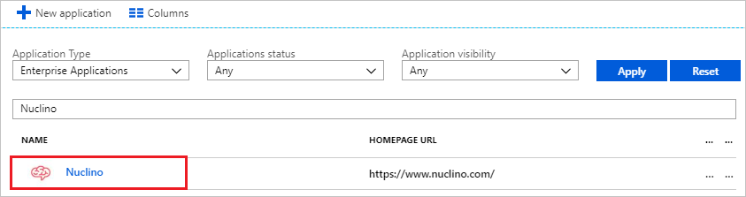

# Tutorial: Azure Active Directory integration with Nuclino

In this tutorial, you learn how to integrate Nuclino with Azure Active Directory (Azure AD).

Integrating Nuclino with Azure AD provides you with the following benefits:

- You can control in Azure AD who has access to Nuclino.
- You can enable your users to automatically get signed-on to Nuclino (Single Sign-On) with their Azure AD accounts.
- You can manage your accounts in one central location - the Azure portal.

If you want to know more details about SaaS app integration with Azure AD, see [what is application access and single sign-on with Azure Active Directory](../manage-apps/what-is-single-sign-on.md)

## Prerequisites

To configure Azure AD integration with Nuclino, you need the following items:

- An Azure AD subscription
- A Nuclino single sign-on enabled subscription

> [!NOTE]
> To test the steps in this tutorial, we do not recommend using a production environment.

To test the steps in this tutorial, you should follow these recommendations:

- Do not use your production environment, unless it is necessary.
- If you don't have an Azure AD trial environment, you can [get a one-month trial](https://azure.microsoft.com/pricing/free-trial/).

## Scenario description

In this tutorial, you test Azure AD single sign-on in a test environment. 
The scenario outlined in this tutorial consists of two main building blocks:

1. Adding Nuclino from the gallery
2. Configuring and testing Azure AD single sign-on

## Adding Nuclino from the gallery

To configure the integration of Nuclino into Azure AD, you need to add Nuclino from the gallery to your list of managed SaaS apps.

**To add Nuclino from the gallery, perform the following steps:**

1. In the **[Azure portal](https://portal.azure.com)**, on the left navigation panel, click **Azure Active Directory** icon. 

	![The Azure Active Directory button][1]

2. Navigate to **Enterprise applications**. Then go to **All applications**.

	![The Enterprise applications blade][2]

3. To add new application, click **New application** button on the top of dialog.

	![The New application button][3]

4. In the search box, type **Nuclino**, select **Nuclino** from result panel then click **Add** button to add the application.

	

## Configure and test Azure AD single sign-on

In this section, you configure and test Azure AD single sign-on with Nuclino based on a test user called "Britta Simon".

For single sign-on to work, Azure AD needs to know what the counterpart user in Nuclino is to a user in Azure AD. In other words, a link relationship between an Azure AD user and the related user in Nuclino needs to be established.

To configure and test Azure AD single sign-on with Nuclino, you need to complete the following building blocks:

1. **[Configure Azure AD Single Sign-On](#configure-azure-ad-single-sign-on)** - to enable your users to use this feature.
2. **[Create an Azure AD test user](#create-an-azure-ad-test-user)** - to test Azure AD single sign-on with Britta Simon.
3. **[Create a Nuclino test user](#create-a-nuclino-test-user)** - to have a counterpart of Britta Simon in Nuclino that is linked to the Azure AD representation of user.
4. **[Assign the Azure AD test user](#assign-the-azure-ad-test-user)** - to enable Britta Simon to use Azure AD single sign-on.
5. **[Test single sign-on](#test-single-sign-on)** - to verify whether the configuration works.

### Configure Azure AD single sign-on

In this section, you enable Azure AD single sign-on in the Azure portal and configure single sign-on in your Nuclino application.

**To configure Azure AD single sign-on with Nuclino, perform the following steps:**

1. In the Azure portal, on the **Nuclino** application integration page, click **Single sign-on**.

	![Configure single sign-on link][4]

2. On the **Single sign-on** dialog, select **Mode** as	**SAML-based Sign-on** to enable single sign-on.

	

3. On the **Nuclino Domain and URLs** section, perform the following steps if you wish to configure the application in **IDP** initiated mode:

	

    a. In the **Identifier** textbox, type a URL using the following pattern: `https://api.nuclino.com/api/sso/<UNIQUE-ID>/metadata`

	b. In the **Reply URL** textbox, type a URL using the following pattern: `https://api.nuclino.com/api/sso/<UNIQUE-ID>/acs`

	> [!NOTE]
	> These values are not real. Update these values with the actual Identifier and Reply URL from the **Authentication** section, which is explained later in this tutorial.

4. Check **Show advanced URL settings** and perform the following step if you wish to configure the application in **SP** initiated mode:

	

    In the **Sign-on URL** textbox, type a URL using the following pattern: `https://app.nuclino.com/<UNIQUE-ID>/login`

	> [!NOTE]
	> This value is not real. Update this value with the actual Sign-On URL. Contact [Nuclino Client support team](mailto:contact@nuclino.com) to get this value.

5. Nuclino application expects the SAML assertions in a specific format. Please configure the following claims for this application. You can manage the values of these attributes from the "**User Attributes**" section on application integration page. The following screenshot shows an example for this.

	

6. Click **View and edit all other user attributes** checkbox in the **User Attributes** section to expand the attributes. Perform the following steps on each of the displayed attributes-

	| Attribute Name | Attribute Value |
	| ---------------| --------------- |
	| first_name | user.givenname |
	| last_name | user.surname |

	a. Click **Add attribute** to open the **Add Attribute** dialog.

	

	

	b. In the **Name** textbox, type the **attribute name** shown for that row.

	c. From the **Value** list, type the attribute value shown for that row.

	d. Click **Ok**.

7. On the **SAML Signing Certificate** section, click **Certificate (Base64)** and then save the certificate file on your computer.

	

8. Click **Save** button.

	

9. On the **Nuclino Configuration** section, click **Configure Nuclino** to open **Configure sign-on** window. Copy the **SAML Entity ID and SAML Single Sign-On Service URL** from the **Quick Reference section.**

	

10. In a different web browser window, sign in to your Nuclino company site as an administrator.

11. Click on the **ICON**.

	

12. Click on the **Azure AD SSO** and select **Team settings** from the dropdown.

	

13. Select **Authentication** from left navigation pane.

	

14. In the **Authentication** section, perform the following steps:

	

	a. Select **SAML-based single sign-on (SSO)**.

	b. Copy **ACS URL (You need to copy and paste this to your SSO provider)** value and paste it into the **Reply URL** textbox of the **Nuclino Domain and URLs** section in the Azure portal.

	c. Copy **Entity ID (You need to copy and paste this to your SSO provider)** value and paste it into the **Identifier** textbox of the **Nuclino Domain and URLs** section in the Azure portal.

	d. In the **SSO URL** textbox, paste the **SAML Single Sign-On Service URL** value which you have copied from the Azure portal.

	e. In the **Entity ID** textbox, paste the **SAML Entity ID** value which you have copied from the Azure portal.

	f. Open your downloaded **Certificate(Base64)** file in Notepad. Copy the content of it into your clipboard, and then paste it to the **Public certificate** text box.

	g. Click **SAVE CHANGES**.

### Create an Azure AD test user

The objective of this section is to create a test user in the Azure portal called Britta Simon.

   ![Create an Azure AD test user][100]

**To create a test user in Azure AD, perform the following steps:**

1. In the Azure portal, in the left pane, click the **Azure Active Directory** button.

    

2. To display the list of users, go to **Users and groups**, and then click **All users**.

    

3. To open the **User** dialog box, click **Add** at the top of the **All Users** dialog box.

    

4. In the **User** dialog box, perform the following steps:

    

    a. In the **Name** box, type **BrittaSimon**.

    b. In the **User name** box, type the email address of user Britta Simon.

    c. Select the **Show Password** check box, and then write down the value that's displayed in the **Password** box.

    d. Click **Create**.

### Create a Nuclino test user

The objective of this section is to create a user called Britta Simon in Nuclino. Nuclino supports just-in-time provisioning, which is by default enabled. There is no action item for you in this section. A new user is created during an attempt to access Nuclino if it doesn't exist yet.

> [!Note]
> If you need to create a user manually, contact [Nuclino support team](mailto:contact@nuclino.com).

### Assign the Azure AD test user

In this section, you enable Britta Simon to use Azure single sign-on by granting access to Nuclino.

![Assign the user role][200]

**To assign Britta Simon to Nuclino, perform the following steps:**

1. In the Azure portal, open the applications view, and then navigate to the directory view and go to **Enterprise applications** then click **All applications**.

	![Assign User][201]

2. In the applications list, select **Nuclino**.

	  

3. In the menu on the left, click **Users and groups**.

	![The "Users and groups" link][202]

4. Click **Add** button. Then select **Users and groups** on **Add Assignment** dialog.

	![The Add Assignment pane][203]

5. On **Users and groups** dialog, select **Britta Simon** in the Users list.

6. Click **Select** button on **Users and groups** dialog.

7. Click **Assign** button on **Add Assignment** dialog.

### Test single sign-on

In this section, you test your Azure AD single sign-on configuration using the Access Panel.

When you click the Nuclino tile in the Access Panel, you should get automatically signed-on to your Nuclino application.
For more information about the Access Panel, see [Introduction to the Access Panel](../user-help/active-directory-saas-access-panel-introduction.md).

## Additional resources

* [List of Tutorials on How to Integrate SaaS Apps with Azure Active Directory](tutorial-list.md)
* [What is application access and single sign-on with Azure Active Directory?](../manage-apps/what-is-single-sign-on.md)

<!--Image references-->

[1]: ./media/nuclino-tutorial/tutorial_general_01.png
[2]: ./media/nuclino-tutorial/tutorial_general_02.png
[3]: ./media/nuclino-tutorial/tutorial_general_03.png
[4]: ./media/nuclino-tutorial/tutorial_general_04.png

[100]: ./media/nuclino-tutorial/tutorial_general_100.png

[200]: ./media/nuclino-tutorial/tutorial_general_200.png
[201]: ./media/nuclino-tutorial/tutorial_general_201.png
[202]: ./media/nuclino-tutorial/tutorial_general_202.png
[203]: ./media/nuclino-tutorial/tutorial_general_203.png