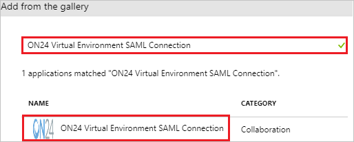
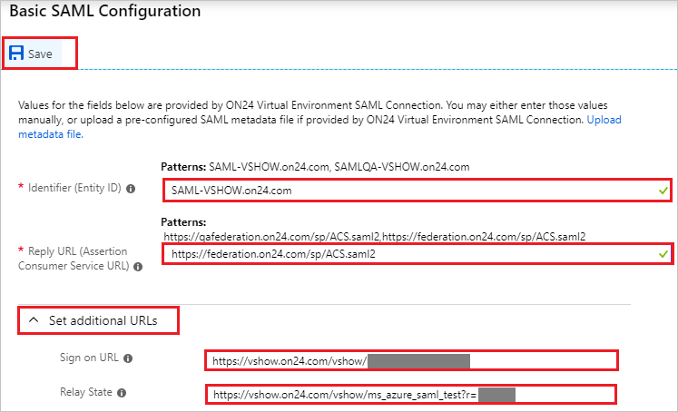
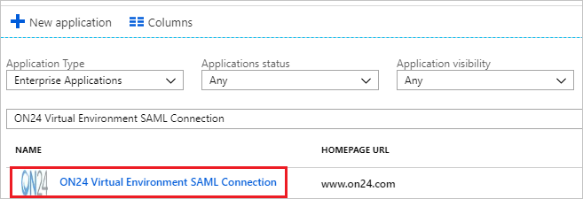

# Tutorial: Azure Active Directory integration with ON24 Virtual Environment SAML Connection

In this tutorial, you learn how to integrate ON24 Virtual Environment SAML Connection with Azure Active Directory (Azure AD).

Integrating ON24 Virtual Environment SAML Connection with Azure AD provides you with the following benefits:

- You can control in Azure AD who has access to ON24 Virtual Environment SAML Connection.
- You can enable your users to automatically get signed-on to ON24 Virtual Environment SAML Connection (Single Sign-On) with their Azure AD accounts.
- You can manage your accounts in one central location - the Azure portal.

If you want to know more details about SaaS app integration with Azure AD, see [what is application access and single sign-on with Azure Active Directory](../manage-apps/what-is-single-sign-on.md).

## Prerequisites

To configure Azure AD integration with ON24 Virtual Environment SAML Connection, you need the following items:

- An Azure AD subscription
- A ON24 Virtual Environment SAML Connection single sign-on enabled subscription

> [!NOTE]
> To test the steps in this tutorial, we do not recommend using a production environment.

To test the steps in this tutorial, you should follow these recommendations:

- Do not use your production environment, unless it is necessary.
- If you don't have an Azure AD trial environment, you can [get a one-month trial](https://azure.microsoft.com/pricing/free-trial/).

## Scenario description
In this tutorial, you test Azure AD single sign-on in a test environment. 
The scenario outlined in this tutorial consists of two main building blocks:

1. Adding ON24 Virtual Environment SAML Connection from the gallery
2. Configuring and testing Azure AD single sign-on

## Adding ON24 Virtual Environment SAML Connection from the gallery
To configure the integration of ON24 Virtual Environment SAML Connection into Azure AD, you need to add ON24 Virtual Environment SAML Connection from the gallery to your list of managed SaaS apps.

**To add ON24 Virtual Environment SAML Connection from the gallery, perform the following steps:**

1. In the **[Azure portal](https://portal.azure.com)**, on the left navigation panel, click **Azure Active Directory** icon. 

	

2. Navigate to **Enterprise applications**. Then go to **All applications**.

	
	
3. To add new application, click **New application** button on the top of dialog.

	

4. In the search box, type **ON24 Virtual Environment SAML Connection**, select **ON24 Virtual Environment SAML Connection** from result panel then click **Add** button to add the application.

	 

## Configure and test Azure AD single sign-on

In this section, you configure and test Azure AD single sign-on with ON24 Virtual Environment SAML Connection based on a test user called "Britta Simon".

For single sign-on to work, Azure AD needs to know what the counterpart user in ON24 Virtual Environment SAML Connection is to a user in Azure AD. In other words, a link relationship between an Azure AD user and the related user in ON24 Virtual Environment SAML Connection needs to be established.

To configure and test Azure AD single sign-on with ON24 Virtual Environment SAML Connection, you need to complete the following building blocks:

1. **[Configure Azure AD Single Sign-On](#configure-azure-ad-single-sign-on)** - to enable your users to use this feature.
2. **[Create an Azure AD test user](#create-an-azure-ad-test-user)** - to test Azure AD single sign-on with Britta Simon.
3. **[Create an ON24 Virtual Environment SAML Connection test user](#create-an-on24-virtual-environment-saml-connection-test-user)** - to have a counterpart of Britta Simon in ON24 Virtual Environment SAML Connection that is linked to the Azure AD representation of user.
4. **[Assign the Azure AD test user](#assign-the-azure-ad-test-user)** - to enable Britta Simon to use Azure AD single sign-on.
5. **[Test single sign-on](#test-single-sign-on)** - to verify whether the configuration works.

### Configure Azure AD single sign-on

In this section, you enable Azure AD single sign-on in the Azure portal and configure single sign-on in your ON24 Virtual Environment SAML Connection application.

**To configure Azure AD single sign-on with ON24 Virtual Environment SAML Connection, perform the following steps:**

1. In the [Azure portal](https://portal.azure.com/), on the **ON24 Virtual Environment SAML Connection** application integration page, select **Single sign-on**.

    

2. Click **Change single sign-on mode** on top of the screen to select the **SAML** mode.

	  

3. On the **Select a Single sign-on method** dialog, select **SAML** mode to enable single sign-on.

    

4. On the **Set up Single Sign-On with SAML** page, click **Edit** button to open **Basic SAML Configuration** dialog.

	

5. On the **Basic SAML Configuration** section perform the following steps, if you wish to configure the application in **IDP** intiated mode:

    

	a. In the **Identifier** text box, type a URL:

	 **Production Environment URL**
    
	`SAML-VSHOW.on24.com`

	`SAML-Gateway.on24.com` 

	`SAP PROD SAML-EliteAudience.on24.com` 
                
	 **QA Environment URL**
    
	`SAMLQA-VSHOW.on24.com` 

	`SAMLQA-Gateway.on24.com` 

	`SAMLQA-EliteAudience.on24.com`
 
	b. In the **Reply URL** text box, type a URL:
    
	 **Production Environment URL**
    
	`https://federation.on24.com/sp/ACS.saml2`

	`https://federation.on24.com/sp/eyJ2c2lkIjoiU0FNTC1WU2hvdy5vbjI0LmNvbSJ9/ACS.saml2`

	`https://federation.on24.com/sp/eyJ2c2lkIjoiU0FNTC1HYXRld2F5Lm9uMjQuY29tIn0/ACS.saml2`

	`https://federation.on24.com/sp/eyJ2c2lkIjoiU0FNTC1FbGl0ZUF1ZGllbmNlLm9uMjQuY29tIn0/ACS.saml2`

	 **QA Environment URL**
    
	`https://qafederation.on24.com/sp/ACS.saml2`

	`https://qafederation.on24.com/sp/eyJ2c2lkIjoiU0FNTFFBLVZzaG93Lm9uMjQuY29tIn0/ACS.saml2`

	`https://qafederation.on24.com/sp/eyJ2c2lkIjoiU0FNTFFBLUdhdGV3YXkub24yNC5jb20ifQ/ACS.saml2`
     
	`https://qafederation.on24.com/sp/eyJ2c2lkIjoiU0FNTFFBLUVsaXRlQXVkaWVuY2Uub24yNC5jb20ifQ/ACS.saml2` 

    c. Click **Set additional URLs**. 

	d. In the **Relay State** text box, type a URL: `https://vshow.on24.com/vshow/ms_azure_saml_test?r=<ID>`

    e. If you wish to configure the application in **SP** intiated mode, in the **Sign-on URL** text box, type a URL:
    `https://vshow.on24.com/vshow/<INSTANCENAME>`

6. On the **Set up Single Sign-On with SAML** page, in the **SAML Signing Certificate** section, click **Download** to download the appropriate certificate as per your requirement and save it on your computer.

	 

7. To configure single sign-on on **ON24 Virtual Environment SAML Connection** side, you need to send the certificate/metadata which you have downloaded from Azure portal to [ON24 Virtual Environment SAML Connection support team](https://www.on24.com/about-us/support/). They set this setting to have the SAML SSO connection set properly on both sides.

### Create an Azure AD test user

The objective of this section is to create a test user in the Azure portal called Britta Simon.

1. In the Azure portal, in the left pane, select **Azure Active Directory**, select **Users**, and then select **All users**.

    

2. Select **New user** at the top of the screen.

    

3. In the User properties, perform the following steps.

    

    a. In the **Name** field enter **BrittaSimon**.
  
    b. In the **User name** field type **brittasimon@yourcompanydomain.extension**  
    For example, BrittaSimon@contoso.com

    c. Select **Properties**, select the **Show password** check box, and then write down the value that's displayed in the Password box.

    d. Select **Create**.
 
### Create an ON24 Virtual Environment SAML Connection test user

In this section, you create a user called Britta Simon in ON24 Virtual Environment SAML Connection. Work with [ON24 Virtual Environment SAML Connection support team](https://www.on24.com/about-us/support/) to add the users in the ON24 Virtual Environment SAML Connection platform. Users must be created and activated before you use single sign-on.

### Assign the Azure AD test user

In this section, you enable Britta Simon to use Azure single sign-on by granting access to ON24 Virtual Environment SAML Connection.

1. In the Azure portal, select **Enterprise Applications**, select **All applications**.

	

2. In the applications list, select **ON24 Virtual Environment SAML Connection**.

	

3. In the menu on the left, select **Users and groups**.

    

4. Select the **Add** button, then select **Users and groups** in the **Add Assignment** dialog.

    

4. In the **Users and groups** dialog select **Britta Simon** in the Users list, then click the **Select** button at the bottom of the screen.

5. In the **Add Assignment** dialog select the **Assign** button.
	
### Test single sign-on

In this section, you test your Azure AD single sign-on configuration using the Access Panel.

When you click the ON24 Virtual Environment SAML Connection tile in the Access Panel, you should get automatically signed-on to your ON24 Virtual Environment SAML Connection application.
For more information about the Access Panel, see [Introduction to the Access Panel](../active-directory-saas-access-panel-introduction.md). 

## Additional resources

* [List of Tutorials on How to Integrate SaaS Apps with Azure Active Directory](tutorial-list.md)
* [What is application access and single sign-on with Azure Active Directory?](../manage-apps/what-is-single-sign-on.md)

