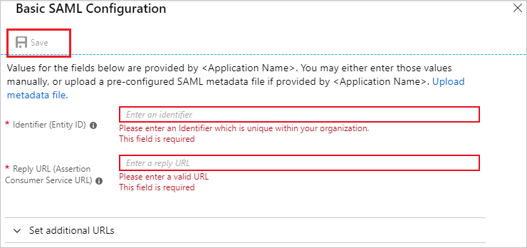

# Tutorial: Microsoft Entra integration with OnTrack

In this tutorial, you learn how to integrate OnTrack with Microsoft Entra ID.
Integrating OnTrack with Microsoft Entra ID provides you with the following benefits:

* You can control in Microsoft Entra ID who has access to OnTrack.
* You can enable your users to be automatically signed-in to OnTrack (Single Sign-On) with their Microsoft Entra accounts.
* You can manage your accounts in one central location.

If you want to know more details about SaaS app integration with Microsoft Entra ID, see [What is application access and single sign-on with Microsoft Entra ID](../manage-apps/what-is-single-sign-on.md).
If you don't have an Azure subscription, [create a free account](https://azure.microsoft.com/free/) before you begin.

## Prerequisites

To configure Microsoft Entra integration with OnTrack, you need the following items:

* A Microsoft Entra subscription. If you don't have a Microsoft Entra environment, you can get one-month trial [here](https://azure.microsoft.com/pricing/free-trial/)
* OnTrack single sign-on enabled subscription

## Scenario description

In this tutorial, you configure and test Microsoft Entra single sign-on in a test environment.

* OnTrack supports **IDP** initiated SSO

## Adding OnTrack from the gallery

To configure the integration of OnTrack into Microsoft Entra ID, you need to add OnTrack from the gallery to your list of managed SaaS apps.

**To add OnTrack from the gallery, perform the following steps:**

1. Sign in to the [Microsoft Entra admin center](https://entra.microsoft.com) as at least a [Cloud Application Administrator](../roles/permissions-reference.md#cloud-application-administrator).
1. Browse to **Identity** > **Applications** > **Enterprise applications** > **New application**.
1. In the search box, type **OnTrack**, select **OnTrack** from result panel then click **Add** button to add the application.

	 

## Configure and test Microsoft Entra single sign-on

In this section, you configure and test Microsoft Entra single sign-on with OnTrack based on a test user called **Britta Simon**.
For single sign-on to work, a link relationship between a Microsoft Entra user and the related user in OnTrack needs to be established.

To configure and test Microsoft Entra single sign-on with OnTrack, you need to complete the following building blocks:

1. **[Configure Microsoft Entra Single Sign-On](#configure-azure-ad-single-sign-on)** - to enable your users to use this feature.
2. **[Configure OnTrack Single Sign-On](#configure-ontrack-single-sign-on)** - to configure the Single Sign-On settings on application side.
3. **[Create a Microsoft Entra test user](#create-an-azure-ad-test-user)** - to test Microsoft Entra single sign-on with Britta Simon.
4. **[Assign the Microsoft Entra test user](#assign-the-azure-ad-test-user)** - to enable Britta Simon to use Microsoft Entra single sign-on.
5. **[Create OnTrack test user](#create-ontrack-test-user)** - to have a counterpart of Britta Simon in OnTrack that is linked to the Microsoft Entra representation of user.
6. **[Test single sign-on](#test-single-sign-on)** - to verify whether the configuration works.

### Configure Microsoft Entra single sign-on

In this section, you enable Microsoft Entra single sign-on.

To configure Microsoft Entra single sign-on with OnTrack, perform the following steps:

1. Sign in to the [Microsoft Entra admin center](https://entra.microsoft.com) as at least a [Cloud Application Administrator](../roles/permissions-reference.md#cloud-application-administrator).
1. Browse to **Identity** > **Applications** > **Enterprise applications** > **OnTrack** application integration page, select **Single sign-on**.

    

1. On the **Select a Single sign-on method** dialog, select **SAML/WS-Fed** mode to enable single sign-on.

    

1. On the **Set up Single Sign-On with SAML** page, click **Edit** icon to open **Basic SAML Configuration** dialog.

	

4. On the **Set up Single Sign-On with SAML** page, perform the following steps:

    

    a. In the **Identifier** text box:

    For the testing environment, type the URL: `https://staging.insigniagroup.com/sso`

	For the production environment, type the URL: `https://oeaccessories.com/sso`

    b. In the **Reply URL** text box:

    For the testing environment, type the URL: `https://indie.staging.insigniagroup.com/sso/autonation.aspx`

	For the production environment, type the URL: `https://igaccessories.com/sso/autonation.aspx`

	> [!NOTE]
	> These values are not real. Update these values with the actual Identifier and Reply URL. Contact [OnTrack Client support team](mailto:CustomerService@insigniagroup.com) to get these values. You can also refer to the patterns shown in the **Basic SAML Configuration** section.

5. OnTrack application expects the SAML assertions in a specific format, which requires you to add custom attribute mappings to your SAML token attributes configuration. The following screenshot shows the list of default attributes. Click **Edit** icon to open **User Attributes** dialog.

	

6. In addition to above, OnTrack application expects few more attributes to be passed back in SAML response. In the **User Claims** section on the **User Attributes** dialog, perform the following steps to add SAML token attribute as shown in the below table:

	| Name | Source Attribute|
	| -------------- | ----------------|    
	| User-Role      | "42F432" |
	| Hyperion-Code  | "12345" |

	> [!NOTE]
	> **User-Role** and **Hyperion-Code** attributes are mapped with Autonation User Role and Dealer Code respectively. These values are example only, please use the correct code for your integration. You can contact [Autonation support](mailto:CustomerService@insigniagroup.com) for these values.

	a. Click **Add new claim** to open the **Manage user claims** dialog.

	

	

	b. In the **Name** textbox, type the attribute name shown for that row.

	c. Leave the **Namespace** blank.

	d. Select Source as **Attribute**.

	e. From the **Source attribute** list, type the attribute value shown for that row.

	f. Click **Ok**

	g. Click **Save**.

7. On the **Set up Single Sign-On with SAML** page, in the **SAML Signing Certificate** section, click **Download** to download the **Federation Metadata XML** from the given options as per your requirement and save it on your computer.

	

8. On the **Set up OnTrack** section, copy the appropriate URL(s) as per your requirement.

	

	a. Login URL

	b. Microsoft Entra Identifier

	c. Logout URL

### Configure OnTrack Single Sign-On

To configure single sign-on on **OnTrack** side, you need to send the downloaded **Federation Metadata XML** and appropriate copied URLs from the application configuration to [OnTrack support team](mailto:CustomerService@insigniagroup.com). They set this setting to have the SAML SSO connection set properly on both sides.

### Create a Microsoft Entra test user 

The objective of this section is to create a test user called Britta Simon.

1. Sign in to the [Microsoft Entra admin center](https://entra.microsoft.com) as at least a [User Administrator](../roles/permissions-reference.md#user-administrator).
1. Browse to **Identity** > **Users** > **All users**.
1. Select **New user** > **Create new user**, at the top of the screen.
1. In the **User** properties, follow these steps:
   1. In the **Display name** field, enter `B.Simon`.  
   1. In the **User principal name** field, enter the username@companydomain.extension. For example, `B.Simon@contoso.com`.
   1. Select the **Show password** check box, and then write down the value that's displayed in the **Password** box.
   1. Select **Review + create**.
1. Select **Create**.

### Assign the Microsoft Entra test user

In this section, you enable Britta Simon to use Azure single sign-on by granting access to OnTrack.

1. Sign in to the [Microsoft Entra admin center](https://entra.microsoft.com) as at least a [Cloud Application Administrator](../roles/permissions-reference.md#cloud-application-administrator).
1. Browse to **Identity** > **Applications** > **Enterprise applications** > **OnTrack**.

	

1. In the applications list, select **OnTrack**.

	

1. In the app's overview page, select **Users and groups**.
1. Select **Add user/group**, then select **Users and groups** in the **Add Assignment** dialog.
   1. In the **Users and groups** dialog, select **B.Simon** from the Users list, then click the **Select** button at the bottom of the screen.
   1. If you are expecting a role to be assigned to the users, you can select it from the **Select a role** dropdown. If no role has been set up for this app, you see "Default Access" role selected.
   1. In the **Add Assignment** dialog, click the **Assign** button.

### Create OnTrack test user

In this section, you create a user called Britta Simon in OnTrack. Work with [OnTrack support team](mailto:CustomerService@insigniagroup.com) to add the users in the OnTrack platform. Users must be created and activated before you use single sign-on.

### Test single sign-on 

In this section, you test your Microsoft Entra single sign-on configuration using the Access Panel.

When you click the OnTrack tile in the Access Panel, you should be automatically signed in to the OnTrack for which you set up SSO. For more information about the Access Panel, see [Introduction to the Access Panel](https://support.microsoft.com/account-billing/sign-in-and-start-apps-from-the-my-apps-portal-2f3b1bae-0e5a-4a86-a33e-876fbd2a4510).

## Additional Resources

- [List of Tutorials on How to Integrate SaaS Apps with Microsoft Entra ID](./tutorial-list.md)

- [What is application access and single sign-on with Microsoft Entra ID?](../manage-apps/what-is-single-sign-on.md)

- [What is Conditional Access in Microsoft Entra ID?](../conditional-access/overview.md)
