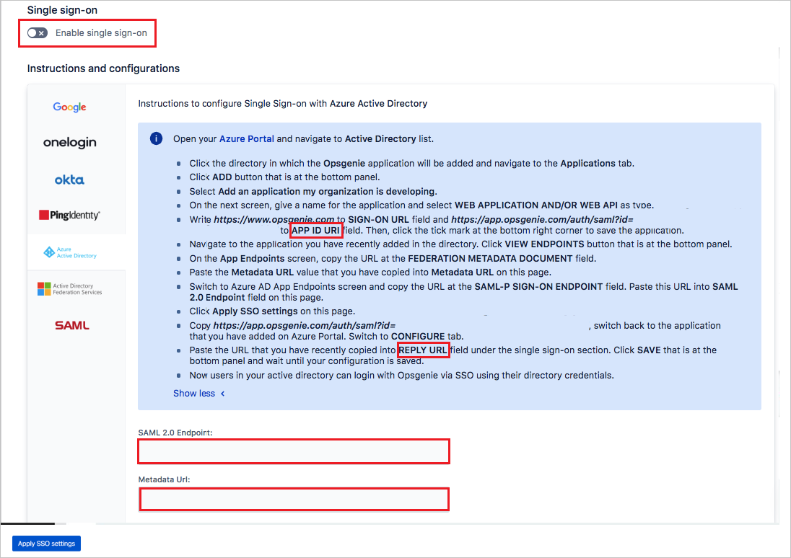
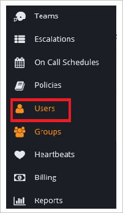
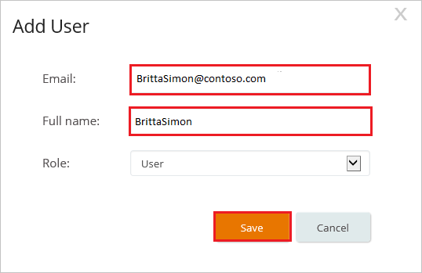

# Tutorial: Microsoft Entra single sign-on (SSO) integration with OpsGenie

In this tutorial, you'll learn how to integrate OpsGenie with Microsoft Entra ID. When you integrate OpsGenie with Microsoft Entra ID, you can:

* Control in Microsoft Entra ID who has access to OpsGenie.
* Enable your users to be automatically signed-in to OpsGenie with their Microsoft Entra accounts.
* Manage your accounts in one central location.

## Prerequisites

To get started, you need the following items:

* A Microsoft Entra subscription. If you don't have a subscription, you can get a [free account](https://azure.microsoft.com/free/).
* OpsGenie single sign-on (SSO) enabled subscription.

## Scenario description

In this tutorial, you configure and test Microsoft Entra SSO in a test environment.

* OpsGenie supports **IDP** initiated SSO

## Adding OpsGenie from the gallery

To configure the integration of OpsGenie into Microsoft Entra ID, you need to add OpsGenie from the gallery to your list of managed SaaS apps.

1. Sign in to the [Microsoft Entra admin center](https://entra.microsoft.com) as at least a [Cloud Application Administrator](../roles/permissions-reference.md#cloud-application-administrator).
1. Browse to **Identity** > **Applications** > **Enterprise applications** > **New application**.
1. In the **Add from the gallery** section, type **OpsGenie** in the search box.
1. Select **OpsGenie** from results panel and then add the app. Wait a few seconds while the app is added to your tenant.

 Alternatively, you can also use the [Enterprise App Configuration Wizard](https://portal.office.com/AdminPortal/home?Q=Docs#/azureadappintegration). In this wizard, you can add an application to your tenant, add users/groups to the app, assign roles, as well as walk through the SSO configuration as well. [Learn more about Microsoft 365 wizards.](/microsoft-365/admin/misc/azure-ad-setup-guides)

## Configure and test Microsoft Entra SSO for OpsGenie

Configure and test Microsoft Entra SSO with OpsGenie using a test user called **B.Simon**. For SSO to work, you need to establish a link relationship between a Microsoft Entra user and the related user in OpsGenie.

To configure and test Microsoft Entra SSO with OpsGenie, perform the following steps:

1. **[Configure Microsoft Entra SSO](#configure-azure-ad-sso)** - to enable your users to use this feature.
    1. **[Create a Microsoft Entra test user](#create-an-azure-ad-test-user)** - to test Microsoft Entra single sign-on with B.Simon.
    1. **[Assign the Microsoft Entra test user](#assign-the-azure-ad-test-user)** - to enable B.Simon to use Microsoft Entra single sign-on.
1. **[Configure OpsGenie SSO](#configure-opsgenie-sso)** - to configure the single sign-on settings on application side.
    1. **[Create OpsGenie test user](#create-opsgenie-test-user)** - to have a counterpart of B.Simon in OpsGenie that is linked to the Microsoft Entra representation of user.
1. **[Test SSO](#test-sso)** - to verify whether the configuration works.

## Configure Microsoft Entra SSO

Follow these steps to enable Microsoft Entra SSO.

1. Sign in to the [Microsoft Entra admin center](https://entra.microsoft.com) as at least a [Cloud Application Administrator](../roles/permissions-reference.md#cloud-application-administrator).
1. Browse to **Identity** > **Applications** > **Enterprise applications** > **OpsGenie** > **Single sign-on**.
1. On the **Select a single sign-on method** page, select **SAML**.
1. On the **Set up single sign-on with SAML** page, click the edit/pen icon for **Basic SAML Configuration** to edit the settings.

   

1. On the **Basic SAML Configuration** section, perform the following steps:

    a. In the **Identifier** text box, type a URL using the following pattern:
    `https://app.opsginie.com/auth/saml/<UNIQUEID>`

    b. In the **Reply URL** text box, type a URL using the following pattern:
    `https://app.opsginie.com/auth/saml?id=<UNIQUEID>`

    > [!NOTE]
	> These values are not real. Update these values with the actual Identifier and Reply URL, which is explained later in this tutorial.

1. On the **Set up Single Sign-On with SAML** page, In the **SAML Signing Certificate** section, click copy button to copy **App Federation Metadata Url** and save it on your computer.

	

1. On the **Set up OpsGenie** section, copy the appropriate URL(s) based on your requirement.

	

### Create a Microsoft Entra test user

In this section, you'll create a test user called B.Simon.

1. Sign in to the [Microsoft Entra admin center](https://entra.microsoft.com) as at least a [User Administrator](../roles/permissions-reference.md#user-administrator).
1. Browse to **Identity** > **Users** > **All users**.
1. Select **New user** > **Create new user**, at the top of the screen.
1. In the **User** properties, follow these steps:
   1. In the **Display name** field, enter `B.Simon`.  
   1. In the **User principal name** field, enter the username@companydomain.extension. For example, `B.Simon@contoso.com`.
   1. Select the **Show password** check box, and then write down the value that's displayed in the **Password** box.
   1. Select **Review + create**.
1. Select **Create**.

### Assign the Microsoft Entra test user

In this section, you'll enable B.Simon to use single sign-on by granting access to OpsGenie.

1. Sign in to the [Microsoft Entra admin center](https://entra.microsoft.com) as at least a [Cloud Application Administrator](../roles/permissions-reference.md#cloud-application-administrator).
1. Browse to **Identity** > **Applications** > **Enterprise applications** > **OpsGenie**.
1. In the app's overview page, find the **Manage** section and select **Users and groups**.

1. Select **Add user**, then select **Users and groups** in the **Add Assignment** dialog.

1. In the **Users and groups** dialog, select **B.Simon** from the Users list, then click the **Select** button at the bottom of the screen.
1. If you are expecting a role to be assigned to the users, you can select it from the **Select a role** dropdown. If no role has been set up for this app, you see "Default Access" role selected.
1. In the **Add Assignment** dialog, click the **Assign** button.

## Configure OpsGenie SSO

1. In a different web browser window, sign in to your OpsGenie company site as an administrator

2. Click **Settings**, and then click the **Single Sign On** tab.
   
    

3. To enable SSO, select **Enabled**.
   
     

4. In the **Provider** section, click the **Microsoft Entra ID** tab.
   
     

5. On the Microsoft Entra dialog page, perform the following steps:
   
    
	
    a. Copy the **App ID URI** value and paste it into **Identifier (Entity ID)** textbox in the **Basic SAML Configuration** section.

    a. Copy the **Reply URL** value and paste it into **Reply URL** textbox in the **Basic SAML Configuration** section.

	a. In the **SAML 2.0 Endpoint** textbox, paste **Login URL**value which you copied previously.
	
	b. In the **Metadata Url:** textbox, paste **App Federation Metadata Url** value which you copied previously.
    
    c. To enable SSO, turn on the **Enable single sign-on** toggle.

    d. Click **Apply SSO settings**.

### Create OpsGenie test user

The objective of this section is to create a user called B.Simon in OpsGenie. 

1. In a web browser window, sign into your OpsGenie tenant as an administrator.

2. Navigate to Users list by clicking **Users** in left panel.
   
     

3. Click **Add User**.

4. On the **Add User** dialog, perform the following steps:
   
    
   
    a. In the **Email** textbox, type the email address of B.Simon addressed in Microsoft Entra ID.
   
    b. In the **Full Name** textbox, type **B.Simon**.
   
    c. Click **Save**. 

> [!NOTE]
> B.Simon gets an email with instructions for setting up their profile.

## Test SSO 

In this section, you test your Microsoft Entra single sign-on configuration with following options.

* Click on **Test this application**, and you should be automatically signed in to the OpsGenie for which you set up the SSO

* You can use Microsoft My Apps. When you click the OpsGenie tile in the My Apps, you should be automatically signed in to the OpsGenie for which you set up the SSO. For more information about the My Apps, see [Introduction to the My Apps](https://support.microsoft.com/account-billing/sign-in-and-start-apps-from-the-my-apps-portal-2f3b1bae-0e5a-4a86-a33e-876fbd2a4510).

## Next steps

* Once you configure OpsGenie you can enforce session control, which protects exfiltration and infiltration of your organization’s sensitive data in real time. Session control extends from Conditional Access. [Learn how to enforce session control with Microsoft Defender for Cloud Apps](/cloud-app-security/proxy-deployment-any-app).
