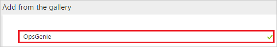
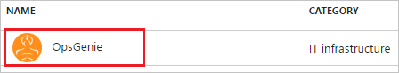
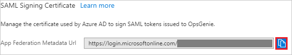
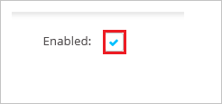
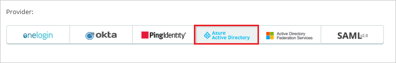
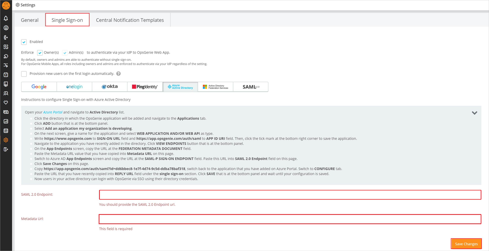
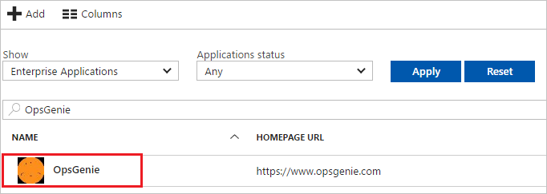

# Tutorial: Azure Active Directory integration with OpsGenie

In this tutorial, you learn how to integrate OpsGenie with Azure Active Directory (Azure AD).

Integrating OpsGenie with Azure AD provides you with the following benefits:

- You can control in Azure AD who has access to OpsGenie
- You can enable your users to automatically get signed-on to OpsGenie (Single Sign-On) with their Azure AD accounts
- You can manage your accounts in one central location - the Azure portal

If you want to know more details about SaaS app integration with Azure AD, see [what is application access and single sign-on with Azure Active Directory](../manage-apps/what-is-single-sign-on.md).

## Prerequisites

To configure Azure AD integration with OpsGenie, you need the following items:

- An Azure AD subscription
- A OpsGenie single sign-on enabled subscription

> [!NOTE]
> To test the steps in this tutorial, we do not recommend using a production environment.

To test the steps in this tutorial, you should follow these recommendations:

- Do not use your production environment, unless it is necessary.
- If you don't have an Azure AD trial environment, you can get a one-month trial [here](https://azure.microsoft.com/pricing/free-trial/).

## Scenario description
In this tutorial, you test Azure AD single sign-on in a test environment. 
The scenario outlined in this tutorial consists of two main building blocks:

1. Adding OpsGenie from the gallery
1. Configuring and testing Azure AD single sign-on

## Adding OpsGenie from the gallery
To configure the integration of OpsGenie into Azure AD, you need to add OpsGenie from the gallery to your list of managed SaaS apps.

**To add OpsGenie from the gallery, perform the following steps:**

1. In the **[Azure portal](https://portal.azure.com)**, on the left navigation panel, click **Azure Active Directory** icon. 

	![Active Directory][1]

1. Navigate to **Enterprise applications**. Then go to **All applications**.

	![Applications][2]
	
1. To add new application, click **New application** button on the top of dialog.

	![Applications][3]

1. In the search box, type **OpsGenie**.

	

1. In the results panel, select **OpsGenie**, and then click **Add** button to add the application.

	

##  Configuring and testing Azure AD single sign-on
In this section, you configure and test Azure AD single sign-on with OpsGenie based on a test user called "Britta Simon".

For single sign-on to work, Azure AD needs to know what the counterpart user in OpsGenie is to a user in Azure AD. In other words, a link relationship between an Azure AD user and the related user in OpsGenie needs to be established.

In OpsGenie, assign the value of the **user name** in Azure AD as the value of the **Username** to establish the link relationship.

To configure and test Azure AD single sign-on with OpsGenie, you need to complete the following building blocks:

1. **[Configuring Azure AD Single Sign-On](#configuring-azure-ad-single-sign-on)** - to enable your users to use this feature.
1. **[Creating an Azure AD test user](#creating-an-azure-ad-test-user)** - to test Azure AD single sign-on with Britta Simon.
1. **[Creating a OpsGenie test user](#creating-a-opsgenie-test-user)** - to have a counterpart of Britta Simon in OpsGenie that is linked to the Azure AD representation of user.
1. **[Assigning the Azure AD test user](#assigning-the-azure-ad-test-user)** - to enable Britta Simon to use Azure AD single sign-on.
1. **[Testing Single Sign-On](#testing-single-sign-on)** - to verify whether the configuration works.

### Configuring Azure AD single sign-on

In this section, you enable Azure AD single sign-on in the Azure portal and configure single sign-on in your OpsGenie application.

**To configure Azure AD single sign-on with OpsGenie, perform the following steps:**

1. In the Azure portal, on the **OpsGenie** application integration page, click **Single sign-on**.

	![Configure Single Sign-On][4]

1. On the **Single sign-on** dialog, select **Mode** as	**SAML-based Sign-on** to enable single sign-on.
 
	

1. On the **OpsGenie Domain and URLs** section, perform the following steps:

	

    In the **Sign-on URL** textbox, type the URL: `https://app.opsgenie.com/auth/login`

1. On the **SAML Signing Certificate** section, click the copy button to copy **App Federation Metadata Url** and paste it into notepad.

	

1. Click **Save** button.

	

1. On the **OpsGenie Configuration** section, click **Configure OpsGenie** to open **Configure sign-on** window. Copy the **SAML Single Sign-On Service URL** from the Quick Reference section.

    

1. Open another browser instance, and then log-in to OpsGenie as an administrator.

1. Click **Settings**, and then click the **Single Sign On** tab.
   
    

1. To enable SSO, select **Enabled**.
   
     

1. In the **Provider** section, click the **Azure Active Directory** tab.
   
     

1. On the Azure Active Directory dialog page, perform the following steps:
   
    
	
	a. In the **SAML 2.0 Endpoint** textbox, paste **Single Sign On Service URL**value which you have copied from the Azure portal.
	
	b. In the **Metadata Url:** textbox, paste **App Federation Metadata Url** value which you have copied from the Azure portal.
    
    c. Click **Save Changes**.

### Creating an Azure AD test user
The objective of this section is to create a test user in the Azure portal called Britta Simon.

![Create Azure AD User][100]

**To create a test user in Azure AD, perform the following steps:**

1. In the **Azure portal**, on the left navigation pane, click **Azure Active Directory** icon.

	 

1. To display the list of users, go to **Users and groups** and click **All users**.
	
	 

1. To open the **User** dialog, click **Add** on the top of the dialog.
 
	 

1. On the **User** dialog page, perform the following steps:
 
	 

    a. In the **Name** textbox, type **BrittaSimon**.

    b. In the **User name** textbox, type the **email address** of BrittaSimon.

	c. Select **Show Password** and write down the value of the **Password**.

    d. Click **Create**.
 
### Creating a OpsGenie test user

The objective of this section is to create a user called Britta Simon in OpsGenie. 

1. In a web browser window, log into your OpsGenie tenant as an administrator.

1. Navigate to Users list by clicking **User** in left panel.
   
    

1. Click **Add User**.

1. On the **Add User** dialog, perform the following steps:
   
   
   
   a. In the **Email** textbox, type the email address of BrittaSimon addressed in Azure Active Directory.
   
   b. In the **Full Name** textbox, type **Britta Simon**.
   
   c. Click **Save**. 

>[!NOTE]
>Britta gets an email with instructions for setting up her profile.

### Assigning the Azure AD test user

In this section, you enable Britta Simon to use Azure single sign-on by granting access to OpsGenie.

![Assign User][200] 

**To assign Britta Simon to OpsGenie, perform the following steps:**

1. In the Azure portal, open the applications view, and then navigate to the directory view and go to **Enterprise applications** then click **All applications**.

	![Assign User][201] 

1. In the applications list, select **OpsGenie**.

	 

1. In the menu on the left, click **Users and groups**.

	![Assign User][202] 

1. Click **Add** button. Then select **Users and groups** on **Add Assignment** dialog.

	![Assign User][203]

1. On **Users and groups** dialog, select **Britta Simon** in the Users list.

1. Click **Select** button on **Users and groups** dialog.

1. Click **Assign** button on **Add Assignment** dialog.
	
### Testing single sign-on

The objective of this section is to test your Azure AD SSO configuration using the Access Panel.

When you click the OpsGenie tile in the Access Panel, you should get automatically signed-on to your OpsGenie application.

## Additional resources

* [List of Tutorials on How to Integrate SaaS Apps with Azure Active Directory](tutorial-list.md)
* [What is application access and single sign-on with Azure Active Directory?](../manage-apps/what-is-single-sign-on.md)

<!--Image references-->

[1]: ./media/opsgenie-tutorial/tutorial_general_01.png
[2]: ./media/opsgenie-tutorial/tutorial_general_02.png
[3]: ./media/opsgenie-tutorial/tutorial_general_03.png
[4]: ./media/opsgenie-tutorial/tutorial_general_04.png

[100]: ./media/opsgenie-tutorial/tutorial_general_100.png

[200]: ./media/opsgenie-tutorial/tutorial_general_200.png
[201]: ./media/opsgenie-tutorial/tutorial_general_201.png
[202]: ./media/opsgenie-tutorial/tutorial_general_202.png
[203]: ./media/opsgenie-tutorial/tutorial_general_203.png

