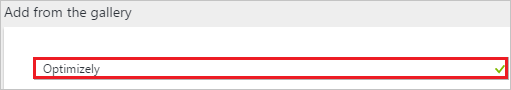
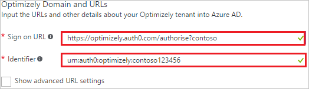
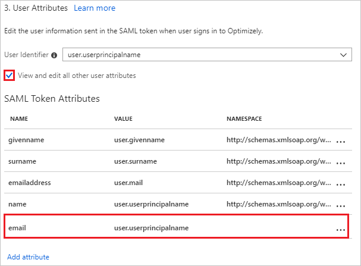
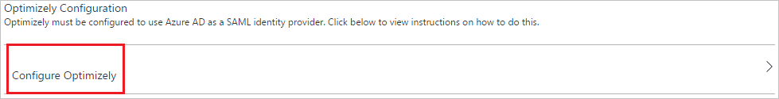
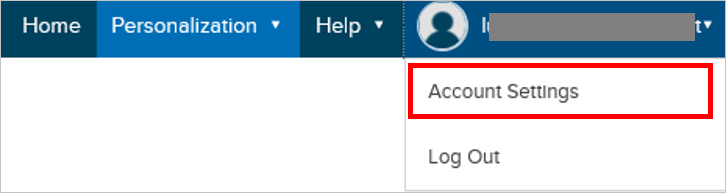
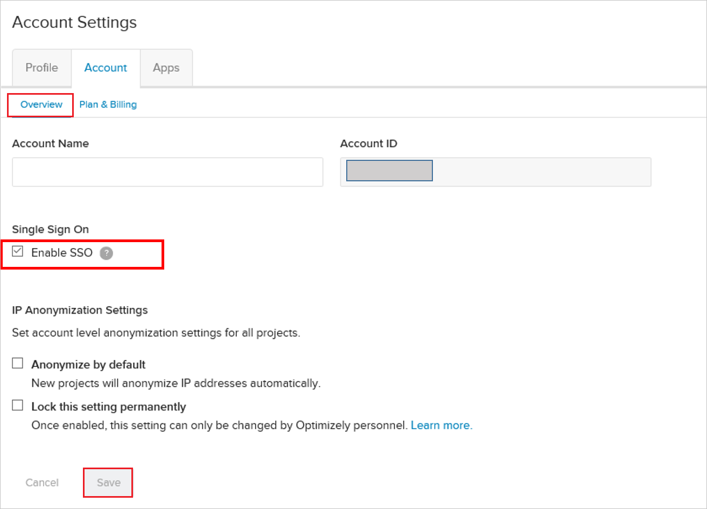
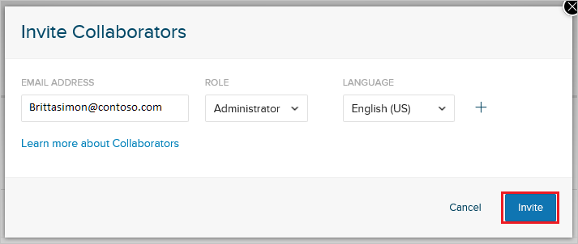
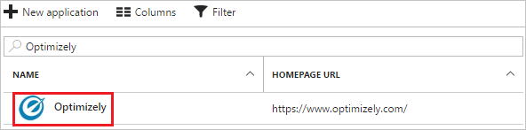

# Tutorial: Azure Active Directory integration with Optimizely

In this tutorial, you learn how to integrate Optimizely with Azure Active Directory (Azure AD).

Integrating Optimizely with Azure AD provides you with the following benefits:

- You can control in Azure AD who has access to Optimizely
- You can enable your users to automatically get signed-on to Optimizely (Single Sign-On) with their Azure AD accounts
- You can manage your accounts in one central location - the Azure portal

If you want to know more details about SaaS app integration with Azure AD, see [what is application access and single sign-on with Azure Active Directory](../manage-apps/what-is-single-sign-on.md).

## Prerequisites

To configure Azure AD integration with Optimizely, you need the following items:

- An Azure AD subscription
- An Optimizely single sign-on enabled subscription

> [!NOTE]
> To test the steps in this tutorial, we do not recommend using a production environment.

To test the steps in this tutorial, you should follow these recommendations:

- Do not use your production environment, unless it is necessary.
- If you don't have an Azure AD trial environment, you can get a one-month trial [here](https://azure.microsoft.com/pricing/free-trial/).

## Scenario description

In this tutorial, you test Azure AD single sign-on in a test environment.
The scenario outlined in this tutorial consists of two main building blocks:

1. Adding Optimizely from the gallery
2. Configuring and testing Azure AD single sign-on

## Adding Optimizely from the gallery

To configure the integration of Optimizely into Azure AD, you need to add Optimizely from the gallery to your list of managed SaaS apps.

**To add Optimizely from the gallery, perform the following steps:**

1. In the **[Azure portal](https://portal.azure.com)**, on the left navigation panel, click **Azure Active Directory** icon. 

	![Active Directory][1]

2. Navigate to **Enterprise applications**. Then go to **All applications**.

	![Applications][2]

3. To add new application, click **New application** button on the top of dialog.

	![Applications][3]

4. In the search box, type **Optimizely**.

	

5. In the results panel, select **Optimizely**, and then click **Add** button to add the application.

	

## Configuring and testing Azure AD single sign-on

In this section, you configure and test Azure AD single sign-on with Optimizely based on a test user called "Britta Simon."

For single sign-on to work, Azure AD needs to know what the counterpart user in Optimizely is to a user in Azure AD. In other words, a link relationship between an Azure AD user and the related user in Optimizely needs to be established.

This link relationship is established by assigning the value of the **user name** in Azure AD as the value of the **Username** in Optimizely.

To configure and test Azure AD single sign-on with Optimizely, you need to complete the following building blocks:

1. **[Configuring Azure AD Single Sign-On](#configuring-azure-ad-single-sign-on)** - to enable your users to use this feature.
2. **[Creating an Azure AD test user](#creating-an-azure-ad-test-user)** - to test Azure AD single sign-on with Britta Simon.
3. **[Creating an Optimizely test user](#creating-an-optimizely-test-user)** - to have a counterpart of Britta Simon in Optimizely that is linked to the Azure AD representation of user.
4. **[Assigning the Azure AD test user](#assigning-the-azure-ad-test-user)** - to enable Britta Simon to use Azure AD single sign-on.
5. **[Testing Single Sign-On](#testing-single-sign-on)** - to verify whether the configuration works.

### Configuring Azure AD single sign-on

In this section, you enable Azure AD single sign-on in the Azure portal and configure single sign-on in your Optimizely application.

**To configure Azure AD single sign-on with Optimizely, perform the following steps:**

1. In the Azure portal, on the **Optimizely** application integration page, click **Single sign-on**.

	![Configure Single Sign-On][4]

2. On the **Single sign-on** dialog, select **Mode** as **SAML-based Sign-on** to enable single sign-on.

	

3. On the **Optimizely Domain and URLs** section, perform the following steps:

	

    a. In the **Sign-on URL** textbox, type a URL using the following pattern: `https://app.optimizely.net/<instance name>`

	b. In the **Identifier** textbox, type a URL using the following pattern:  `urn:auth0:optimizely:contoso`

	> [!NOTE]
	> These values are not the real. You will update the value with the actual Sign-on URL and Identifier, which is explained later in the tutorial.

4. Optimizely application expects the SAML assertions in a specific format. Please configure the following claims for this application. You can manage the values of these attributes from the "**User Attributes**" section on application integration page. The following screenshot shows an example for this.
	
	
	
5. Click **View and edit all other user attributes** checkbox in the **User Attributes** section to expand the attributes. Perform the following steps on each of the displayed attributes-

	| Attribute Name | Attribute Value |
	| ---------------| --------------- |
	| email | user.mail |

	a. Click **Add attribute** to open the **Add Attribute** dialog.

	

	

	b. In the **Name** textbox, type the **attribute name** shown for that row.

	c. From the **Value** list, type the attribute value shown for that row.

	d. Click **Ok**.

6. On the **SAML Signing Certificate** section, click **Certificate(Base64)** and then save the certificate file on your computer.

	

7. Click **Save** button.

	

8. On the **Optimizely Configuration** section, click **Configure Optimizely** to open **Configure sign-on** window. Copy the **SAML Single Sign-On Service URL** from the **Quick Reference section.**

	

9. To configure single sign-on on **Optimizely** side, contact your Optimizely Account Manager and provide the downloaded **Certificate (Base64)**, and **SAML Single Sign-On Service URL**.

10. In response to your email, Optimizely provides you with the Sign On URL (SP-initiated SSO) and the Identifier (Service Provider Entity ID) values.

	a. Copy the **SP-initiated SSO URL** provided by Optimizely, and paste into the **Sign On URL** textbox in **Optimizely Domain and URLs** section on Azure portal.

	b. Copy the **Service Provider Entity ID** provided by Optimizely, and paste into the **Identifier** textbox in **Optimizely Domain and URLs** section on Azure portal.

11. In a different browser window, sign-on to your Optimizely application.

12. Click you account name in the top right corner and then **Account Settings**.

    

13. In the Account tab, check the box **Enable SSO** under Single Sign On in the **Overview** section.
  
    

14. Click **Save**

### Creating an Azure AD test user

The objective of this section is to create a test user in the Azure portal called Britta Simon.

![Create Azure AD User][100]

**To create a test user in Azure AD, perform the following steps:**

1. In the **Azure portal**, on the left navigation pane, click **Azure Active Directory** icon.

	 

2. To display the list of users, go to **Users and groups** and click **All users**.
	
	 

3. To open the **User** dialog, click **Add** on the top of the dialog.
 
	 

4. On the **User** dialog page, perform the following steps:
 
	 

    a. In the **Name** textbox, type **BrittaSimon**.

    b. In the **User name** textbox, type the **email address** of Britta Simon.

	c. Select **Show Password** and write down the value of the **Password**.

    d. Click **Create**.

### Creating an Optimizely test user

In this section, you create a user called Britta Simon in Optimizely.

1. On the home page, select **Collaborators** tab.

2. To add new collaborator to the project, click **New Collaborator**.
   
    

3. Fill in the email address and assign them a role. Click **Invite**.

    

4. They receive an email invite. Using the email address, they have to log in to Optimizely.

### Assigning the Azure AD test user

In this section, you enable Britta Simon to use Azure single sign-on by granting access to Optimizely.

![Assign User][200] 

**To assign Britta Simon to Optimizely, perform the following steps:**

1. In the Azure portal, open the applications view, and then navigate to the directory view and go to **Enterprise applications** then click **All applications**.

	![Assign User][201]

2. In the applications list, select **Optimizely**.

	 

3. In the menu on the left, click **Users and groups**.

	![Assign User][202]

4. Click **Add** button. Then select **Users and groups** on **Add Assignment** dialog.

	![Assign User][203]

5. On **Users and groups** dialog, select **Britta Simon** in the Users list.

6. Click **Select** button on **Users and groups** dialog.

7. Click **Assign** button on **Add Assignment** dialog.

### Testing single sign-on

In this section, you test your Azure AD single sign-on configuration using the Access Panel.

When you click the Optimizely tile in the Access Panel, you should get automatically signed-on to your Optimizely application.

## Additional resources

* [List of Tutorials on How to Integrate SaaS Apps with Azure Active Directory](tutorial-list.md)
* [What is application access and single sign-on with Azure Active Directory?](../manage-apps/what-is-single-sign-on.md)

<!--Image references-->

[1]: ./media/optimizely-tutorial/tutorial_general_01.png
[2]: ./media/optimizely-tutorial/tutorial_general_02.png
[3]: ./media/optimizely-tutorial/tutorial_general_03.png
[4]: ./media/optimizely-tutorial/tutorial_general_04.png

[100]: ./media/optimizely-tutorial/tutorial_general_100.png

[200]: ./media/optimizely-tutorial/tutorial_general_200.png
[201]: ./media/optimizely-tutorial/tutorial_general_201.png
[202]: ./media/optimizely-tutorial/tutorial_general_202.png
[203]: ./media/optimizely-tutorial/tutorial_general_203.png