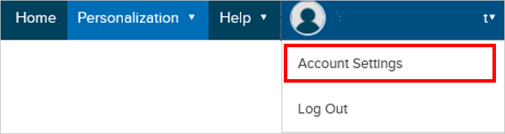
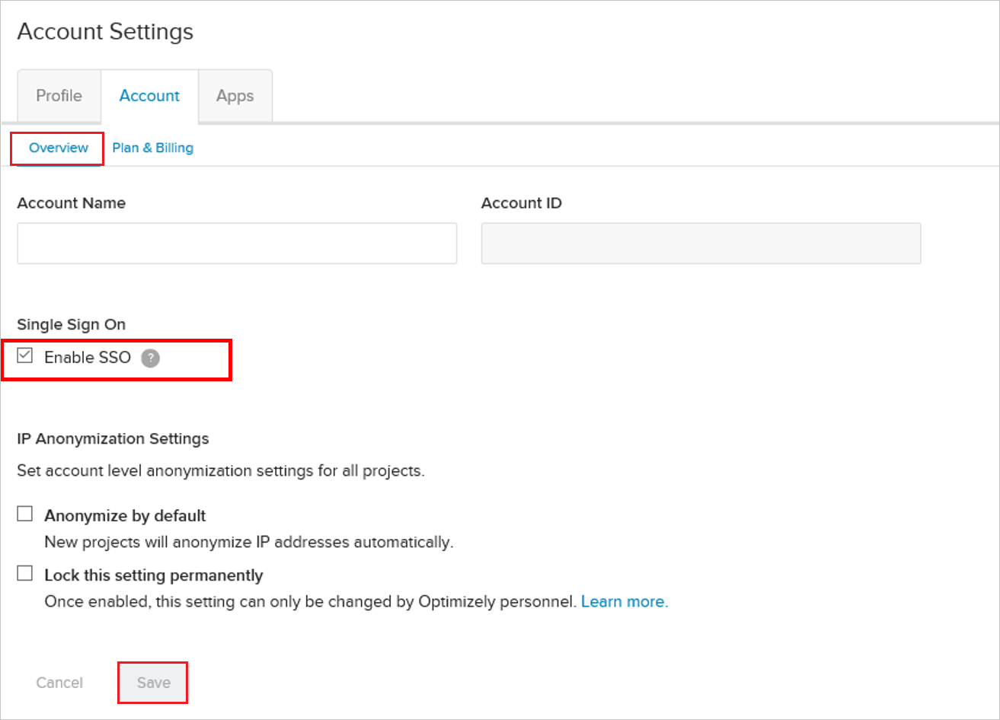
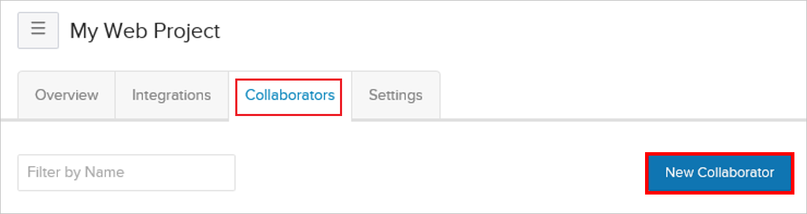

# Tutorial: Azure Active Directory integration with Optimizely

In this tutorial, you'll learn how to integrate Optimizely with Azure Active Directory (Azure AD). When you integrate Optimizely with Azure AD, you can:

* Control in Azure AD who has access to Optimizely.
* Enable your users to be automatically signed-in to Optimizely with their Azure AD accounts.
* Manage your accounts in one central location - the Azure portal.

## Prerequisites

To get started, you need the following items:

* An Azure AD subscription. If you don't have a subscription, you can get a [free account](https://azure.microsoft.com/free/).
* Optimizely single sign-on (SSO) enabled subscription.

## Scenario description

In this tutorial, you configure and test Azure AD single sign-on in a test environment.

* Optimizely supports **SP** initiated SSO.

## Add Optimizely from the gallery

To configure the integration of Optimizely into Azure AD, you need to add Optimizely from the gallery to your list of managed SaaS apps.

1. Sign in to the Azure portal using either a work or school account, or a personal Microsoft account.
1. On the left navigation pane, select the **Azure Active Directory** service.
1. Navigate to **Enterprise Applications** and then select **All Applications**.
1. To add new application, select **New application**.
1. In the **Add from the gallery** section, type **Optimizely** in the search box.
1. Select **Optimizely** from results panel and then add the app. Wait a few seconds while the app is added to your tenant.

## Configure and test Azure AD SSO for Optimizely

Configure and test Azure AD SSO with Optimizely using a test user called **B.Simon**. For SSO to work, you need to establish a link relationship between an Azure AD user and the related user in Optimizely.

To configure and test Azure AD SSO with Optimizely, perform the following steps:

1. **[Configure Azure AD SSO](#configure-azure-ad-sso)** - to enable your users to use this feature.
    1. **[Create an Azure AD test user](#create-an-azure-ad-test-user)** - to test Azure AD single sign-on with B.Simon.
    1. **[Assign the Azure AD test user](#assign-the-azure-ad-test-user)** - to enable B.Simon to use Azure AD single sign-on.
1. **[Configure Optimizely SSO](#configure-optimizely-sso)** - to configure the single sign-on settings on application side.
    1. **[Create Optimizely test user](#create-optimizely-test-user)** - to have a counterpart of B.Simon in Optimizely that is linked to the Azure AD representation of user.
1. **[Test SSO](#test-sso)** - to verify whether the configuration works.

## Configure Azure AD SSO

Follow these steps to enable Azure AD SSO in the Azure portal.

1. In the Azure portal, on the **Optimizely** application integration page, find the **Manage** section and select **single sign-on**.
1. On the **Select a single sign-on method** page, select **SAML**.
1. On the **Set up single sign-on with SAML** page, click the pencil icon for **Basic SAML Configuration** to edit the settings.

   

4. On the **Basic SAML Configuration** section, perform the following steps:

	a. In the **Sign on URL** text box, type a URL using the following pattern:
    `https://app.optimizely.net/<INSTANCE_NAME>`

    b. In the **Identifier (Entity ID)** text box, type a value using the following pattern:
    `urn:auth0:optimizely:contoso`

	> [!NOTE]
	> These values are not the real. You will update the value with the actual Sign-on URL and Identifier, which is explained later in the tutorial. You can also refer to the patterns shown in the **Basic SAML Configuration** section in the Azure portal.

5. Your Optimizely application expects the SAML assertions in a specific format, which requires you to add custom attribute mappings to your SAML token attributes configuration. The following screenshot shows the list of default attributes. Click **Edit** icon to open **User Attributes** dialog.

	

6. In addition to above, Optimizely application expects few more attributes to be passed back in SAML response. In the **User Claims** section on the **User Attributes** dialog, perform the following steps to add SAML token attribute as shown in the below table:

	| Name | Source Attribute |
	| ---------------| --------------- |
	| email | user.mail |
	
	a. Click **Add new claim** to open the **Manage user claims** dialog.

	

	

	b. In the **Name** textbox, type the attribute name shown for that row.

	c. Leave the **Namespace** blank.

	d. Select Source as **Attribute**.

	e. From the **Source attribute** list, type the attribute value shown for that row.

	f. Click **Ok**

	g. Click **Save**.

4. On the **Set up Single Sign-On with SAML** page, in the **SAML Signing Certificate** section, click **Download** to download the **Certificate (Base64)** from the given options as per your requirement and save it on your computer.

	

6. On the **Set up Optimizely** section, copy the appropriate URL(s) as per your requirement.

	

### Create an Azure AD test user 

In this section, you'll create a test user in the Azure portal called B.Simon.

1. From the left pane in the Azure portal, select **Azure Active Directory**, select **Users**, and then select **All users**.
1. Select **New user** at the top of the screen.
1. In the **User** properties, follow these steps:
   1. In the **Name** field, enter `B.Simon`.  
   1. In the **User name** field, enter the username@companydomain.extension. For example, `B.Simon@contoso.com`.
   1. Select the **Show password** check box, and then write down the value that's displayed in the **Password** box.
   1. Click **Create**.

### Assign the Azure AD test user

In this section, you'll enable B.Simon to use Azure single sign-on by granting access to Optimizely.

1. In the Azure portal, select **Enterprise Applications**, and then select **All applications**.
1. In the applications list, select **Optimizely**.
1. In the app's overview page, find the **Manage** section and select **Users and groups**.
1. Select **Add user**, then select **Users and groups** in the **Add Assignment** dialog.
1. In the **Users and groups** dialog, select **B.Simon** from the Users list, then click the **Select** button at the bottom of the screen.
1. If you are expecting a role to be assigned to the users, you can select it from the **Select a role** dropdown. If no role has been set up for this app, you see "Default Access" role selected.
1. In the **Add Assignment** dialog, click the **Assign** button.

## Configure Optimizely SSO

1. To configure single sign-on on **Optimizely** side, contact your Optimizely Account Manager and provide the downloaded **Certificate (Base64)** and appropriate copied URLs.

2. In response to your email, Optimizely provides you with the Sign On URL (SP-initiated SSO) and the Identifier (Service Provider Entity ID) values.

	a. Copy the **SP-initiated SSO URL** provided by Optimizely, and paste into the **Sign On URL** textbox in **Basic SAML Configuration** section on Azure portal.

	b. Copy the **Service Provider Entity ID** provided by Optimizely, and paste into the **Identifier** textbox in **Basic SAML Configuration** section on Azure portal.

3. In a different browser window, sign-on to your Optimizely application.

4. Click you account name in the top right corner and then **Account Settings**.

    

5. In the Account tab, check the box **Enable SSO** under Single Sign On in the **Overview** section.
  
    

6. Click **Save**.

### Create Optimizely test user

In this section, you create a user called Britta Simon in Optimizely.

1. On the home page, select **Collaborators** tab.

2. To add new collaborator to the project, click **New Collaborator**.
   
    

3. Fill in the email address and assign them a role. Click **Invite**.

    

4. They receive an email invite. Using the email address, they have to log in to Optimizely.

## Test SSO

In this section, you test your Azure AD single sign-on configuration with following options. 

* Click on **Test this application** in Azure portal. This will redirect to Optimizely Sign-on URL where you can initiate the login flow. 

* Go to Optimizely Sign-on URL directly and initiate the login flow from there.

* You can use Microsoft My Apps. When you click the Optimizely tile in the My Apps, this will redirect to Optimizely Sign-on URL. For more information about the My Apps, see [Introduction to the My Apps](../user-help/my-apps-portal-end-user-access.md).

## Next steps

Once you configure Optimizely you can enforce session control, which protects exfiltration and infiltration of your organization’s sensitive data in real time. Session control extends from Conditional Access. [Learn how to enforce session control with Microsoft Cloud App Security](/cloud-app-security/proxy-deployment-aad).
