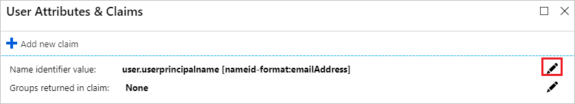
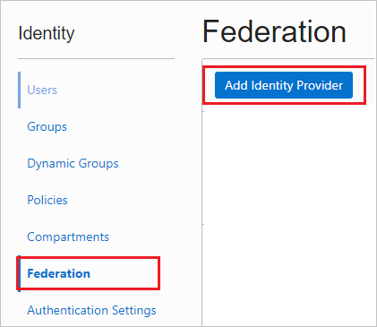
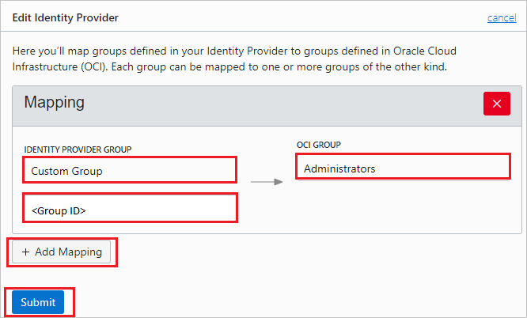
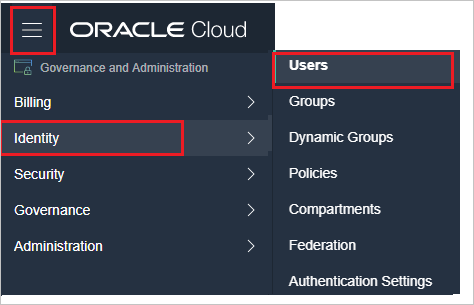
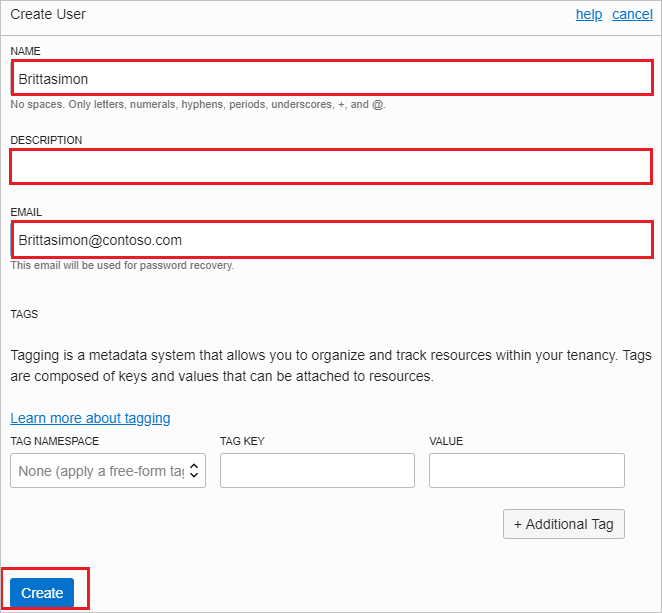

# Tutorial: Integrate Oracle Cloud with Azure Active Directory

In this tutorial, you'll learn how to integrate Oracle Cloud with Azure Active Directory (Azure AD). When you integrate Oracle Cloud with Azure AD, you can:

* Control in Azure AD who has access to Oracle Cloud.
* Enable your users to be automatically signed-in to Oracle Cloud with their Azure AD accounts.
* Manage your accounts in one central location - the Azure portal.

To learn more about SaaS app integration with Azure AD, see [What is application access and single sign-on with Azure Active Directory](https://docs.microsoft.com/azure/active-directory/active-directory-appssoaccess-whatis).

## Prerequisites

To get started, you need the following items:

* An Azure AD subscription. If you don't have a subscription, you can get a [free account](https://azure.microsoft.com/free/).
* Oracle Cloud single sign-on (SSO) enabled subscription.

## Scenario description

In this tutorial, you configure and test Azure AD SSO in a test environment. Oracle Cloud supports **SP** initiated SSO.

## Adding Oracle Cloud from the gallery

To configure the integration of Oracle Cloud into Azure AD, you need to add Oracle Cloud from the gallery to your list of managed SaaS apps.

1. Sign in to the [Azure portal](https://portal.azure.com) using either a work or school account, or a personal Microsoft account.
1. On the left navigation pane, select the **Azure Active Directory** service.
1. Navigate to **Enterprise Applications** and then select **All Applications**.
1. To add new application, select **New application**.
1. In the **Add from the gallery** section, type **Oracle Cloud** in the search box.
1. Select **Oracle Cloud** from results panel and then add the app. Wait a few seconds while the app is added to your tenant.

## Configure and test Azure AD single sign-on

Configure and test Azure AD SSO with Oracle Cloud using a test user called **Britta Simon**. For SSO to work, you need to establish a link relationship between an Azure AD user and the related user in Oracle Cloud.

To configure and test Azure AD SSO with Oracle Cloud, complete the following building blocks:

1. **[Configure Azure AD single sign-on](#configure-azure-ad-single-sign-on)** to enable your users to use this feature.
2. **[Configure Oracle Cloud](#configure-oracle-cloud)** to configure the SSO settings on application side.
3. **[Create an Azure AD test user](#create-an-azure-ad-test-user)** to test Azure AD single sign-on with Britta Simon.
4. **[Assign the Azure AD test user](#assign-the-azure-ad-test-user)** to enable Britta Simon to use Azure AD single sign-on.
5. **[Create Oracle Cloud test user](#create-oracle-cloud-test-user)** to have a counterpart of Britta Simon in Oracle Cloud that is linked to the Azure AD representation of user.
6. **[Test single sign-on](#test-single-sign-on)** to verify whether the configuration works.

### Configure Azure AD single sign-on

Follow these steps to enable Azure AD SSO in the Azure portal.

1. In the [Azure portal](https://portal.azure.com/), on the **Oracle Cloud** application integration page, find the **Manage** section and select **Single sign-on**.
1. On the **Select a Single sign-on method** page, select **SAML**.
1. On the **Set up Single Sign-On with SAML** page, click the edit/pen icon for **Basic SAML Configuration** to edit the settings.

   

1. On the **Basic SAML Configuration** page, enter the values for the following fields:

   >[!NOTE]
	>You will get the Service Provider metadata file from the **Configure Oracle Cloud Single Sign-On** section of the tutorial.
	
		1. Click **Upload metadata file**.
		1. Click on **folder logo** to select the metadata file and click **Upload**.
		1. Once the metadata file is successfully uploaded, the **Identifier** and **Reply URL** values get auto populated in Oracle Cloud section textbox.
	
	> [!NOTE]
	> If the **Identifier** and **Reply URL** values do not get auto polulated, then fill in the values manually according to your requirement.

	 In the **Sign-on URL** text box, type a URL using the following pattern:
    ` https://<SUBDOMAIN>.oraclecloud.com/`

	> [!NOTE]
	> The value is not real. Update the value with the actual Sign-On URL. Contact [Oracle Cloud Client support team](https://www.oracle.com/support/advanced-customer-support/products/cloud.html) to get the value. You can also refer to the patterns shown in the **Basic SAML Configuration** section in the Azure portal.

1. On the **Set up Single Sign-On with SAML** page, in the **SAML Signing Certificate** section, find **Federation Metadata XML** and select **Download** to download the certificate and save it on your computer.

   

1. Oracle Cloud application expects the SAML assertions in a specific format, which requires you to add custom attribute mappings to your SAML token attributes configuration. The following screenshot shows the list of default attributes. Click **Edit** icon to open User Attributes dialog.

	

1. In addition to above, Oracle Cloud application expects few more attributes to be passed back in SAML response. In the **User Attributes & Claims** section on the **Group Claims (Preview)** dialog, perform the following steps:

	1. Click the **pen** next to **Groups returned in claim**.

	

	

	1. Select **Security groups** from the radio list.
	1. Select **Source Attribute** of **Group ID**.
	1. Check **Customize the name of the group claim**.
	1. In the **Name** text box, type **groupName**.
	1. In the **Namespace (optional)** text box, type `https://auth.oraclecloud.com/saml/claims`.
	1. Click **Save**.

1. On the **Set up Oracle Cloud** section, copy the appropriate URL(s) based on your requirement.

   

### Configure Oracle Cloud

1. In a different web browser window, sign in to Oracle Cloud as an Administrator.

2. Click on the left side of the menu and click on **Identity** then navigate to **Federation**.

	

3. Save the **Service Provider metadata file** by clicking the **Download this document** link and upload it into the **Basic SAML Configuration** section of Azure portal and then click on **Add Identity Provider**.

	

4. On the **Add Identity Provider** pop-up, perform the following steps:

	

	1. In the **NAME** text box, enter your name.
	1. In the **DESCRIPTION** text box, enter your description.
	1. Select **MICROSOFT ACTIVE DIRECTORY FEDERATION SERVICE (ADFS) OR SAML 2.0 COMPLIANT IDENTITY PROVIDER** as **TYPE**.
	1. Click **Browse** to upload the Federation Metadata XML, which you have downloaded from Azure portal.
	1. Click **Continue** and on the **Edit Identity Provider** section perform the following steps:

	

	1. For the **IDENTITY PROVIDER GROUP field**, enter a group name and group id that will be passed from Azure portal and select a corresponding group from the **OCI GROUP** dropdown list.

	>[!NOTE]
	>In our example, we have used OCIAdmins for the Azure portal group name and the corresponding Administrators group for the OCI GROUP. You can create different groups by using **+ Add Mapping** option, for example OCIAdmins, OCIEveryone etc and set a mapping for each group.

	1. Click **Submit**.

### Create an Azure AD test user

In this section, you'll create a test user in the Azure portal called Britta Simon.

1. From the left pane in the Azure portal, select **Azure Active Directory**, select **Users**, and then select **All users**.
1. Select **New user** at the top of the screen.
1. In the **User** properties, follow these steps:
   1. In the **Name** field, enter `Britta Simon`.  
   1. In the **User name** field, enter the username@companydomain.extension. For example, `BrittaSimon@contoso.com`.
   1. Select the **Show password** check box, and then write down the value that's displayed in the **Password** box.
   1. Click **Create**.

### Assign the Azure AD test user

In this section, you'll enable Britta Simon to use Azure single sign-on by granting access to Oracle Cloud.

1. In the Azure portal, select **Enterprise Applications**, and then select **All applications**.
1. In the applications list, select **Oracle Cloud**.
1. In the app's overview page, find the **Manage** section and select **Users and groups**.

   

1. Select **Add user**, then select **Users and groups** in the **Add Assignment** dialog.

	

1. In the **Users and groups** dialog, select **Britta Simon** from the Users list, then click the **Select** button at the bottom of the screen.
1. If you're expecting any role value in the SAML assertion, in the **Select Role** dialog, select the appropriate role for the user from the list and then click the **Select** button at the bottom of the screen.
1. In the **Add Assignment** dialog, click the **Assign** button.

### Create Oracle Cloud test user

To enable Azure AD users to sign in to Oracle Cloud, they must be provisioned into Oracle Cloud. In Oracle Cloud, provisioning is a manual task.

**To provision a user account, perform the following steps:**

1. Sign in to Oracle Cloud as an Administrator.

2. Click on the left side of the menu and click on **Identity** then navigate to **Users**.

	

3. Click on **Create User**.

	

4. On the **Create User** pop-up, perform the following steps:

	

	1. In the **NAME** text box, enter the name of user like **Brittasimon**.
	1. In the **DESCRIPTION** text box, enter your description.
	1. In **EMAIL** text box, enter the email of user like `Brittasimon@contoso.com`.
	1. Click **Create**.

### Test single sign-on

When you select the Oracle Cloud tile in the Access Panel, you should be automatically signed in to the Oracle Cloud for which you set up SSO. For more information about the Access Panel, see [Introduction to the Access Panel](https://docs.microsoft.com/azure/active-directory/active-directory-saas-access-panel-introduction).

## Additional Resources

- [List of Tutorials on How to Integrate SaaS Apps with Azure Active Directory](https://docs.microsoft.com/azure/active-directory/active-directory-saas-tutorial-list)

- [What is application access and single sign-on with Azure Active Directory?](https://docs.microsoft.com/azure/active-directory/active-directory-appssoaccess-whatis)

- [What is conditional access in Azure Active Directory?](https://docs.microsoft.com/azure/active-directory/conditional-access/overview)