# Tutorial: Azure Active Directory single sign-on (SSO) integration with Oracle PeopleSoft - Protected by F5 BIG-IP APM

In this tutorial, you'll learn how to integrate Oracle PeopleSoft - Protected by F5 BIG-IP APM with Azure Active Directory (Azure AD). When you integrate Oracle PeopleSoft - Protected by F5 BIG-IP APM with Azure AD, you can:

* Control in Azure AD who has access to Oracle PeopleSoft - Protected by F5 BIG-IP APM.
* Enable your users to be automatically signed-in to Oracle PeopleSoft - Protected by F5 BIG-IP APM with their Azure AD accounts.
* Manage your accounts in one central location - the Azure portal.
* This tutorial covers instructions for Oracle PeopleSoft ELM.

## Prerequisites

To get started, you need the following items:

1. An Azure AD subscription. If you don't have a subscription, you can get a [free account](https://azure.microsoft.com/free/).
1. Oracle PeopleSoft - Protected by F5 BIG-IP APM single sign-on (SSO) enabled subscription.

1. Deploying the joint solution requires the following license:

    1. F5 BIG-IP® Best bundle (or) 
    2. F5 BIG-IP Access Policy Manager™ (APM) standalone license 
    3. F5 BIG-IP Access Policy Manager™ (APM) add-on license on an existing BIG-IP F5 BIG-IP® Local Traffic Manager™ (LTM).
    4. In addition to the above license, the F5 system may also be licensed with: 
        * A URL Filtering subscription to use the URL category database. 
        * An F5 IP Intelligence subscription to detect and block known attackers and malicious traffic. 
        * A network hardware security module (HSM) to safeguard and manage digital keys for strong authentication.
1. F5 BIG-IP system is provisioned with APM modules (LTM is optional).
1. Although optional, it is highly recommended to Deploy the F5 systems in a [sync/failover device group](https://techdocs.f5.com/kb/en-us/products/big-ip_ltm/manuals/product/big-ip-device-service-clustering-administration-14-1-0.html) (S/F DG), which includes the active standby pair, with a floating IP address for high availability (HA). Further interface redundancy can be achieved using the Link Aggregation Control Protocol (LACP). LACP manages the connected physical interfaces as a single virtual interface (aggregate group) and detects any interface failures within the group.

## Scenario description

In this tutorial, you configure and test Azure AD SSO in a test environment.

* Oracle PeopleSoft - Protected by F5 BIG-IP APM supports **SP and IDP** initiated SSO.

## Add Oracle PeopleSoft - Protected by F5 BIG-IP APM from the gallery

To configure the integration of Oracle PeopleSoft - Protected by F5 BIG-IP APM into Azure AD, you need to add Oracle PeopleSoft - Protected by F5 BIG-IP APM from the gallery to your list of managed SaaS apps.

1. Sign in to the Azure portal using either a work or school account, or a personal Microsoft account.
1. On the left navigation pane, select the **Azure Active Directory** service.
1. Navigate to **Enterprise Applications** and then select **All Applications**.
1. To add new application, select **New application**.
1. In the **Add from the gallery** section, type **Oracle PeopleSoft - Protected by F5 BIG-IP APM** in the search box.
1. Select **Oracle PeopleSoft - Protected by F5 BIG-IP APM** from results panel and then add the app. Wait a few seconds while the app is added to your tenant.

 Alternatively, you can also use the [Enterprise App Configuration Wizard](https://portal.office.com/AdminPortal/home?Q=Docs#/azureadappintegration). In this wizard, you can add an application to your tenant, add users/groups to the app, assign roles, as well as walk through the SSO configuration as well. [Learn more about Microsoft 365 wizards.](/microsoft-365/admin/misc/azure-ad-setup-guides)


## Configure and test Azure AD SSO for Oracle PeopleSoft - Protected by F5 BIG-IP APM

Configure and test Azure AD SSO with Oracle PeopleSoft - Protected by F5 BIG-IP APM using a test user called **B.Simon**. For SSO to work, you need to establish a link relationship between an Azure AD user and the related user in Oracle PeopleSoft - Protected by F5 BIG-IP APM.

To configure and test Azure AD SSO with Oracle PeopleSoft - Protected by F5 BIG-IP APM, perform the following steps:

1. **[Configure Azure AD SSO](#configure-azure-ad-sso)** - to enable your users to use this feature.
    1. **[Create an Azure AD test user](#create-an-azure-ad-test-user)** - to test Azure AD single sign-on with B.Simon.
    1. **[Assign the Azure AD test user](#assign-the-azure-ad-test-user)** - to enable B.Simon to use Azure AD single sign-on.
1. **[Configure Oracle PeopleSoft-Protected by F5 BIG-IP APM SSO](#configure-oracle-peoplesoft-protected-by-f5-big-ip-apm-sso)** - to configure the single sign-on settings on application side.
    1. **[Create Oracle PeopleSoft-Protected by F5 BIG-IP APM test user](#create-oracle-peoplesoft-protected-by-f5-big-ip-apm-test-user)** - to have a counterpart of B.Simon in Oracle PeopleSoft - Protected by F5 BIG-IP APM that is linked to the Azure AD representation of user.
1. **[Test SSO](#test-sso)** - to verify whether the configuration works.

## Configure Azure AD SSO

Follow these steps to enable Azure AD SSO in the Azure portal.

1. In the Azure portal, on the **Oracle PeopleSoft - Protected by F5 BIG-IP APM** application integration page, find the **Manage** section and select **single sign-on**.
1. On the **Select a single sign-on method** page, select **SAML**.
1. On the **Set up single sign-on with SAML** page, click the pencil icon for **Basic SAML Configuration** to edit the settings.

   

1. On the **Basic SAML Configuration** section, if you wish to configure the application in **IDP** initiated mode, enter the values for the following fields:

    a. In the **Identifier** text box, type a URL using the following pattern:
    `https://<FQDN>.peoplesoft.f5.com`

    b. In the **Reply URL** text box, type a URL using the following pattern:
    `https://<FQDN>.peoplesoft.f5.com/saml/sp/profile/post/acs`

    c. In the **Logout URL** text box, type a URL using the following pattern:
    `https://<FQDN>.peoplesoft.f5.com/saml/sp/profile/redirect/slr`

1. Click **Set additional URLs** and perform the following step if you wish to configure the application in **SP** initiated mode:

    In the **Sign-on URL** text box, type a URL using the following pattern:
    `https://<FQDN>.peoplesoft.f5.com/`

    > [!NOTE]
    >These values are not real. Update these values with the actual Sign-On URL, Identifier, Reply URL and Logout URL. Contact [Oracle PeopleSoft - Protected by F5 BIG-IP APM Client support team](https://support.f5.com) to get the value. You can also refer to the patterns shown in the **Basic SAML Configuration** section in the Azure portal.

1. Oracle PeopleSoft - Protected by F5 BIG-IP APM application expects the SAML assertions in a specific format, which requires you to add custom attribute mappings to your SAML token attributes configuration. The following screenshot shows the list of default attributes.

	

1. In addition to above, Oracle PeopleSoft - Protected by F5 BIG-IP APM application expects few more attributes to be passed back in SAML response which are shown below. These attributes are also pre populated but you can review them as per your requirements.
	
	| Name |  Source Attribute|
	| ------------------ | --------- |
	| EMPLID | user.employeeid |

1. On the **Set up single sign-on with SAML** page, In the **SAML Signing Certificate** section, Download the **Federation Metadata XML** and the **Certificate (Base64)** and save it on your computer.

	

### Create an Azure AD test user

In this section, you'll create a test user in the Azure portal called B.Simon.

1. From the left pane in the Azure portal, select **Azure Active Directory**, select **Users**, and then select **All users**.
1. Select **New user** at the top of the screen.
1. In the **User** properties, follow these steps:
   1. In the **Name** field, enter `B.Simon`.  
   1. In the **User name** field, enter the username@companydomain.extension. For example, `B.Simon@contoso.com`.
   1. Select the **Show password** check box, and then write down the value that's displayed in the **Password** box.
   1. Click **Create**.

### Assign the Azure AD test user

In this section, you'll enable B.Simon to use Azure single sign-on by granting access to Oracle PeopleSoft - Protected by F5 BIG-IP APM.

1. In the Azure portal, select **Enterprise Applications**, and then select **All applications**.
1. In the applications list, select **Oracle PeopleSoft - Protected by F5 BIG-IP APM**.
1. In the app's overview page, find the **Manage** section and select **Users and groups**.
1. Select **Add user**, then select **Users and groups** in the **Add Assignment** dialog.
1. In the **Users and groups** dialog, select **B.Simon** from the Users list, then click the **Select** button at the bottom of the screen.
1. If you are expecting a role to be assigned to the users, you can select it from the **Select a role** dropdown. If no role has been set up for this app, you see "Default Access" role selected.
1. In the **Add Assignment** dialog, click the **Assign** button.

## Configure Oracle PeopleSoft-Protected by F5 BIG-IP APM SSO

### F5 SAML SP Configuration

Import the Metadata Certificate into the F5 which will be used later in the setup process. Navigate to **System > Certificate Management > Traffic Certificate Management > SSL Certificate List**. Select **Import** from the right-hand corner.

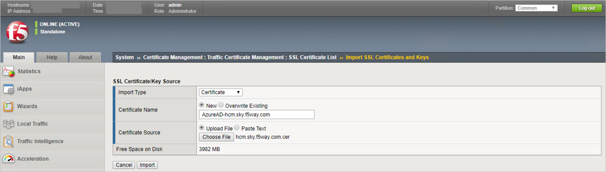

#### Setup the SAML IDP Connector 

1. Navigate to **Access > Federation > SAML: Service Provider > External Idp Connectors** and click **Create > From Metadata**.

    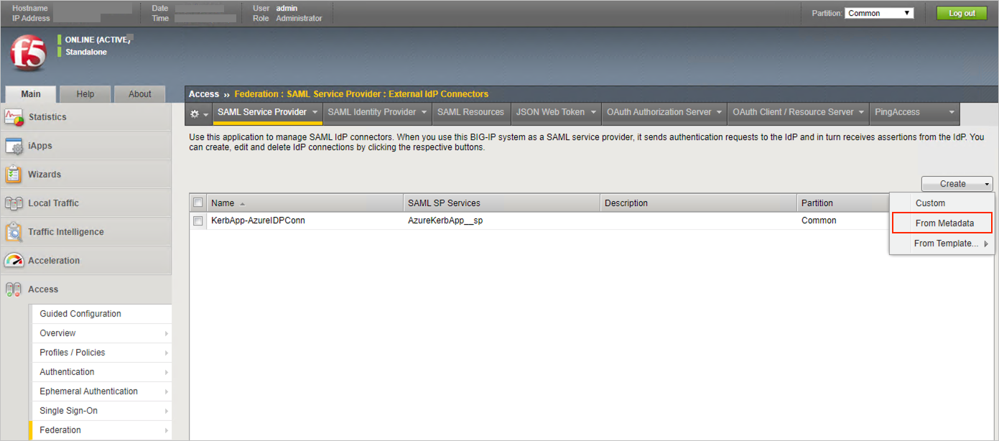

1. In the following page, click on **Browse** to upload the xml file.

1. Give a valid name in the **Identity Provider Name** textbox and then click on **OK**.

    

1. Perform the required steps in the **Security Settings** tab and then click on **OK**.

    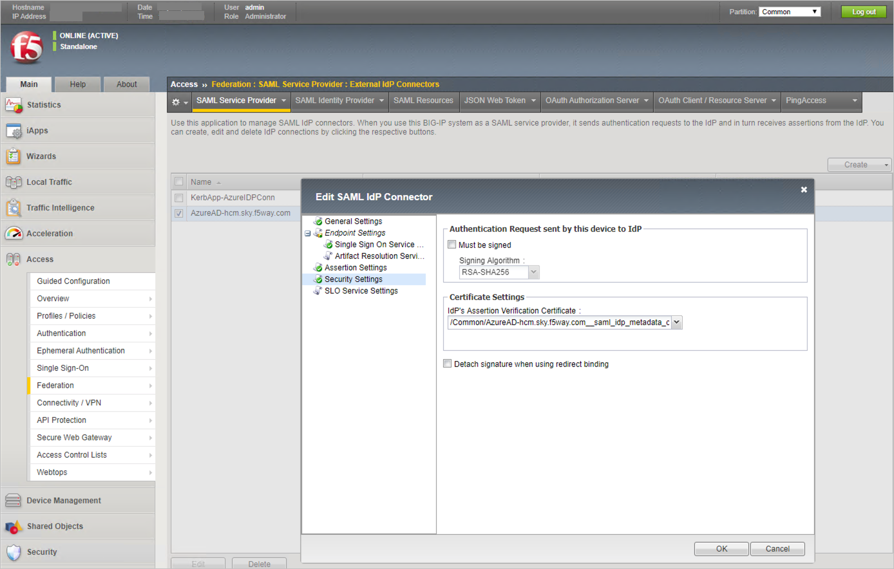

#### Setup the SAML SP

1. Navigate to **Access > Federation > SAML Service Provider > Local SP Services** and click **Create**. Complete the following information and click **OK**.

    * Name: `<Name>`
    * Entity ID: `https://<FQDN>.peoplesoft.f5.com`
    * SP Name Settings
        * Scheme: `https`
        * Host: `<FQDN>.peoplesoft.f5.com`
        * Description: `<Description>`

    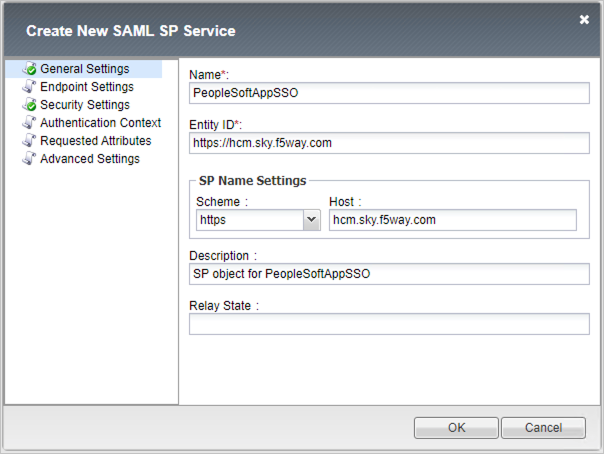

1. Select the SP Configuration, PeopleSoftAppSSO, and **Click Bind/UnBind IdP Connectors**.
Click on **Add New Row** and Select the **External IdP connector** created in previous step, click **Update**, and then click **OK**.

    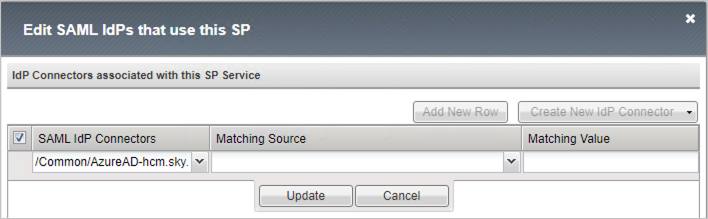

## Configuring Application

### Create a new Pool
1. Navigate to **Local Traffic > Pools > Pool List**, click **Create**, complete the following information and click **Finished**.

    * Name: `<Name>`
    * Description: `<Description>`
    * Health Monitors: `http`
    * Address: `<Address>`
    * Service Port: `<Service Port>`

    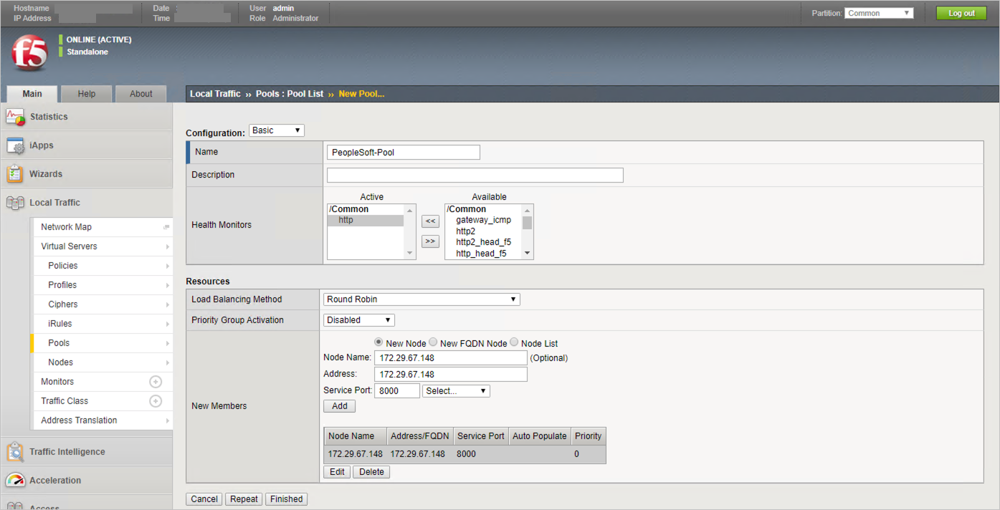


### Create a new Client SSL profile

Navigate to **Local Traffic > Profiles > SSL > Client > +**, complete the following information and click **Finished**.

* Name: `<Name>`
* Certificate: `<Certificate>`
* Key: `<Key>`

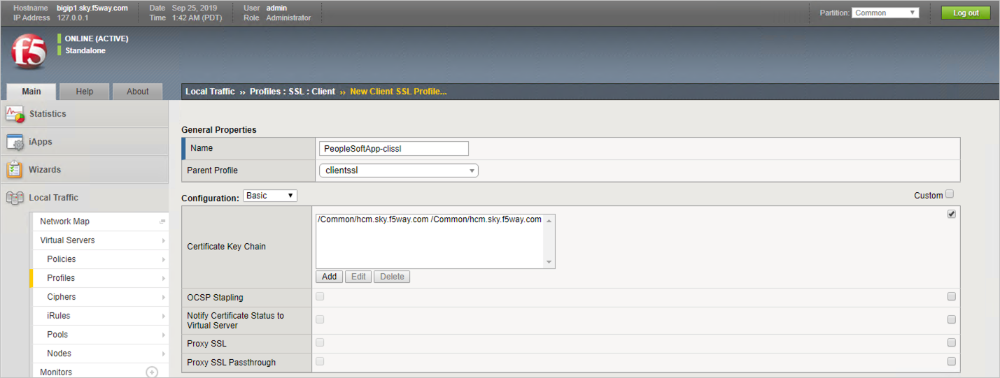

### Create a new Virtual Server

1. Navigate to **Local Traffic > Virtual Servers > Virtual Server List > +**, complete the following information and click **Finished**.
    * Name: `<Name>`
    * Destination Address/Mask: `<Address>`
    * Service Port: Port 443 HTTPS
    * HTTP Profile (Client): http

    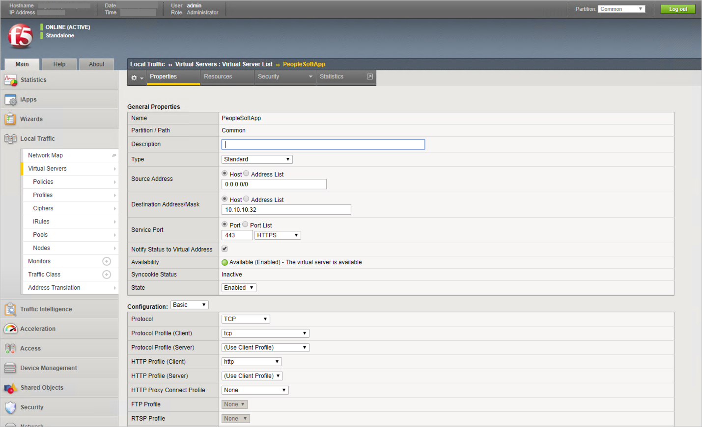

1. Fill the following values in the below page:

    * SSL Profile (Client): `<SSL Profile>`
    * Source Address Translation: Auto Map
    * Access Profile: `<Access Profile>`
    * Default Pool: `<Pool>`


    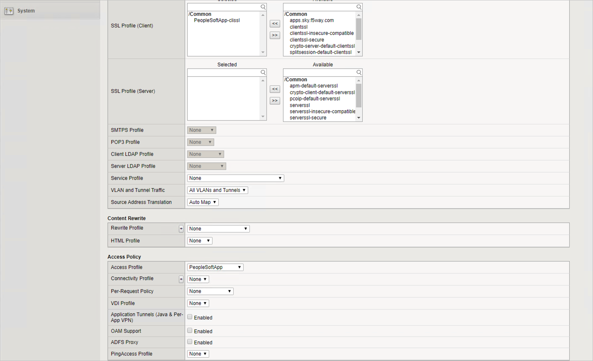

## Setting up PeopleSoft application to support F5 Big-IP APM as the single sign-on solution

>[!Note]
> Reference https://docs.oracle.com/cd/E12530_01/oam.1014/e10356/people.htm

1. Logon to Peoplesoft Console `https://<FQDN>.peoplesoft.f5.com/:8000/psp/ps/?cmd=start` using Admin credentials(Example: PS/PS).

    

1. In the PeopleSoft application, create **OAMPSFT** as a new user profile and associate a low security role such as **PeopleSoft User**.
Navigate to **Peopletools > Security > User Profiles > User Profiles** to create a new user profile, for example: **OAMPSFT** and Add **Peoplesoft User**.

    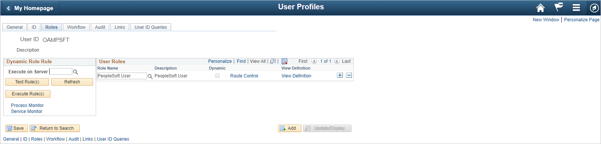

1. Access the web profile and enter **OAMPSFT** as the public access **user ID**.

    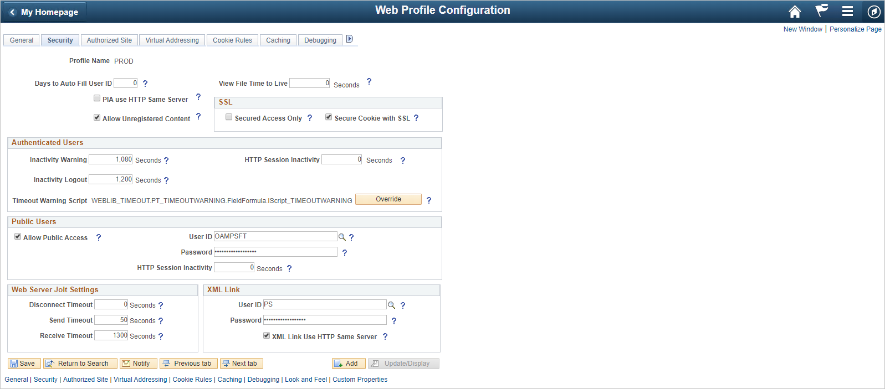

1. From the **PeopleTools Application Designer**, open the **FUNCLIB_LDAP** record.

    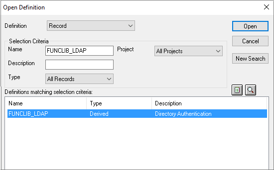

1. Update the user Header with **PS_SSO_UID** for **OAMSSO_AUTHENTICATION** function.
In the **getWWWAuthConfig()** function, replace the value that is assigned to the **&defaultUserId** with the **OAMPSFT** that we defined in the Web profile. Save the record definition.

    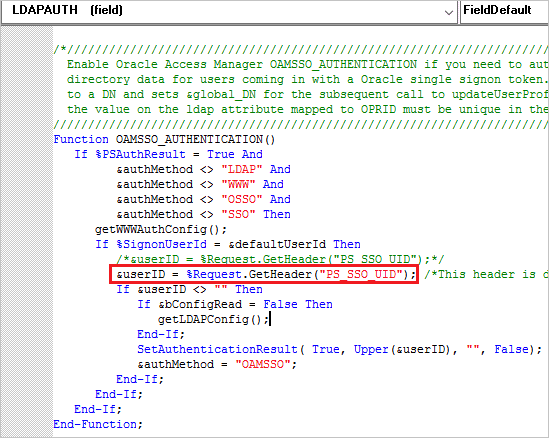

1. Access the **Signon PeopleCode** page (PeopleTools, Security, Security Objects, Signon PeopleCode) and enable the **OAMSSO_AUTHENTICATION** function—the Signon PeopleCode for Oracle Access Manager single signon.

    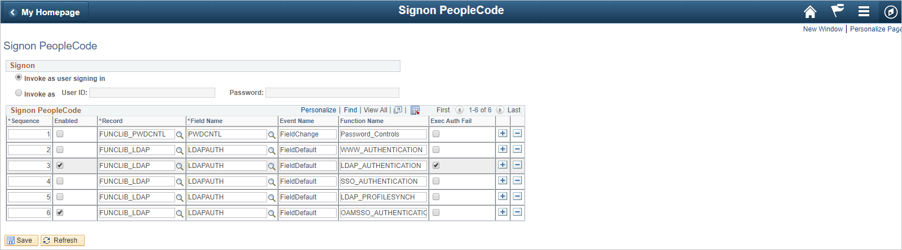

## Setting up F5 Big-IP APM to populate “PS_SSO_UID” HTTP Header with the PeopleSoft User ID

### Configuring Per-Request Policy
1. Navigate to **Access > Profile/Policies > Per-Request Policies**, click **Create**, complete the following information and click **Finished**.

    * Name: `<Name>`
    * Profile Type: All
    * Languages: `<Language>`

    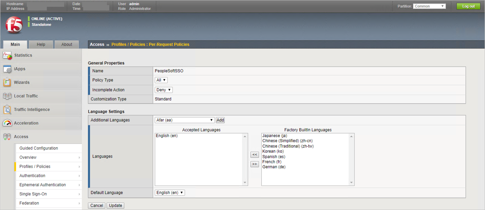

1. Click **Edit** Per-Request Policy `<Name>`
    

    `Header Name: <Header Name>`   
    `Header Value: <Header Value>`

### Assign Per-Request Policy to the Virtual Server

Navigate to **Local Traffic > Virtual Servers > Virtual Server List > PeopleSoftApp**
Specify `<Name>` as Per-Request Policy

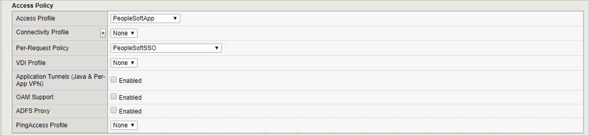

## Setting up F5 Big-IP APM to support Single Logout from PeopleSoft application

To add single logout support for all PeopleSoft users,please follow these steps:

1. Determine the correct logout URL for PeopleSoft portal
    * To determine the address that the PeopleSoft application uses to end a user session, you need to open the portal using any web browser and enable browser debug tools, as shown in the example below:

        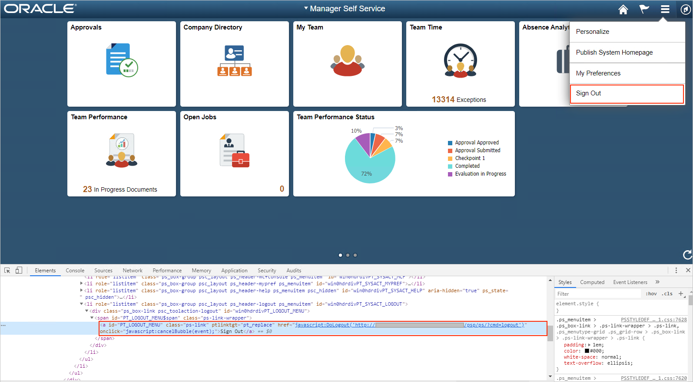

    * Find the element with the `PT_LOGOUT_MENU` id and save the URL path with the query parameters. In our example, we got the following value: `/psp/ps/?cmd=logout`

1. Create LTM iRule that will redirect the user to the APM logout URL: `/my.logout.php3`

    * Navigate to **Local Traffic > iRule**, click **Create**, complete the following information and click **Finished**.

      ```text
      Name: `<Name>`
      Definition:
                  _when HTTP_REQUEST {
                      switch -glob -- [HTTP::URI] {
                          `/psp/ps/?cmd=logout` {
                              HTTP::redirect `/my.logout.php3`
                          }
                      }
                  }_
      ```

1. Assign the created iRule to the Virtual Server

    * Navigate to **Local Traffic > Virtual Servers > Virtual Server List > PeopleSoftApp > Resources**. Click the **Manage…** button:   

    * Specify `<Name>` as Enabled iRule and click **Finished**.

        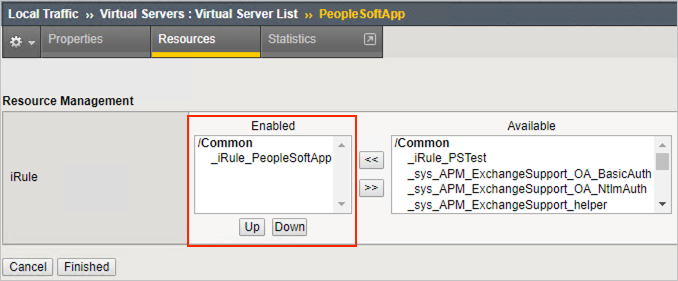

    * Give the **Name** textbox value as `<Name>` 

        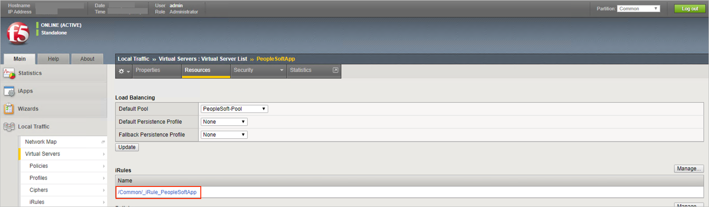


### Create Oracle PeopleSoft-Protected by F5 BIG-IP APM test user

In this section, you create a user called B.Simon in Oracle PeopleSoft-Protected by F5 BIG-IP APM. Work with [Oracle PeopleSoft-Protected by F5 BIG-IP APM support team](https://support.f5.com) to add the users in the Oracle PeopleSoft-Protected by F5 BIG-IP APM platform. Users must be created and activated before you use single sign-on.

## Test SSO 

In this section, you test your Azure AD single sign-on configuration with following options. 

#### SP initiated:

* Click on **Test this application** in Azure portal. This will redirect to Oracle PeopleSoft-Protected by F5 BIG-IP APM Sign on URL where you can initiate the login flow.  

* Go to Oracle PeopleSoft-Protected by F5 BIG-IP APM Sign-on URL directly and initiate the login flow from there.

#### IDP initiated:

* Click on **Test this application** in Azure portal and you should be automatically signed in to the Oracle PeopleSoft-Protected by F5 BIG-IP APM for which you set up the SSO. 

You can also use Microsoft My Apps to test the application in any mode. When you click the Oracle PeopleSoft-Protected by F5 BIG-IP APM tile in the My Apps, if configured in SP mode you would be redirected to the application sign on page for initiating the login flow and if configured in IDP mode, you should be automatically signed in to the Oracle PeopleSoft-Protected by F5 BIG-IP APM for which you set up the SSO. For more information about the My Apps, see [Introduction to the My Apps](https://support.microsoft.com/account-billing/sign-in-and-start-apps-from-the-my-apps-portal-2f3b1bae-0e5a-4a86-a33e-876fbd2a4510).

## Next steps

Once you configure Oracle PeopleSoft-Protected by F5 BIG-IP APM you can enforce session control, which protects exfiltration and infiltration of your organization’s sensitive data in real time. Session control extends from Conditional Access. [Learn how to enforce session control with Microsoft Defender for Cloud Apps](/cloud-app-security/proxy-deployment-any-app).
