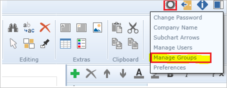
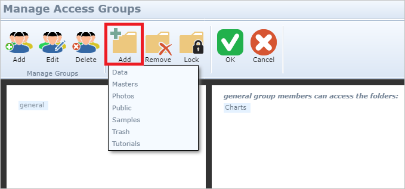
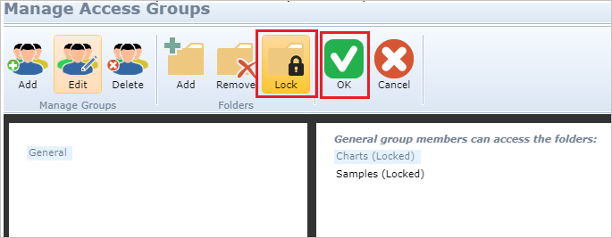
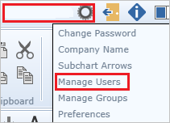
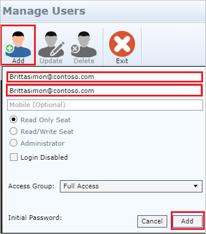

# Tutorial: Azure Active Directory integration with OrgChart Now

In this tutorial, you'll learn how to integrate OrgChart Now with Azure Active Directory (Azure AD). When you integrate OrgChart Now with Azure AD, you can:

* Control in Azure AD who has access to OrgChart Now.
* Enable your users to be automatically signed-in to OrgChart Now with their Azure AD accounts.
* Manage your accounts in one central location - the Azure portal.

## Prerequisites

To get started, you need the following items:

* An Azure AD subscription. If you don't have a subscription, you can get a [free account](https://azure.microsoft.com/free/).
* OrgChart Now single sign-on (SSO) enabled subscription.

## Scenario description

In this tutorial, you configure and test Azure AD single sign-on in a test environment.

* OrgChart Now supports **SP** and **IDP** initiated SSO.

> [!NOTE]
> Identifier of this application is a fixed string value so only one instance can be configured in one tenant.

## Add OrgChart Now from the gallery

To configure the integration of OrgChart Now into Azure AD, you need to add OrgChart Now from the gallery to your list of managed SaaS apps.

1. Sign in to the Azure portal using either a work or school account, or a personal Microsoft account.
1. On the left navigation pane, select the **Azure Active Directory** service.
1. Navigate to **Enterprise Applications** and then select **All Applications**.
1. To add new application, select **New application**.
1. In the **Add from the gallery** section, type **OrgChart Now** in the search box.
1. Select **OrgChart Now** from results panel and then add the app. Wait a few seconds while the app is added to your tenant.

## Configure and test Azure AD SSO for OrgChart Now

Configure and test Azure AD SSO with OrgChart Now using a test user called **B.Simon**. For SSO to work, you need to establish a link relationship between an Azure AD user and the related user in OrgChart Now.

To configure and test Azure AD SSO with OrgChart Now, perform the following steps:

1. **[Configure Azure AD SSO](#configure-azure-ad-sso)** - to enable your users to use this feature.
    1. **[Create an Azure AD test user](#create-an-azure-ad-test-user)** - to test Azure AD single sign-on with B.Simon.
    1. **[Assign the Azure AD test user](#assign-the-azure-ad-test-user)** - to enable B.Simon to use Azure AD single sign-on.
1. **[Configure OrgChart Now SSO](#configure-orgchart-now-sso)** - to configure the single sign-on settings on application side.
    1. **[Create OrgChart Now test user](#create-orgchart-now-test-user)** - to have a counterpart of B.Simon in OrgChart Now that is linked to the Azure AD representation of user.
1. **[Test SSO](#test-sso)** - to verify whether the configuration works.

## Configure Azure AD SSO 

Follow these steps to enable Azure AD SSO in the Azure portal.

1. In the Azure portal, on the **OrgChart Now** application integration page, find the **Manage** section and select **single sign-on**.
1. On the **Select a single sign-on method** page, select **SAML**.
1. On the **Set up single sign-on with SAML** page, click the pencil icon for **Basic SAML Configuration** to edit the settings.

   

4. On the **Basic SAML Configuration** section, If you wish to configure the application in **IDP** initiated mode, perform the following step:

    In the **Identifier** text box, type the URL:
    `https://sso2.orgchartnow.com`

5. Click **Set additional URLs** and perform the following step if you wish to configure the application in **SP** initiated mode:

    In the **Sign-on URL** text box, type a URL using the following pattern:
    `https://sso2.orgchartnow.com/Shibboleth.sso/Login?entityID=<YourEntityID>&target=https://sso2.orgchartnow.com`

	> [!NOTE]
	> `<YourEntityID>` is the **Azure AD Identifier** copied from the **Set up OrgChart Now** section, described later in tutorial.

6. On the **Set up Single Sign-On with SAML** page, in the **SAML Signing Certificate** section, click **Download** to download the **Federation Metadata XML** from the given options as per your requirement and save it on your computer.

	

7. On the **Set up OrgChart Now** section, copy the appropriate URL(s) as per your requirement.

	

### Create an Azure AD test user 

In this section, you'll create a test user in the Azure portal called B.Simon.

1. From the left pane in the Azure portal, select **Azure Active Directory**, select **Users**, and then select **All users**.
1. Select **New user** at the top of the screen.
1. In the **User** properties, follow these steps:
   1. In the **Name** field, enter `B.Simon`.  
   1. In the **User name** field, enter the username@companydomain.extension. For example, `B.Simon@contoso.com`.
   1. Select the **Show password** check box, and then write down the value that's displayed in the **Password** box.
   1. Click **Create**.

### Assign the Azure AD test user

In this section, you'll enable B.Simon to use Azure single sign-on by granting access to OrgChart Now.

1. In the Azure portal, select **Enterprise Applications**, and then select **All applications**.
1. In the applications list, select **OrgChart Now**.
1. In the app's overview page, find the **Manage** section and select **Users and groups**.
1. Select **Add user**, then select **Users and groups** in the **Add Assignment** dialog.
1. In the **Users and groups** dialog, select **B.Simon** from the Users list, then click the **Select** button at the bottom of the screen.
1. If you are expecting a role to be assigned to the users, you can select it from the **Select a role** dropdown. If no role has been set up for this app, you see "Default Access" role selected.
1. In the **Add Assignment** dialog, click the **Assign** button.

## Configure OrgChart Now SSO

To configure single sign-on on **OrgChart Now** side, you need to send the downloaded **Federation Metadata XML** and appropriate copied URLs from Azure portal to [OrgChart Now support team](mailto:ocnsupport@officeworksoftware.com). They set this setting to have the SAML SSO connection set properly on both sides.

### Create OrgChart Now test user

To enable Azure AD users to log in to OrgChart Now, they must be provisioned into OrgChart Now. 

1. OrgChart Now supports just-in-time provisioning, which is by default enabled. A new user is created during an attempt to access OrgChart Now if it doesn't exist yet. The just-in-time user provisioning feature will only create a **read-only** user when an SSO request comes from a recognized IDP and the email in the SAML assertion is not found in the user list. For this auto provisioning feature you need to create an access group titled **General** in OrgChart Now. Please follow the below steps to create an access group:

	a. Go to the **Manage Groups** option after clicking the **gear** in the top right corner of the UI.

   	  	

	b. Select the **Add** icon and name the group **General** then click **OK**. 

	  

	c. Select the folder(s) you wish the general or read-only users to be able to access:
	
	  

	d. **Lock** the folders so that only Admin users can modify them. Then press **OK**.

	  

2. To create **Admin** users and **read/write** users, you must manually create a user in order to get access to their privilege level via SSO. To provision a user account, perform the following steps:

	a. Log in to OrgChart Now as a Security Administrator.

	b. Click on **Settings** on the top right corner and then navigate to **Manage Users**.

	  

	c. Click on **Add** and perform the following steps:

	  

	1. In the **User ID** textbox, enter the User ID like **brittasimon\@contoso.com**.

	1. In **Email Address** text box, enter the email of user like **brittasimon\@contoso.com**.

	1. Click **Add**.

## Test SSO

In this section, you test your Azure AD single sign-on configuration with following options. 

#### SP initiated:

* Click on **Test this application** in Azure portal. This will redirect to OrgChart Now Sign on URL where you can initiate the login flow.  

* Go to OrgChart Now Sign-on URL directly and initiate the login flow from there.

#### IDP initiated:

* Click on **Test this application** in Azure portal and you should be automatically signed in to the OrgChart Now for which you set up the SSO. 

You can also use Microsoft My Apps to test the application in any mode. When you click the OrgChart Now tile in the My Apps, if configured in SP mode you would be redirected to the application sign on page for initiating the login flow and if configured in IDP mode, you should be automatically signed in to the OrgChart Now for which you set up the SSO. For more information about the My Apps, see [Introduction to the My Apps](../user-help/my-apps-portal-end-user-access.md).

## Next steps

Once you configure OrgChart Now you can enforce session control, which protects exfiltration and infiltration of your organization’s sensitive data in real time. Session control extends from Conditional Access. [Learn how to enforce session control with Microsoft Cloud App Security](/cloud-app-security/proxy-deployment-aad).
