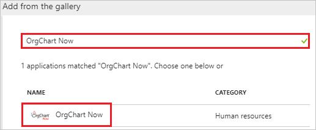
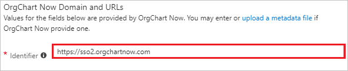
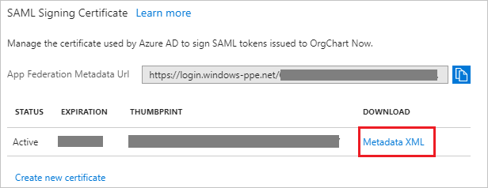
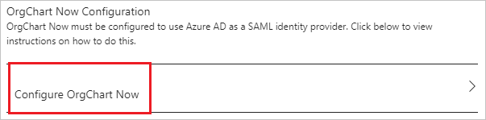
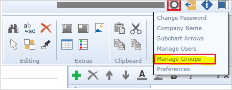
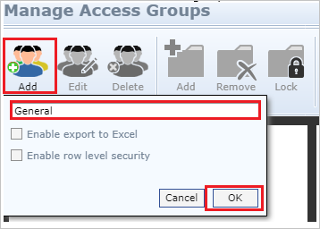
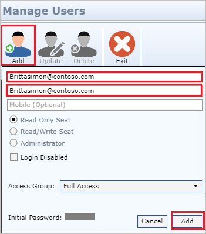
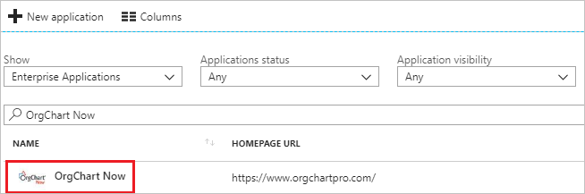

---
title: 'Tutorial: Azure Active Directory integration with OrgChart Now | Microsoft Docs'
description: Learn how to configure single sign-on between Azure Active Directory and OrgChart Now.
services: active-directory
documentationCenter: na
author: jeevansd
manager: femila
ms.reviewer: joflore

ms.assetid: 50a1522f-81de-4d14-9b6b-dd27bb1338a4
ms.service: active-directory
ms.component: saas-app-tutorial
ms.workload: identity
ms.tgt_pltfrm: na
ms.devlang: na
ms.topic: article
ms.date: 04/19/2018
ms.author: jeedes

---
# Tutorial: Azure Active Directory integration with OrgChart Now

In this tutorial, you learn how to integrate OrgChart Now with Azure Active Directory (Azure AD).

Integrating OrgChart Now with Azure AD provides you with the following benefits:

- You can control in Azure AD who has access to OrgChart Now.
- You can enable your users to automatically get signed-on to OrgChart Now (Single Sign-On) with their Azure AD accounts.
- You can manage your accounts in one central location - the Azure portal.

If you want to know more details about SaaS app integration with Azure AD, see [what is application access and single sign-on with Azure Active Directory](../manage-apps/what-is-single-sign-on.md).

## Prerequisites

To configure Azure AD integration with OrgChart Now, you need the following items:

- An Azure AD subscription
- An OrgChart Now single-sign on enabled subscription

> [!NOTE]
> To test the steps in this tutorial, we do not recommend using a production environment.

To test the steps in this tutorial, you should follow these recommendations:

- Do not use your production environment, unless it is necessary.
- If you don't have an Azure AD trial environment, you can [get a one-month trial](https://azure.microsoft.com/pricing/free-trial/).

## Scenario description
In this tutorial, you test Azure AD single sign-on in a test environment. 
The scenario outlined in this tutorial consists of two main building blocks:

1. Adding OrgChart Now from the gallery
1. Configuring and testing Azure AD single sign-on

## Adding OrgChart Now from the gallery
To configure the integration of OrgChart Now into Azure AD, you need to add OrgChart Now from the gallery to your list of managed SaaS apps.

**To add OrgChart Now from the gallery, perform the following steps:**

1. In the **[Azure portal](https://portal.azure.com)**, on the left navigation panel, click **Azure Active Directory** icon. 

	![The Azure Active Directory button][1]

1. Navigate to **Enterprise applications**. Then go to **All applications**.

	![The Enterprise applications blade][2]
	
1. To add new application, click **New application** button on the top of dialog.

	![The New application button][3]

1. In the search box, type **OrgChart Now**, select **OrgChart Now** from result panel then click **Add** button to add the application.

	

## Configure and test Azure AD single sign-on

In this section, you configure and test Azure AD single sign-on with OrgChart Now based on a test user called "Britta Simon".

For single sign-on to work, Azure AD needs to know what the counterpart user in OrgChart Now is to a user in Azure AD. In other words, a link relationship between an Azure AD user and the related user in OrgChart Now needs to be established.

To configure and test Azure AD single sign-on with OrgChart Now, you need to complete the following building blocks:

1. **[Configure Azure AD Single Sign-On](#configure-azure-ad-single-sign-on)** - to enable your users to use this feature.
1. **[Create an Azure AD test user](#create-an-azure-ad-test-user)** - to test Azure AD single sign-on with Britta Simon.
1. **[Create an OrgChart Now test user](#create-an-orgchart-now-test-user)** - to have a counterpart of Britta Simon in OrgChart Now that is linked to the Azure AD representation of user.
1. **[Assign the Azure AD test user](#assign-the-azure-ad-test-user)** - to enable Britta Simon to use Azure AD single sign-on.
1. **[Test single sign-on](#test-single-sign-on)** - to verify whether the configuration works.

### Configure Azure AD single sign-on

In this section, you enable Azure AD single sign-on in the Azure portal and configure single sign-on in your OrgChart Now application.

**To configure Azure AD single sign-on with OrgChart Now, perform the following steps:**

1. In the Azure portal, on the **OrgChart Now** application integration page, click **Single sign-on**.

	![Configure single sign-on link][4]

1. On the **Single sign-on** dialog, select **Mode** as	**SAML-based Sign-on** to enable single sign-on.
 
	

1. On the **OrgChart Now Domain and URLs** section, if you wish to configure the application in **IDP** initiated mode:

	

	In the **Identifier** textbox, type a URL: `https://sso2.orgchartnow.com`

1. Check **Show advanced URL settings** and perform the following step if you wish to configure the application in **SP** initiated mode:

	

    In the **Sign-on URL** textbox, type a URL using the following pattern: `https://sso2.orgchartnow.com/Shibboleth.sso/Login?entityID=<YourEntityID>&target=https://sso2.orgchartnow.com`
	 
	> [!NOTE]
	> `<YourEntityID>` is the SAML Entity ID copied from the Quick Reference section, described later in tutorial.

1. On the **SAML Signing Certificate** section, click **Metadata XML** and then save the metadata file on your computer.

	 

1. Click **Save** button.

	
	
1. On the **OrgChart Now Configuration** section, click **Configure OrgChart Now** to open **Configure sign-on** window. Copy the **SAML Entity ID** from the **Quick Reference section** and use it to complete **Sign-on URL** in **OrgChart Now Domain and URLs section**.

	 

1. To configure single sign-on on **OrgChart Now** side, you need to send the downloaded **Metadata XML** to [OrgChart Now support team](mailto:ocnsupport@officeworksoftware.com). They set this setting to have the SAML SSO connection set properly on both sides.

### Create an Azure AD test user

The objective of this section is to create a test user in the Azure portal called Britta Simon.

   ![Create an Azure AD test user][100]

**To create a test user in Azure AD, perform the following steps:**

1. In the Azure portal, in the left pane, click the **Azure Active Directory** button.

    

1. To display the list of users, go to **Users and groups**, and then click **All users**.

    

1. To open the **User** dialog box, click **Add** at the top of the **All Users** dialog box.

    

1. In the **User** dialog box, perform the following steps:

    

    a. In the **Name** box, type **BrittaSimon**.

    b. In the **User name** box, type the email address of user Britta Simon.

    c. Select the **Show Password** check box, and then write down the value that's displayed in the **Password** box.

    d. Click **Create**.
 
### Create an OrgChart Now test user

To enable Azure AD users to log in to OrgChart Now, they must be provisioned into OrgChart Now. 

1. OrgChart Now supports just-in-time provisioning, which is by default enabled. A new user is created during an attempt to access OrgChart Now if it doesn't exist yet. The just-in-time user provisioning feature will only create a **read-only** user when an SSO request comes from a recognized IDP and the email in the SAML assertion is not found in the user list. For this auto provisioning feature you need to create an access group titled **General** in OrgChart Now. Please follow the below steps to create an access group:

	a. Go to the **Manage Groups** option after clicking the **gear** in the top right corner of the UI.

    	

	b. Select the **Add** icon and name the group **General** then click **OK**. 

	

	c. Select the folder(s) you wish the general or read-only users to be able to access:

	

	d. **Lock** the folders so that only Admin users can modify them. Then press **OK**.

	

1. To create **Admin** users and **read/write** users, you must manually create a user in order to get access to their privilege level via SSO. To provision a user account, perform the following steps:

	a. Log in to OrgChart Now as a Security Administrator.

	b.  Click on **Settings** on the top right corner and then navigate to **Manage Users**.

	

	c. Click on **Add** and perform the following steps:

	

	* In the **User ID** textbox, enter the User ID like **brittasimon@contoso.com**.

	* In **Email Address** text box, enter the email of user like **brittasimon@contoso.com**.

	* Click **Add**.
	
### Assign the Azure AD test user

In this section, you enable Britta Simon to use Azure single sign-on by granting access to OrgChart Now.

![Assign the user role][200] 

**To assign Britta Simon to OrgChart Now, perform the following steps:**

1. In the Azure portal, open the applications view, and then navigate to the directory view and go to **Enterprise applications** then click **All applications**.

	![Assign User][201] 

1. In the applications list, select **OrgChart Now**.

	  

1. In the menu on the left, click **Users and groups**.

	![The "Users and groups" link][202]

1. Click **Add** button. Then select **Users and groups** on **Add Assignment** dialog.

	![The Add Assignment pane][203]

1. On **Users and groups** dialog, select **Britta Simon** in the Users list.

1. Click **Select** button on **Users and groups** dialog.

1. Click **Assign** button on **Add Assignment** dialog.
	
### Test single sign-on

In this section, you test your Azure AD single sign-on configuration using the Access Panel.

When you click the OrgChart Now tile in the Access Panel, you should get automatically signed-on to your OrgChart Now application.
For more information about the Access Panel, see [Introduction to the Access Panel](../user-help/active-directory-saas-access-panel-introduction.md). 

## Additional resources

* [List of Tutorials on How to Integrate SaaS Apps with Azure Active Directory](tutorial-list.md)
* [What is application access and single sign-on with Azure Active Directory?](../manage-apps/what-is-single-sign-on.md)

<!--Image references-->

[1]: ./media/orgchartnow-tutorial/tutorial_general_01.png
[2]: ./media/orgchartnow-tutorial/tutorial_general_02.png
[3]: ./media/orgchartnow-tutorial/tutorial_general_03.png
[4]: ./media/orgchartnow-tutorial/tutorial_general_04.png

[100]: ./media/orgchartnow-tutorial/tutorial_general_100.png

[200]: ./media/orgchartnow-tutorial/tutorial_general_200.png
[201]: ./media/orgchartnow-tutorial/tutorial_general_201.png
[202]: ./media/orgchartnow-tutorial/tutorial_general_202.png
[203]: ./media/orgchartnow-tutorial/tutorial_general_203.png

