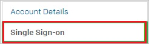
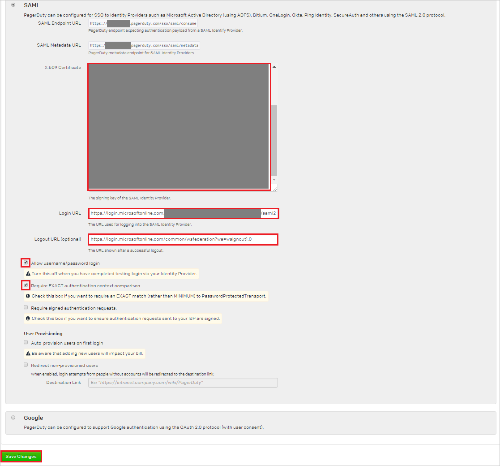
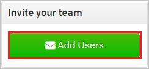
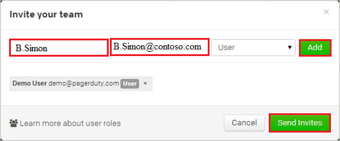

# Tutorial: Azure Active Directory single sign-on (SSO) integration with PagerDuty

In this tutorial, you'll learn how to integrate PagerDuty with Azure Active Directory (Azure AD). When you integrate PagerDuty with Azure AD, you can:

* Control in Azure AD who has access to PagerDuty.
* Enable your users to be automatically signed-in to PagerDuty with their Azure AD accounts.
* Manage your accounts in one central location - the Azure portal.

To learn more about SaaS app integration with Azure AD, see [What is application access and single sign-on with Azure Active Directory](https://docs.microsoft.com/azure/active-directory/manage-apps/what-is-single-sign-on).

## Prerequisites

To get started, you need the following items:

* An Azure AD subscription. If you don't have a subscription, you can get a [free account](https://azure.microsoft.com/free/).
* PagerDuty single sign-on (SSO) enabled subscription.

## Scenario description

In this tutorial, you configure and test Azure AD SSO in a test environment.

* PagerDuty supports **SP** initiated SSO
* Once you configure PagerDuty you can enforce session control, which protect exfiltration and infiltration of your organization’s sensitive data in real-time. Session control extend from Conditional Access. [Learn how to enforce session control with Microsoft Cloud App Security](https://docs.microsoft.com/cloud-app-security/proxy-deployment-any-app).

## Adding PagerDuty from the gallery

To configure the integration of PagerDuty into Azure AD, you need to add PagerDuty from the gallery to your list of managed SaaS apps.

1. Sign in to the [Azure portal](https://portal.azure.com) using either a work or school account, or a personal Microsoft account.
1. On the left navigation pane, select the **Azure Active Directory** service.
1. Navigate to **Enterprise Applications** and then select **All Applications**.
1. To add new application, select **New application**.
1. In the **Add from the gallery** section, type **PagerDuty** in the search box.
1. Select **PagerDuty** from results panel and then add the app. Wait a few seconds while the app is added to your tenant.

## Configure and test Azure AD single sign-on for PagerDuty

Configure and test Azure AD SSO with PagerDuty using a test user called **B.Simon**. For SSO to work, you need to establish a link relationship between an Azure AD user and the related user in PagerDuty.

To configure and test Azure AD SSO with PagerDuty, complete the following building blocks:

1. **[Configure Azure AD SSO](#configure-azure-ad-sso)** - to enable your users to use this feature.
    1. **[Create an Azure AD test user](#create-an-azure-ad-test-user)** - to test Azure AD single sign-on with B.Simon.
    1. **[Assign the Azure AD test user](#assign-the-azure-ad-test-user)** - to enable B.Simon to use Azure AD single sign-on.
1. **[Configure PagerDuty SSO](#configure-pagerduty-sso)** - to configure the single sign-on settings on application side.
    1. **[Create PagerDuty test user](#create-pagerduty-test-user)** - to have a counterpart of B.Simon in PagerDuty that is linked to the Azure AD representation of user.
1. **[Test SSO](#test-sso)** - to verify whether the configuration works.

## Configure Azure AD SSO

Follow these steps to enable Azure AD SSO in the Azure portal.

1. In the [Azure portal](https://portal.azure.com/), on the **PagerDuty** application integration page, find the **Manage** section and select **single sign-on**.
1. On the **Select a single sign-on method** page, select **SAML**.
1. On the **Set up single sign-on with SAML** page, click the edit/pen icon for **Basic SAML Configuration** to edit the settings.

   

1. On the **Basic SAML Configuration** section, perform the following steps:

	a. In the **Sign on URL** text box, type a URL using the following pattern:
    `https://<tenant-name>.pagerduty.com`

    b. In the **Identifier (Entity ID)** text box, type a URL using the following pattern:
    `https://<tenant-name>.pagerduty.com`

    c. In the **Reply URL** text box, type a URL using the following pattern:
    `https://<tenant-name>.pagerduty.com`

	> [!NOTE]
	> These values are not real. Update these values with the actual Sign on URL, Identifier and Reply URL. Contact [PagerDuty Client support team](https://www.pagerduty.com/support/) to get these values. You can also refer to the patterns shown in the **Basic SAML Configuration** section in the Azure portal.

1. On the **Set up single sign-on with SAML** page, in the **SAML Signing Certificate** section,  find **Certificate (Base64)** and select **Download** to download the certificate and save it on your computer.

	

1. On the **Set up PagerDuty** section, copy the appropriate URL(s) based on your requirement.

	

### Create an Azure AD test user

In this section, you'll create a test user in the Azure portal called B.Simon.

1. From the left pane in the Azure portal, select **Azure Active Directory**, select **Users**, and then select **All users**.
1. Select **New user** at the top of the screen.
1. In the **User** properties, follow these steps:
   1. In the **Name** field, enter `B.Simon`.  
   1. In the **User name** field, enter the username@companydomain.extension. For example, `B.Simon@contoso.com`.
   1. Select the **Show password** check box, and then write down the value that's displayed in the **Password** box.
   1. Click **Create**.

### Assign the Azure AD test user

In this section, you'll enable B.Simon to use Azure single sign-on by granting access to PagerDuty.

1. In the Azure portal, select **Enterprise Applications**, and then select **All applications**.
1. In the applications list, select **PagerDuty**.
1. In the app's overview page, find the **Manage** section and select **Users and groups**.

   

1. Select **Add user**, then select **Users and groups** in the **Add Assignment** dialog.

	

1. In the **Users and groups** dialog, select **B.Simon** from the Users list, then click the **Select** button at the bottom of the screen.
1. If you're expecting any role value in the SAML assertion, in the **Select Role** dialog, select the appropriate role for the user from the list and then click the **Select** button at the bottom of the screen.
1. In the **Add Assignment** dialog, click the **Assign** button.

## Configure PagerDuty SSO

1. In a different web browser window, sign into your Pagerduty company site as an administrator.

2. In the menu on the top, click **Account Settings**.

    

3. Click **Single Sign-on**.

    

4. On the **Enable Single Sign-on (SSO)** page, perform the following steps:

    

    a. Open your base-64 encoded certificate downloaded from Azure portal in notepad, copy the content of it into your clipboard, and then paste it to the **X.509 Certificate** textbox
  
    b. In the **Login URL** textbox, paste **Login URL** which you have copied from Azure portal.
  
    c. In the **Logout URL** textbox, paste **Logout URL** which you have copied from Azure portal.

    d. Select **Allow username/password login**.

	e. Select **Require EXACT authentication context comparison** checkbox.

    f. Click **Save Changes**.

### Create PagerDuty test user

To enable Azure AD users to sign into PagerDuty, they must be provisioned into PagerDuty. In the case of PagerDuty, provisioning is a manual task.

> [!NOTE]
> You can use any other Pagerduty user account creation tools or APIs provided by Pagerduty to provision Azure Active Directory user accounts.

**To provision a user account, perform the following steps:**

1. Sign into your **Pagerduty** tenant.

2. In the menu on the top, click **Users**.

3. Click **Add Users**.
   
    

4.  On the **Invite your team** dialog, perform the following steps:
   
    

    a. Type the **First and Last Name** of user like **B.Simon**. 
   
    b. Enter **Email** address of user like **b.simon\@contoso.com**.
   
    c. Click **Add**, and then click **Send Invites**.
   
    > [!NOTE]
    > All added users will receive an invite to create a PagerDuty account.

## Test SSO 

In this section, you test your Azure AD single sign-on configuration using the Access Panel.

When you click the PagerDuty tile in the Access Panel, you should be automatically signed in to the PagerDuty for which you set up SSO. For more information about the Access Panel, see [Introduction to the Access Panel](https://docs.microsoft.com/azure/active-directory/active-directory-saas-access-panel-introduction).

## Additional resources

- [ List of Tutorials on How to Integrate SaaS Apps with Azure Active Directory ](https://docs.microsoft.com/azure/active-directory/active-directory-saas-tutorial-list)

- [What is application access and single sign-on with Azure Active Directory? ](https://docs.microsoft.com/azure/active-directory/active-directory-appssoaccess-whatis)

- [What is conditional access in Azure Active Directory?](https://docs.microsoft.com/azure/active-directory/conditional-access/overview)

- [Try PagerDuty with Azure AD](https://aad.portal.azure.com/)

- [What is session control in Microsoft Cloud App Security?](https://docs.microsoft.com/cloud-app-security/proxy-intro-aad)

- [How to protect PagerDuty with advanced visibility and controls](https://docs.microsoft.com/cloud-app-security/proxy-intro-aad)

