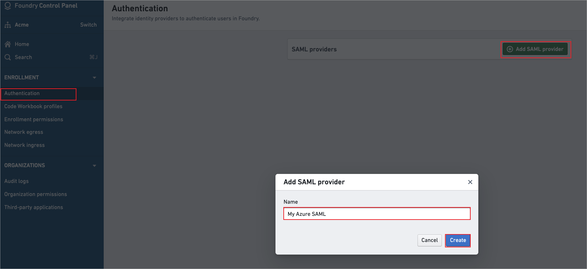
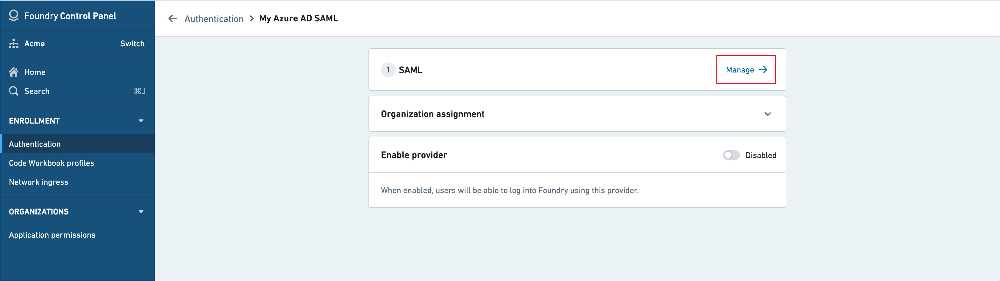
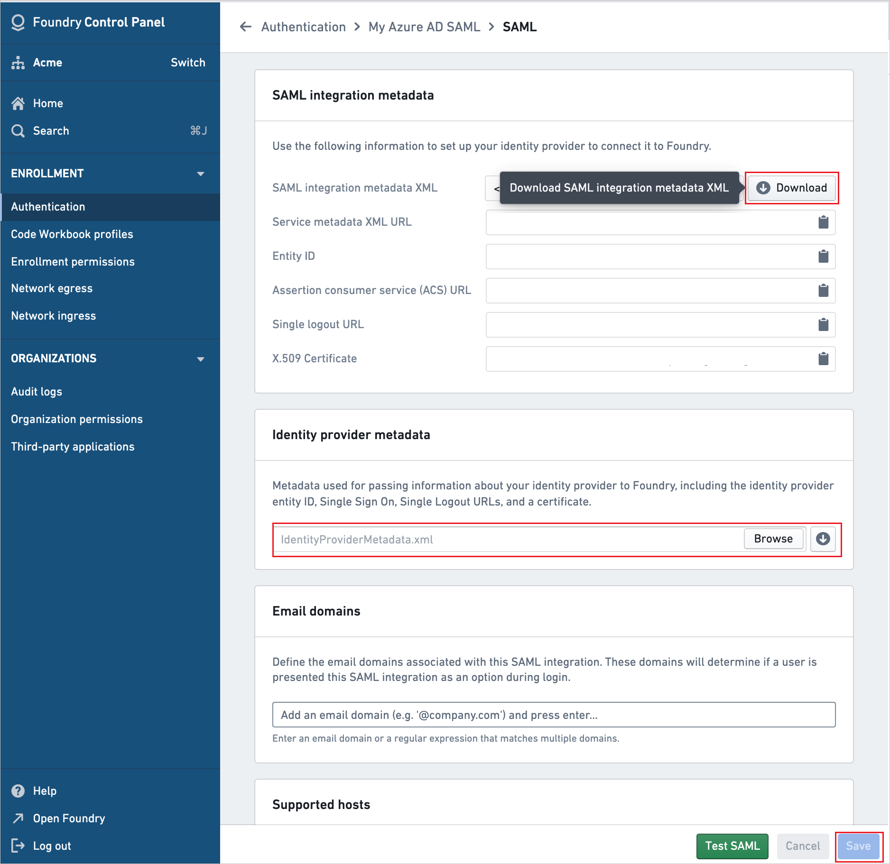

# Tutorial: Azure AD SSO integration with Palantir Foundry

In this tutorial, you'll learn how to integrate Palantir Foundry with Azure Active Directory (Azure AD). When you integrate Palantir Foundry with Azure AD, you can:

* Control in Azure AD who has access to Palantir Foundry.
* Enable your users to be automatically signed-in to Palantir Foundry with their Azure AD accounts.
* Manage your accounts in one central location - the Azure portal.

## Prerequisites

To get started, you need the following items:

* An Azure AD subscription. If you don't have a subscription, you can get a [free account](https://azure.microsoft.com/free/).
* Palantir Foundry single sign-on (SSO) enabled subscription.

## Scenario description

In this tutorial, you configure and test Azure AD SSO in a test environment.

* Palantir Foundry supports **SP and IDP** initiated SSO.
* Palantir Foundry supports **Just In Time** user provisioning.

## Add Palantir Foundry from the gallery

To configure the integration of Palantir Foundry into Azure AD, you need to add Palantir Foundry from the gallery to your list of managed SaaS apps.

1. Sign in to the Azure portal using either a work or school account, or a personal Microsoft account.
1. On the left navigation pane, select the **Azure Active Directory** service.
1. Navigate to **Enterprise Applications** and then select **All Applications**.
1. To add new application, select **New application**.
1. In the **Add from the gallery** section, type **Palantir Foundry** in the search box.
1. Select **Palantir Foundry** from results panel and then add the app. Wait a few seconds while the app is added to your tenant.

## Configure and test Azure AD SSO for Palantir Foundry

Configure and test Azure AD SSO with Palantir Foundry using a test user called **B.Simon**. For SSO to work, you need to establish a link relationship between an Azure AD user and the related user in Palantir Foundry.

To configure and test Azure AD SSO with Palantir Foundry, perform the following steps:

1. **[Configure Azure AD SSO](#configure-azure-ad-sso)** - to enable your users to use this feature.
    1. **[Create an Azure AD test user](#create-an-azure-ad-test-user)** - to test Azure AD single sign-on with B.Simon.
    1. **[Assign the Azure AD test user](#assign-the-azure-ad-test-user)** - to enable B.Simon to use Azure AD single sign-on.
1. **[Configure Palantir Foundry SSO](#configure-palantir-foundry-sso)** - to configure the single sign-on settings on application side.
    1. **[Create Palantir Foundry test user](#create-palantir-foundry-test-user)** - to have a counterpart of B.Simon in Palantir Foundry that is linked to the Azure AD representation of user.
1. **[Test SSO](#test-sso)** - to verify whether the configuration works.

## Configure Azure AD SSO

Follow these steps to enable Azure AD SSO in the Azure portal.

1. In the Azure portal, on the **Palantir Foundry** application integration page, find the **Manage** section and select **single sign-on**.
1. On the **Select a single sign-on method** page, select **SAML**.
1. Select **Upload metadata file**, select the metadata file which you have downloaded in the **[Configure Palantir Foundry SSO](#configure-palantir-foundry-sso)** section, and then select **Add**.

   

1. When the metadata file is successfully uploaded, the values for **Identifier**, **Reply URL** and **Logout URL** appear automatically in the Palantir Foundry section text box.

    > [!Note]
    > If the **Identifier**, **Reply URL** and **Logout URL** values don't appear automatically, fill in the values manually which can be found in Foundry Control Panel.

1. On the **Set up single sign-on with SAML** page, in the **SAML Signing Certificate** section,  find **Federation Metadata XML** and select **Download** to download the certificate and save it on your computer.

	

### Create an Azure AD test user

In this section, you'll create a test user in the Azure portal called B.Simon.

1. From the left pane in the Azure portal, select **Azure Active Directory**, select **Users**, and then select **All users**.
1. Select **New user** at the top of the screen.
1. In the **User** properties, follow these steps:
   1. In the **Name** field, enter `B.Simon`.  
   1. In the **User name** field, enter the username@companydomain.extension. For example, `B.Simon@contoso.com`.
   1. Select the **Show password** check box, and then write down the value that's displayed in the **Password** box.
   1. Click **Create**.

### Assign the Azure AD test user

In this section, you'll enable B.Simon to use Azure single sign-on by granting access to Palantir Foundry.

1. In the Azure portal, select **Enterprise Applications**, and then select **All applications**.
1. In the applications list, select **Palantir Foundry**.
1. In the app's overview page, find the **Manage** section and select **Users and groups**.
1. Select **Add user**, then select **Users and groups** in the **Add Assignment** dialog.
1. In the **Users and groups** dialog, select **B.Simon** from the Users list, then click the **Select** button at the bottom of the screen.
1. If you are expecting a role to be assigned to the users, you can select it from the **Select a role** dropdown. If no role has been set up for this app, you see "Default Access" role selected.
1. In the **Add Assignment** dialog, click the **Assign** button.

## Configure Palantir Foundry SSO

1. In Foundry Control Panel, go to the **Authentication** tab and click **Add SAML provider**. 

    

1. Give a valid SAML provider name and click **Create**.

1. Click **Manage** in the **SAML** section.

    

1. Perform the following steps in the **SAML** section:

    

    a. In the SAML integration metadata section, download the **SAML integration metadata XML**, and save it as file in your computer.

    b. In the Identity provider metadata section, click on **Browse** to upload the **Federation Metadata XML** file which you have downloaded from the Azure portal.

    c. Click **Save**.

### Create Palantir Foundry test user

In this section, a user called Britta Simon is created in Palantir Foundry. Palantir Foundry supports just-in-time user provisioning, which is enabled by default. There is no action item for you in this section. If a user doesn't already exist in Palantir Foundry, a new one is created after authentication.

## Test SSO 

In this section, you test your Azure AD single sign-on configuration with following options. 

#### SP initiated:

* Click on **Test this application** in Azure portal. This will redirect to Palantir Foundry Sign on URL where you can initiate the login flow.  

* Go to Palantir Foundry Sign-on URL directly and initiate the login flow from there.

#### IDP initiated:

* Click on **Test this application** in Azure portal and you should be automatically signed in to the Palantir Foundry for which you set up the SSO. 

You can also use Microsoft My Apps to test the application in any mode. When you click the Palantir Foundry tile in the My Apps, if configured in SP mode you would be redirected to the application sign on page for initiating the login flow and if configured in IDP mode, you should be automatically signed in to the Palantir Foundry for which you set up the SSO. For more information about the My Apps, see [Introduction to the My Apps](../user-help/my-apps-portal-end-user-access.md).

## Next steps

Once you configure Palantir Foundry you can enforce session control, which protects exfiltration and infiltration of your organization’s sensitive data in real time. Session control extends from Conditional Access. [Learn how to enforce session control with Microsoft Cloud App Security](/cloud-app-security/proxy-deployment-aad).
