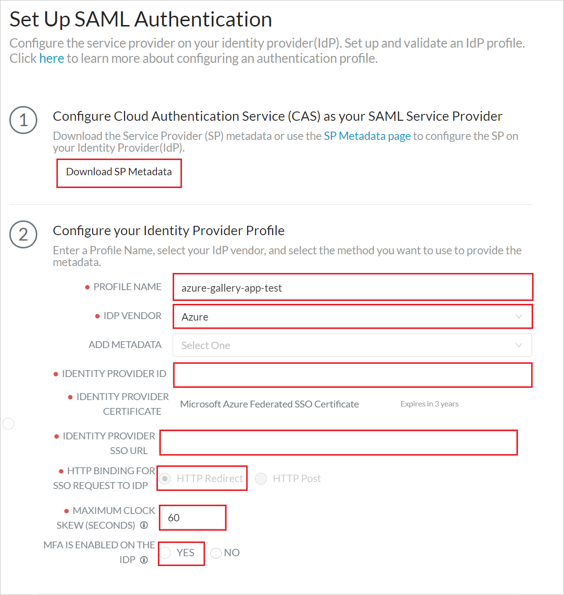
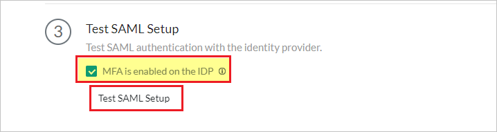
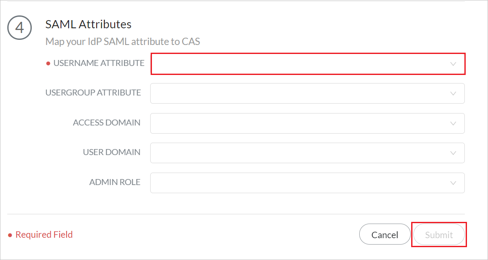

# Tutorial: Microsoft Entra single sign-on (SSO) integration with Palo Alto Networks Cloud Identity Engine - Cloud Authentication Service

In this tutorial, you'll learn how to integrate Palo Alto Networks Cloud Identity Engine - Cloud Authentication Service with Microsoft Entra ID. When you integrate Palo Alto Networks Cloud Identity Engine - Cloud Authentication Service with Microsoft Entra ID, you can:

* Control in Microsoft Entra ID who has access to Palo Alto Networks Cloud Identity Engine - Cloud Authentication Service.
* Enable your users to be automatically signed-in to Palo Alto Networks Cloud Identity Engine - Cloud Authentication Service with their Microsoft Entra accounts.
* Manage your accounts in one central location.

## Prerequisites

To get started, you need the following items:

* A Microsoft Entra subscription. If you don't have a subscription, you can get a [free account](https://azure.microsoft.com/free/).
* Palo Alto Networks Cloud Identity Engine - Cloud Authentication Service single sign-on (SSO) enabled subscription.

## Scenario description

In this tutorial, you configure and test Microsoft Entra SSO in a test environment.

* Palo Alto Networks Cloud Identity Engine - Cloud Authentication Service supports **SP** initiated SSO.

* Palo Alto Networks Cloud Identity Engine - Cloud Authentication Service supports **Just In Time** user provisioning.

## Add Palo Alto Networks Cloud Identity Engine - Cloud Authentication Service from the gallery

To configure the integration of Palo Alto Networks Cloud Identity Engine - Cloud Authentication Service into Microsoft Entra ID, you need to add Palo Alto Networks Cloud Identity Engine - Cloud Authentication Service from the gallery to your list of managed SaaS apps.

1. Sign in to the [Microsoft Entra admin center](https://entra.microsoft.com) as at least a [Cloud Application Administrator](../roles/permissions-reference.md#cloud-application-administrator).
1. Browse to **Identity** > **Applications** > **Enterprise applications** > **New application**.
1. In the **Add from the gallery** section, type **Palo Alto Networks Cloud Identity Engine - Cloud Authentication Service** in the search box.
1. Select **Palo Alto Networks Cloud Identity Engine - Cloud Authentication Service** from results panel and then add the app. Wait a few seconds while the app is added to your tenant.

 Alternatively, you can also use the [Enterprise App Configuration Wizard](https://portal.office.com/AdminPortal/home?Q=Docs#/azureadappintegration). In this wizard, you can add an application to your tenant, add users/groups to the app, assign roles, as well as walk through the SSO configuration as well. [Learn more about Microsoft 365 wizards.](/microsoft-365/admin/misc/azure-ad-setup-guides)

## Configure and test Microsoft Entra SSO for Palo Alto Networks Cloud Identity Engine - Cloud Authentication Service

Configure and test Microsoft Entra SSO with Palo Alto Networks Cloud Identity Engine - Cloud Authentication Service using a test user called **B.Simon**. For SSO to work, you need to establish a link relationship between a Microsoft Entra user and the related user in Palo Alto Networks Cloud Identity Engine - Cloud Authentication Service.

To configure and test Microsoft Entra SSO with Palo Alto Networks Cloud Identity Engine - Cloud Authentication Service, perform the following steps:

1. **[Configure Microsoft Entra SSO](#configure-azure-ad-sso)** - to enable your users to use this feature.
    1. **[Create a Microsoft Entra test user](#create-an-azure-ad-test-user)** - to test Microsoft Entra single sign-on with B.Simon.
    1. **[Assign the Microsoft Entra test user](#assign-the-azure-ad-test-user)** - to enable B.Simon to use Microsoft Entra single sign-on.
1. **[Configure Palo Alto Networks Cloud Identity Engine - Cloud Authentication Service SSO](#configure-palo-alto-networks-cloud-identity-engine---cloud-authentication-service-sso)** - to configure the single sign-on settings on application side.
    1. **[Create Palo Alto Networks Cloud Identity Engine - Cloud Authentication Service test user](#create-palo-alto-networks-cloud-identity-engine---cloud-authentication-service-test-user)** - to have a counterpart of B.Simon in Palo Alto Networks Cloud Identity Engine - Cloud Authentication Service that is linked to the Microsoft Entra representation of user.
1. **[Test SSO](#test-sso)** - to verify whether the configuration works.

## Configure Microsoft Entra SSO

Follow these steps to enable Microsoft Entra SSO.

1. Sign in to the [Microsoft Entra admin center](https://entra.microsoft.com) as at least a [Cloud Application Administrator](../roles/permissions-reference.md#cloud-application-administrator).
1. Browse to **Identity** > **Applications** > **Enterprise applications** > **Palo Alto Networks Cloud Identity Engine - Cloud Authentication Service** > **Single sign-on**.
1. On the **Select a single sign-on method** page, select **SAML**.
1. On the **Set up single sign-on with SAML** page, click the pencil icon for **Basic SAML Configuration** to edit the settings.

   

1. On the **Basic SAML Configuration** section, if you have **Service Provider metadata file**, perform the following steps:

	a. Click **Upload metadata file**.

    

	b. Click on **folder logo** to select the metadata file and click **Upload**.

	

	c. After the metadata file is successfully uploaded, the **Identifier** value gets auto populated in Basic SAML Configuration section.

	d. In the **Sign-on URL** text box, type a URL using the following pattern:
    `https://<RegionUrl>.paloaltonetworks.com/sp/acs`

	> [!Note]
	> If the **Identifier** value does not get auto populated, then please fill in the value manually according to your requirement. The Sign-on URL value is not real. Update this value with the actual Sign-on URL. Contact [Palo Alto Networks Cloud Identity Engine - Cloud Authentication Service Client support team](mailto:support@paloaltonetworks.com) to get this value. You can also refer to the patterns shown in the **Basic SAML Configuration** section.

1. Palo Alto Networks Cloud Identity Engine - Cloud Authentication Service application expects the SAML assertions in a specific format, which requires you to add custom attribute mappings to your SAML token attributes configuration. The following screenshot shows the list of default attributes.

	

1. In addition to above, Palo Alto Networks Cloud Identity Engine - Cloud Authentication Service application expects few more attributes to be passed back in SAML response which are shown below. These attributes are also pre populated but you can review them as per your requirements.
	
	| Name | Source Attribute|
	| ---------------| --------- |
	| Group |  user.groups |
	| username | user.userprincipalname |

1. On the **Set up single sign-on with SAML** page, In the **SAML Signing Certificate** section, click copy button to copy **App Federation Metadata Url** and save it on your computer.

	

### Create a Microsoft Entra test user

In this section, you'll create a test user called B.Simon.

1. Sign in to the [Microsoft Entra admin center](https://entra.microsoft.com) as at least a [User Administrator](../roles/permissions-reference.md#user-administrator).
1. Browse to **Identity** > **Users** > **All users**.
1. Select **New user** > **Create new user**, at the top of the screen.
1. In the **User** properties, follow these steps:
   1. In the **Display name** field, enter `B.Simon`.  
   1. In the **User principal name** field, enter the username@companydomain.extension. For example, `B.Simon@contoso.com`.
   1. Select the **Show password** check box, and then write down the value that's displayed in the **Password** box.
   1. Select **Review + create**.
1. Select **Create**.

### Assign the Microsoft Entra test user

In this section, you'll enable B.Simon to use single sign-on by granting access to Palo Alto Networks Cloud Identity Engine - Cloud Authentication Service.

1. Sign in to the [Microsoft Entra admin center](https://entra.microsoft.com) as at least a [Cloud Application Administrator](../roles/permissions-reference.md#cloud-application-administrator).
1. Browse to **Identity** > **Applications** > **Enterprise applications** > **Palo Alto Networks Cloud Identity Engine - Cloud Authentication Service**.
1. In the app's overview page, select **Users and groups**.
1. Select **Add user/group**, then select **Users and groups** in the **Add Assignment** dialog.
   1. In the **Users and groups** dialog, select **B.Simon** from the Users list, then click the **Select** button at the bottom of the screen.
   1. If you are expecting a role to be assigned to the users, you can select it from the **Select a role** dropdown. If no role has been set up for this app, you see "Default Access" role selected.
   1. In the **Add Assignment** dialog, click the **Assign** button.

## Configure Palo Alto Networks Cloud Identity Engine - Cloud Authentication Service SSO

1. Log in to your Palo Alto Networks Cloud Identity Engine - Cloud Authentication Service company site as an administrator.

1. Navigate to **Authentication** > **Identity Providers** and click **Add Identity Provider**.

	 

1. In the **Set Up SAML Authentication** page, perform the following steps.

	 

	a. From Step 1, click **Download SP Metadata** to download the metadata file and save it on your computer.

	b. From Step 2, fill the required fields to **Configure your Identity Provider Profile** which you copied previously. 

	c. From Step 3, click **Test SAML Setup** to verify the profile configuration and select **MFA is enabled on the IDP**.

	

	> [!NOTE]
	> To Test the **Palo Alto Networks Cloud Identity Engine - Cloud Authentication Service**  SSO, open the **Palo Alto Networks Cloud Identity Engine - Cloud Authentication Service** console and click **Test Connection** button and authenticate using the test account which you have created in the **Create a Microsoft Entra test user** section. 

	d. From Step 4, enter the **USERNAME ATTRIBUTE** and click **Submit**. 

	

### Create Palo Alto Networks Cloud Identity Engine - Cloud Authentication Service test user

In this section, a user called Britta Simon is created in **Palo Alto Networks Cloud Identity Engine - Cloud Authentication Service**. **Palo Alto Networks Cloud Identity Engine - Cloud Authentication Service** supports just-in-time user provisioning, which is enabled by default. There is no action item for you in this section. If a user doesn't already exist in **Palo Alto Networks Cloud Identity Engine - Cloud Authentication Service**, a new one is created after authentication.

## Test SSO 

To Test the **Palo Alto Networks Cloud Identity Engine - Cloud Authentication Service** SSO, open the **Palo Alto Networks Cloud Identity Engine - Cloud Authentication Service** console and click **Test Connection** button and authenticate using the test account which you have created in the **Create a Microsoft Entra test user** section.

## Next Steps

Once you configure **Palo Alto Networks Cloud Identity Engine - Cloud Authentication Service** you can enforce session control, which protects exfiltration and infiltration of your organization’s sensitive data in real time. Session control extends from Conditional Access. [Learn how to enforce session control with Microsoft Defender for Cloud Apps](/cloud-app-security/proxy-deployment-aad).
