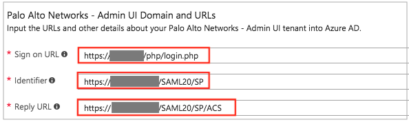
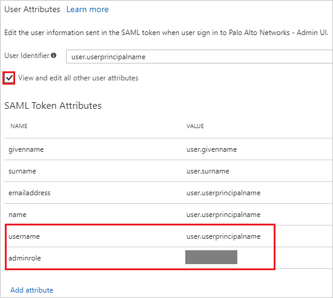
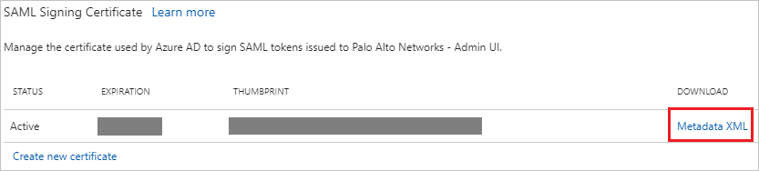

---
title: 'Tutorial: Azure Active Directory integration with Palo Alto Networks - Admin UI | Microsoft Docs'
description: Learn how to configure single sign-on between Azure Active Directory and Palo Alto Networks - Admin UI.
services: active-directory
documentationCenter: na
author: jeevansd
manager: mtillman
ms.reviewer: joflore

ms.assetid: a826eaec-15af-4c85-8855-8a3374d1efb9
ms.service: active-directory
ms.component: saas-app-tutorial
ms.workload: identity
ms.tgt_pltfrm: na
ms.devlang: na
ms.topic: article
ms.date: 06/12/2018
ms.author: jeedes

---
# Integrate Azure Active Directory with Palo Alto Networks - Admin UI

In this tutorial, you learn how to integrate Azure Active Directory (Azure AD) with Palo Alto Networks - Admin UI.

By integrating Azure AD with Palo Alto Networks - Admin UI, you get the following benefits:

- You can control in Azure AD who has access to Palo Alto Networks - Admin UI.
- You can enable your users to get signed in automatically to Palo Alto Networks - Admin UI (single sign-on, or SSO) with their Azure AD accounts.
- You can manage your accounts in one central location, the Azure portal.

To learn about SaaS app integration with Azure AD, see [What is application access and single sign-on with Azure Active Directory?](../manage-apps/what-is-single-sign-on.md).

## Prerequisites

To configure Azure AD integration with Palo Alto Networks - Admin UI, you need the following items:

- An Azure AD subscription
- A Palo Alto Networks Next-Generation Firewall or Panorama (centralized management system for the firewalls)

> [!NOTE]
> When you test the steps in this tutorial, we recommend that you do *not* use a production environment.

To test the steps in this tutorial, follow these recommendations:

- Do not use your production environment, unless it is necessary.
- If you don't have an Azure AD trial environment, you can [get a one-month trial](https://azure.microsoft.com/pricing/free-trial/).

## Scenario description
In this tutorial, you test Azure AD single sign-on in a test environment. 

The scenario that's outlined in this tutorial consists of two main building blocks:

* Adding Palo Alto Networks - Admin UI from the gallery
* Configuring and testing Azure AD single sign-on

## Add Palo Alto Networks - Admin UI from the gallery
To configure the integration of Azure AD with Palo Alto Networks - Admin UI, add Palo Alto Networks - Admin UI from the gallery to your list of managed SaaS apps by doing the following:

1. In the [Azure portal](https://portal.azure.com), in the left pane, select **Azure Active Directory**. 

	![The Azure Active Directory button][1]

1. Select **Enterprise applications** > **All applications**.

	![The "Enterprise applications" window][2]
	
1. To add a new application, select the **New application** button at the top of window.

	![The "New application" button][3]

1. In the search box, type **Palo Alto Networks - Admin UI**, select **Palo Alto Networks - Admin UI** in the results list, and then select **Add**.

	

## Configure and test Azure AD single sign-on

In this section, you configure and test Azure AD single sign-on with Palo Alto Networks - Admin UI, based on a test user called "Britta Simon."

For single sign-on to work, Azure AD needs to identify the Palo Alto Networks - Admin UI user and its counterpart in Azure AD. In other words, a link relationship between an Azure AD user and the same user in Palo Alto Networks - Admin UI must be established.

To establish the link relationship, assign as the Palo Alto Networks - Admin UI *Username* the value of the *user name* in Azure AD.

To configure and test Azure AD single sign-on with Palo Alto Networks - Admin UI, complete the building blocks in the next five sections.

### Configure Azure AD single sign-on

Enable Azure AD single sign-on in the Azure portal and configure single sign-on in your Palo Alto Networks - Admin UI application by doing the following:

1. In the Azure portal, on the **Palo Alto Networks - Admin UI** application integration page, select **Single sign-on**.

    ![The "Single sign-on" link][4]

1. In the **Single sign-on** window, in the **Single Sign-on Mode** box, select **SAML-based Sign-on**.
 
    

1. Under **Palo Alto Networks - Admin UI Domain and URLs**, do the following:

    
	
    a. In the **Sign-on URL** box, type a URL in the following format: *https://\<Customer Firewall FQDN>/php/login.php*.

    b. In the **Identifier** box, type a URL in the following format: *https://\<Customer Firewall FQDN>:443/SAML20/SP*.
	
    c. In the **Reply URL** box, type the Assertion Consumer Service (ACS) URL in the following format: *https://\<Customer Firewall FQDN>:443/SAML20/SP/ACS*.
	
    > [!NOTE] 
    > The preceding values are not real. Update them with the actual sign-on URL and identifier. To obtain the values, contact [Palo Alto Networks - Admin UI Client support team](https://support.paloaltonetworks.com/support). 
 
1. Because the Palo Alto Networks - Admin UI application expects the SAML assertions in a specific format, configure the claims as shown in the following image. Manage the attribute values in the **User Attributes** section of the **Application Integration** page by doing the following:
	
    
	
   > [!NOTE]
   > Because the attribute values are examples only, map the appropriate values for *username* and *adminrole*. There is another optional attribute, *accessdomain*, which is used to restrict admin access to specific virtual systems on the firewall.
   >
        
    | Attribute name | Attribute value |
    | --- | --- |    
    | username | user.userprincipalname |
    | adminrole | customadmin |

    a. Select **Add attribute**.  
    
    

    The **Add Attribute** window opens.

    
	
    b. In the **Name** box, type the attribute name that's shown for that row.
	
    c. In the **Value** box, type the attribute value that's shown for that row.
	
    d. Select **OK**.

    > [!NOTE]
    > For more information about the attributes, see the following articles:
    > * [Administrative role profile for Admin UI (adminrole)](https://www.paloaltonetworks.com/documentation/80/pan-os/pan-os/firewall-administration/manage-firewall-administrators/configure-an-admin-role-profile)
    > * [Device access domain for Admin UI (accessdomain)](https://www.paloaltonetworks.com/documentation/80/pan-os/web-interface-help/device/device-access-domain)
    >

1. Under **SAML Signing Certificate**, select **Metadata XML**, and then select **Save**.

     

    

1. Open the Palo Alto Networks Firewall Admin UI as an administrator in a new window.

1. Select the **Device** tab.

    

1. In the left pane, select **SAML Identity Provider**, and then select **Import** to import the metadata file.

    

1. In the **SAML Identify Provider Server Profile Import** window, do the following:

    

    a. In the **Profile Name** box, provide a name (for example, **AzureAD Admin UI**).
	
    b. Under **Identity Provider Metadata**, select **Browse**, and select the metadata.xml file that you downloaded earlier from the Azure portal.
	
    c. Clear the **Validate Identity Provider Certificate** check box.
	
    d. Select **OK**.
	
    e. To commit the configurations on the firewall, select **Commit**.

1. In the left pane, select **SAML Identity Provider**, and then select the SAML Identity Provider Profile (for example, **AzureAD Admin UI**) that you created in the preceding step. 

    

1. In the **SAML Identity Provider Server Profile** window, do the following:

    
  
    a. In the **Identity Provider SLO URL** box, replace the previously imported SLO URL with the following URL: **https://login.microsoftonline.com/common/wsfederation?wa=wsignout1.0**.
  
    b. Select **OK**.

1. On the Palo Alto Networks Firewall's Admin UI, select **Device**, and then select **Admin Roles**.

1. Select the **Add** button. 

1. In the **Admin Role Profile** window, in the **Name** box, provide a name for the administrator role (for example, **fwadmin**).  
    The administrator role name should match the SAML Admin Role attribute name that was sent by the Identity Provider. The administrator role name and value were created in step 4.

    
  
1. On the Firewall's Admin UI, select **Device**, and then select **Authentication Profile**.

1. Select the **Add** button. 

1. In the **Authentication Profile** window, do the following: 

    

    a. In the **Name** box, provide a name (for example, **AzureSAML_Admin_AuthProfile**).
	
    b. In the **Type** drop-down list, select **SAML**. 
   
    c. In the **IdP Server Profile** drop-down list, select the appropriate SAML Identity Provider Server profile (for example, **AzureAD Admin UI**).
   
    c. Select the **Enable Single Logout** check box.
    
    d. In the **Admin Role Attribute** box, enter the attribute name (for example, **adminrole**). 
    
    e. Select the **Advanced** tab and then, under **Allow List**, select **Add**. 
    
    
    
    f. Select the **All** check box, or select the users and groups that can authenticate with this profile.  
    When a user authenticates, the firewall matches the associated username or group against the entries in this list. If you don’t add entries, no users can authenticate.

    g. Select **OK**.

1. To enable administrators to use SAML SSO by using Azure, select **Device** > **Setup**. In the **Setup** pane, select the **Management** tab and then, under **Authentication Settings**, select the **Settings** ("gear") button. 

 

1. Select the SAML Authentication profile that you created in step 17 (for example, **AzureSAML_Admin_AuthProfile**).

 

1. Select **OK**.

1. To commit the configuration, select **Commit**.

> [!TIP]
> As you're setting up the app, you can read a concise version of the preceding instructions in the [Azure portal](https://portal.azure.com). After you've added the app in the **Active Directory** > **Enterprise Applications** section, select the **Single Sign-On** tab, and then access the embedded documentation in the **Configuration** section at the bottom. For more information about the embedded documentation feature, see [Azure AD embedded documentation]( https://go.microsoft.com/fwlink/?linkid=845985).
> 

### Create an Azure AD test user

In this section, you create test user Britta Simon in the Azure portal by doing the following:

![Create an Azure AD test user][100]

1. In the Azure portal, in the left pane, select **Azure Active Directory**.

    

1. To display a list of current users, select **Users and groups** > **All users**.

    

1. At the top of the **All Users** window, select **Add**.

    
    
    The **User** window opens.

1. In the **User** window, do the following:

    

    a. In the **Name** box, type **BrittaSimon**.

    b. In the **User name** box, type the email address of user Britta Simon.

    c. Select the **Show Password** check box, and then write down the value that's displayed in the **Password** box.

    d. Select **Create**.
 
### Create a Palo Alto Networks - Admin UI test user

Palo Alto Networks - Admin UI supports just-in-time user provisioning. If a user doesn't already exist, it is automatically created in the system after a successful authentication. No action is required from you to create the user.

### Assign the Azure AD test user

In this section, you enable user Britta Simon to use Azure single sign-on by granting access to Palo Alto Networks - Admin UI. To do so, do the following:

![Assign the user role][200] 

1. In the Azure portal, open the **Applications** view, go to the **Directory** view, and then select **Enterprise applications** > **All applications**.

    ![The "Enterprise applications" and "All applications" links][201] 

1. In the **Applications** list, select **Palo Alto Networks - Admin UI**.

      

1. In the left pane, select **Users and groups**.

    ![The "Users and groups" link][202]

1. Select **Add** and then, in the **Add Assignment** pane, select **Users and groups**.

    ![The Add Assignment pane][203]

1. In the **Users and groups** window, in the **Users** list, select **Britta Simon**.

1. Select the **Select** button.

1. In the **Add Assignment** window, select **Assign**.
	
### Test single sign-on

In this section, you test your Azure AD single sign-on configuration by using the Access Panel.

When you select the Palo Alto Networks - Admin UI tile in the Access Panel, you should be signed in automatically to your Palo Alto Networks - Admin UI application.

For more information about the Access Panel, see [Introduction to the Access Panel](../user-help/active-directory-saas-access-panel-introduction.md). 

## Additional resources

* [List of tutorials about integrating SaaS apps with Azure Active Directory](tutorial-list.md)
* [What is application access and single sign-on with Azure Active Directory?](../manage-apps/what-is-single-sign-on.md)

<!--Image references-->

[1]: ./media/paloaltoadmin-tutorial/tutorial_general_01.png
[2]: ./media/paloaltoadmin-tutorial/tutorial_general_02.png
[3]: ./media/paloaltoadmin-tutorial/tutorial_general_03.png
[4]: ./media/paloaltoadmin-tutorial/tutorial_general_04.png

[100]: ./media/paloaltoadmin-tutorial/tutorial_general_100.png

[200]: ./media/paloaltoadmin-tutorial/tutorial_general_200.png
[201]: ./media/paloaltoadmin-tutorial/tutorial_general_201.png
[202]: ./media/paloaltoadmin-tutorial/tutorial_general_202.png
[203]: ./media/paloaltoadmin-tutorial/tutorial_general_203.png

