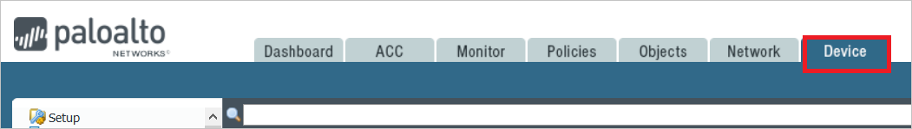
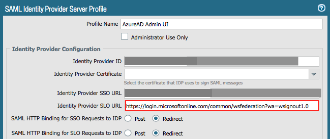
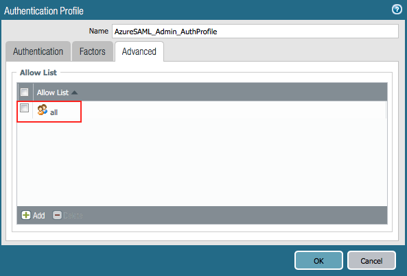

# Tutorial: Azure Active Directory integration with Palo Alto Networks - Admin UI

In this tutorial, you learn how to integrate Palo Alto Networks - Admin UI with Azure Active Directory (Azure AD).
Integrating Palo Alto Networks - Admin UI with Azure AD provides you with the following benefits:

* You can control in Azure AD who has access to Palo Alto Networks - Admin UI.
* You can enable your users to be automatically signed-in to Palo Alto Networks - Admin UI (Single Sign-On) with their Azure AD accounts.
* You can manage your accounts in one central location - the Azure portal.

If you want to know more details about SaaS app integration with Azure AD, see [What is application access and single sign-on with Azure Active Directory](https://docs.microsoft.com/azure/active-directory/active-directory-appssoaccess-whatis).
If you don't have an Azure subscription, [create a free account](https://azure.microsoft.com/free/) before you begin.

## Prerequisites

To configure Azure AD integration with Palo Alto Networks - Admin UI, you need the following items:

* An Azure AD subscription. If you don't have an Azure AD environment, you can get one-month trial [here](https://azure.microsoft.com/pricing/free-trial/)
* Palo Alto Networks - Admin UI single sign-on enabled subscription

## Scenario description

In this tutorial, you configure and test Azure AD single sign-on in a test environment.

* Palo Alto Networks - Admin UI supports **SP** initiated SSO
* Palo Alto Networks - Admin UI supports **Just In Time** user provisioning

## Adding Palo Alto Networks - Admin UI from the gallery

To configure the integration of Palo Alto Networks - Admin UI into Azure AD, you need to add Palo Alto Networks - Admin UI from the gallery to your list of managed SaaS apps.

**To add Palo Alto Networks - Admin UI from the gallery, perform the following steps:**

1. In the **[Azure portal](https://portal.azure.com)**, on the left navigation panel, click **Azure Active Directory** icon.

	

2. Navigate to **Enterprise Applications** and then select the **All Applications** option.

	

3. To add new application, click **New application** button on the top of dialog.

	

4. In the search box, type **Palo Alto Networks - Admin UI**, select **Palo Alto Networks - Admin UI** from result panel then click **Add** button to add the application.

	 

## Configure and test Azure AD single sign-on

In this section, you configure and test Azure AD single sign-on with Palo Alto Networks - Admin UI based on a test user called **Britta Simon**.
For single sign-on to work, a link relationship between an Azure AD user and the related user in Palo Alto Networks - Admin UI needs to be established.

To configure and test Azure AD single sign-on with Palo Alto Networks - Admin UI, you need to complete the following building blocks:

1. **[Configure Azure AD Single Sign-On](#configure-azure-ad-single-sign-on)** - to enable your users to use this feature.
2. **[Configure Palo Alto Networks - Admin UI Single Sign-On](#configure-palo-alto-networks---admin-ui-single-sign-on)** - to configure the Single Sign-On settings on application side.
3. **[Create an Azure AD test user](#create-an-azure-ad-test-user)** - to test Azure AD single sign-on with Britta Simon.
4. **[Assign the Azure AD test user](#assign-the-azure-ad-test-user)** - to enable Britta Simon to use Azure AD single sign-on.
5. **[Create Palo Alto Networks - Admin UI test user](#create-palo-alto-networks---admin-ui-test-user)** - to have a counterpart of Britta Simon in Palo Alto Networks - Admin UI that is linked to the Azure AD representation of user.
6. **[Test single sign-on](#test-single-sign-on)** - to verify whether the configuration works.

### Configure Azure AD single sign-on

In this section, you enable Azure AD single sign-on in the Azure portal.

To configure Azure AD single sign-on with Palo Alto Networks - Admin UI, perform the following steps:

1. In the [Azure portal](https://portal.azure.com/), on the **Palo Alto Networks - Admin UI** application integration page, select **Single sign-on**.

    

2. On the **Select a Single sign-on method** dialog, select **SAML/WS-Fed** mode to enable single sign-on.

    

3. On the **Set up Single Sign-On with SAML** page, click **Edit** icon to open **Basic SAML Configuration** dialog.

	

4. On the **Basic SAML Configuration** section, perform the following steps:

    

    a. In the **Sign-on URL** text box, type a URL using the following pattern:
    `https://<Customer Firewall FQDN>/php/login.php`

    b. In the **Identifier** box, type a URL using the following pattern:
    `https://<Customer Firewall FQDN>:443/SAML20/SP`

    c. In the **Reply URL** text box, type the Assertion Consumer Service (ACS) URL in the following format:
    `https://<Customer Firewall FQDN>:443/SAML20/SP/ACS`

	> [!NOTE]
	> These values are not real. Update these values with the actual Sign-On URL, Identifier and Reply URL. Contact [Palo Alto Networks - Admin UI Client support team](https://support.paloaltonetworks.com/support) to get these values. You can also refer to the patterns shown in the **Basic SAML Configuration** section in the Azure portal.

5. Palo Alto Networks - Admin UI application expects the SAML assertions in a specific format. Configure the following claims for this application. You can manage the values of these attributes from the **User Attributes** section on application integration page. On the **Set up Single Sign-On with SAML** page, click **Edit** button to open **User Attributes** dialog.

	

   > [!NOTE]
   > Because the attribute values are examples only, map the appropriate values for *username* and *adminrole*. There is another optional attribute, *accessdomain*, which is used to restrict admin access to specific virtual systems on the firewall.
   >

6. In the **User Claims** section on the **User Attributes** dialog, configure SAML token attribute as shown in the image above and perform the following steps:

	| Name |  Source Attribute|
    | --- | --- |
    | username | user.userprincipalname |
    | adminrole | customadmin |
	| | |

	a. Click **Add new claim** to open the **Manage user claims** dialog.

	

	

	b. In the **Name** textbox, type the attribute name shown for that row.

	c. Leave the **Namespace** blank.

	d. Select Source as **Attribute**.

	e. From the **Source attribute** list, type the attribute value shown for that row.

	f. Click **Ok**

	g. Click **Save**.

	> [!NOTE]
    > For more information about the attributes, see the following articles:
    > * [Administrative role profile for Admin UI (adminrole)](https://www.paloaltonetworks.com/documentation/80/pan-os/pan-os/firewall-administration/manage-firewall-administrators/configure-an-admin-role-profile)
    > * [Device access domain for Admin UI (accessdomain)](https://www.paloaltonetworks.com/documentation/80/pan-os/web-interface-help/device/device-access-domain)

7. On the **Set up Single Sign-On with SAML** page, in the **SAML Signing Certificate** section, click **Download** to download the **Federation Metadata XML** from the given options as per your requirement and save it on your computer.

	

8. On the **Set up Palo Alto Networks - Admin UI** section, copy the appropriate URL(s) as per your requirement.

	

	a. Login URL

	b. Azure Ad Identifier

	c. Logout URL

### Configure Palo Alto Networks - Admin UI Single Sign-On

1. Open the Palo Alto Networks Firewall Admin UI as an administrator in a new window.

2. Select the **Device** tab.

    

3. In the left pane, select **SAML Identity Provider**, and then select **Import** to import the metadata file.

    

4. In the **SAML Identify Provider Server Profile Import** window, do the following:

    

    a. In the **Profile Name** box, provide a name (for example, **AzureAD Admin UI**).
	
    b. Under **Identity Provider Metadata**, select **Browse**, and select the metadata.xml file that you downloaded earlier from the Azure portal.
	
    c. Clear the **Validate Identity Provider Certificate** check box.
	
    d. Select **OK**.
	
    e. To commit the configurations on the firewall, select **Commit**.

5. In the left pane, select **SAML Identity Provider**, and then select the SAML Identity Provider Profile (for example, **AzureAD Admin UI**) that you created in the preceding step.

    

6. In the **SAML Identity Provider Server Profile** window, do the following:

    
  
    a. In the **Identity Provider SLO URL** box, replace the previously imported SLO URL with the following URL: `https://login.microsoftonline.com/common/wsfederation?wa=wsignout1.0`
  
    b. Select **OK**.

7. On the Palo Alto Networks Firewall's Admin UI, select **Device**, and then select **Admin Roles**.

8. Select the **Add** button.

9. In the **Admin Role Profile** window, in the **Name** box, provide a name for the administrator role (for example, **fwadmin**). The administrator role name should match the SAML Admin Role attribute name that was sent by the Identity Provider. The administrator role name and value were created in **User Attributes** section in the Azure portal.

    
  
10. On the Firewall's Admin UI, select **Device**, and then select **Authentication Profile**.

11. Select the **Add** button.

12. In the **Authentication Profile** window, do the following: 

    

    a. In the **Name** box, provide a name (for example, **AzureSAML_Admin_AuthProfile**).

    b. In the **Type** drop-down list, select **SAML**. 

    c. In the **IdP Server Profile** drop-down list, select the appropriate SAML Identity Provider Server profile (for example, **AzureAD Admin UI**).

    c. Select the **Enable Single Logout** check box.

    d. In the **Admin Role Attribute** box, enter the attribute name (for example, **adminrole**).

    e. Select the **Advanced** tab and then, under **Allow List**, select **Add**.

    

    f. Select the **All** check box, or select the users and groups that can authenticate with this profile.  
    When a user authenticates, the firewall matches the associated username or group against the entries in this list. If you don’t add entries, no users can authenticate.

    g. Select **OK**.

13. To enable administrators to use SAML SSO by using Azure, select **Device** > **Setup**. In the **Setup** pane, select the **Management** tab and then, under **Authentication Settings**, select the **Settings** ("gear") button.

	

14. Select the SAML Authentication profile that you created in the Authentication Profile window(for example, **AzureSAML_Admin_AuthProfile**).

	

15. Select **OK**.

16. To commit the configuration, select **Commit**.

### Create an Azure AD test user

The objective of this section is to create a test user in the Azure portal called Britta Simon.

1. In the Azure portal, in the left pane, select **Azure Active Directory**, select **Users**, and then select **All users**.

    

2. Select **New user** at the top of the screen.

    

3. In the User properties, perform the following steps.

    

    a. In the **Name** field enter **BrittaSimon**.
  
    b. In the **User name** field type **brittasimon\@yourcompanydomain.extension**  
    For example, BrittaSimon@contoso.com

    c. Select **Show password** check box, and then write down the value that's displayed in the Password box.

    d. Click **Create**.

### Assign the Azure AD test user

In this section, you enable Britta Simon to use Azure single sign-on by granting access to Palo Alto Networks - Admin UI.

1. In the Azure portal, select **Enterprise Applications**, select **All applications**, then select **Palo Alto Networks - Admin UI**.

	

2. In the applications list, select **Palo Alto Networks - Admin UI**.

	

3. In the menu on the left, select **Users and groups**.

    

4. Click the **Add user** button, then select **Users and groups** in the **Add Assignment** dialog.

    

5. In the **Users and groups** dialog select **Britta Simon** in the Users list, then click the **Select** button at the bottom of the screen.

6. If you are expecting any role value in the SAML assertion then in the **Select Role** dialog select the appropriate role for the user from the list, then click the **Select** button at the bottom of the screen.

7. In the **Add Assignment** dialog click the **Assign** button.

### Create Palo Alto Networks - Admin UI test user

Palo Alto Networks - Admin UI supports just-in-time user provisioning. If a user doesn't already exist, it is automatically created in the system after a successful authentication. No action is required from you to create the user.

### Test single sign-on

In this section, you test your Azure AD single sign-on configuration using the Access Panel.

When you click the Palo Alto Networks - Admin UI tile in the Access Panel, you should be automatically signed in to the Palo Alto Networks - Admin UI for which you set up SSO. For more information about the Access Panel, see [Introduction to the Access Panel](https://docs.microsoft.com/azure/active-directory/active-directory-saas-access-panel-introduction).

## Additional Resources

- [List of Tutorials on How to Integrate SaaS Apps with Azure Active Directory](https://docs.microsoft.com/azure/active-directory/active-directory-saas-tutorial-list)

- [What is application access and single sign-on with Azure Active Directory?](https://docs.microsoft.com/azure/active-directory/active-directory-appssoaccess-whatis)

- [What is Conditional Access in Azure Active Directory?](https://docs.microsoft.com/azure/active-directory/conditional-access/overview)
