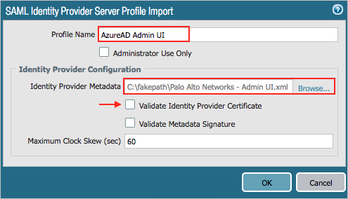
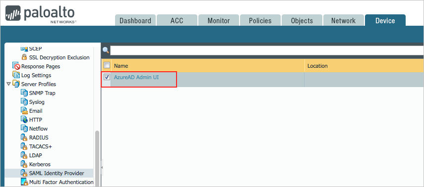
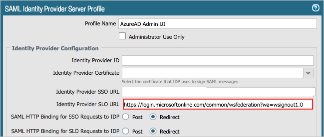
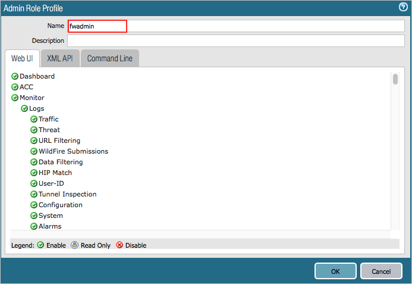
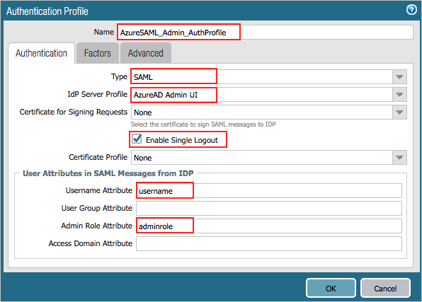
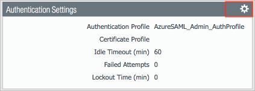
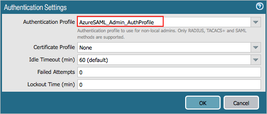

# Tutorial: Microsoft Entra SSO integration with Palo Alto Networks - Admin UI

In this tutorial, you'll learn how to integrate Palo Alto Networks - Admin UI with Microsoft Entra ID. When you integrate Palo Alto Networks - Admin UI with Microsoft Entra ID, you can:

* Control in Microsoft Entra ID who has access to Palo Alto Networks - Admin UI.
* Enable your users to be automatically signed-in to Palo Alto Networks - Admin UI with their Microsoft Entra accounts.
* Manage your accounts in one central location.

## Prerequisites

To get started, you need the following items:

* A Microsoft Entra subscription. If you don't have a subscription, you can get a [free account](https://azure.microsoft.com/free/).
* Palo Alto Networks - Admin UI single sign-on (SSO) enabled subscription.
* It is a requirement that the service should be public available. Please refer [this](../develop/single-sign-on-saml-protocol.md) page for more information.

## Scenario description

In this tutorial, you configure and test Microsoft Entra single sign-on in a test environment.

* Palo Alto Networks - Admin UI supports **SP** initiated SSO.
* Palo Alto Networks - Admin UI supports **Just In Time** user provisioning.

## Adding Palo Alto Networks - Admin UI from the gallery

To configure the integration of Palo Alto Networks - Admin UI into Microsoft Entra ID, you need to add Palo Alto Networks - Admin UI from the gallery to your list of managed SaaS apps.

1. Sign in to the [Microsoft Entra admin center](https://entra.microsoft.com) as at least a [Cloud Application Administrator](../roles/permissions-reference.md#cloud-application-administrator).
1. Browse to **Identity** > **Applications** > **Enterprise applications** > **New application**.
1. In the **Add from the gallery** section, type **Palo Alto Networks - Admin UI** in the search box.
1. Select **Palo Alto Networks - Admin UI** from results panel and then add the app. Wait a few seconds while the app is added to your tenant.

 Alternatively, you can also use the [Enterprise App Configuration Wizard](https://portal.office.com/AdminPortal/home?Q=Docs#/azureadappintegration). In this wizard, you can add an application to your tenant, add users/groups to the app, assign roles, as well as walk through the SSO configuration as well. [Learn more about Microsoft 365 wizards.](/microsoft-365/admin/misc/azure-ad-setup-guides)

## Configure and test Microsoft Entra SSO for Palo Alto Networks - Admin UI

In this section, you configure and test Microsoft Entra single sign-on with Palo Alto Networks - Admin UI based on a test user called **B.Simon**.
For single sign-on to work, a link relationship between a Microsoft Entra user and the related user in Palo Alto Networks - Admin UI needs to be established.

To configure and test Microsoft Entra single sign-on with Palo Alto Networks - Admin UI, perform the following steps:

1. **[Configure Microsoft Entra SSO](#configure-azure-ad-sso)** - to enable your users to use this feature.
    1. **[Create a Microsoft Entra test user](#create-an-azure-ad-test-user)** - to test Microsoft Entra single sign-on with B.Simon.
    1. **[Assign the Microsoft Entra test user](#assign-the-azure-ad-test-user)** - to enable B.Simon to use Microsoft Entra single sign-on.
1. **[Configure Palo Alto Networks - Admin UI SSO](#configure-palo-alto-networks---admin-ui-sso)** - to configure the single sign-on settings on application side.
    1. **[Create Palo Alto Networks - Admin UI test user](#create-palo-alto-networks---admin-ui-test-user)** - to have a counterpart of B.Simon in Palo Alto Networks - Admin UI that is linked to the Microsoft Entra representation of user.
1. **[Test SSO](#test-sso)** - to verify whether the configuration works.

## Configure Microsoft Entra SSO

Follow these steps to enable Microsoft Entra SSO.

1. Sign in to the [Microsoft Entra admin center](https://entra.microsoft.com) as at least a [Cloud Application Administrator](../roles/permissions-reference.md#cloud-application-administrator).
1. Browse to **Identity** > **Applications** > **Enterprise applications** > **Palo Alto Networks - Admin UI** > **Single sign-on**.
1. On the **Select a single sign-on method** page, select **SAML**.
1. On the **Set up single sign-on with SAML** page, click the pencil icon for **Basic SAML Configuration** to edit the settings.

   

1. On the **Basic SAML Configuration** section, perform the following steps:

    a. In the **Identifier** box, type a URL using the following pattern:
    `https://<Customer Firewall FQDN>:443/SAML20/SP`

    b. In the **Reply URL** text box, type the Assertion Consumer Service (ACS) URL in the following format:
    `https://<Customer Firewall FQDN>:443/SAML20/SP/ACS`

    c. In the **Sign-on URL** text box, type a URL using the following pattern:
    `https://<Customer Firewall FQDN>/php/login.php`

	> [!NOTE]
	> These values are not real. Update these values with the actual Identifier,Reply URL and Sign on URL. Contact [Palo Alto Networks - Admin UI Client support team](https://support.paloaltonetworks.com/support) to get these values. You can also refer to the patterns shown in the **Basic SAML Configuration** section.
	>
	> Port 443 is required on the **Identifier** and the **Reply URL** as these values are hardcoded into the Palo Alto Firewall. Removing the port number will result in an error during login if removed.

    > Port 443 is required on the **Identifier** and the **Reply URL** as these values are hardcoded into the Palo Alto Firewall. Removing the port number will result in an error during login if removed.

1. The Palo Alto Networks - Admin UI application expects the SAML assertions in a specific format, which requires you to add custom attribute mappings to your SAML token attributes configuration. The following screenshot shows the list of default attributes.

	

   > [!NOTE]
   > Because the attribute values are examples only, map the appropriate values for *username* and *adminrole*. There is another optional attribute, *accessdomain*, which is used to restrict admin access to specific virtual systems on the firewall.

1. In addition to above, the Palo Alto Networks - Admin UI application expects few more attributes to be passed back in SAML response which are shown below. These attributes are also pre populated but you can review them as per your requirements.

	| Name |  Source Attribute|
    | --- | --- |
    | username | user.userprincipalname |
    | adminrole | customadmin |
	| | |

    > [!NOTE]
    > The **Name** value, shown above as _adminrole_, should be the same value as the _Admin role attribute_, which is configured in step 12 of the **[Configure Palo Alto Networks - Admin UI SSO](#configure-palo-alto-networks---admin-ui-sso)** section. The **Source Attribute** value, shown above as _customadmin_, should be the same value as the _Admin Role Profile Name_, which is configured in step 9 of the the **[Configure Palo Alto Networks - Admin UI SSO](#configure-palo-alto-networks---admin-ui-sso)** section.  

	> [!NOTE]
    > For more information about the attributes, see the following articles:
    > * [Administrative role profile for Admin UI (adminrole)](https://docs.paloaltonetworks.com/pan-os/8-1/pan-os-admin/firewall-administration/manage-firewall-administrators/configure-an-admin-role-profile)
    > * [Device access domain for Admin UI (accessdomain)](https://docs.paloaltonetworks.com/pan-os/8-0/pan-os-web-interface-help/device/device-access-domain.html)

1. On the **Set up Single Sign-On with SAML** page, in the **SAML Signing Certificate** section, click **Download** to download the **Federation Metadata XML** from the given options as per your requirement and save it on your computer.

	

1. On the **Set up Palo Alto Networks - Admin UI** section, copy the appropriate URL(s) as per your requirement.

	

### Create a Microsoft Entra test user

In this section, you'll create a test user called B.Simon.

1. Sign in to the [Microsoft Entra admin center](https://entra.microsoft.com) as at least a [User Administrator](../roles/permissions-reference.md#user-administrator).
1. Browse to **Identity** > **Users** > **All users**.
1. Select **New user** > **Create new user**, at the top of the screen.
1. In the **User** properties, follow these steps:
   1. In the **Display name** field, enter `B.Simon`.  
   1. In the **User principal name** field, enter the username@companydomain.extension. For example, `B.Simon@contoso.com`.
   1. Select the **Show password** check box, and then write down the value that's displayed in the **Password** box.
   1. Select **Review + create**.
1. Select **Create**.

### Assign the Microsoft Entra test user

In this section, you'll enable B.Simon to use single sign-on by granting access to Palo Alto Networks - Admin UI.

1. Sign in to the [Microsoft Entra admin center](https://entra.microsoft.com) as at least a [Cloud Application Administrator](../roles/permissions-reference.md#cloud-application-administrator).
1. Browse to **Identity** > **Applications** > **Enterprise applications** > **Palo Alto Networks - Admin UI**.
1. In the app's overview page, select **Users and groups**.
1. Select **Add user/group**, then select **Users and groups** in the **Add Assignment** dialog.
   1. In the **Users and groups** dialog, select **B.Simon** from the Users list, then click the **Select** button at the bottom of the screen.
   1. If you are expecting a role to be assigned to the users, you can select it from the **Select a role** dropdown. If no role has been set up for this app, you see "Default Access" role selected.
   1. In the **Add Assignment** dialog, click the **Assign** button.

## Configure Palo Alto Networks - Admin UI SSO

1. Open the Palo Alto Networks Firewall Admin UI as an administrator in a new window.

2. Select the **Device** tab.

    

3. In the left pane, select **SAML Identity Provider**, and then select **Import** to import the metadata file.

    

4. In the **SAML Identify Provider Server Profile Import** window, do the following:

    

    a. In the **Profile Name** box, provide a name (for example, **Microsoft Entra Admin UI**).

    b. Under **Identity Provider Metadata**, select **Browse**, and select the metadata.xml file that you downloaded earlier.

    c. Clear the **Validate Identity Provider Certificate** check box.

    d. Select **OK**.

    e. To commit the configurations on the firewall, select **Commit**.

5. In the left pane, select **SAML Identity Provider**, and then select the SAML Identity Provider Profile (for example, **Microsoft Entra Admin UI**) that you created in the preceding step.

    

6. In the **SAML Identity Provider Server Profile** window, do the following:

    
  
    a. In the **Identity Provider SLO URL** box, replace the previously imported SLO URL with the following URL: `https://login.microsoftonline.com/common/wsfederation?wa=wsignout1.0`
  
    b. Select **OK**.

7. On the Palo Alto Networks Firewall's Admin UI, select **Device**, and then select **Admin Roles**.

8. Select the **Add** button.

9. In the **Admin Role Profile** window, in the **Name** box, provide a name for the administrator role (for example, **fwadmin**). The administrator role name should match the SAML Admin Role attribute name that was sent by the Identity Provider. The administrator role name and value were created in **User Attributes** section.

    
  
10. On the Firewall's Admin UI, select **Device**, and then select **Authentication Profile**.

11. Select the **Add** button.

12. In the **Authentication Profile** window, do the following: 

    

    a. In the **Name** box, provide a name (for example, **AzureSAML_Admin_AuthProfile**).

    b. In the **Type** drop-down list, select **SAML**. 

    c. In the **IdP Server Profile** drop-down list, select the appropriate SAML Identity Provider Server profile (for example, **Microsoft Entra Admin UI**).

    d. Select the **Enable Single Logout** check box.

    e. In the **Admin Role Attribute** box, enter the attribute name (for example, **adminrole**).

    f. Select the **Advanced** tab and then, under **Allow List**, select **Add**.

    

    g. Select the **All** check box, or select the users and groups that can authenticate with this profile.  
    When a user authenticates, the firewall matches the associated username or group against the entries in this list. If you don’t add entries, no users can authenticate.

    h. Select **OK**.

13. To enable administrators to use SAML SSO by using Azure, select **Device** > **Setup**. In the **Setup** pane, select the **Management** tab and then, under **Authentication Settings**, select the **Settings** ("gear") button.

	

14. Select the SAML Authentication profile that you created in the Authentication Profile window(for example, **AzureSAML_Admin_AuthProfile**).

	

15. Select **OK**.

16. To commit the configuration, select **Commit**.

### Create Palo Alto Networks - Admin UI test user

Palo Alto Networks - Admin UI supports just-in-time user provisioning. If a user doesn't already exist, it is automatically created in the system after a successful authentication. No action is required from you to create the user.

## Test SSO

In this section, you test your Microsoft Entra single sign-on configuration with following options. 

* Click on **Test this application**, this will redirect to Palo Alto Networks - Admin UI Sign-on URL where you can initiate the login flow. 

* Go to Palo Alto Networks - Admin UI Sign-on URL directly and initiate the login flow from there.

* You can use Microsoft My Apps. When you click the Palo Alto Networks - Admin UI tile in the My Apps, you should be automatically signed in to the Palo Alto Networks - Admin UI for which you set up the SSO. For more information about the My Apps, see [Introduction to the My Apps](https://support.microsoft.com/account-billing/sign-in-and-start-apps-from-the-my-apps-portal-2f3b1bae-0e5a-4a86-a33e-876fbd2a4510).

## Next steps

Once you configure Palo Alto Networks - Admin UI you can enforce session control, which protects exfiltration and infiltration of your organization’s sensitive data in real time. Session control extends from Conditional Access. [Learn how to enforce session control with Microsoft Defender for Cloud Apps](/cloud-app-security/proxy-deployment-any-app).
