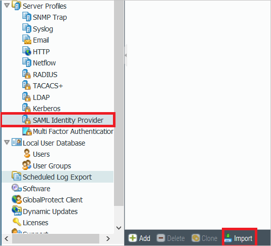
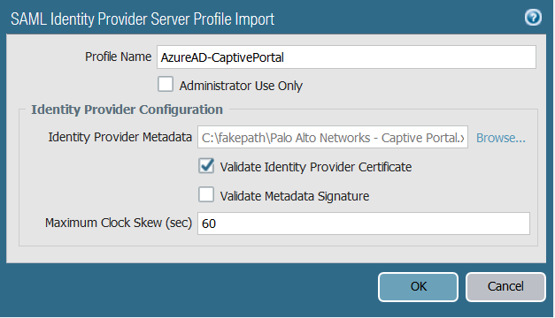

# Tutorial: Azure Active Directory integration with Palo Alto Networks Captive Portal

In this tutorial, you learn how to integrate Palo Alto Networks Captive Portal with Azure Active Directory (Azure AD).

You get the following benefits when you integrate Palo Alto Networks Captive Portal with Azure AD:

* In Azure AD, you can control who has access to Palo Alto Networks Captive Portal.
* You can automatically sign in users in Palo Alto Networks Captive Portal (single sign-on) by using user Azure AD accounts.
* You can manage your accounts in one, central location, the Azure portal.

To learn more about software as a service (SaaS) app integration with Azure AD, see [Single sign-on to applications in Azure Active Directory](https://docs.microsoft.com/azure/active-directory/active-directory-appssoaccess-whatis).

If you don't have an Azure subscription, [create a free account](https://azure.microsoft.com/free/).

## Prerequisites

To integrate Azure AD with Palo Alto Networks Captive Portal, you need the following items:

* An Azure Active Directory subscription. If you don't have Azure AD, you can get a [one-month trial](https://azure.microsoft.com/pricing/free-trial/).
* A Palo Alto Networks Captive Portal single sign-on (SSO)-enabled subscription.

## Scenario description

In this tutorial, you configure and test Azure AD single sign-on in a test environment.

Palo Alto Networks Captive Portal supports these scenarios:

* **IDP-initiated single sign-on**
* **Just-in-time user provisioning**

## Add Palo Alto Networks Captive Portal from the gallery

To get started, in the gallery, add Palo Alto Networks Captive Portal to your list of managed SaaS apps:

1. In the [Azure portal](https://portal.azure.com), in the left menu, select **Azure Active Directory**.

	

2. Select **Enterprise applications** > **All applications**.

	

3. Select **New application**.

	

4. In the search box, enter **Palo Alto Networks Captive Portal**. In the search results, select **Palo Alto Networks - Captive Portal**, and then select **Add**.

	 

## Configure and test Azure AD single sign-on

You configure and test Azure AD single sign-on with Palo Alto Networks Captive Portal based on a test user named *Britta Simon*. For single sign-on to work, you must establish a relationship between an Azure AD user and the same user in Palo Alto Networks Captive Portal. 

To configure and test Azure AD single sign-on with Palo Alto Networks Captive Portal, complete the following tasks:

1. **[Configure Azure AD single sign-on](#configure-azure-ad-single-sign-on)**: Enable the user to use this feature.
2. **[Configure Palo Alto Networks Captive Portal single sign-on](#configure-palo-alto-networks-captive-portal-single-sign-on)**: Configure the single sign-on settings in the application.
3. **[Create an Azure AD test user](#create-an-azure-ad-test-user)**: Test Azure AD single sign-on with the user *Britta Simon*.
4. **[Assign the Azure AD test user](#assign-the-azure-ad-test-user)**: Set up Britta Simon to use Azure AD single sign-on.
5. **Create a Palo Alto Networks Captive Portal test user**: Create a counterpart user *Britta Simon* in Palo Alto Networks Captive Portal that's linked to the Azure AD user.
6. **[Test single sign-on](#test-single-sign-on)**: Verify that the configuration works.

### Configure Azure AD single sign-on

First, enable Azure AD single sign-on in the Azure portal:

1. In the [Azure portal](https://portal.azure.com/), on the **Palo Alto Networks - Captive Portal** application integration page, select **Single sign-on**.

    

2. In the **Select a single sign-on method** pane, select **SAML**.

    

3. In the **Set up Single Sign-On with SAML** pane, select the pencil **Edit** icon.

	

4. In the **Basic SAML Configuration** pane, complete the following steps:

    

   1. For **Identifier**, enter a URL that has the pattern
      `https://<customer_firewall_host_name>/SAML20/SP`.

   2. For **Reply URL**, enter a URL that has the pattern
      `https://<customer_firewall_host_name>/SAML20/SP/ACS`.

      > [!NOTE]
      > Update the placeholder values in this step with the actual identifier and reply URLs. To get the actual values, contact [Palo Alto Networks Captive Portal Client support team](https://support.paloaltonetworks.com/support).

5. In the **SAML Signing Certificate** section, next to **Federation Metadata XML**, select **Download**. Save the downloaded file on your computer.

	

### Configure Palo Alto Networks Captive Portal single sign-on

Next, set up single-sign on in Palo Alto Networks Captive Portal:

1. In a different browser window, sign in to the Palo Alto Networks website as an administrator.

2. Select the **Device** tab.

	

3. In the menu, select **SAML Identity Provider**, and then select **Import**.

	

4. In the **SAML Identity Provider Server Profile Import** dialog box, complete the following steps:

	

	1. For **Profile Name**, enter a name, like **AzureAD-CaptivePortal**.
	
	2. Next to **Identity Provider Metadata**, select **Browse**. Select the metadata.xml file that you downloaded in the Azure portal.
	
	3. Select **OK**.

### Create an Azure AD test user 

Next, create a test user named *Britta Simon* in the Azure portal:

1. In the Azure portal, select **Azure Active Directory** > **Users** > **All users**.

    

2. Select **New user**.

    

3. In the **User** pane, complete the following steps:

    

    1. For **Name**, enter **BrittaSimon**.
  
    2. For **User name**, enter **BrittaSimon\@\<your_company_domain\>**. For example, **BrittaSimon\@contoso.com**.

    3. For **Password**, enter a password. We recommend that you keep a record of the password you enter. You can select the **Show Password** check box to display the password.

    4. Select **Create**.

### Assign the Azure AD test user

Next, grant access to Palo Alto Networks Captive Portal so Britta Simon can use Azure single sign-on:

1. In the Azure portal, select **Enterprise applications** > **All applications**.

	

2. In the applications list, enter **Palo Alto Networks - Captive Portal**, and then select the application.

	

3. In the menu, select **Users and groups**.

    

4. Select **Add user**. Then, in the **Add assignment** pane, select **Users and groups**.

    

5. In the **Users and groups** pane, in the **Users** list, select **Britta Simon**. Select **Select**.

6. To add a role value to the SAML assertion, in the **Select role** pane, select the relevant role for the user. Select **Select**.

7. In the **Add assignment** pane, select **Assign**.

### Create a Palo Alto Networks Captive Portal test user

Next, create a user named *Britta Simon* in Palo Alto Networks Captive Portal. Palo Alto Networks Captive Portal supports just-in-time user provisioning, which is enabled by default. You don't need to complete any tasks in this section. If a user doesn't already exist in Palo Alto Networks Captive Portal, a new one is created after authentication.

> [!NOTE]
> If you want to create a user manually, contact the [Palo Alto Networks Captive Portal Client support team](https://support.paloaltonetworks.com/support).

### Test single sign-on 

Palo Alto Networks Captive Portal is installed behind the firewall on a Windows VM. To test single sign-on in Palo Alto Networks Captive Portal, sign in to the Windows VM by using Remote Desktop Protocol (RDP). In the RDP session, open a browser and go to any website. The SSO URL opens and you're prompted to authenticate. When authentication is finished, you can access websites.

## Additional resources

To learn more, see these articles:

- [Tutorials about integrating SaaS apps with Azure Active Directory](https://docs.microsoft.com/azure/active-directory/active-directory-saas-tutorial-list)
- [Single sign-on to applications in Azure Active Directory](https://docs.microsoft.com/azure/active-directory/active-directory-appssoaccess-whatis)
- [Conditional Access in Azure Active Directory](https://docs.microsoft.com/azure/active-directory/conditional-access/overview)

