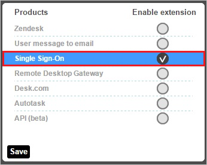
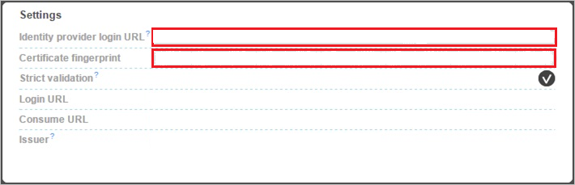
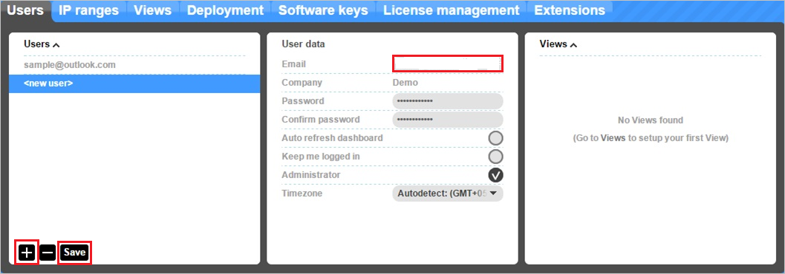

# Tutorial: Azure Active Directory integration with Panorama9

In this tutorial, you'll learn how to integrate Panorama9 with Azure Active Directory (Azure AD). When you integrate Panorama9 with Azure AD, you can:

* Control in Azure AD who has access to Panorama9.
* Enable your users to be automatically signed-in to Panorama9 with their Azure AD accounts.
* Manage your accounts in one central location - the Azure portal.

## Prerequisites

To get started, you need the following items:

* An Azure AD subscription. If you don't have a subscription, you can get a [free account](https://azure.microsoft.com/free/).
* Panorama9 single sign-on (SSO) enabled subscription.

## Scenario description

In this tutorial, you configure and test Azure AD single sign-on in a test environment.

* Panorama9 supports **SP** initiated SSO.

## Add Panorama9 from the gallery

To configure the integration of Panorama9 into Azure AD, you need to add Panorama9 from the gallery to your list of managed SaaS apps.

1. Sign in to the Azure portal using either a work or school account, or a personal Microsoft account.
1. On the left navigation pane, select the **Azure Active Directory** service.
1. Navigate to **Enterprise Applications** and then select **All Applications**.
1. To add new application, select **New application**.
1. In the **Add from the gallery** section, type **Panorama9** in the search box.
1. Select **Panorama9** from results panel and then add the app. Wait a few seconds while the app is added to your tenant.

 Alternatively, you can also use the [Enterprise App Configuration Wizard](https://portal.office.com/AdminPortal/home?Q=Docs#/azureadappintegration). In this wizard, you can add an application to your tenant, add users/groups to the app, assign roles, as well as walk through the SSO configuration as well. [Learn more about Microsoft 365 wizards.](/microsoft-365/admin/misc/azure-ad-setup-guides)

## Configure and test Azure AD SSO for Panorama9

Configure and test Azure AD SSO with Panorama9 using a test user called **B.Simon**. For SSO to work, you need to establish a link relationship between an Azure AD user and the related user in Panorama9.

To configure and test Azure AD SSO with Panorama9, perform the following steps:

1. **[Configure Azure AD SSO](#configure-azure-ad-sso)** - to enable your users to use this feature.
    1. **[Create an Azure AD test user](#create-an-azure-ad-test-user)** - to test Azure AD single sign-on with B.Simon.
    1. **[Assign the Azure AD test user](#assign-the-azure-ad-test-user)** - to enable B.Simon to use Azure AD single sign-on.
1. **[Configure Panorama9 SSO](#configure-panorama9-sso)** - to configure the single sign-on settings on application side.
    1. **[Create Panorama9 test user](#create-panorama9-test-user)** - to have a counterpart of B.Simon in Panorama9 that is linked to the Azure AD representation of user.
1. **[Test SSO](#test-sso)** - to verify whether the configuration works.

## Configure Azure AD SSO

Follow these steps to enable Azure AD SSO in the Azure portal.

1. In the Azure portal, on the **Panorama9** application integration page, find the **Manage** section and select **single sign-on**.
1. On the **Select a single sign-on method** page, select **SAML**.
1. On the **Set up single sign-on with SAML** page, click the pencil icon for **Basic SAML Configuration** to edit the settings.

   

4. On the **Basic SAML Configuration** section, perform the following steps:

	a. In the **Sign on URL** text box, type the URL:
    `https://dashboard.panorama9.com/saml/access/3262`

    b. In the **Identifier (Entity ID)** text box, type a URL using the following pattern:
    `https://www.panorama9.com/saml20/<TENANT_NAME>`

	> [!NOTE]
	> These values are not real. Update these values with the actual Sign on URL and Identifier. Contact [Panorama9 Client support team](https://support.panorama9.com/) to get these values. You can also refer to the patterns shown in the **Basic SAML Configuration** section in the Azure portal.

5. In the **SAML Signing Certificate** section, click **Edit** button to open **SAML Signing Certificate** dialog.

	

6. In the **SAML Signing Certificate** section, copy the **Thumbprint** and save it on your computer.

    

7. On the **Set up Panorama9** section, copy the appropriate URL(s) as per your requirement.

	

### Create an Azure AD test user 

In this section, you'll create a test user in the Azure portal called B.Simon.

1. From the left pane in the Azure portal, select **Azure Active Directory**, select **Users**, and then select **All users**.
1. Select **New user** at the top of the screen.
1. In the **User** properties, follow these steps:
   1. In the **Name** field, enter `B.Simon`.  
   1. In the **User name** field, enter the username@companydomain.extension. For example, `B.Simon@contoso.com`.
   1. Select the **Show password** check box, and then write down the value that's displayed in the **Password** box.
   1. Click **Create**.

### Assign the Azure AD test user

In this section, you'll enable B.Simon to use Azure single sign-on by granting access to Panorama9.

1. In the Azure portal, select **Enterprise Applications**, and then select **All applications**.
1. In the applications list, select **Panorama9**.
1. In the app's overview page, find the **Manage** section and select **Users and groups**.
1. Select **Add user**, then select **Users and groups** in the **Add Assignment** dialog.
1. In the **Users and groups** dialog, select **B.Simon** from the Users list, then click the **Select** button at the bottom of the screen.
1. If you are expecting a role to be assigned to the users, you can select it from the **Select a role** dropdown. If no role has been set up for this app, you see "Default Access" role selected.
1. In the **Add Assignment** dialog, click the **Assign** button.

## Configure Panorama9 SSO

1. In a different web browser window, sign in to your Panorama9 company site as an administrator.

2. In the toolbar on the top, click **Manage**, and then click **Extensions**.
   
	

3. On the **Extensions** dialog, click **Single Sign-On**.
   
	

4. In the **Settings** section, perform the following steps:
   
	
   
	a. In **Identity provider URL** textbox, paste the value of **Login URL**, which you have copied from Azure portal.
   
	b. In **Certificate fingerprint** textbox, paste the **Thumbprint** value of certificate, which you have copied from Azure portal.    
         
5. Click **Save**.

### Create Panorama9 test user

In order to enable Azure AD users to sign in to Panorama9, they must be provisioned into Panorama9.  

In the case of Panorama9, provisioning is a manual task.

**To configure user provisioning, perform the following steps:**

1. Sign in to your **Panorama9** company site as an administrator.

2. In the menu on the top, click **Manage**, and then click **Users**.
   
	

3. In the Users section, Click **+** to add new user.

	

4. Go to the User data section, type the email address of a valid Azure Active Directory user you want to provision into the **Email** textbox.

5. Come to the Users section, Click **Save**.
   
	> [!NOTE]
    > The Azure Active Directory account holder receives an email and follows a link to confirm their account before it becomes active.

## Test SSO

In this section, you test your Azure AD single sign-on configuration with following options. 

* Click on **Test this application** in Azure portal. This will redirect to Panorama9 Sign-on URL where you can initiate the login flow. 

* Go to Panorama9 Sign-on URL directly and initiate the login flow from there.

* You can use Microsoft My Apps. When you click the Panorama9 tile in the My Apps, this will redirect to Panorama9 Sign-on URL. For more information about the My Apps, see [Introduction to the My Apps](https://support.microsoft.com/account-billing/sign-in-and-start-apps-from-the-my-apps-portal-2f3b1bae-0e5a-4a86-a33e-876fbd2a4510).

## Next steps

Once you configure Panorama9 you can enforce session control, which protects exfiltration and infiltration of your organization’s sensitive data in real time. Session control extends from Conditional Access. [Learn how to enforce session control with Microsoft Defender for Cloud Apps](/cloud-app-security/proxy-deployment-aad).
