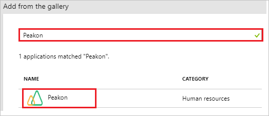
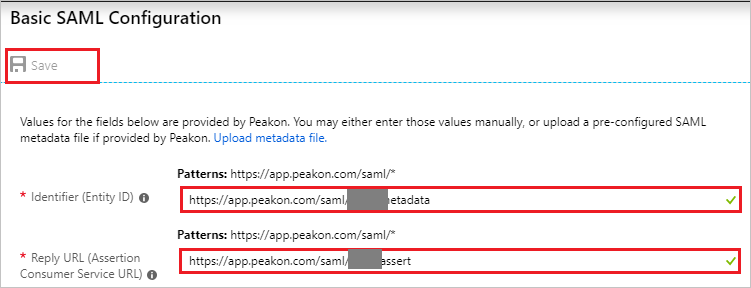
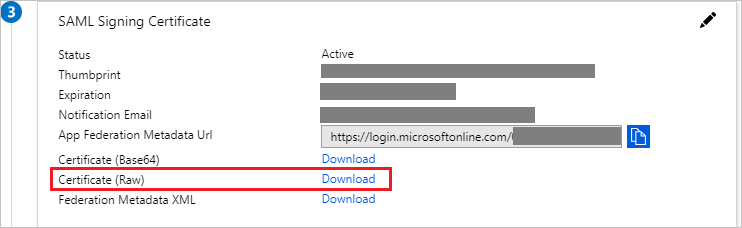
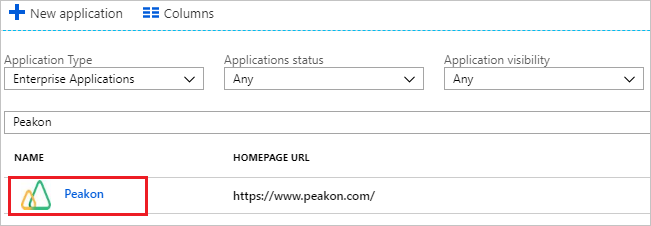

# Tutorial: Azure Active Directory integration with Peakon

In this tutorial, you learn how to integrate Peakon with Azure Active Directory (Azure AD).

Integrating Peakon with Azure AD provides you with the following benefits:

- You can control in Azure AD who has access to Peakon.
- You can enable your users to automatically get signed-on to Peakon (Single Sign-On) with their Azure AD accounts.
- You can manage your accounts in one central location - the Azure portal.

If you want to know more details about SaaS app integration with Azure AD, see [what is application access and single sign-on with Azure Active Directory](../manage-apps/what-is-single-sign-on.md)

## Prerequisites

To configure Azure AD integration with Peakon, you need the following items:

- An Azure AD subscription
- A Peakon single sign-on enabled subscription

> [!NOTE]
> To test the steps in this tutorial, we do not recommend using a production environment.

To test the steps in this tutorial, you should follow these recommendations:

- Do not use production environment, unless it is necessary.
- If you don't have an Azure AD trial environment, you can [get a one-month trial](https://azure.microsoft.com/pricing/free-trial/).

## Scenario description

In this tutorial, you test Azure AD single sign-on in a test environment. 
The scenario outlined in this tutorial consists of two main building blocks:

1. Adding Peakon from the gallery
2. Configuring and testing Azure AD single sign-on

## Adding Peakon from the gallery

To configure the integration of Peakon into Azure AD, you need to add Peakon from the gallery to your list of managed SaaS apps.

**To add Peakon from the gallery, perform the following steps:**

1. In the **[Azure portal](https://portal.azure.com)**, on the left navigation panel, click **Azure Active Directory** icon. 

	![The Azure Active Directory button][1]

2. Navigate to **Enterprise applications**. Then go to **All applications**.

	![The Enterprise applications blade][2]

3. To add new application, click **New application** button on the top of dialog.

	![The New application button][3]

4. In the search box, type **Peakon**, select **Peakon** from result panel then click **Add** button to add the application.

	

## Configure and test Azure AD single sign-on

In this section, you configure and test Azure AD single sign-on with Peakon based on a test user called "Britta Simon".

For single sign-on to work, Azure AD needs to know what the counterpart user in Peakon is to a user in Azure AD. In other words, a link relationship between an Azure AD user and the related user in Peakon needs to be established.

To configure and test Azure AD single sign-on with Peakon, you need to complete the following building blocks:

1. **[Configuring Azure AD Single Sign-On](#configuring-azure-ad-single-sign-on)** - to enable your users to use this feature.
2. **[Creating an Azure AD test user](#creating-an-azure-ad-test-user)** - to test Azure AD single sign-on with Britta Simon.
3. **[Creating a Peakon test user](#creating-a-peakon-test-user)** - to have a counterpart of Britta Simon in Peakon that is linked to the Azure AD representation of user.
4. **[Assigning the Azure AD test user](#assigning-the-azure-ad-test-user)** - to enable Britta Simon to use Azure AD single sign-on.
5. **[Testing single sign-on](#testing-single-sign-on)** - to verify whether the configuration works.

### Configuring Azure AD single sign-on

In this section, you enable Azure AD single sign-on in the Azure portal and configure single sign-on in your Peakon application.

**To configure Azure AD single sign-on with Peakon, perform the following steps:**

1. In the Azure portal, on the **Peakon** application integration page, click **Single sign-on**.

	![Configure single sign-on link][4]

2. On the **Select a Single sign-on method** dialog, Click **Select** for **SAML** mode to enable single sign-on.

    

3. On the **Set-up Single Sign-On with SAML** page, click **Edit** icon to open **Basic SAML Configuration** dialog.

	

4. On the **Basic SAML Configuration** section, perform the following steps, if you wish to configure the application in **IDP** initiated mode:

	

    a. In the **Identifier** textbox, type a URL using the following pattern: `https://app.peakon.com/saml/<companyid>/metadata`

	b. In the **Reply URL** textbox, type a URL using the following pattern: `https://app.peakon.com/saml/<companyid>/assert`

5. Click **Set additional URLs** and perform the following step if you wish to configure the application in **SP** initiated mode:

	

    In the **Sign-on URL** textbox, type a URL: `https://app.peakon.com/login`

	> [!NOTE]
	> These values are not real. Update these values with the actual Identifier and Reply URL which is explained latert in the tutorial.

6. In the **SAML Signing Certificate** section, click **Download** to download **Certificate (Raw)** and then save certificate file on your computer.

	 

7. On the **Set up Peakon** section, copy the appropriate URL as per your requirement.

	a. Login URL

	b. Azure AD Identifier

	c. Logout URL

	

8. In a different web browser window, sign in to Peakon as an Administrator.

9. In the menu bar on the left side of the page, click **Configuration**, then navigate to **Integrations**.

	

10. On **Integrations** page, click on **Single Sign-On**.

	

11. Under **Single Sign-On** section, click on **Enable**.

	

12. On the **Single sign-on for employees using SAML** section, perform the following steps:

	

	a. In the **SSO Login URL** textbox, paste the value of **Login URL**, which you have copied from the Azure portal.

	b. In the **SSO Logout URL** textbox, paste the value of **Logout URL**, which you have copied from the Azure portal.

	c. Click **Choose file** to upload the certificate that you have downloaded from the Azure portal, into the Certificate box.

	d. Click the **icon** to copy the **Entity ID** and paste in **Identifier** textbox in **Basic SAML Configuration** section on Azure portal.

	e. Click the **icon** to copy the **Reply URL (ACS)** and paste in **Reply URL** textbox in **Basic SAML Configuration** section on Azure portal.

	f. Click **Save**

### Creating an Azure AD test user

The objective of this section is to create a test user in the Azure portal called Britta Simon.

1. In the Azure portal, in the left pane, select **Azure Active Directory**, select **Users**, and then select **All users**.

	![Create Azure AD User][100]

2. Select **New user** at the top of the screen.

	 

3. In the User properties, perform the following steps.

	

    a. In the **Name** field, enter **BrittaSimon**.
  
    b. In the **User name** field, type **brittasimon@yourcompanydomain.extension**  
    For example, BrittaSimon@contoso.com

    c. Select **Properties**, select the **Show password** check box, and then write down the value that's displayed in the Password box.

    d. Select **Create**.

### Creating a Peakon test user

For enabling Azure AD users to sign in to Peakon, they must be provisioned into Peakon.  
In the case of Peakon, provisioning is a manual task.

**To provision a user account, perform the following steps:**

1. Sign in to your Peakon company site as an administrator.

2. In the menu bar on the left side of the page, click **Configuration**, then navigate to **Employees**.

    

3. On the top right side of the page, click **Add employee**.

	  

3. On the **New employee** dialog page, perform the following steps:

	 

	a. In the **Name** textbox, type first name as **Britta** and last name as **simon**.

	b. In the **Email** textbox, type the email address like **Brittasimon@contoso.com**.

	c. Click **Create employee**.

### Assigning the Azure AD test user

In this section, you enable Britta Simon to use Azure single sign-on by granting access to Peakon.

1. In the Azure portal, select **Enterprise Applications**, select **All applications**.

	![Assign User][201]

2. In the applications list, select **Peakon**.

	 

3. In the menu on the left, click **Users and groups**.

	![Assign User][202]

4. Click **Add** button. Then select **Users and groups** on **Add Assignment** dialog.

	![Assign User][203]

5. In the **Users and groups** dialog select **Britta Simon** in the Users list, then click the **Select** button at the bottom of the screen.

6. In the **Add Assignment** dialog, select the **Assign** button.

### Testing single sign-on

In this section, you test your Azure AD single sign-on configuration using the Access Panel.

When you click the Peakon tile in the Access Panel, you should get automatically signed-on to your Peakon application.
For more information about the Access Panel, see [Introduction to the Access Panel](../user-help/active-directory-saas-access-panel-introduction.md).

## Additional resources

* [List of Tutorials on How to Integrate SaaS Apps with Azure Active Directory](tutorial-list.md)
* [What is application access and single sign-on with Azure Active Directory?](../manage-apps/what-is-single-sign-on.md)

<!--Image references-->

[1]: common/tutorial_general_01.png
[2]: common/tutorial_general_02.png
[3]: common/tutorial_general_03.png
[4]: common/tutorial_general_04.png

[100]: common/tutorial_general_100.png

[201]: common/tutorial_general_201.png
[202]: common/tutorial_general_202.png
[203]: common/tutorial_general_203.png
