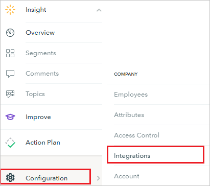
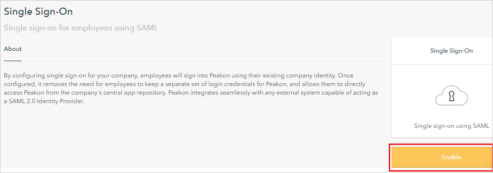
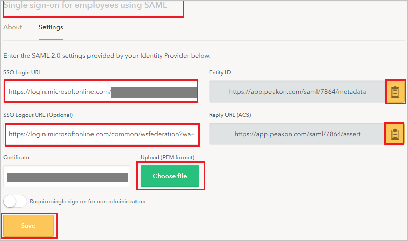
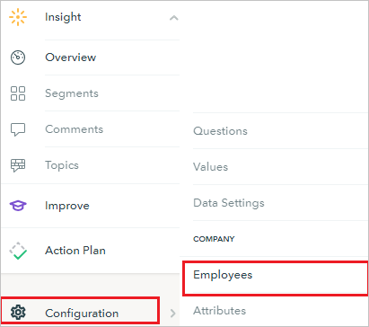
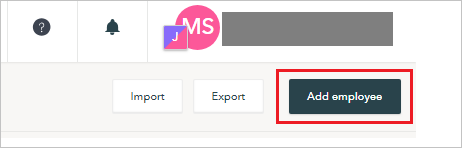
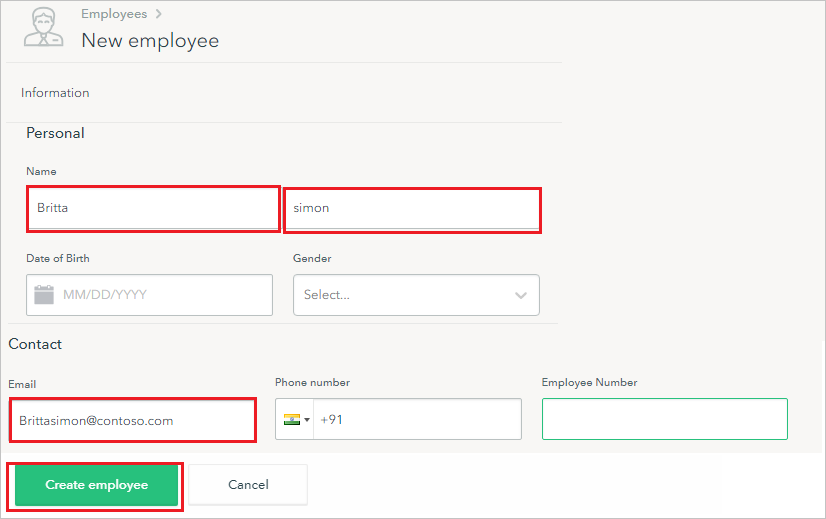

# Tutorial: Azure Active Directory integration with Peakon

In this tutorial, you learn how to integrate Peakon with Azure Active Directory (Azure AD).
Integrating Peakon with Azure AD provides you with the following benefits:

* You can control in Azure AD who has access to Peakon.
* You can enable your users to be automatically signed-in to Peakon (Single Sign-On) with their Azure AD accounts.
* You can manage your accounts in one central location - the Azure portal.

If you want to know more details about SaaS app integration with Azure AD, see [What is application access and single sign-on with Azure Active Directory](https://docs.microsoft.com/azure/active-directory/active-directory-appssoaccess-whatis).
If you don't have an Azure subscription, [create a free account](https://azure.microsoft.com/free/) before you begin.

## Prerequisites

To configure Azure AD integration with Peakon, you need the following items:

* An Azure AD subscription. If you don't have an Azure AD environment, you can get one-month trial [here](https://azure.microsoft.com/pricing/free-trial/)
* Peakon single sign-on enabled subscription

## Scenario description

In this tutorial, you configure and test Azure AD single sign-on in a test environment.

* Peakon supports **SP** and **IDP** initiated SSO

## Adding Peakon from the gallery

To configure the integration of Peakon into Azure AD, you need to add Peakon from the gallery to your list of managed SaaS apps.

**To add Peakon from the gallery, perform the following steps:**

1. In the **[Azure portal](https://portal.azure.com)**, on the left navigation panel, click **Azure Active Directory** icon.

	

2. Navigate to **Enterprise Applications** and then select the **All Applications** option.

	

3. To add new application, click **New application** button on the top of dialog.

	

4. In the search box, type **Peakon**, select **Peakon** from result panel then click **Add** button to add the application.

	 

## Configure and test Azure AD single sign-on

In this section, you configure and test Azure AD single sign-on with Peakon based on a test user called **Britta Simon**.
For single sign-on to work, a link relationship between an Azure AD user and the related user in Peakon needs to be established.

To configure and test Azure AD single sign-on with Peakon, you need to complete the following building blocks:

1. **[Configure Azure AD Single Sign-On](#configure-azure-ad-single-sign-on)** - to enable your users to use this feature.
2. **[Configure Peakon Single Sign-On](#configure-peakon-single-sign-on)** - to configure the Single Sign-On settings on application side.
3. **[Create an Azure AD test user](#create-an-azure-ad-test-user)** - to test Azure AD single sign-on with Britta Simon.
4. **[Assign the Azure AD test user](#assign-the-azure-ad-test-user)** - to enable Britta Simon to use Azure AD single sign-on.
5. **[Create Peakon test user](#create-peakon-test-user)** - to have a counterpart of Britta Simon in Peakon that is linked to the Azure AD representation of user.
6. **[Test single sign-on](#test-single-sign-on)** - to verify whether the configuration works.

### Configure Azure AD single sign-on

In this section, you enable Azure AD single sign-on in the Azure portal.

To configure Azure AD single sign-on with Peakon, perform the following steps:

1. In the [Azure portal](https://portal.azure.com/), on the **Peakon** application integration page, select **Single sign-on**.

    

2. On the **Select a Single sign-on method** dialog, select **SAML/WS-Fed** mode to enable single sign-on.

    

3. On the **Set up Single Sign-On with SAML** page, click **Edit** icon to open **Basic SAML Configuration** dialog.

	

4. On the **Basic SAML Configuration** section, if you wish to configure the application in **IDP** initiated mode, perform the following steps:

    

    a. In the **Identifier** text box, type a URL using the following pattern:
    `https://app.peakon.com/saml/<companyid>/metadata`

    b. In the **Reply URL** text box, type a URL using the following pattern:
    `https://app.peakon.com/saml/<companyid>/assert`

5. Click **Set additional URLs** and perform the following step if you wish to configure the application in **SP** initiated mode:

    

    In the **Sign-on URL** text box, type a URL:
    `https://app.peakon.com/login`

	> [!NOTE]
	> These values are not real. Update these values with the actual Identifier and Reply URL which is explained later in the tutorial. You can also refer to the patterns shown in the **Basic SAML Configuration** section in the Azure portal.

6. On the **Set up Single Sign-On with SAML** page, in the **SAML Signing Certificate** section, click **Download** to download the **Certificate (Raw)** from the given options as per your requirement and save it on your computer.

	

7. On the **Set up Peakon** section, copy the appropriate URL(s) as per your requirement.

	

	a. Login URL

	b. Azure AD Identifier

	c. Logout URL

### Configure Peakon Single Sign-On

1. In a different web browser window, sign in to Peakon as an Administrator.

2. In the menu bar on the left side of the page, click **Configuration**, then navigate to **Integrations**.

	

3. On **Integrations** page, click on **Single Sign-On**.

	

4. Under **Single Sign-On** section, click on **Enable**.

	

5. On the **Single sign-on for employees using SAML** section, perform the following steps:

	

	a. In the **SSO Login URL** textbox, paste the value of **Login URL**, which you have copied from the Azure portal.

	b. In the **SSO Logout URL** textbox, paste the value of **Logout URL**, which you have copied from the Azure portal.

	c. Click **Choose file** to upload the certificate that you have downloaded from the Azure portal, into the Certificate box.

	d. Click the **icon** to copy the **Entity ID** and paste in **Identifier** textbox in **Basic SAML Configuration** section on Azure portal.

	e. Click the **icon** to copy the **Reply URL (ACS)** and paste in **Reply URL** textbox in **Basic SAML Configuration** section on Azure portal.

	f. Click **Save**

### Create an Azure AD test user 

The objective of this section is to create a test user in the Azure portal called Britta Simon.

1. In the Azure portal, in the left pane, select **Azure Active Directory**, select **Users**, and then select **All users**.

    

2. Select **New user** at the top of the screen.

    

3. In the User properties, perform the following steps.

    

    a. In the **Name** field enter **BrittaSimon**.
  
    b. In the **User name** field type **brittasimon@yourcompanydomain.extension**  
    For example, BrittaSimon@contoso.com

    c. Select **Show password** check box, and then write down the value that's displayed in the Password box.

    d. Click **Create**.

### Assign the Azure AD test user

In this section, you enable Britta Simon to use Azure single sign-on by granting access to Peakon.

1. In the Azure portal, select **Enterprise Applications**, select **All applications**, then select **Peakon**.

	

2. In the applications list, select **Peakon**.

	

3. In the menu on the left, select **Users and groups**.

    

4. Click the **Add user** button, then select **Users and groups** in the **Add Assignment** dialog.

    

5. In the **Users and groups** dialog select **Britta Simon** in the Users list, then click the **Select** button at the bottom of the screen.

6. If you are expecting any role value in the SAML assertion then in the **Select Role** dialog select the appropriate role for the user from the list, then click the **Select** button at the bottom of the screen.

7. In the **Add Assignment** dialog click the **Assign** button.

### Create Peakon test user

For enabling Azure AD users to sign in to Peakon, they must be provisioned into Peakon.  
In the case of Peakon, provisioning is a manual task.

**To provision a user account, perform the following steps:**

1. Sign in to your Peakon company site as an administrator.

2. In the menu bar on the left side of the page, click **Configuration**, then navigate to **Employees**.

    

3. On the top right side of the page, click **Add employee**.

	  

3. On the **New employee** dialog page, perform the following steps:

	 

	a. In the **Name** textbox, type first name as **Britta** and last name as **simon**.

	b. In the **Email** textbox, type the email address like **Brittasimon\@contoso.com**.

	c. Click **Create employee**.

### Test single sign-on 

In this section, you test your Azure AD single sign-on configuration using the Access Panel.

When you click the Peakon tile in the Access Panel, you should be automatically signed in to the Peakon for which you set up SSO. For more information about the Access Panel, see [Introduction to the Access Panel](https://docs.microsoft.com/azure/active-directory/active-directory-saas-access-panel-introduction).

## Additional Resources

- [List of Tutorials on How to Integrate SaaS Apps with Azure Active Directory](https://docs.microsoft.com/azure/active-directory/active-directory-saas-tutorial-list)

- [What is application access and single sign-on with Azure Active Directory?](https://docs.microsoft.com/azure/active-directory/active-directory-appssoaccess-whatis)

- [What is Conditional Access in Azure Active Directory?](https://docs.microsoft.com/azure/active-directory/conditional-access/overview)

