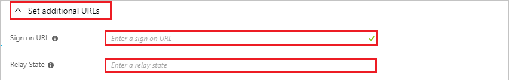
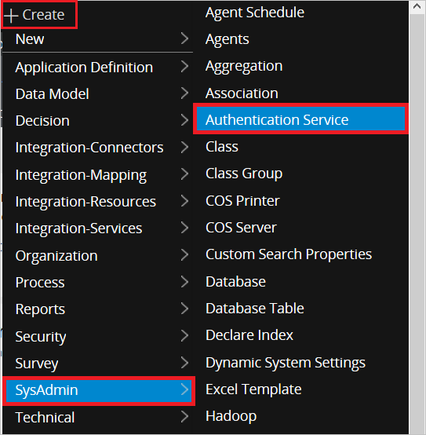
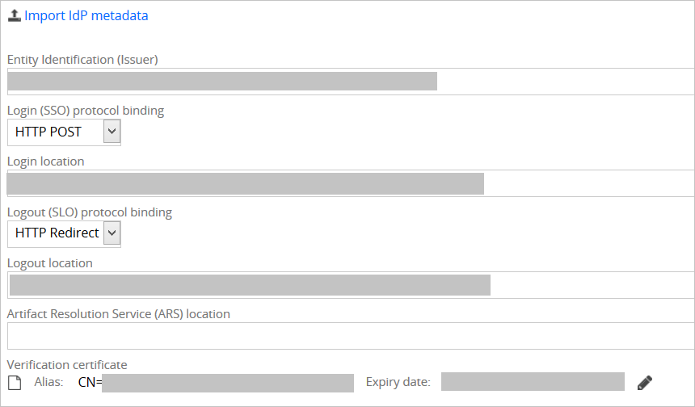
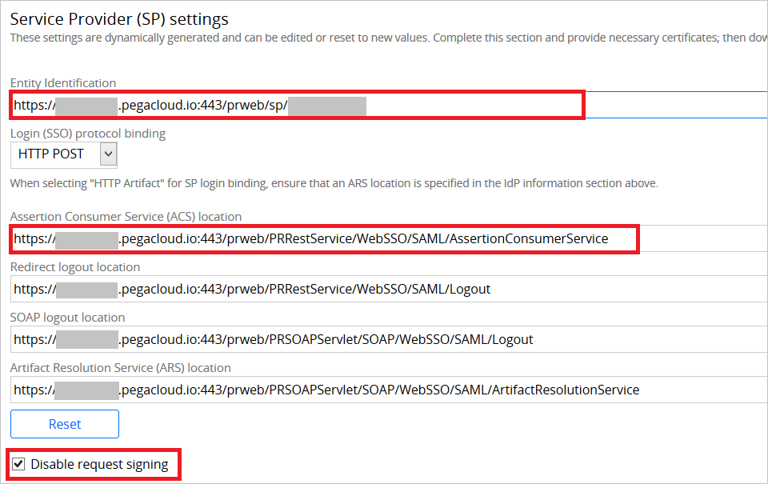

# Tutorial: Azure Active Directory integration with Pega Systems

In this tutorial, you'll learn how to integrate Pega Systems with Azure Active Directory (Azure AD).

This integration provides these benefits:

* You can use Azure AD to control who has access to Pega Systems.
* You can enable your users to be automatically signed-in to Pega Systems (single sign-on) with their Azure AD accounts.
* You can manage your accounts in one central location: the Azure portal.

To learn more about SaaS app integration with Azure AD, see [Single sign-on to applications in Azure Active Directory](https://docs.microsoft.com/azure/active-directory/active-directory-appssoaccess-whatis).

If you don't have an Azure subscription, [create a free account](https://azure.microsoft.com/free/) before you start.

## Prerequisites

To configure Azure AD integration with Pega Systems, you need to have:

* An Azure AD subscription. If you don't have an Azure AD environment, you can sign up for a [one-month trial](https://azure.microsoft.com/pricing/free-trial/).
* A Pega Systems subscription that has single sign-on enabled.

## Scenario description

In this tutorial, you'll configure and test Azure AD single sign-on in a test environment.

* Pega Systems supports SP-initiated and IdP-initiated SSO.

## Add Pega Systems from the gallery

To set up the integration of Pega Systems into Azure AD, you need to add Pega Systems from the gallery to your list of managed SaaS apps.

1. In the [Azure portal](https://portal.azure.com), in the left pane, select **Azure Active Directory**:

	

2. Go to **Enterprise applications** > **All applications**.

	

3. To add an application, select **New application** at the top of the window:

	

4. In the search box, enter **Pega Systems**. Select **Pega Systems** in the search results, and then select **Add**.

	 

## Configure and test Azure AD single sign-on

In this section, you'll configure and test Azure AD single sign-on with Pega Systems by using a test user named Britta Simon.
To enable single sign-on, you need to establish a relationship between an Azure AD user and the corresponding user in Pega Systems.

To configure and test Azure AD single sign-on with Pega Systems, you need to complete these steps:

1. **[Configure Azure AD single sign-on](#configure-azure-ad-single-sign-on)** to enable the feature for your users.
2. **[Configure Pega Systems single sign-on](#configure-pega-systems-single-sign-on)** on the application side.
3. **[Create an Azure AD test user](#create-an-azure-ad-test-user)** to test Azure AD single sign-on.
4. **[Assign the Azure AD test user](#assign-the-azure-ad-test-user)** to enable Azure AD single sign-on for the user.
5. **[Create a Pega Systems test user](#create-a-pega-systems-test-user)** that's linked to the Azure AD representation of the user.
6. **[Test single sign-on](#test-single-sign-on)** to verify that the configuration works.

### Configure Azure AD single sign-on

In this section, you'll enable Azure AD single sign-on in the Azure portal.

To configure Azure AD single sign-on with Pega Systems, take these steps:

1. In the [Azure portal](https://portal.azure.com/), on the **Pega Systems** application integration page, select **Single sign-on**:

    

2. In the **Select a single sign-on method** dialog box, select **SAML/WS-Fed** mode to enable single sign-on:

    

3. On the **Set up Single Sign-On with SAML** page, select the **Edit** icon to open the **Basic SAML Configuration** dialog box:

	

4. In the **Basic SAML Configuration** dialog box, if you want to configure the application in IdP-initiated mode, complete the following steps.

    

    1. In the **Identifier** box, enter a URL in this pattern:

       `https://<customername>.pegacloud.io:443/prweb/sp/<instanceID>`

    1. In the **Reply URL** box, enter a URL in this pattern:

       `https://<customername>.pegacloud.io:443/prweb/PRRestService/WebSSO/SAML/AssertionConsumerService`

5. If you want to configure the application in SP-initiated mode, select **Set additional URLs** and complete the following steps.

    

	1. In the **Sign on URL** box, enter the sign on URL value.

    1. In the **Relay State** box, enter a URL in this pattern:
       `https://<customername>.pegacloud.io/prweb/sso`

	> [!NOTE]
	> The values provided here are placeholders. You need to use the actual identifier, reply URL, sign on URL, and relay state URL. You can get the identifier and reply URL values from a Pega application, as explained later in this tutorial. To get the relay state value, contact the [Pega Systems support team](https://www.pega.com/contact-us). You can also refer to the patterns shown in the **Basic SAML Configuration** section in the Azure portal.

6. The Pega Systems application needs the SAML assertions to be in a specific format. To get them in the correct format, you need to add custom attribute mappings to your SAML token attributes configuration. The following screenshot shows the default attributes. Select the **Edit** icon to open the **User Attributes** dialog box:

	

7. In addition to the attributes shown in the previous screenshot, the Pega Systems application requires a few more attributes to be passed back in the SAML response. In the **User claims** section of the **User Attributes** dialog box, complete the following steps to add these SAML token attributes:

	
   - `uid`
   - `cn`
   - `mail`
   - `accessgroup`  
   - `organization`  
   - `orgdivision`
   - `orgunit`
   - `workgroup`  
   - `Phone`

	> [!NOTE]
	> These values are specific to your organization. Provide the appropriate values.

	1. Select **Add new claim** to open the **Manage user claims** dialog box:

	

	

	1. In the **Name** box, enter the attribute name shown for that row.

	1. Leave the **Namespace** box empty.

	1. For the **Source**, select **Attribute**.

	1. In the **Source attribute** list, select the attribute value shown for that row.

	1. Select **Ok**.

	1. Select **Save**.

8. On the **Set up Single Sign-On with SAML** page, in the **SAML Signing Certificate** section, select the **Download** link next to **Federation Metadata XML**, per your requirements, and save the certificate on your computer:

	

9. In the **Set up Pega Systems** section, copy the appropriate URLs, based on your requirements.

	

	1. **Login URL**.

	1. **Azure AD Identifier**.

	1. **Logout URL**.

### Configure Pega Systems single sign-on

1. To configure single sign-on on the **Pega Systems** side, sign in to the Pega Portal with an admin account in another browser window.

2. Select **Create** > **SysAdmin** > **Authentication Service**:

	
	
3. Complete the following steps on the **Create Authentication Service** screen.

	

	1. In the **Type** list, select **SAML 2.0**.

	1. In the **Name** box, enter any name (for example, **Azure AD SSO**).

	1. In the **Short description** box, enter a description.  

	1. Select **Create and open**.
	
4. In the **Identity Provider (IdP) information** section, select **Import IdP metadata** and browse to the metadata file that you downloaded from the Azure portal. Click **Submit** to load the metadata:

	
	
    The import will populate the IdP data as shown here:

	
	
6. Complete the following steps in the **Service Provider (SP) settings** section.

	

	1. Copy the **Entity Identification** value and paste it into the **Identifier** box in the **Basic SAML Configuration** section in the Azure portal.

	1. Copy the **Assertion Consumer Service (ACS) location** value and paste it into the **Reply URL** box in the **Basic SAML Configuration** section in the Azure portal.

	1. Select **Disable request signing**.

7. Select **Save**.

### Create an Azure AD test user

In this section, you'll create a test user named Britta Simon in the Azure portal.

1. In the Azure portal, select **Azure Active Directory** in the left pane, select **Users**, and then select **All users**:

    

2. Select **New user** at the top of the screen:

    

3. In the **User** dialog box, complete the following steps.

    

    a. In the **Name** box, enter **BrittaSimon**.
  
    b. In the **User name** box, enter **brittasimon@\<yourcompanydomain>.\<extension>**. (For example, BrittaSimon@contoso.com.)

    c. Select **Show password**, and then write down the value that's in the **Password** box.

    d. Select **Create**.

### Assign the Azure AD test user

In this section, you'll enable Britta Simon to use Azure single sign-on by granting her access to Pega Systems.

1. In the Azure portal, select **Enterprise applications**, select **All applications**, and then select **Pega Systems**.

	

2. In the list of applications, select **Pega Systems**.

	

3. In the left pane, select **Users and groups**:

    

4. Select **Add user**, and then select **Users and groups** in the **Add Assignment** dialog box.

    

5. In the **Users and groups** dialog box, select **Britta Simon** in the users list, and then click the **Select** button at the bottom of the screen.

6. If you expect a role value in the SAML assertion, in the **Select Role** dialog box, select the appropriate role for the user from the list. Click the **Select** button at the bottom of the screen.

7. In the **Add Assignment** dialog box, select **Assign**.

### Create a Pega Systems test user

Next, you need to create a user named Britta Simon in Pega Systems. Work with the [Pega Systems support team](https://www.pega.com/contact-us) to create users.

### Test single sign-on

Now you need to test your Azure AD single sign-on configuration by using the Access Panel.

When you select the Pega Systems tile in the Access Panel, you should be automatically signed in to the Pega Systems instance for which you set up SSO. For more information, see [Access and use apps on the My Apps portal](https://docs.microsoft.com/azure/active-directory/active-directory-saas-access-panel-introduction).

## Additional resources

- [Tutorials for integrating SaaS applications with Azure Active Directory](https://docs.microsoft.com/azure/active-directory/active-directory-saas-tutorial-list)

- [What is application access and single sign-on with Azure Active Directory?](https://docs.microsoft.com/azure/active-directory/active-directory-appssoaccess-whatis)

- [What is Conditional Access in Azure Active Directory?](https://docs.microsoft.com/azure/active-directory/conditional-access/overview)