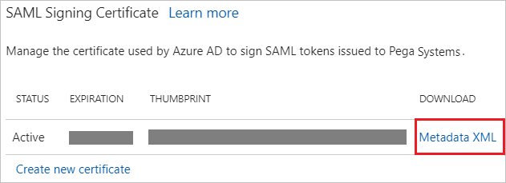

---
title: 'Tutorial: Azure Active Directory integration with Pega Systems | Microsoft Docs'
description: Learn how to configure single sign-on between Azure Active Directory and Pega Systems.
services: active-directory
documentationCenter: na
author: jeevansd
manager: mtillman
ms.reviewer: joflore

ms.assetid: 31acf80f-1f4b-41f1-956f-a9fbae77ee69
ms.service: active-directory
ms.component: saas-app-tutorial
ms.workload: identity
ms.tgt_pltfrm: na
ms.devlang: na
ms.topic: article
ms.date: 11/16/2017
ms.author: jeedes

---
# Tutorial: Azure Active Directory integration with Pega Systems

In this tutorial, you learn how to integrate Pega Systems with Azure Active Directory (Azure AD).

Integrating Pega Systems with Azure AD provides you with the following benefits:

- You can control in Azure AD who has access to Pega Systems.
- You can enable your users to automatically get signed-on to Pega Systems (Single Sign-On) with their Azure AD accounts.
- You can manage your accounts in one central location - the Azure portal.

If you want to know more details about SaaS app integration with Azure AD, see [what is application access and single sign-on with Azure Active Directory](../manage-apps/what-is-single-sign-on.md).

## Prerequisites

To configure Azure AD integration with Pega Systems, you need the following items:

- An Azure AD subscription
- A Pega Systems single-sign on enabled subscription

> [!NOTE]
> To test the steps in this tutorial, we do not recommend using a production environment.

To test the steps in this tutorial, you should follow these recommendations:

- Do not use your production environment, unless it is necessary.
- If you don't have an Azure AD trial environment, you can [get a one-month trial](https://azure.microsoft.com/pricing/free-trial/).

## Scenario description
In this tutorial, you test Azure AD single sign-on in a test environment. 
The scenario outlined in this tutorial consists of two main building blocks:

1. Adding Pega Systems from the gallery
1. Configuring and testing Azure AD single sign-on

## Adding Pega Systems from the gallery
To configure the integration of Pega Systems into Azure AD, you need to add Pega Systems from the gallery to your list of managed SaaS apps.

**To add Pega Systems from the gallery, perform the following steps:**

1. In the **[Azure portal](https://portal.azure.com)**, on the left navigation panel, click **Azure Active Directory** icon. 

	![The Azure Active Directory button][1]

1. Navigate to **Enterprise applications**. Then go to **All applications**.

	![The Enterprise applications blade][2]
	
1. To add new application, click **New application** button on the top of dialog.

	![The New application button][3]

1. In the search box, type **Pega Systems**, select **Pega Systems** from result panel then click **Add** button to add the application.

	

## Configure and test Azure AD single sign-on

In this section, you configure and test Azure AD single sign-on with Pega Systems based on a test user called "Britta Simon".

For single sign-on to work, Azure AD needs to know what the counterpart user in Pega Systems is to a user in Azure AD. In other words, a link relationship between an Azure AD user and the related user in Pega Systems needs to be established.

In Pega Systems, assign the value of the **user name** in Azure AD as the value of the **Username** to establish the link relationship.

To configure and test Azure AD single sign-on with Pega Systems, you need to complete the following building blocks:

1. **[Configure Azure AD Single Sign-On](#configure-azure-ad-single-sign-on)** - to enable your users to use this feature.
1. **[Create an Azure AD test user](#create-an-azure-ad-test-user)** - to test Azure AD single sign-on with Britta Simon.
1. **[Create a Pega Systems test user](#create-a-pega-systems-test-user)** - to have a counterpart of Britta Simon in Pega Systems that is linked to the Azure AD representation of user.
1. **[Assign the Azure AD test user](#assign-the-azure-ad-test-user)** - to enable Britta Simon to use Azure AD single sign-on.
1. **[Test single sign-on](#test-single-sign-on)** - to verify whether the configuration works.

### Configure Azure AD single sign-on

In this section, you enable Azure AD single sign-on in the Azure portal and configure single sign-on in your Pega Systems application.

**To configure Azure AD single sign-on with Pega Systems, perform the following steps:**

1. In the Azure portal, on the **Pega Systems** application integration page, click **Single sign-on**.

	![Configure single sign-on link][4]

1. On the **Single sign-on** dialog, select **Mode** as	**SAML-based Sign-on** to enable single sign-on.
 
	

1. On the **Pega Systems Domain and URLs** section, perform the following steps if you wish to configure the application in **IDP** initiated mode:

	

    a. In the **Identifier** textbox, type a URL using the following pattern: `https://<CUSTOMERNAME>.pegacloud.io:443/prweb/sp/<INSTANCEID>`

	b. In the **Reply URL** textbox, type a URL using the following pattern: `https://<CUSTOMERNAME>.pegacloud.io:443/prweb/PRRestService/WebSSO/SAML/AssertionConsumerService`

1. Check **Show advanced URL settings** and perform the following step if you wish to configure the application in **SP** initiated mode:

	

    In the **Relay State** textbox, type a URL using the following pattern: `https://<CUSTOMERNAME>.pegacloud.io/prweb/sso`
	 
	> [!NOTE] 
	> These values are not real. Update these values with the actual Identifier, Reply URL, and Relay State URL. You can find the values of Identifier and Reply URL from Pega application which is explained later in this tutorial. For Relay State, please contact [Pega Systems Client support team](https://www.pega.com/contact-us) to get the value. 

1. The Pega Systems application expects the SAML assertions in a specific format, which requires you to add custom attribute mappings to your SAML token attributes configuration. These claims are customer specific and depends on your requirement. Following optional claims are example only which you can configure for your application. You can manage the values of these attributes from the "**User Attributes**" section on application integration page. 

	

1. In the **User Attributes** section on the **Single sign-on** dialog, configure SAML token attribute as shown in the preceding image and perform the following steps:
	
	| Attribute Name | Attribute Value |
	| ------------------- | -------------------- |    
	| uid | *********** |
	| cn  | *********** |
	| mail | *********** |
	| accessgroup | *********** |
	| organization | *********** |
	| orgdivision | *********** |
	| orgunit | *********** |
	| workgroup | *********** |
	| Phone | *********** |

	> [!NOTE]
	> These are customer specific values. Please provide your appropriate values.

	a. Click **Add attribute** to open the **Add Attribute** dialog.

	

	

	b. In the **Name** textbox, type the attribute name shown for that row.

	c. From the **Value** list, type the attribute value shown for that row.
	
	d. Click **Ok**.

1. On the **SAML Signing Certificate** section, click **Metadata XML** and then save the metadata file on your computer.

	 
1. Click **Save** button.

	
	
1. To configure single sign-on on **Pega Systems** side, open the **Pega Portal** with admin account in another browser window.

1. Select **Create** -> **SysAdmin** -> **Authentication Service**.

	
	
1. Perform following actions on **Create Aauthentication Service** screen:

	

	a. Select **SAML 2.0** from Type

	b. In the **Name** textbox, enter any name e.g Azure AD SSO

	c. In the **Short Description** textbox, enter any description  

	d. Click on **Create and open** 
	
1. In **Identity Provider (IdP) information** section, click on **Import IdP metadata** and browse the metadata file which you have downloaded from the Azure portal. Click **Submit** to load the metadata.

	
	
1. This will populate the IdP data as shown below.

	
	
1. Perform following actions on **Service Provider (SP) settings** section:

	

	a. Copy the **Entity Identification** value and paste back in Azure Portal's **Identifier** textbox.

	b.  Copy the **Assertion Consumer Service (ACS) location** value and paste back in Azure Portal's **Reply URL** textbox.

	c. Select **Disable request signing**.

1. Click **Save**
	
> [!TIP]
> You can now read a concise version of these instructions inside the [Azure portal](https://portal.azure.com), while you are setting up the app!  After adding this app from the **Active Directory > Enterprise Applications** section, simply click the **Single Sign-On** tab and access the embedded documentation through the **Configuration** section at the bottom. You can read more about the embedded documentation feature here: [Azure AD embedded documentation]( https://go.microsoft.com/fwlink/?linkid=845985)

### Create an Azure AD test user

The objective of this section is to create a test user in the Azure portal called Britta Simon.

   ![Create an Azure AD test user][100]

**To create a test user in Azure AD, perform the following steps:**

1. In the Azure portal, in the left pane, click the **Azure Active Directory** button.

    

1. To display the list of users, go to **Users and groups**, and then click **All users**.

    

1. To open the **User** dialog box, click **Add** at the top of the **All Users** dialog box.

    

1. In the **User** dialog box, perform the following steps:

    

    a. In the **Name** box, type **BrittaSimon**.

    b. In the **User name** box, type the email address of user Britta Simon.

    c. Select the **Show Password** check box, and then write down the value that's displayed in the **Password** box.

    d. Click **Create**.
 
### Create a Pega Systems test user

The objective of this section is to create a user called Britta Simon in Pega Systems. Please work with [Pega Systems Client support team](https://www.pega.com/contact-us) to create users in Pega Sysyems.

### Assign the Azure AD test user

In this section, you enable Britta Simon to use Azure single sign-on by granting access to Pega Systems.

![Assign the user role][200] 

**To assign Britta Simon to Pega Systems, perform the following steps:**

1. In the Azure portal, open the applications view, and then navigate to the directory view and go to **Enterprise applications** then click **All applications**.

	![Assign User][201] 

1. In the applications list, select **Pega Systems**.

	  

1. In the menu on the left, click **Users and groups**.

	![The "Users and groups" link][202]

1. Click **Add** button. Then select **Users and groups** on **Add Assignment** dialog.

	![The Add Assignment pane][203]

1. On **Users and groups** dialog, select **Britta Simon** in the Users list.

1. Click **Select** button on **Users and groups** dialog.

1. Click **Assign** button on **Add Assignment** dialog.
	
### Test single sign-on

In this section, you test your Azure AD single sign-on configuration using the Access Panel.

When you click the Pega Systems tile in the Access Panel, you should get automatically signed-on to your Pega Systems application.
For more information about the Access Panel, see [Introduction to the Access Panel](../user-help/active-directory-saas-access-panel-introduction.md). 

## Additional resources

* [List of Tutorials on How to Integrate SaaS Apps with Azure Active Directory](tutorial-list.md)
* [What is application access and single sign-on with Azure Active Directory?](../manage-apps/what-is-single-sign-on.md)

<!--Image references-->

[1]: ./media/pegasystems-tutorial/tutorial_general_01.png
[2]: ./media/pegasystems-tutorial/tutorial_general_02.png
[3]: ./media/pegasystems-tutorial/tutorial_general_03.png
[4]: ./media/pegasystems-tutorial/tutorial_general_04.png

[100]: ./media/pegasystems-tutorial/tutorial_general_100.png

[200]: ./media/pegasystems-tutorial/tutorial_general_200.png
[201]: ./media/pegasystems-tutorial/tutorial_general_201.png
[202]: ./media/pegasystems-tutorial/tutorial_general_202.png
[203]: ./media/pegasystems-tutorial/tutorial_general_203.png

