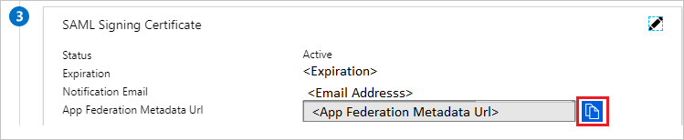
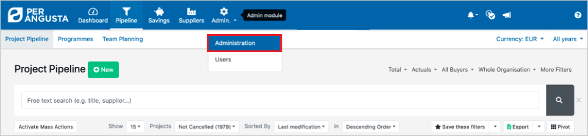
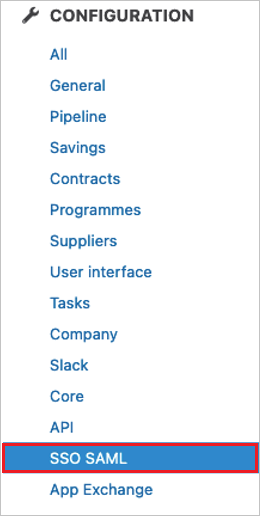
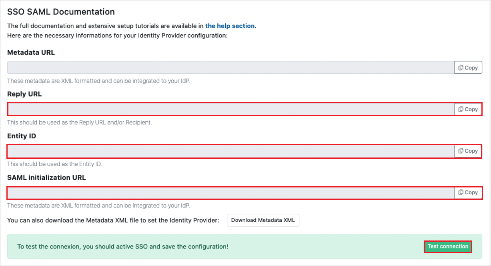
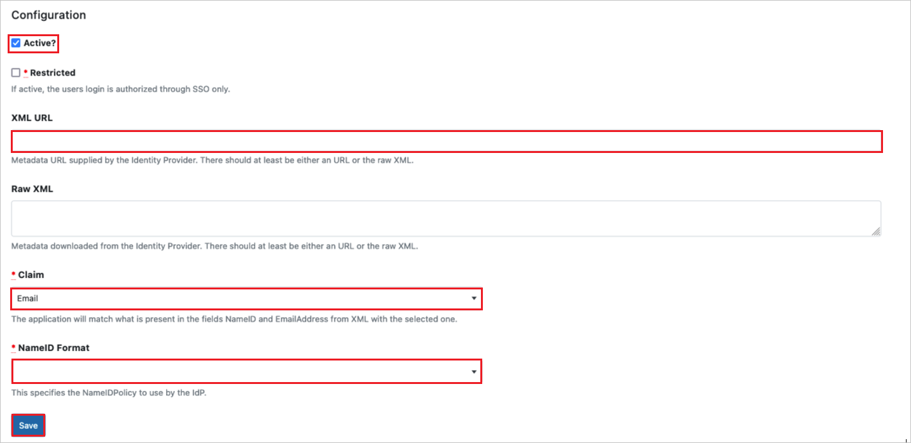

# Tutorial: Microsoft Entra SSO integration with Per Angusta

In this tutorial, you'll learn how to integrate Per Angusta with Microsoft Entra ID. When you integrate Per Angusta with Microsoft Entra ID, you can:

* Control in Microsoft Entra ID who has access to Per Angusta.
* Enable your users to be automatically signed-in to Per Angusta with their Microsoft Entra accounts.
* Manage your accounts in one central location.

## Prerequisites

To get started, you need the following items:

* A Microsoft Entra subscription. If you don't have a subscription, you can get a [free account](https://azure.microsoft.com/free/).
* Per Angusta single sign-on (SSO) enabled subscription.
* Along with Cloud Application Administrator, Application Administrator can also add or manage applications in Microsoft Entra ID.
For more information, see [Azure built-in roles](../roles/permissions-reference.md).

## Scenario description

In this tutorial, you configure and test Microsoft Entra SSO in a test environment.

* Per Angusta supports **SP** initiated SSO.

## Add Per Angusta from the gallery

To configure the integration of Per Angusta into Microsoft Entra ID, you need to add Per Angusta from the gallery to your list of managed SaaS apps.

1. Sign in to the [Microsoft Entra admin center](https://entra.microsoft.com) as at least a [Cloud Application Administrator](../roles/permissions-reference.md#cloud-application-administrator).
1. Browse to **Identity** > **Applications** > **Enterprise applications** > **New application**.
1. In the **Add from the gallery** section, type **Per Angusta** in the search box.
1. Select **Per Angusta** from results panel and then add the app. Wait a few seconds while the app is added to your tenant.

 Alternatively, you can also use the [Enterprise App Configuration Wizard](https://portal.office.com/AdminPortal/home?Q=Docs#/azureadappintegration). In this wizard, you can add an application to your tenant, add users/groups to the app, assign roles, as well as walk through the SSO configuration as well. [Learn more about Microsoft 365 wizards.](/microsoft-365/admin/misc/azure-ad-setup-guides)

## Configure and test Microsoft Entra SSO for Per Angusta

Configure and test Microsoft Entra SSO with Per Angusta using a test user called **B.Simon**. For SSO to work, you need to establish a link relationship between a Microsoft Entra user and the related user in Per Angusta.

To configure and test Microsoft Entra SSO with Per Angusta, perform the following steps:

1. **[Configure Microsoft Entra SSO](#configure-azure-ad-sso)** - to enable your users to use this feature.
    1. **[Create a Microsoft Entra test user](#create-an-azure-ad-test-user)** - to test Microsoft Entra single sign-on with B.Simon.
    1. **[Assign the Microsoft Entra test user](#assign-the-azure-ad-test-user)** - to enable B.Simon to use Microsoft Entra single sign-on.
1. **[Configure Per Angusta SSO](#configure-per-angusta-sso)** - to configure the single sign-on settings on application side.
    1. **[Create Per Angusta test user](#create-per-angusta-test-user)** - to have a counterpart of B.Simon in Per Angusta that is linked to the Microsoft Entra representation of user.
1. **[Test SSO](#test-sso)** - to verify whether the configuration works.

## Configure Microsoft Entra SSO

Follow these steps to enable Microsoft Entra SSO.

1. Sign in to the [Microsoft Entra admin center](https://entra.microsoft.com) as at least a [Cloud Application Administrator](../roles/permissions-reference.md#cloud-application-administrator).
1. Browse to **Identity** > **Applications** > **Enterprise applications** > **Per Angusta** > **Single sign-on**.
1. On the **Select a single sign-on method** page, select **SAML**.
1. On the **Set up single sign-on with SAML** page, click the pencil icon for **Basic SAML Configuration** to edit the settings.

   

1. On the **Basic SAML Configuration** section, perform the following steps:

    a. In the **Identifier** text box, type a value using the following pattern:
    `<SUBDOMAIN>.per-angusta.com`

    b. In the **Reply URL** text box, type a URL using the following pattern:
    `https://<SUBDOMAIN>.per-angusta.com/saml/consume`

    c. In the **Sign-on URL** text box, type a URL using the following pattern:
    `https://<SUBDOMAIN>.per-angusta.com/saml/init`
    
    > [!NOTE]
	> These values are not real. Update these values with the actual Identifier, Reply URL and Sign-on URL. Contact [Per Angusta Client support team](mailto:support@per-angusta.com) to get these values. You can also refer to the patterns shown in the **Basic SAML Configuration** section.

1. On the **Set up single sign-on with SAML** page, In the **SAML Signing Certificate** section, click copy button to copy **App Federation Metadata Url** and save it on your computer.

	

### Create a Microsoft Entra test user

In this section, you'll create a test user called B.Simon.

1. Sign in to the [Microsoft Entra admin center](https://entra.microsoft.com) as at least a [User Administrator](../roles/permissions-reference.md#user-administrator).
1. Browse to **Identity** > **Users** > **All users**.
1. Select **New user** > **Create new user**, at the top of the screen.
1. In the **User** properties, follow these steps:
   1. In the **Display name** field, enter `B.Simon`.  
   1. In the **User principal name** field, enter the username@companydomain.extension. For example, `B.Simon@contoso.com`.
   1. Select the **Show password** check box, and then write down the value that's displayed in the **Password** box.
   1. Select **Review + create**.
1. Select **Create**.

### Assign the Microsoft Entra test user

In this section, you'll enable B.Simon to use single sign-on by granting access to Per Angusta.

1. Sign in to the [Microsoft Entra admin center](https://entra.microsoft.com) as at least a [Cloud Application Administrator](../roles/permissions-reference.md#cloud-application-administrator).
1. Browse to **Identity** > **Applications** > **Enterprise applications** > **Per Angusta**.
1. In the app's overview page, select **Users and groups**.
1. Select **Add user/group**, then select **Users and groups** in the **Add Assignment** dialog.
   1. In the **Users and groups** dialog, select **B.Simon** from the Users list, then click the **Select** button at the bottom of the screen.
   1. If you are expecting a role to be assigned to the users, you can select it from the **Select a role** dropdown. If no role has been set up for this app, you see "Default Access" role selected.
   1. In the **Add Assignment** dialog, click the **Assign** button.

## Configure Per Angusta SSO

1. Log in to your Per Angusta company site as an administrator.

1. Go to Administration tab.
    
    

1.  In the left-side menu under **CONFIGURATION**, click **SSO SAML**.

    

1. Perform the following steps in the configuration page:

    

    

    1. Copy **Reply URL** value, paste this value into the **Reply URL** text box in the **Basic SAML Configuration** section.
    
    1. Copy **Entity ID** value, paste this value into the **Identifier** text box in the **Basic SAML Configuration** section.

    1. Copy **SAML initialization URL** value, paste this value into the **Sign on URL** text box in the **Basic SAML Configuration** section.

    1. Enable **Active** SSO checkbox before to test connection.

    1. In the **XML URL** textbox, paste the **App Federation Metadata Url** value which you copied previously.

    1. In the **Claim** textbox, select **Email** from the dropdown.

    1. In the **NameID Format** textbox, please select `urn:oasis:names:tc:SAML:1.1:nameid-format:unspecified` from the dropdown.

    1. Click **Save**.

### Create Per Angusta test user

In this section, you create a user called Britta Simon in Per Angusta. Work with [Per Angusta support team](mailto:support@per-angusta.com) to add the users in the Per Angusta platform. Users must be created and activated before you use single sign-on.

## Test SSO 

In this section, you test your Microsoft Entra single sign-on configuration with following options. 

* Click on **Test this application**, this will redirect to Per Angusta Sign-on URL where you can initiate the login flow. 

* Go to Per Angusta Sign-on URL directly and initiate the login flow from there.

* You can use Microsoft My Apps. When you click the Per Angusta tile in the My Apps, this will redirect to Per Angusta Sign-on URL. For more information about the My Apps, see [Introduction to the My Apps](https://support.microsoft.com/account-billing/sign-in-and-start-apps-from-the-my-apps-portal-2f3b1bae-0e5a-4a86-a33e-876fbd2a4510).

## Next steps

Once you configure Per Angusta you can enforce session control, which protects exfiltration and infiltration of your organization’s sensitive data in real time. Session control extends from Conditional Access. [Learn how to enforce session control with Microsoft Defender for Cloud Apps](/cloud-app-security/proxy-deployment-any-app).
